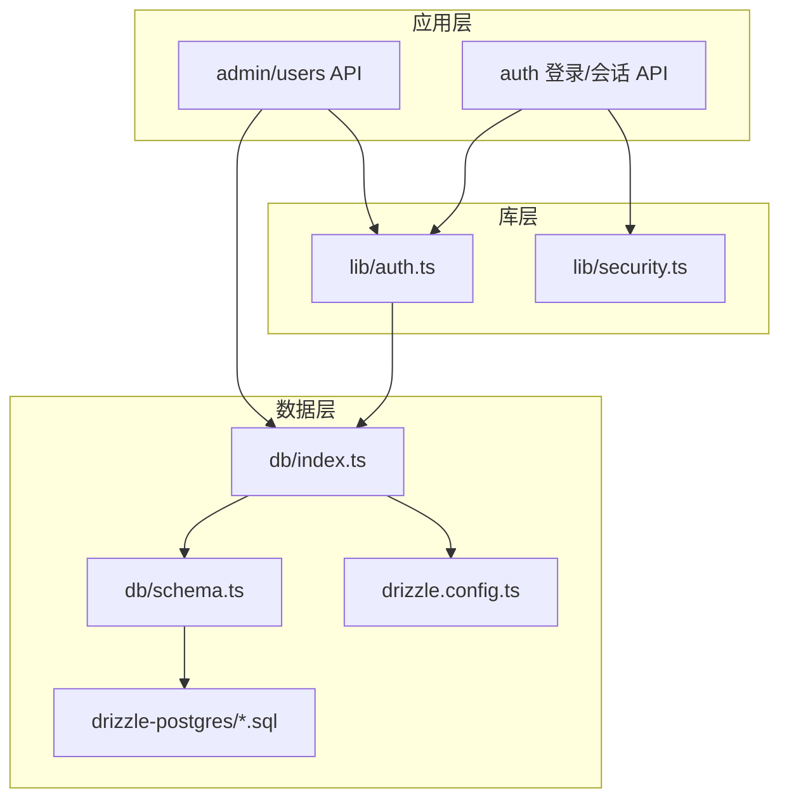
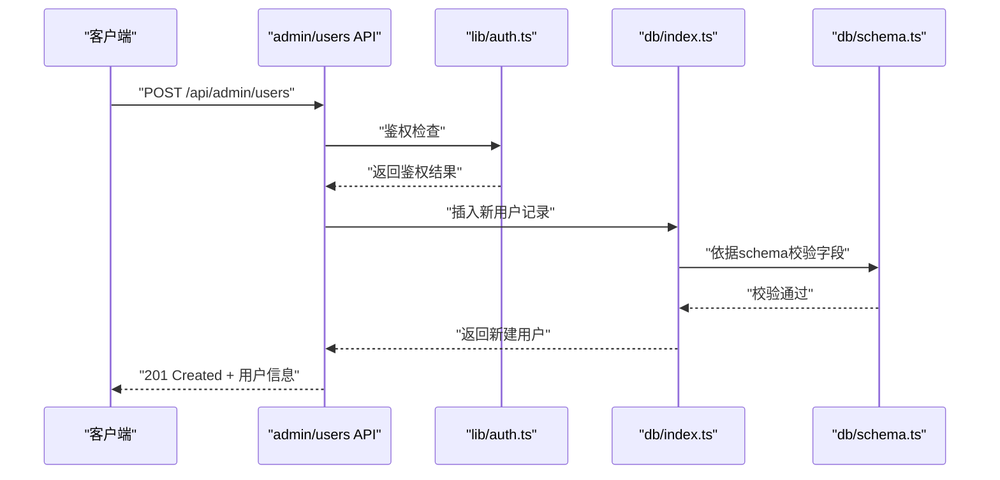
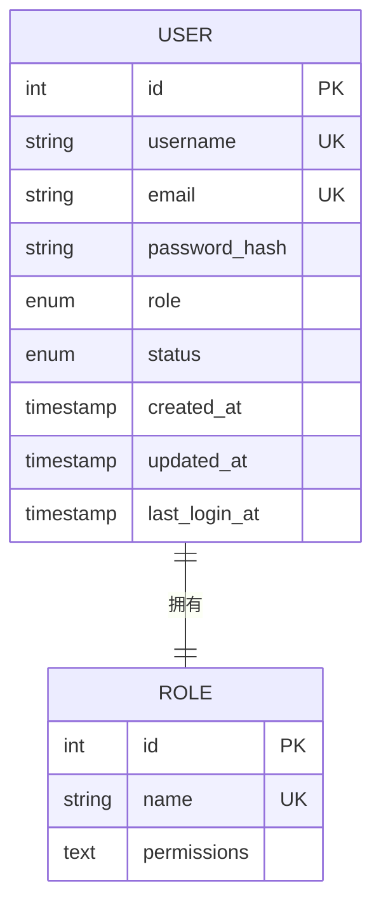
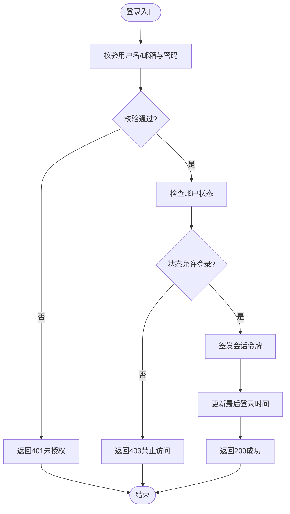
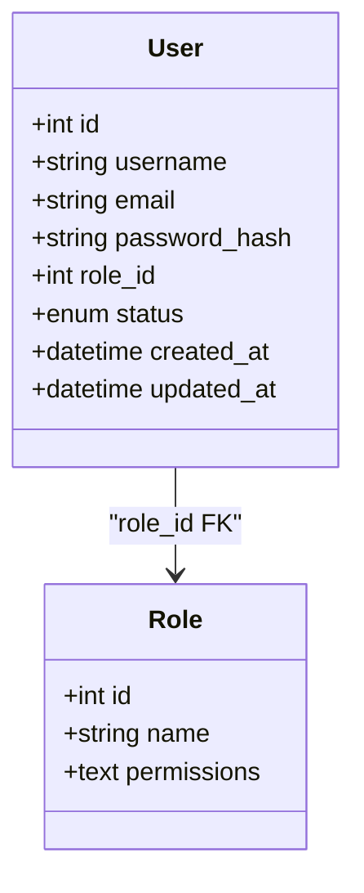
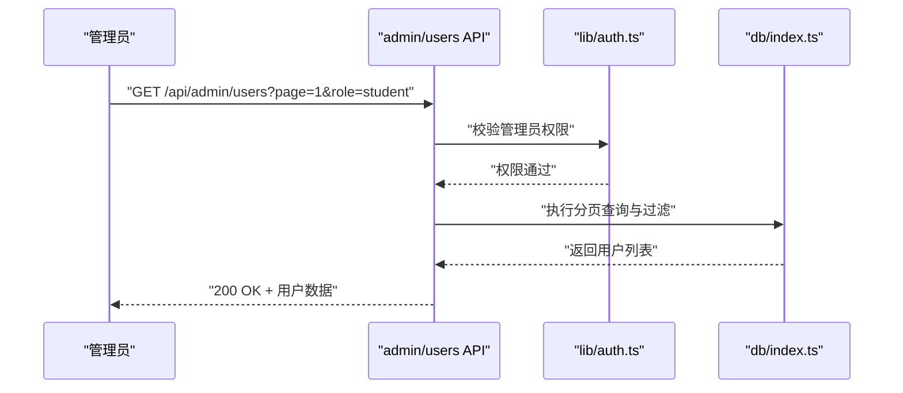
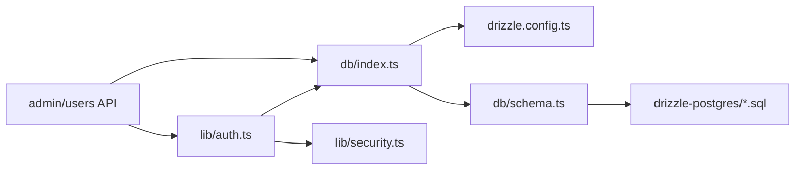

# 用户管理实体

<cite>
**本文档引用的文件**
- [db/schema.ts](file://db/schema.ts)
- [db/index.ts](file://db/index.ts)
- [lib/auth.ts](file://lib/auth.ts)
- [lib/security.ts](file://lib/security.ts)
- [app/api/admin/users/route.ts](file://app/api/admin/users/route.ts)
- [app/api/admin/users/[id]/route.ts](file://app/api/admin/users/[id]/route.ts)
- [app/api/auth/login/route.ts](file://app/api/auth/login/route.ts)
- [app/api/auth/session/route.ts](file://app/api/auth/session/route.ts)
- [drizzle.config.ts](file://drizzle.config.ts)
- [scripts/seed-admin.mjs](file://scripts/seed-admin.mjs)
</cite>

## 目录
1. [简介](#简介)
2. [项目结构](#项目结构)
3. [核心组件](#核心组件)
4. [架构总览](#架构总览)
5. [详细组件分析](#详细组件分析)
6. [依赖关系分析](#依赖关系分析)
7. [性能考虑](#性能考虑)
8. [故障排查指南](#故障排查指南)
9. [结论](#结论)
10. [附录](#附录)

## 简介
本文件面向“学生事务管理系统”中的用户管理相关数据实体，聚焦用户表的核心字段（用户ID、用户名、邮箱、密码哈希、角色权限等）、用户状态管理、认证信息存储与权限控制机制，以及用户与角色的关系映射（管理员、辅导员、学生）。文档同时提供CRUD操作示例与查询模式建议，并给出安全存储策略与隐私保护措施。

## 项目结构
围绕用户管理的代码主要分布在以下位置：
- 数据库模型与迁移：db/schema.ts、db/index.ts、drizzle-postgres/*.sql、drizzle.config.ts
- 认证与会话：lib/auth.ts、app/api/auth/*
- 权限与安全：lib/security.ts
- 用户管理API：app/api/admin/users/*
- 初始化管理员数据：scripts/seed-admin.mjs

图表来源
- [app/api/admin/users/route.ts](file://app/api/admin/users/route.ts)
- [app/api/auth/login/route.ts](file://app/api/auth/login/route.ts)
- [lib/auth.ts](file://lib/auth.ts)
- [lib/security.ts](file://lib/security.ts)
- [db/schema.ts](file://db/schema.ts)
- [db/index.ts](file://db/index.ts)
- [drizzle.config.ts](file://drizzle.config.ts)
- [drizzle-postgres/0000_fine_psylocke.sql](file://drizzle-postgres/0000_fine_psylocke.sql)

章节来源
- [db/schema.ts](file://db/schema.ts)
- [db/index.ts](file://db/index.ts)
- [drizzle.config.ts](file://drizzle.config.ts)

## 核心组件
- 用户数据模型与字段定义：位于 db/schema.ts，包含用户ID、用户名、邮箱、密码哈希、角色、状态、创建/更新时间等字段及约束。
- 数据库连接与查询封装：位于 db/index.ts，提供Drizzle客户端实例与常用查询方法。
- 认证与会话：位于 lib/auth.ts，负责登录校验、令牌签发与验证、会话管理。
- 安全工具：位于 lib/security.ts，提供密码哈希、随机令牌生成、输入校验等能力。
- 用户管理API：位于 app/api/admin/users/*，实现用户的增删改查与批量操作。
- 认证API：位于 app/api/auth/*，处理登录与会话生命周期。
- 初始化脚本：scripts/seed-admin.mjs，用于预置管理员账户。

章节来源
- [db/schema.ts](file://db/schema.ts)
- [db/index.ts](file://db/index.ts)
- [lib/auth.ts](file://lib/auth.ts)
- [lib/security.ts](file://lib/security.ts)
- [app/api/admin/users/route.ts](file://app/api/admin/users/route.ts)
- [app/api/admin/users/[id]/route.ts](file://app/api/admin/users/[id]/route.ts)
- [app/api/auth/login/route.ts](file://app/api/auth/login/route.ts)
- [app/api/auth/session/route.ts](file://app/api/auth/session/route.ts)
- [scripts/seed-admin.mjs](file://scripts/seed-admin.mjs)

## 架构总览
用户管理采用分层架构：
- 表现层：Next.js API路由暴露REST接口，接收请求参数并进行基础校验。
- 业务层：lib/auth.ts与lib/security.ts提供认证、授权、密码处理等通用能力。
- 数据层：db/index.ts通过Drizzle ORM访问PostgreSQL，db/schema.ts定义表结构与约束，drizzle-postgres下为迁移脚本。

图表来源
- [app/api/admin/users/route.ts](file://app/api/admin/users/route.ts)
- [lib/auth.ts](file://lib/auth.ts)
- [db/index.ts](file://db/index.ts)
- [db/schema.ts](file://db/schema.ts)

## 详细组件分析

### 用户数据模型与字段定义
- 用户ID：唯一标识，通常使用自增整数或UUID；在schema中声明为主键与唯一索引。
- 用户名：字符串类型，非空且唯一，用于登录名展示。
- 邮箱：字符串类型，非空且唯一，支持大小写规范化与格式校验。
- 密码哈希：不可逆的哈希值，禁止明文存储；长度与复杂度由安全策略保证。
- 角色权限：枚举或外键关联到角色表，常见角色包括管理员、辅导员、学生；不同角色具备不同资源访问权限。
- 状态管理：如启用/禁用、锁定、待激活等状态字段，配合时间戳进行生命周期管理。
- 审计字段：创建时间、更新时间、最后登录时间等，便于追踪与合规。

图表来源
- [db/schema.ts](file://db/schema.ts)
- [drizzle-postgres/0000_fine_psylocke.sql](file://drizzle-postgres/0000_fine_psylocke.sql)

章节来源
- [db/schema.ts](file://db/schema.ts)
- [drizzle-postgres/0000_fine_psylocke.sql](file://drizzle-postgres/0000_fine_psylocke.sql)

### 用户状态管理与认证信息存储
- 状态管理：通过状态字段控制账户可用性与生命周期，例如禁用后拒绝登录、锁定后需管理员解锁。
- 认证信息存储：密码以强哈希算法存储；会话令牌（如JWT）在服务端或客户端安全存储，设置过期时间与刷新机制。
- 登录流程：校验用户名/邮箱与密码哈希，成功后签发令牌并更新最后登录时间。

图表来源
- [lib/auth.ts](file://lib/auth.ts)
- [lib/security.ts](file://lib/security.ts)
- [app/api/auth/login/route.ts](file://app/api/auth/login/route.ts)

章节来源
- [lib/auth.ts](file://lib/auth.ts)
- [lib/security.ts](file://lib/security.ts)
- [app/api/auth/login/route.ts](file://app/api/auth/login/route.ts)

### 用户与角色关系映射（管理员、辅导员、学生）
- 角色定义：角色表包含角色名称与权限集合，权限可细分为资源与操作维度。
- 用户-角色关系：用户表直接引用角色ID，或通过中间表实现多对多关系；本系统采用单角色或多角色扩展设计。
- 权限控制：基于角色的访问控制（RBAC），在API路由与业务逻辑中进行权限校验。

图表来源
- [db/schema.ts](file://db/schema.ts)
- [drizzle-postgres/0000_fine_psylocke.sql](file://drizzle-postgres/0000_fine_psylocke.sql)

章节来源
- [db/schema.ts](file://db/schema.ts)
- [drizzle-postgres/0000_fine_psylocke.sql](file://drizzle-postgres/0000_fine_psylocke.sql)

### 用户数据的CRUD操作与查询模式
- 创建用户：管理员通过API创建用户，服务端校验输入、生成密码哈希、写入数据库并返回新记录。
- 读取用户：支持按ID、用户名、邮箱查询，支持分页与过滤（如角色、状态）。
- 更新用户：修改基本信息、重置密码、切换状态；需要权限校验与审计日志。
- 删除用户：软删除或硬删除，软删除保留历史数据，硬删除需确认无关联数据。
- 批量操作：导入学生列表、批量分配角色、批量启用/禁用。

图表来源
- [app/api/admin/users/route.ts](file://app/api/admin/users/route.ts)
- [lib/auth.ts](file://lib/auth.ts)
- [db/index.ts](file://db/index.ts)

章节来源
- [app/api/admin/users/route.ts](file://app/api/admin/users/route.ts)
- [app/api/admin/users/[id]/route.ts](file://app/api/admin/users/[id]/route.ts)
- [db/index.ts](file://db/index.ts)

### 安全存储策略与隐私保护
- 密码安全：使用强哈希算法（如bcrypt/argon2）存储密码哈希，禁止明文；定期升级哈希参数。
- 令牌安全：JWT设置短期过期时间，支持刷新令牌；敏感信息不放入令牌载荷。
- 传输加密：全站HTTPS，防止中间人攻击。
- 输入校验：严格校验与清理用户输入，防止注入与XSS。
- 最小权限原则：API路由与数据库访问遵循最小权限，避免越权访问。
- 审计与日志：记录关键操作（登录、密码重置、角色变更），但避免记录敏感内容。

章节来源
- [lib/security.ts](file://lib/security.ts)
- [lib/auth.ts](file://lib/auth.ts)
- [app/api/auth/login/route.ts](file://app/api/auth/login/route.ts)

## 依赖关系分析
- API路由依赖认证库与安全工具，确保请求合法性与权限控制。
- 认证库依赖数据库连接与用户模型，完成身份校验与会话管理。
- 数据库层依赖Drizzle配置与迁移脚本，保证表结构与数据一致性。

图表来源
- [app/api/admin/users/route.ts](file://app/api/admin/users/route.ts)
- [lib/auth.ts](file://lib/auth.ts)
- [lib/security.ts](file://lib/security.ts)
- [db/index.ts](file://db/index.ts)
- [db/schema.ts](file://db/schema.ts)
- [drizzle.config.ts](file://drizzle.config.ts)
- [drizzle-postgres/0000_fine_psylocke.sql](file://drizzle-postgres/0000_fine_psylocke.sql)

章节来源
- [app/api/admin/users/route.ts](file://app/api/admin/users/route.ts)
- [lib/auth.ts](file://lib/auth.ts)
- [lib/security.ts](file://lib/security.ts)
- [db/index.ts](file://db/index.ts)
- [db/schema.ts](file://db/schema.ts)
- [drizzle.config.ts](file://drizzle.config.ts)

## 性能考虑
- 数据库索引：对用户ID、用户名、邮箱建立唯一索引，提升查询效率。
- 分页与过滤：用户列表查询默认分页，支持按角色、状态过滤，减少数据传输量。
- 缓存策略：对频繁读取的角色与权限信息进行缓存，降低数据库压力。
- 异步处理：批量导入与复杂计算使用队列异步处理，避免阻塞主线程。

[本节为通用指导，不直接分析具体文件]

## 故障排查指南
- 登录失败：检查用户名/邮箱是否存在、密码哈希是否匹配、账户状态是否允许登录。
- 权限不足：确认当前用户角色是否具备所需权限，检查API路由的权限守卫。
- 数据不一致：核对迁移脚本与schema定义，确保表结构一致；检查事务回滚与错误日志。
- 性能问题：查看慢查询日志，优化索引与查询条件；评估缓存命中率。

章节来源
- [lib/auth.ts](file://lib/auth.ts)
- [lib/security.ts](file://lib/security.ts)
- [app/api/auth/login/route.ts](file://app/api/auth/login/route.ts)
- [db/schema.ts](file://db/schema.ts)

## 结论
本系统通过清晰的层次化架构与严格的权限控制，实现了安全的用户管理功能。用户数据模型涵盖核心字段与状态管理，认证与会话机制保障安全性，CRUD操作与查询模式满足日常需求。建议在后续迭代中持续优化性能与安全性，完善审计与监控能力。

[本节为总结性内容，不直接分析具体文件]

## 附录
- 初始化管理员账户：使用scripts/seed-admin.mjs预置管理员角色与账号，便于系统上线测试。
- 迁移与版本管理：drizzle-postgres下的SQL脚本与drizzle.config.ts共同维护数据库版本演进。

章节来源
- [scripts/seed-admin.mjs](file://scripts/seed-admin.mjs)
- [drizzle.config.ts](file://drizzle.config.ts)
- [drizzle-postgres/0000_fine_psylocke.sql](file://drizzle-postgres/0000_fine_psylocke.sql)