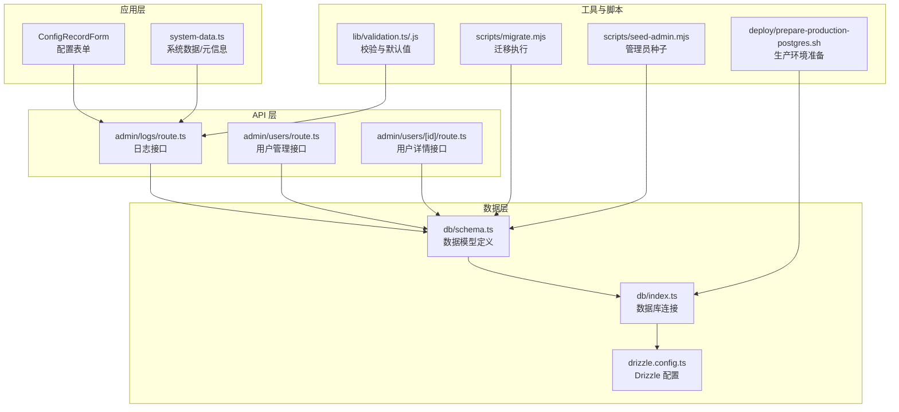
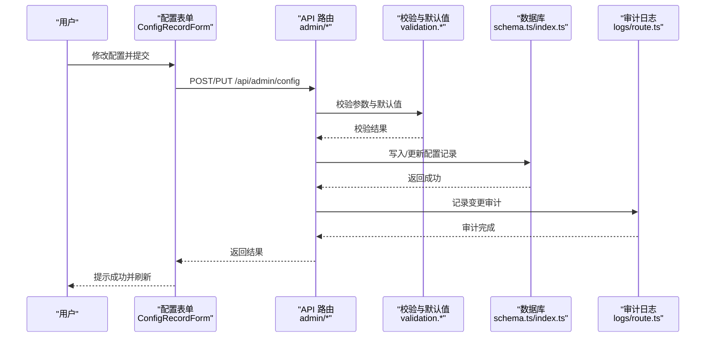
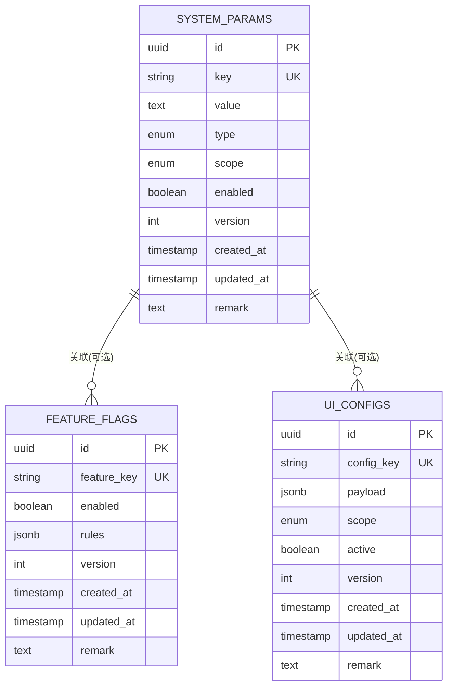
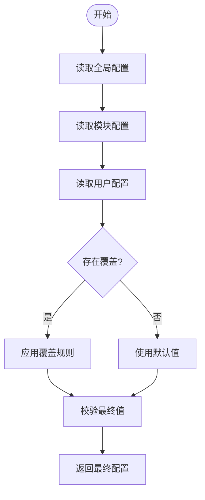
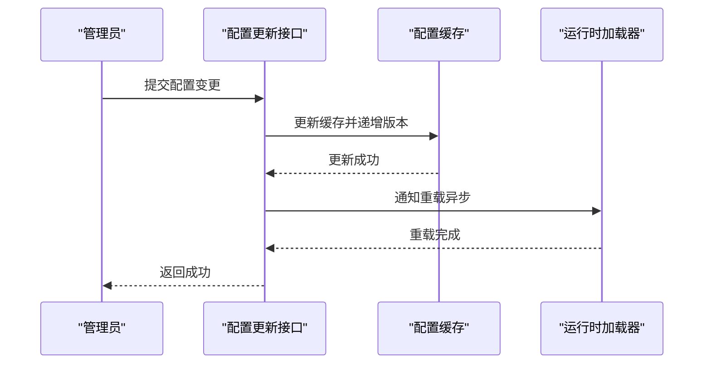
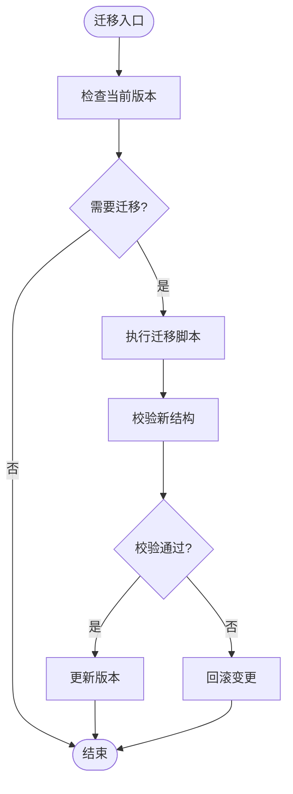
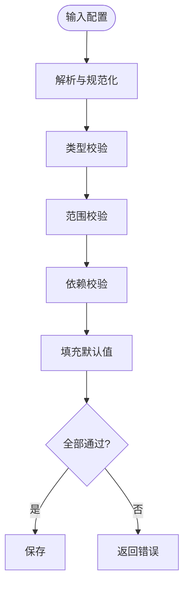
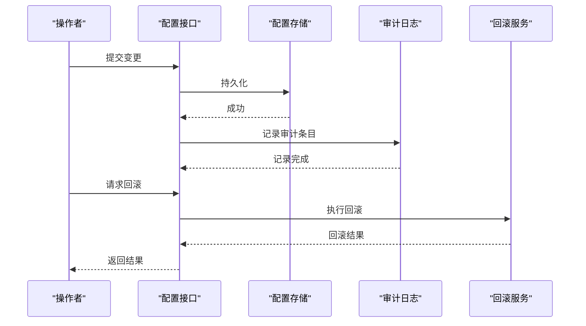
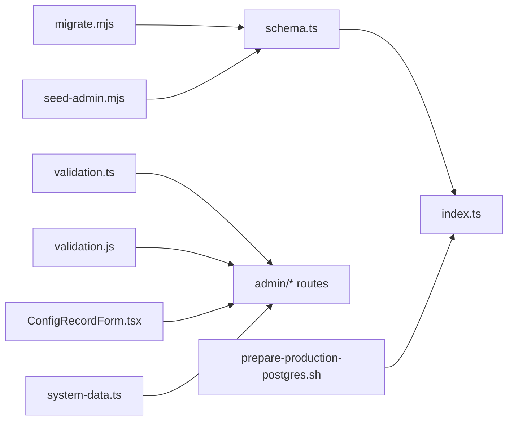

# 系统配置实体

<cite>
**本文引用的文件**   
- [db/schema.ts](file://db/schema.ts)
- [db/index.ts](file://db/index.ts)
- [drizzle.config.ts](file://drizzle.config.ts)
- [lib/validation.ts](file://lib/validation.ts)
- [lib/validation.js](file://lib/validation.js)
- [app/components/forms/ConfigRecordForm.tsx](file://app/components/forms/ConfigRecordForm.tsx)
- [app/system-data.ts](file://app/system-data.ts)
- [app/api/admin/logs/route.ts](file://app/api/admin/logs/route.ts)
- [app/api/admin/users/route.ts](file://app/api/admin/users/route.ts)
- [app/api/admin/users/[id]/route.ts](file://app/api/admin/users/[id]/route.ts)
- [scripts/migrate.mjs](file://scripts/migrate.mjs)
- [scripts/seed-admin.mjs](file://scripts/seed-admin.mjs)
- [deploy/prepare-production-postgres.sh](file://deploy/prepare-production-postgres.sh)
</cite>

## 目录
1. [简介](#简介)
2. [项目结构](#项目结构)
3. [核心组件](#核心组件)
4. [架构总览](#架构总览)
5. [详细组件分析](#详细组件分析)
6. [依赖关系分析](#依赖关系分析)
7. [性能考虑](#性能考虑)
8. [故障排查指南](#故障排查指南)
9. [结论](#结论)
10. [附录](#附录)

## 简介
本文件围绕“系统配置相关的数据实体”进行系统化文档化，覆盖以下目标：
- 系统参数表、功能开关、界面配置等配置项的存储结构与字段语义
- 配置的层级关系与继承机制（全局配置、模块配置、用户自定义配置）
- 配置热更新机制与版本兼容性处理策略
- 配置验证规则与默认值管理策略
- 配置变更的审计追踪与回滚机制

本说明面向开发者与运维人员，力求在保持技术严谨性的同时，提供易于理解的结构化描述。

## 项目结构
与系统配置相关的代码主要分布在数据库定义、校验逻辑、前端表单以及迁移脚本中：
- 数据库层：使用 Drizzle ORM 定义数据模型与迁移
- 校验层：统一的输入校验与默认值处理
- 前端层：配置记录表单与展示
- 迁移与初始化：数据库迁移、种子数据生成与环境准备

图表来源
- [db/schema.ts](file://db/schema.ts)
- [db/index.ts](file://db/index.ts)
- [drizzle.config.ts](file://drizzle.config.ts)
- [lib/validation.ts](file://lib/validation.ts)
- [lib/validation.js](file://lib/validation.js)
- [app/components/forms/ConfigRecordForm.tsx](file://app/components/forms/ConfigRecordForm.tsx)
- [app/system-data.ts](file://app/system-data.ts)
- [app/api/admin/logs/route.ts](file://app/api/admin/logs/route.ts)
- [app/api/admin/users/route.ts](file://app/api/admin/users/route.ts)
- [app/api/admin/users/[id]/route.ts](file://app/api/admin/users/[id]/route.ts)
- [scripts/migrate.mjs](file://scripts/migrate.mjs)
- [scripts/seed-admin.mjs](file://scripts/seed-admin.mjs)
- [deploy/prepare-production-postgres.sh](file://deploy/prepare-production-postgres.sh)

章节来源
- [db/schema.ts](file://db/schema.ts)
- [db/index.ts](file://db/index.ts)
- [drizzle.config.ts](file://drizzle.config.ts)
- [lib/validation.ts](file://lib/validation.ts)
- [lib/validation.js](file://lib/validation.js)
- [app/components/forms/ConfigRecordForm.tsx](file://app/components/forms/ConfigRecordForm.tsx)
- [app/system-data.ts](file://app/system-data.ts)
- [app/api/admin/logs/route.ts](file://app/api/admin/logs/route.ts)
- [app/api/admin/users/route.ts](file://app/api/admin/users/route.ts)
- [app/api/admin/users/[id]/route.ts](file://app/api/admin/users/[id]/route.ts)
- [scripts/migrate.mjs](file://scripts/migrate.mjs)
- [scripts/seed-admin.mjs](file://scripts/seed-admin.mjs)
- [deploy/prepare-production-postgres.sh](file://deploy/prepare-production-postgres.sh)

## 核心组件
- 数据模型定义：集中定义系统配置相关表结构（如系统参数、功能开关、界面配置），包括字段类型、约束与索引
- 数据库连接与迁移：通过 Drizzle 配置与迁移脚本确保数据库结构演进与一致性
- 校验与默认值：统一对配置项进行格式校验、范围检查与默认值填充
- 前端配置表单：提供可视化编辑能力，支持按层级选择与保存
- 审计与日志：记录关键配置变更操作，便于追踪与回溯

章节来源
- [db/schema.ts](file://db/schema.ts)
- [db/index.ts](file://db/index.ts)
- [drizzle.config.ts](file://drizzle.config.ts)
- [lib/validation.ts](file://lib/validation.ts)
- [lib/validation.js](file://lib/validation.js)
- [app/components/forms/ConfigRecordForm.tsx](file://app/components/forms/ConfigRecordForm.tsx)

## 架构总览
系统配置的整体流程如下：
- 前端通过配置表单提交配置变更请求
- API 层接收请求并进行权限校验与输入校验
- 数据层根据模型写入或更新配置记录
- 审计日志记录变更上下文（操作人、时间、变更前后值）
- 缓存或运行时配置加载器按需刷新，实现热更新
- 迁移脚本保证数据库结构兼容新版本

图表来源
- [app/components/forms/ConfigRecordForm.tsx](file://app/components/forms/ConfigRecordForm.tsx)
- [app/api/admin/logs/route.ts](file://app/api/admin/logs/route.ts)
- [lib/validation.ts](file://lib/validation.ts)
- [lib/validation.js](file://lib/validation.js)
- [db/schema.ts](file://db/schema.ts)
- [db/index.ts](file://db/index.ts)

## 详细组件分析

### 数据模型与存储结构
- 系统参数表：用于存储全局运行参数（如超时、阈值、开关常量）
- 功能开关表：用于控制模块级功能启用/禁用及灰度策略
- 界面配置表：用于管理页面布局、显示选项、主题与文案等
- 公共字段建议：键名、值类型、作用域（全局/模块/用户）、生效状态、版本、创建/更新时间、备注

图表来源
- [db/schema.ts](file://db/schema.ts)

章节来源
- [db/schema.ts](file://db/schema.ts)

### 配置层级与继承机制
- 层级划分：全局配置（系统级）、模块配置（业务域级）、用户自定义配置（个人偏好级）
- 继承策略：读取时按优先级合并（用户 > 模块 > 全局），未命中则回退到默认值
- 作用域标识：通过 scope 字段区分，结合 key 命名空间避免冲突
- 生效控制：enabled/active 字段控制是否参与合并与生效

图表来源
- [lib/validation.ts](file://lib/validation.ts)
- [lib/validation.js](file://lib/validation.js)
- [app/system-data.ts](file://app/system-data.ts)

章节来源
- [lib/validation.ts](file://lib/validation.ts)
- [lib/validation.js](file://lib/validation.js)
- [app/system-data.ts](file://app/system-data.ts)

### 配置热更新机制
- 触发方式：配置变更后由 API 层发布事件或更新缓存
- 加载策略：服务启动时加载基础配置，运行时按需增量刷新
- 失效策略：版本号变化或标记失效时强制刷新
- 安全策略：敏感配置变更需二次确认与审计

图表来源
- [app/api/admin/logs/route.ts](file://app/api/admin/logs/route.ts)
- [db/schema.ts](file://db/schema.ts)
- [db/index.ts](file://db/index.ts)

章节来源
- [app/api/admin/logs/route.ts](file://app/api/admin/logs/route.ts)
- [db/schema.ts](file://db/schema.ts)
- [db/index.ts](file://db/index.ts)

### 版本兼容性与迁移
- 版本字段：每个配置项维护 version，用于判断是否需要迁移或回滚
- 迁移脚本：通过 Drizzle 迁移与自定义脚本保证结构演进
- 向后兼容：新增字段设置默认值，旧客户端可忽略未知字段
- 回滚策略：保留历史快照，支持按版本回滚

图表来源
- [scripts/migrate.mjs](file://scripts/migrate.mjs)
- [drizzle.config.ts](file://drizzle.config.ts)
- [db/schema.ts](file://db/schema.ts)

章节来源
- [scripts/migrate.mjs](file://scripts/migrate.mjs)
- [drizzle.config.ts](file://drizzle.config.ts)
- [db/schema.ts](file://db/schema.ts)

### 配置验证与默认值管理
- 校验维度：必填性、类型、取值范围、正则匹配、跨字段依赖
- 默认值策略：按层级提供默认值，未命中时回退到系统内置默认
- 错误反馈：前端即时提示，后端统一错误码与消息

图表来源
- [lib/validation.ts](file://lib/validation.ts)
- [lib/validation.js](file://lib/validation.js)
- [app/components/forms/ConfigRecordForm.tsx](file://app/components/forms/ConfigRecordForm.tsx)

章节来源
- [lib/validation.ts](file://lib/validation.ts)
- [lib/validation.js](file://lib/validation.js)
- [app/components/forms/ConfigRecordForm.tsx](file://app/components/forms/ConfigRecordForm.tsx)

### 审计追踪与回滚机制
- 审计内容：操作人、时间、配置键、作用域、变更前值、变更后值、原因
- 存储位置：独立日志表或集中日志服务
- 回滚策略：基于版本快照或差异对比，支持一键恢复
- 权限控制：仅授权角色可执行变更与回滚

图表来源
- [app/api/admin/logs/route.ts](file://app/api/admin/logs/route.ts)
- [db/schema.ts](file://db/schema.ts)
- [db/index.ts](file://db/index.ts)

章节来源
- [app/api/admin/logs/route.ts](file://app/api/admin/logs/route.ts)
- [db/schema.ts](file://db/schema.ts)
- [db/index.ts](file://db/index.ts)

### 前端配置表单与交互
- 表单设计：按层级分组展示，支持搜索与筛选
- 交互流程：选择作用域 -> 编辑键值 -> 校验 -> 提交 -> 提示
- 状态管理：本地草稿与远程同步，失败重试与幂等提交

章节来源
- [app/components/forms/ConfigRecordForm.tsx](file://app/components/forms/ConfigRecordForm.tsx)
- [app/system-data.ts](file://app/system-data.ts)

## 依赖关系分析
- 数据模型依赖：所有配置表均依赖统一的 schema 定义与数据库连接
- 校验依赖：API 层依赖 validation 模块进行输入校验与默认值填充
- 迁移依赖：迁移脚本依赖 drizzle 配置与 schema 定义
- 审计依赖：日志接口与配置接口协作，确保变更可追溯

图表来源
- [db/schema.ts](file://db/schema.ts)
- [db/index.ts](file://db/index.ts)
- [lib/validation.ts](file://lib/validation.ts)
- [lib/validation.js](file://lib/validation.js)
- [app/components/forms/ConfigRecordForm.tsx](file://app/components/forms/ConfigRecordForm.tsx)
- [app/system-data.ts](file://app/system-data.ts)
- [scripts/migrate.mjs](file://scripts/migrate.mjs)
- [scripts/seed-admin.mjs](file://scripts/seed-admin.mjs)
- [deploy/prepare-production-postgres.sh](file://deploy/prepare-production-postgres.sh)

章节来源
- [db/schema.ts](file://db/schema.ts)
- [db/index.ts](file://db/index.ts)
- [lib/validation.ts](file://lib/validation.ts)
- [lib/validation.js](file://lib/validation.js)
- [app/components/forms/ConfigRecordForm.tsx](file://app/components/forms/ConfigRecordForm.tsx)
- [app/system-data.ts](file://app/system-data.ts)
- [scripts/migrate.mjs](file://scripts/migrate.mjs)
- [scripts/seed-admin.mjs](file://scripts/seed-admin.mjs)
- [deploy/prepare-production-postgres.sh](file://deploy/prepare-production-postgres.sh)

## 性能考虑
- 读取优化：按作用域建立索引，减少全表扫描；热点配置加入内存缓存
- 写入优化：批量更新与事务封装，降低锁竞争
- 热更新优化：增量刷新与懒加载，避免全量重启
- 校验优化：前端预校验与后端快速失败，减少无效请求

[本节为通用指导，不直接分析具体文件]

## 故障排查指南
- 配置不生效：检查作用域优先级、生效标志位、版本是否最新
- 校验失败：查看错误码与消息，定位字段类型或范围问题
- 迁移失败：核对迁移脚本执行顺序与数据库状态，必要时回滚
- 审计缺失：确认日志接口可用与权限配置正确

章节来源
- [app/api/admin/logs/route.ts](file://app/api/admin/logs/route.ts)
- [lib/validation.ts](file://lib/validation.ts)
- [lib/validation.js](file://lib/validation.js)
- [scripts/migrate.mjs](file://scripts/migrate.mjs)

## 结论
通过对系统配置相关数据实体的结构化梳理，明确了存储结构、层级继承、热更新、版本兼容、校验默认值、审计回滚等关键机制。建议在实施过程中严格遵循上述规范，并结合实际业务场景进行扩展与优化。

[本节为总结性内容，不直接分析具体文件]

## 附录
- 常用配置键命名规范：采用“模块.子模块.属性”的分层命名
- 默认值管理建议：将默认值集中在配置中心或常量文件中统一管理
- 审计字段建议：包含操作人、时间、IP、会话ID、变更摘要

[本节为补充说明，不直接分析具体文件]