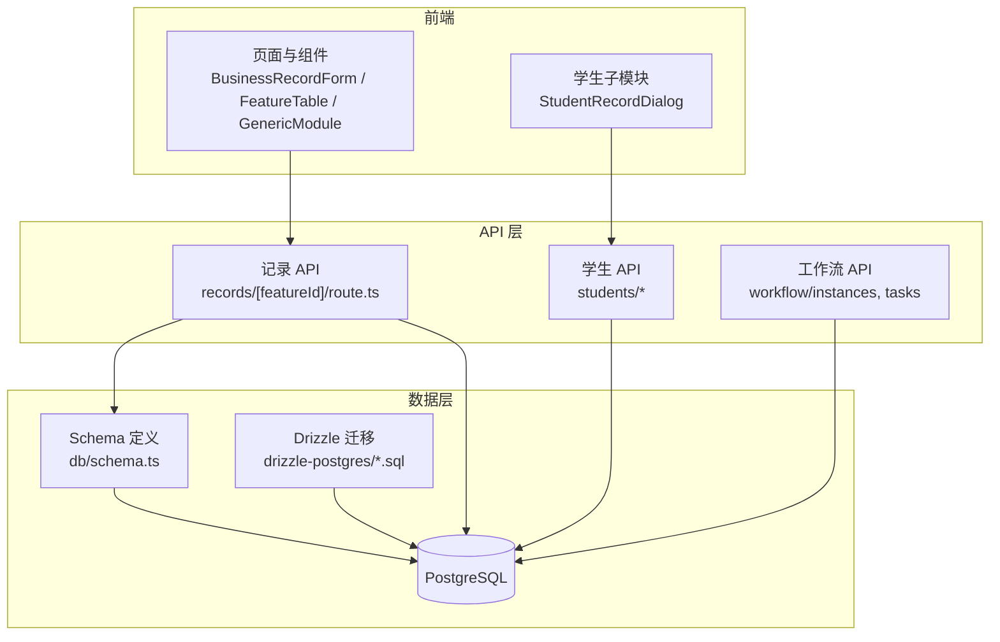
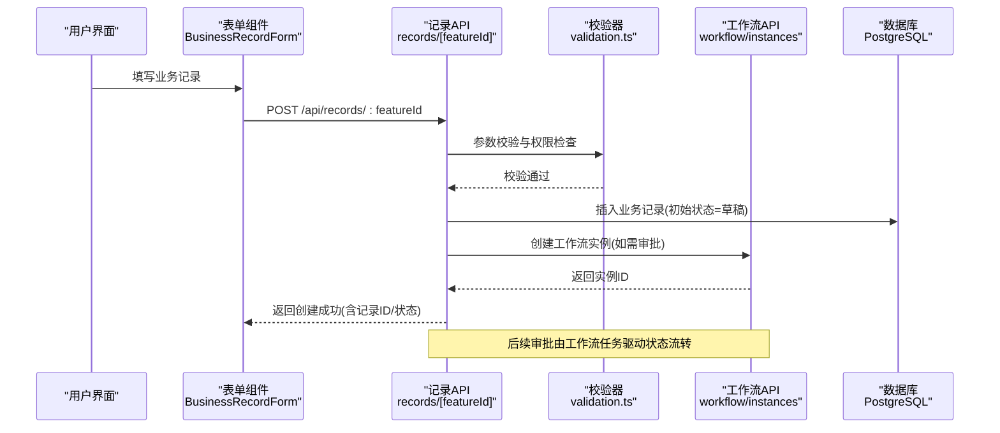
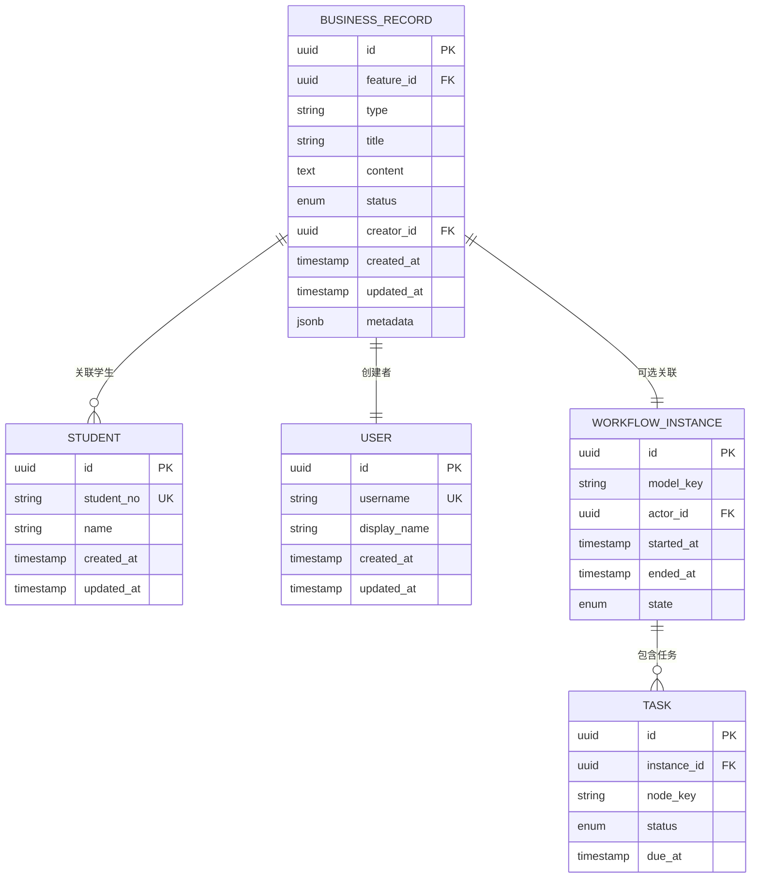
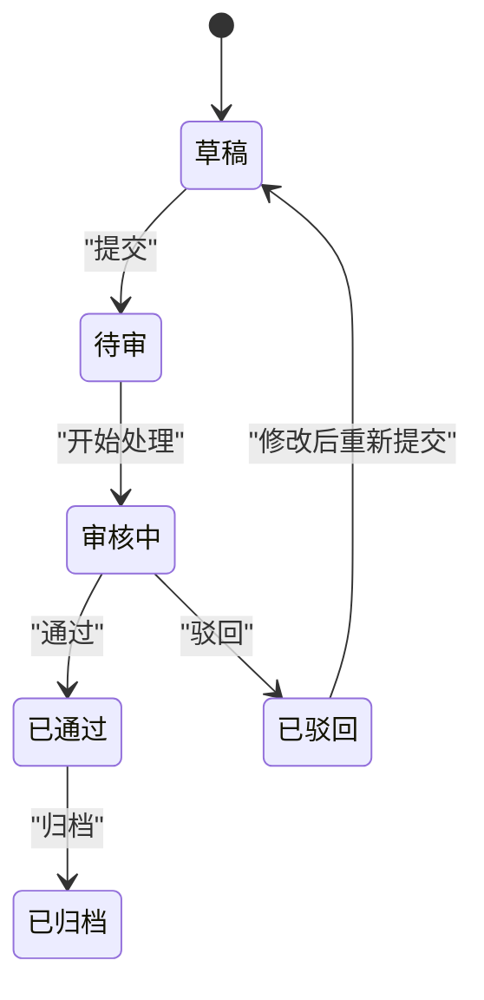
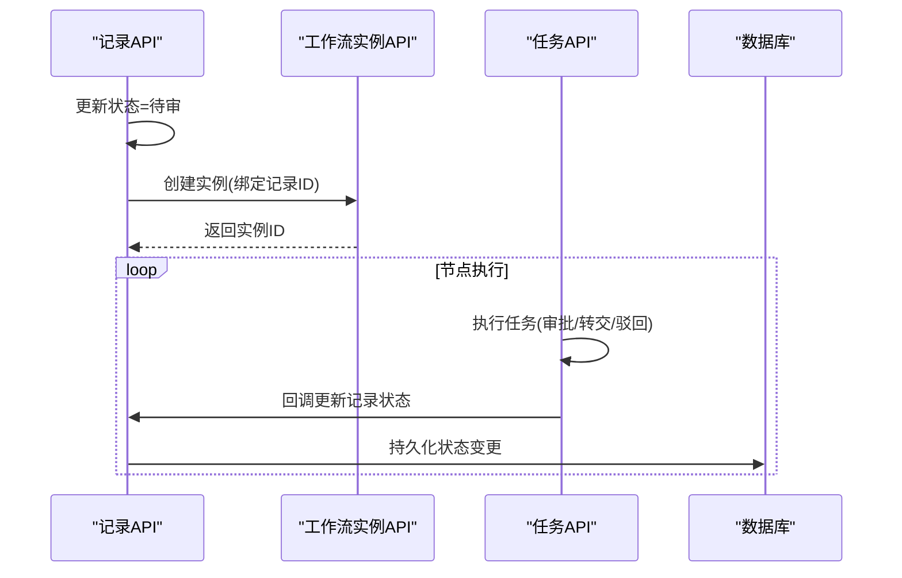
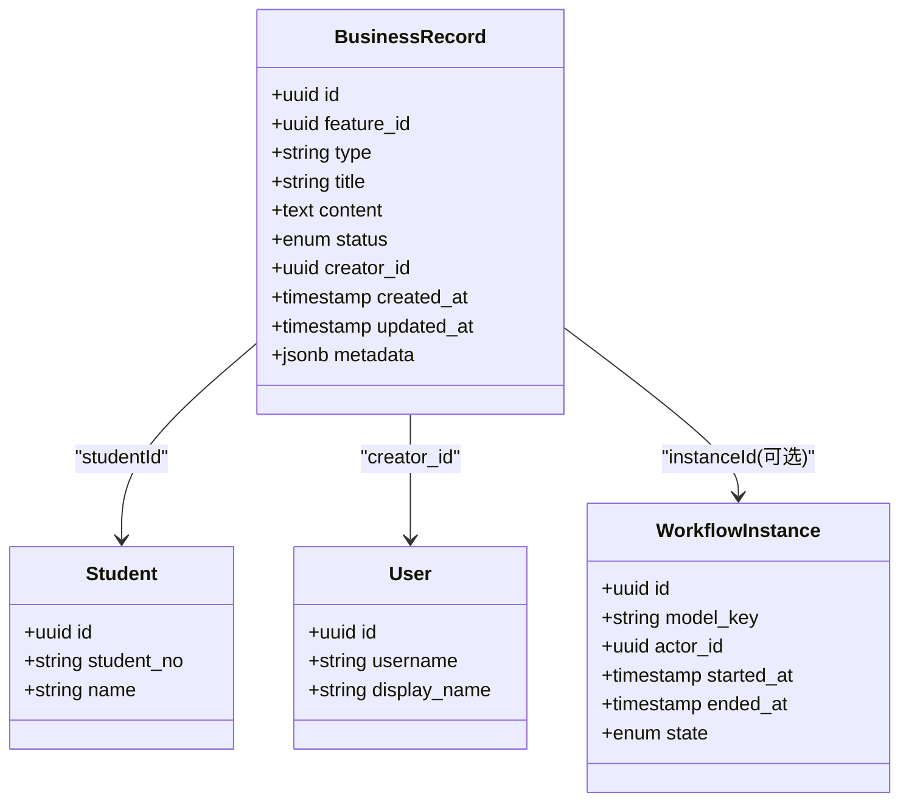
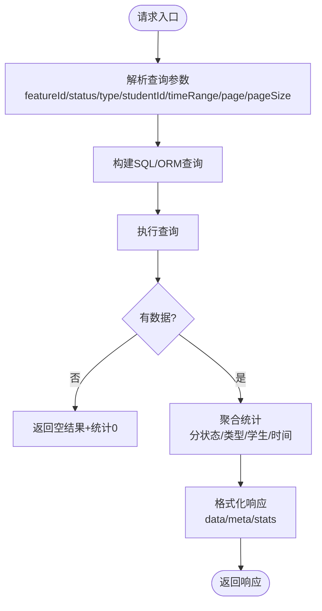
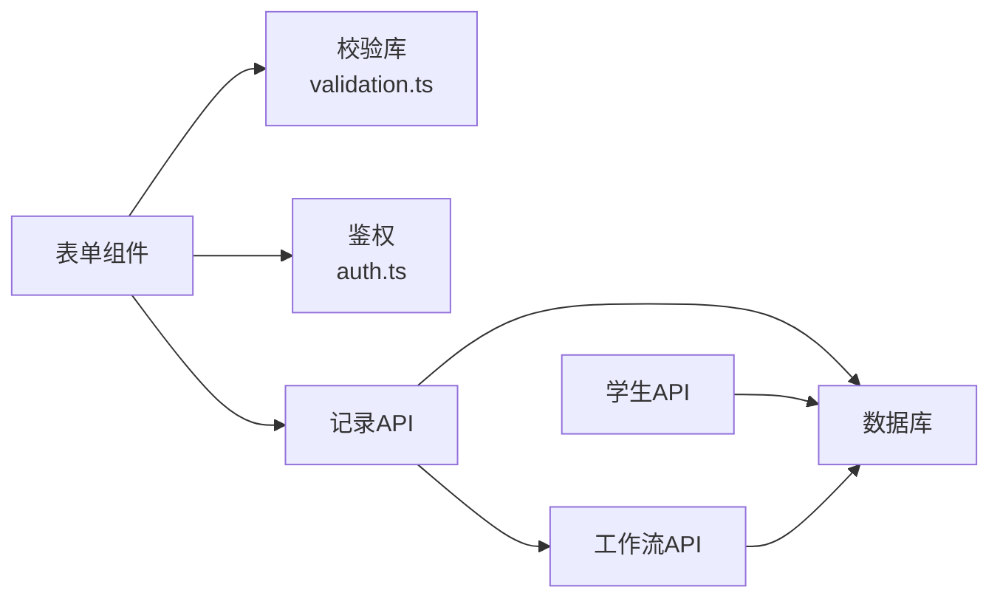

# 业务记录实体

<cite>
**本文引用的文件**   
- [db/schema.ts](file://db/schema.ts)
- [drizzle-postgres/0000_fine_psylocke.sql](file://drizzle-postgres/0000_fine_psylocke.sql)
- [drizzle-postgres/0001_thin_queen_noir.sql](file://drizzle-postgres/0001_thin_queen_noir.sql)
- [drizzle-postgres/0002_crazy_ravenous.sql](file://drizzle-postgres/0002_crazy_ravenous.sql)
- [drizzle-postgres/0003_fine_quentin_quire.sql](file://drizzle-postgres/0003_fine_quentin_quire.sql)
- [app/api/records/[featureId]/route.ts](file://app/api/records/[featureId]/route.ts)
- [app/components/forms/BusinessRecordForm.tsx](file://app/components/forms/BusinessRecordForm.tsx)
- [app/components/forms/ApplicationRecordForm.tsx](file://app/components/forms/ApplicationRecordForm.tsx)
- [app/components/forms/ArchiveRecordForm.tsx](file://app/components/forms/ArchiveRecordForm.tsx)
- [app/components/forms/ConfigRecordForm.tsx](file://app/components/forms/ConfigRecordForm.tsx)
- [app/components/forms/ReviewRecordForm.tsx](file://app/components/forms/ReviewRecordForm.tsx)
- [app/components/generic/FeatureTable.tsx](file://app/components/generic/FeatureTable.tsx)
- [app/components/generic/GenericModule.tsx](file://app/components/generic/GenericModule.tsx)
- [app/components/student/StudentRecordDialog.tsx](file://app/components/student/StudentRecordDialog.tsx)
- [app/feature-metadata.ts](file://app/feature-metadata.ts)
- [lib/validation.ts](file://lib/validation.ts)
- [lib/auth.ts](file://lib/auth.ts)
- [app/api/workflow/instances/route.ts](file://app/api/workflow/instances/route.ts)
- [app/api/workflow/tasks/route.ts](file://app/api/workflow/tasks/route.ts)
- [app/api/students/route.ts](file://app/api/students/route.ts)
- [app/api/students/[id]/route.ts](file://app/api/students/[id]/route.ts)
</cite>

## 目录
1. [简介](#简介)
2. [项目结构](#项目结构)
3. [核心组件](#核心组件)
4. [架构总览](#架构总览)
5. [详细组件分析](#详细组件分析)
6. [依赖关系分析](#依赖关系分析)
7. [性能考虑](#性能考虑)
8. [故障排查指南](#故障排查指南)
9. [结论](#结论)
10. [附录](#附录)

## 简介
本文件围绕“业务记录”实体进行系统化文档化，覆盖数据表结构设计、分类体系与状态管理、审批流程、CRUD 接口与使用示例、与学生/用户/工作流的关联关系，以及查询统计方法与报表生成数据结构。目标读者既包括后端与前端开发者，也包括产品与运维人员。

## 项目结构
本项目采用 Next.js App Router 组织前后端代码，数据库定义位于 db/schema.ts 与 drizzle 迁移脚本中；业务记录的 API 路由集中在 app/api/records/[featureId]/route.ts；表单与通用表格在 components 目录下；学生与工作流相关能力分别由 students 与 workflow 模块提供。

图表来源
- [app/api/records/[featureId]/route.ts](file://app/api/records/[featureId]/route.ts)
- [db/schema.ts](file://db/schema.ts)
- [drizzle-postgres/0000_fine_psylocke.sql](file://drizzle-postgres/0000_fine_psylocke.sql)
- [drizzle-postgres/0001_thin_queen_noir.sql](file://drizzle-postgres/0001_thin_queen_noir.sql)
- [drizzle-postgres/0002_crazy_ravenous.sql](file://drizzle-postgres/0002_crazy_ravenous.sql)
- [drizzle-postgres/0003_fine_quentin_quire.sql](file://drizzle-postgres/0003_fine_quentin_quire.sql)

章节来源
- [db/schema.ts](file://db/schema.ts)
- [app/api/records/[featureId]/route.ts](file://app/api/records/[featureId]/route.ts)
- [app/components/generic/FeatureTable.tsx](file://app/components/generic/FeatureTable.tsx)
- [app/components/generic/GenericModule.tsx](file://app/components/generic/GenericModule.tsx)

## 核心组件
- 数据模型与约束：通过 Drizzle schema 与 SQL 迁移共同定义业务记录主表及关联表（学生、用户、工作流实例等），包含字段类型、非空约束、默认值与索引策略。
- 分类体系：以 featureId 作为功能域标识，配合类型/分类字段实现多类业务记录的统一建模。
- 状态管理与审批：结合工作流实例与任务驱动的状态机，支持提交、审核、驳回、归档等生命周期流转。
- CRUD 接口：统一的 records/[featureId] 路由提供按功能域增删改查能力，并集成鉴权与校验。
- 学生关联：学生模块提供学生主数据与绑定关系，业务记录可关联学生主体。
- 报表与统计：基于通用表格与统计概览组件，聚合查询结果导出 CSV 或渲染统计面板。

章节来源
- [db/schema.ts](file://db/schema.ts)
- [drizzle-postgres/0000_fine_psylocke.sql](file://drizzle-postgres/0000_fine_psylocke.sql)
- [drizzle-postgres/0001_thin_queen_noir.sql](file://drizzle-postgres/0001_thin_queen_noir.sql)
- [drizzle-postgres/0002_crazy_ravenous.sql](file://drizzle-postgres/0002_crazy_ravenous.sql)
- [drizzle-postgres/0003_fine_quentin_quire.sql](file://drizzle-postgres/0003_fine_quentin_quire.sql)
- [app/api/records/[featureId]/route.ts](file://app/api/records/[featureId]/route.ts)
- [app/components/generic/FeatureTable.tsx](file://app/components/generic/FeatureTable.tsx)
- [app/components/generic/GenericModule.tsx](file://app/components/generic/GenericModule.tsx)
- [app/components/student/StudentRecordDialog.tsx](file://app/components/student/StudentRecordDialog.tsx)

## 架构总览
业务记录实体贯穿“前端表单 → API 路由 → 数据模型 → 数据库”，并通过工作流引擎驱动状态变更。学生与用户为外部主数据源，业务记录通过外键建立关联。

图表来源
- [app/components/forms/BusinessRecordForm.tsx](file://app/components/forms/BusinessRecordForm.tsx)
- [app/api/records/[featureId]/route.ts](file://app/api/records/[featureId]/route.ts)
- [lib/validation.ts](file://lib/validation.ts)
- [app/api/workflow/instances/route.ts](file://app/api/workflow/instances/route.ts)
- [db/schema.ts](file://db/schema.ts)

## 详细组件分析

### 数据表结构与字段定义
- 主表：业务记录主表用于承载各功能域的业务数据，关键字段包括唯一标识、功能域标识(featureId)、类型/分类、标题、内容、状态、创建者、更新时间戳、审计信息等。
- 关联表：学生表、用户表、工作流实例表、任务表等，通过外键与业务记录建立一对一或多对一关系。
- 约束与索引：主键约束、非空约束、唯一性约束（如业务编号）、外键约束、时间戳默认值、常用查询字段索引（如 featureId、status、studentId）。

图表来源
- [db/schema.ts](file://db/schema.ts)
- [drizzle-postgres/0000_fine_psylocke.sql](file://drizzle-postgres/0000_fine_psylocke.sql)
- [drizzle-postgres/0001_thin_queen_noir.sql](file://drizzle-postgres/0001_thin_queen_noir.sql)
- [drizzle-postgres/0002_crazy_ravenous.sql](file://drizzle-postgres/0002_crazy_ravenous.sql)
- [drizzle-postgres/0003_fine_quentin_quire.sql](file://drizzle-postgres/0003_fine_quentin_quire.sql)

章节来源
- [db/schema.ts](file://db/schema.ts)
- [drizzle-postgres/0000_fine_psylocke.sql](file://drizzle-postgres/0000_fine_psylocke.sql)
- [drizzle-postgres/0001_thin_queen_noir.sql](file://drizzle-postgres/0001_thin_queen_noir.sql)
- [drizzle-postgres/0002_crazy_ravenous.sql](file://drizzle-postgres/0002_crazy_ravenous.sql)
- [drizzle-postgres/0003_fine_quentin_quire.sql](file://drizzle-postgres/0003_fine_quentin_quire.sql)

### 分类体系与状态管理
- 分类体系：通过 featureId 区分不同业务域（如申请、档案、配置、评审等），每个 featureId 可映射到一组类型枚举与展示模板。
- 状态管理：记录状态涵盖草稿、待审、审核中、已通过、已驳回、已归档等；状态变更由工作流任务驱动，确保一致性。
- 元数据扩展：metadata 字段支持 JSON 存储动态属性，便于扩展不同业务域的差异化字段。

图表来源
- [app/api/records/[featureId]/route.ts](file://app/api/records/[featureId]/route.ts)
- [app/api/workflow/instances/route.ts](file://app/api/workflow/instances/route.ts)
- [app/api/workflow/tasks/route.ts](file://app/api/workflow/tasks/route.ts)

章节来源
- [app/api/records/[featureId]/route.ts](file://app/api/records/[featureId]/route.ts)
- [app/api/workflow/instances/route.ts](file://app/api/workflow/instances/route.ts)
- [app/api/workflow/tasks/route.ts](file://app/api/workflow/tasks/route.ts)

### 审批流程与工作流集成
- 触发条件：当记录进入“待审”时，自动创建工作流实例，并将记录与实例关联。
- 任务驱动：工作流节点对应具体审批动作，任务完成后更新记录状态。
- 回滚与重试：驳回将回到草稿或指定上游节点，支持修正后重新提交。

图表来源
- [app/api/records/[featureId]/route.ts](file://app/api/records/[featureId]/route.ts)
- [app/api/workflow/instances/route.ts](file://app/api/workflow/instances/route.ts)
- [app/api/workflow/tasks/route.ts](file://app/api/workflow/tasks/route.ts)

章节来源
- [app/api/records/[featureId]/route.ts](file://app/api/records/[featureId]/route.ts)
- [app/api/workflow/instances/route.ts](file://app/api/workflow/instances/route.ts)
- [app/api/workflow/tasks/route.ts](file://app/api/workflow/tasks/route.ts)

### CRUD 操作接口与使用示例
- 创建记录：POST /api/records/:featureId，携带 featureId、类型、标题、内容与必要元数据；成功后返回记录ID与初始状态。
- 查询列表：GET /api/records/:featureId?status=&type=&studentId=&page=&pageSize=，支持分页与过滤。
- 获取详情：GET /api/records/:featureId/:id，返回完整记录与关联信息。
- 更新记录：PUT /api/records/:featureId/:id，仅允许草稿或特定状态编辑。
- 删除记录：DELETE /api/records/:featureId/:id，软删除或硬删除取决于策略。
- 提交审批：POST /api/records/:featureId/:id/submit，触发工作流。

使用示例（描述）
- 前端表单 BusinessRecordForm 收集字段并提交至 records API；FeatureTable 负责列表渲染、筛选与分页；GenericModule 封装通用模块行为。
- 学生关联：StudentRecordDialog 在学生详情页快速创建或查看其关联记录。

章节来源
- [app/api/records/[featureId]/route.ts](file://app/api/records/[featureId]/route.ts)
- [app/components/forms/BusinessRecordForm.tsx](file://app/components/forms/BusinessRecordForm.tsx)
- [app/components/generic/FeatureTable.tsx](file://app/components/generic/FeatureTable.tsx)
- [app/components/generic/GenericModule.tsx](file://app/components/generic/GenericModule.tsx)
- [app/components/student/StudentRecordDialog.tsx](file://app/components/student/StudentRecordDialog.tsx)

### 与学生、用户、工作流的关联关系
- 学生关联：业务记录可通过 studentId 关联学生主数据，支持按学生维度检索与统计。
- 用户关联：creator_id 指向用户表，用于审计与权限控制。
- 工作流关联：可选关联工作流实例，记录审批轨迹与节点历史。

图表来源
- [db/schema.ts](file://db/schema.ts)
- [app/api/students/route.ts](file://app/api/students/route.ts)
- [app/api/students/[id]/route.ts](file://app/api/students/[id]/route.ts)
- [app/api/workflow/instances/route.ts](file://app/api/workflow/instances/route.ts)

章节来源
- [db/schema.ts](file://db/schema.ts)
- [app/api/students/route.ts](file://app/api/students/route.ts)
- [app/api/students/[id]/route.ts](file://app/api/students/[id]/route.ts)
- [app/api/workflow/instances/route.ts](file://app/api/workflow/instances/route.ts)

### 查询统计方法与报表生成数据结构
- 查询方法：支持按 featureId、status、type、studentId、时间范围等多维过滤；分页参数 page、pageSize；排序字段与方向。
- 统计指标：总量、分状态计数、分类型计数、分学生计数、趋势折线（按时间聚合）。
- 报表结构：统一返回 data（明细列表）、meta（分页信息）、stats（统计摘要）、exportUrl（CSV导出链接）。

图表来源
- [app/api/records/[featureId]/route.ts](file://app/api/records/[featureId]/route.ts)
- [app/components/generic/FeatureTable.tsx](file://app/components/generic/FeatureTable.tsx)
- [app/components/generic/GenericModule.tsx](file://app/components/generic/GenericModule.tsx)

章节来源
- [app/api/records/[featureId]/route.ts](file://app/api/records/[featureId]/route.ts)
- [app/components/generic/FeatureTable.tsx](file://app/components/generic/FeatureTable.tsx)
- [app/components/generic/GenericModule.tsx](file://app/components/generic/GenericModule.tsx)

### 表单与通用模块
- 业务记录表单：BusinessRecordForm 负责字段收集、校验与提交；ApplicationRecordForm、ArchiveRecordForm、ConfigRecordForm、ReviewRecordForm 针对特定 featureId 的专用表单。
- 通用表格：FeatureTable 提供列设置、搜索、分页、导出等功能；GenericModule 封装模块级逻辑（鉴权、缓存、错误处理）。
- 学生记录弹窗：StudentRecordDialog 在学生详情内快速访问其业务记录。

章节来源
- [app/components/forms/BusinessRecordForm.tsx](file://app/components/forms/BusinessRecordForm.tsx)
- [app/components/forms/ApplicationRecordForm.tsx](file://app/components/forms/ApplicationRecordForm.tsx)
- [app/components/forms/ArchiveRecordForm.tsx](file://app/components/forms/ArchiveRecordForm.tsx)
- [app/components/forms/ConfigRecordForm.tsx](file://app/components/forms/ConfigRecordForm.tsx)
- [app/components/forms/ReviewRecordForm.tsx](file://app/components/forms/ReviewRecordForm.tsx)
- [app/components/generic/FeatureTable.tsx](file://app/components/generic/FeatureTable.tsx)
- [app/components/generic/GenericModule.tsx](file://app/components/generic/GenericModule.tsx)
- [app/components/student/StudentRecordDialog.tsx](file://app/components/student/StudentRecordDialog.tsx)

## 依赖关系分析
- 前端依赖：表单组件依赖校验库与鉴权工具；表格组件依赖通用模块与下载工具。
- API 依赖：记录 API 依赖校验、鉴权、数据库客户端与工作流 API。
- 数据依赖：schema 与迁移脚本共同保证数据库结构一致；学生与工作流模块提供主数据与流程能力。

图表来源
- [lib/validation.ts](file://lib/validation.ts)
- [lib/auth.ts](file://lib/auth.ts)
- [app/api/records/[featureId]/route.ts](file://app/api/records/[featureId]/route.ts)
- [app/api/students/route.ts](file://app/api/students/route.ts)
- [app/api/workflow/instances/route.ts](file://app/api/workflow/instances/route.ts)

章节来源
- [lib/validation.ts](file://lib/validation.ts)
- [lib/auth.ts](file://lib/auth.ts)
- [app/api/records/[featureId]/route.ts](file://app/api/records/[featureId]/route.ts)
- [app/api/students/route.ts](file://app/api/students/route.ts)
- [app/api/workflow/instances/route.ts](file://app/api/workflow/instances/route.ts)

## 性能考虑
- 索引优化：对高频查询字段（featureId、status、studentId、created_at）建立索引，提升过滤与排序性能。
- 分页与懒加载：列表接口强制分页，避免一次性加载大量数据；前端按需加载详情。
- 缓存策略：对只读统计与字典数据使用短期缓存，降低数据库压力。
- 批量操作：导入与批量更新走异步任务队列，避免阻塞请求。
- 连接池：合理配置数据库连接池大小与超时，防止连接耗尽。

## 故障排查指南
- 鉴权失败：检查 auth 中间件与用户会话，确认当前用户具备相应角色与权限。
- 校验错误：核对输入字段是否符合 validation 规则，关注必填项与格式限制。
- 工作流异常：查看工作流实例与任务日志，定位卡住的任务节点与错误原因。
- 数据不一致：比对 schema 与迁移版本，确保数据库结构与应用期望一致。
- 性能问题：启用慢查询日志，分析热点 SQL 与索引命中情况。

章节来源
- [lib/auth.ts](file://lib/auth.ts)
- [lib/validation.ts](file://lib/validation.ts)
- [app/api/workflow/instances/route.ts](file://app/api/workflow/instances/route.ts)
- [app/api/workflow/tasks/route.ts](file://app/api/workflow/tasks/route.ts)
- [db/schema.ts](file://db/schema.ts)

## 结论
业务记录实体通过统一的 featureId 与状态机机制，实现了多业务域的可扩展建模与规范化审批流程。结合学生与工作流模块，形成完整的“主数据—业务记录—流程”闭环。建议在迭代中持续完善索引与缓存策略，保障高并发下的稳定性与性能。

## 附录
- 功能域元数据：feature-metadata.ts 维护 featureId 与类型、展示模板、权限策略等元数据。
- 系统数据：system-data.ts 提供全局字典与常量，便于前端渲染与校验。
- 测试与样例：tests 与 scripts 目录包含数据生成与迁移脚本，便于本地调试与演示。

章节来源
- [app/feature-metadata.ts](file://app/feature-metadata.ts)
- [app/system-data.ts](file://app/system-data.ts)
- [scripts/seed-full-test-data.mjs](file://scripts/seed-full-test-data.mjs)
- [scripts/migrate.mjs](file://scripts/migrate.mjs)