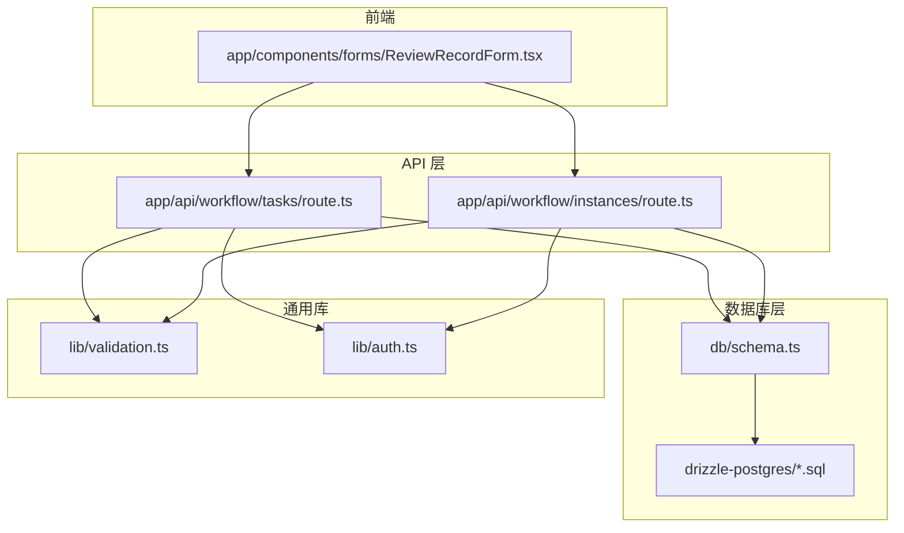
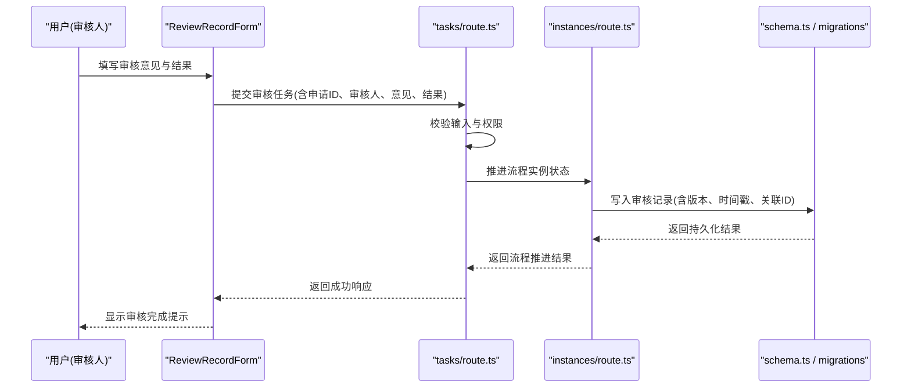
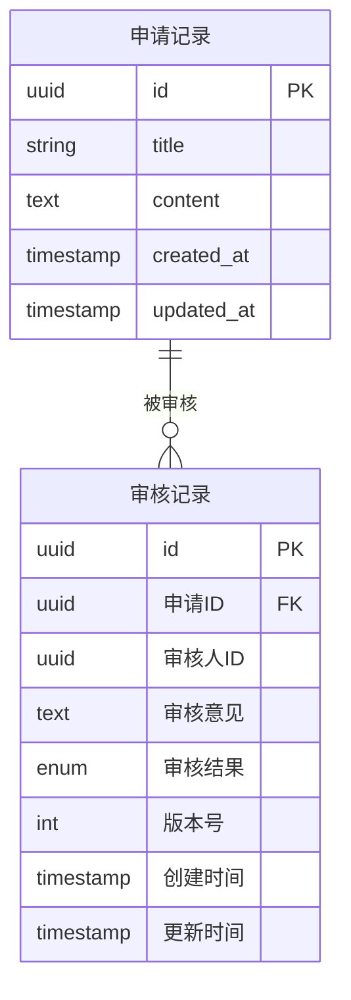
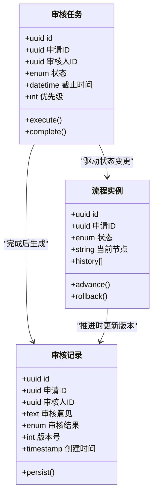
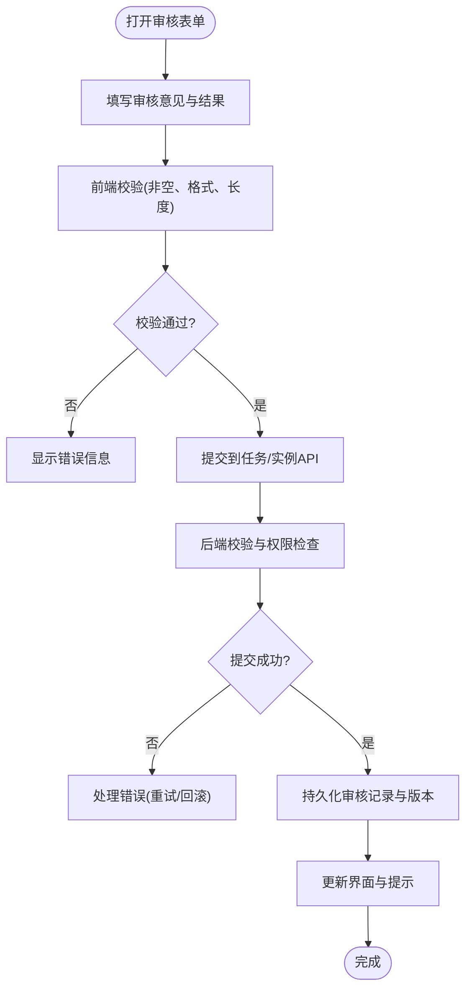
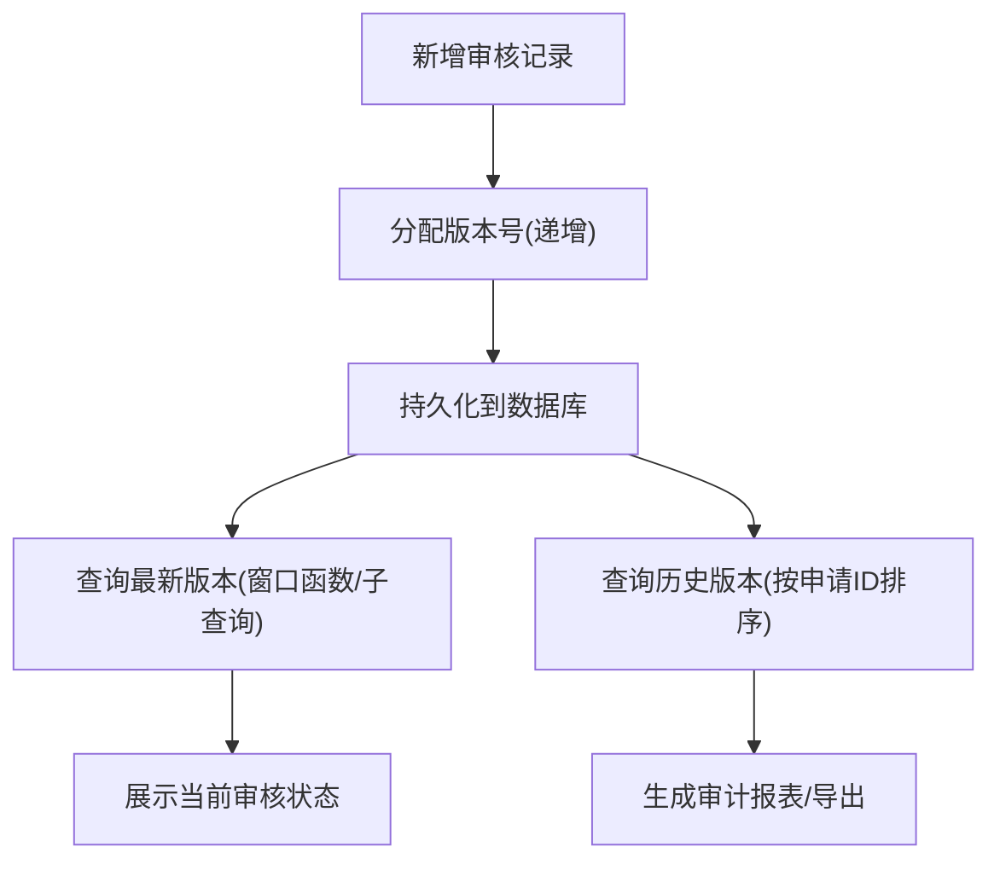
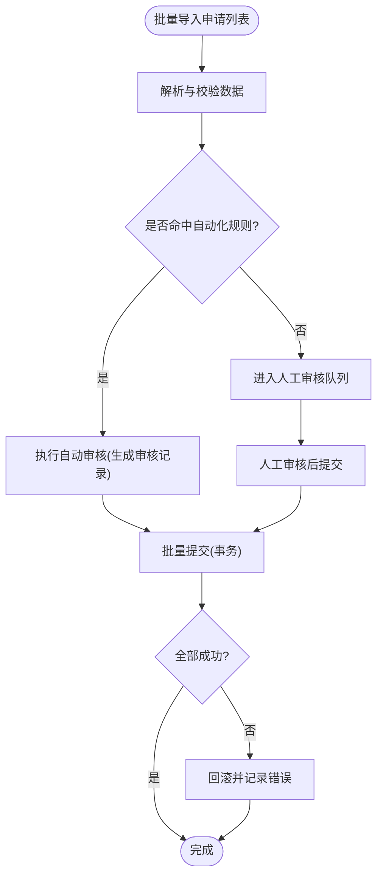
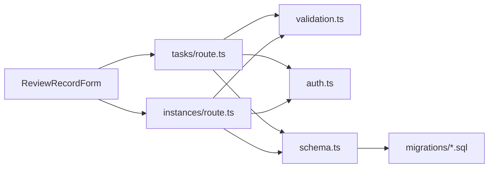

# 审核记录实体

<cite>
**本文引用的文件**   
- [db/schema.ts](file://db/schema.ts)
- [drizzle-postgres/0000_fine_psylocke.sql](file://drizzle-postgres/0000_fine_psylocke.sql)
- [drizzle-postgres/0001_thin_queen_noir.sql](file://drizzle-postgres/0001_thin_queen_noir.sql)
- [drizzle-postgres/0002_crazy_ravenous.sql](file://drizzle-postgres/0002_crazy_ravenous.sql)
- [drizzle-postgres/0003_fine_quentin_quire.sql](file://drizzle-postgres/0003_fine_quentin_quire.sql)
- [app/api/workflow/tasks/route.ts](file://app/api/workflow/tasks/route.ts)
- [app/api/workflow/instances/route.ts](file://app/api/workflow/instances/route.ts)
- [app/components/forms/ReviewRecordForm.tsx](file://app/components/forms/ReviewRecordForm.tsx)
- [lib/validation.ts](file://lib/validation.ts)
- [lib/auth.ts](file://lib/auth.ts)
</cite>

## 目录
1. [简介](#简介)
2. [项目结构](#项目结构)
3. [核心组件](#核心组件)
4. [架构总览](#架构总览)
5. [详细组件分析](#详细组件分析)
6. [依赖关系分析](#依赖关系分析)
7. [性能考虑](#性能考虑)
8. [故障排查指南](#故障排查指南)
9. [结论](#结论)
10. [附录](#附录)

## 简介
本文件围绕“审核记录”实体进行系统化文档化，覆盖数据模型设计、与申请记录的关联关系、审批策略与权限控制、版本管理与历史记录追踪、批量处理与自动化规则等关键主题。目标是帮助开发者与业务方快速理解并正确使用审核记录相关能力。

## 项目结构
与审核记录相关的代码主要分布在以下位置：
- 数据库模式定义与迁移脚本：用于描述审核记录表结构与历史演进
- API 路由：提供任务与实例的查询与操作接口（与审核流程紧密相关）
- 前端表单：审核记录录入与展示
- 校验与鉴权：输入校验与权限控制

图表来源
- [db/schema.ts](file://db/schema.ts)
- [drizzle-postgres/0000_fine_psylocke.sql](file://drizzle-postgres/0000_fine_psylocke.sql)
- [drizzle-postgres/0001_thin_queen_noir.sql](file://drizzle-postgres/0001_thin_queen_noir.sql)
- [drizzle-postgres/0002_crazy_ravenous.sql](file://drizzle-postgres/0002_crazy_ravenous.sql)
- [drizzle-postgres/0003_fine_quentin_quire.sql](file://drizzle-postgres/0003_fine_quentin_quire.sql)
- [app/api/workflow/tasks/route.ts](file://app/api/workflow/tasks/route.ts)
- [app/api/workflow/instances/route.ts](file://app/api/workflow/instances/route.ts)
- [app/components/forms/ReviewRecordForm.tsx](file://app/components/forms/ReviewRecordForm.tsx)
- [lib/validation.ts](file://lib/validation.ts)
- [lib/auth.ts](file://lib/auth.ts)

章节来源
- [db/schema.ts](file://db/schema.ts)
- [drizzle-postgres/0000_fine_psylocke.sql](file://drizzle-postgres/0000_fine_psylocke.sql)
- [drizzle-postgres/0001_thin_queen_noir.sql](file://drizzle-postgres/0001_thin_queen_noir.sql)
- [drizzle-postgres/0002_crazy_ravenous.sql](file://drizzle-postgres/0002_crazy_ravenous.sql)
- [drizzle-postgres/0003_fine_quentin_quire.sql](file://drizzle-postgres/0003_fine_quentin_quire.sql)
- [app/api/workflow/tasks/route.ts](file://app/api/workflow/tasks/route.ts)
- [app/api/workflow/instances/route.ts](file://app/api/workflow/instances/route.ts)
- [app/components/forms/ReviewRecordForm.tsx](file://app/components/forms/ReviewRecordForm.tsx)
- [lib/validation.ts](file://lib/validation.ts)
- [lib/auth.ts](file://lib/auth.ts)

## 核心组件
- 审核记录数据模型：包含审核人、审核意见、审核结果、时间戳、版本号、关联的申请记录标识等关键字段
- 审核任务与实例：承载审核流程中的待办任务与流程实例，驱动审核记录的产生与更新
- 前端审核表单：提供审核意见录入、结果选择、批量提交等交互
- 校验与鉴权：对输入进行合法性校验，基于角色或资源权限控制审核操作

章节来源
- [db/schema.ts](file://db/schema.ts)
- [app/api/workflow/tasks/route.ts](file://app/api/workflow/tasks/route.ts)
- [app/api/workflow/instances/route.ts](file://app/api/workflow/instances/route.ts)
- [app/components/forms/ReviewRecordForm.tsx](file://app/components/forms/ReviewRecordForm.tsx)
- [lib/validation.ts](file://lib/validation.ts)
- [lib/auth.ts](file://lib/auth.ts)

## 架构总览
审核记录贯穿“申请记录 → 审核任务 → 审核记录 → 流程实例”的数据流。前端通过审核表单提交审核意见与结果，后端在任务与实例层面推进状态，并在数据库中持久化审核记录，形成可追溯的历史版本。

图表来源
- [app/components/forms/ReviewRecordForm.tsx](file://app/components/forms/ReviewRecordForm.tsx)
- [app/api/workflow/tasks/route.ts](file://app/api/workflow/tasks/route.ts)
- [app/api/workflow/instances/route.ts](file://app/api/workflow/instances/route.ts)
- [db/schema.ts](file://db/schema.ts)
- [drizzle-postgres/0000_fine_psylocke.sql](file://drizzle-postgres/0000_fine_psylocke.sql)
- [drizzle-postgres/0001_thin_queen_noir.sql](file://drizzle-postgres/0001_thin_queen_noir.sql)
- [drizzle-postgres/0002_crazy_ravenous.sql](file://drizzle-postgres/0002_crazy_ravenous.sql)
- [drizzle-postgres/0003_fine_quentin_quire.sql](file://drizzle-postgres/0003_fine_quentin_quire.sql)

## 详细组件分析

### 审核记录数据模型
- 关键字段说明
  - 审核人：执行审核的用户标识
  - 审核意见：文本形式的审核备注或说明
  - 审核结果：如通过、驳回、退回修改等枚举值
  - 时间戳：创建与更新时间，便于审计与排序
  - 版本号：支持同一申请的多轮审核记录版本管理
  - 关联申请ID：指向申请记录的主键，建立一对多关系
- 数据结构复杂度
  - 单条记录为常量级空间；按申请ID聚合的历史记录为线性增长
  - 查询通常以申请ID与时间范围过滤，索引建议覆盖这些字段以提升性能
- 数据流转
  - 每次审核产生一条新记录，版本号递增
  - 最新记录可通过窗口函数或子查询获取，用于当前状态展示

图表来源
- [db/schema.ts](file://db/schema.ts)
- [drizzle-postgres/0000_fine_psylocke.sql](file://drizzle-postgres/0000_fine_psylocke.sql)
- [drizzle-postgres/0001_thin_queen_noir.sql](file://drizzle-postgres/0001_thin_queen_noir.sql)
- [drizzle-postgres/0002_crazy_ravenous.sql](file://drizzle-postgres/0002_crazy_ravenous.sql)
- [drizzle-postgres/0003_fine_quentin_quire.sql](file://drizzle-postgres/0003_fine_quentin_quire.sql)

章节来源
- [db/schema.ts](file://db/schema.ts)
- [drizzle-postgres/0000_fine_psylocke.sql](file://drizzle-postgres/0000_fine_psylocke.sql)
- [drizzle-postgres/0001_thin_queen_noir.sql](file://drizzle-postgres/0001_thin_queen_noir.sql)
- [drizzle-postgres/0002_crazy_ravenous.sql](file://drizzle-postgres/0002_crazy_ravenous.sql)
- [drizzle-postgres/0003_fine_quentin_quire.sql](file://drizzle-postgres/0003_fine_quentin_quire.sql)

### 审核任务与实例（流程驱动）
- 任务：代表一次待处理的审核动作，包含目标申请ID、审核人、优先级、截止时间等
- 实例：代表一个完整的审核流程生命周期，包含节点状态、当前步骤、历史轨迹
- 与审核记录的关系
  - 任务完成后生成审核记录
  - 实例推进时更新审核记录版本与状态，确保一致性

图表来源
- [app/api/workflow/tasks/route.ts](file://app/api/workflow/tasks/route.ts)
- [app/api/workflow/instances/route.ts](file://app/api/workflow/instances/route.ts)
- [db/schema.ts](file://db/schema.ts)

章节来源
- [app/api/workflow/tasks/route.ts](file://app/api/workflow/tasks/route.ts)
- [app/api/workflow/instances/route.ts](file://app/api/workflow/instances/route.ts)
- [db/schema.ts](file://db/schema.ts)

### 前端审核表单（ReviewRecordForm）
- 功能要点
  - 审核意见输入与校验
  - 审核结果选择（通过/驳回/退回等）
  - 批量提交支持（多条申请一次性审核）
  - 实时反馈与错误提示
- 与后端的交互
  - 调用任务与实例接口，提交审核数据
  - 接收状态码与消息，更新界面

图表来源
- [app/components/forms/ReviewRecordForm.tsx](file://app/components/forms/ReviewRecordForm.tsx)
- [lib/validation.ts](file://lib/validation.ts)
- [app/api/workflow/tasks/route.ts](file://app/api/workflow/tasks/route.ts)
- [app/api/workflow/instances/route.ts](file://app/api/workflow/instances/route.ts)

章节来源
- [app/components/forms/ReviewRecordForm.tsx](file://app/components/forms/ReviewRecordForm.tsx)
- [lib/validation.ts](file://lib/validation.ts)
- [app/api/workflow/tasks/route.ts](file://app/api/workflow/tasks/route.ts)
- [app/api/workflow/instances/route.ts](file://app/api/workflow/instances/route.ts)

### 权限控制与审批策略
- 权限控制
  - 基于角色的访问控制：仅具备审核权限的角色可提交审核记录
  - 资源级权限：审核人必须对目标申请具有审核权限
  - 会话与令牌校验：确保请求来源合法
- 审批策略
  - 单一审核：单人决定通过/驳回
  - 多级审核：多个节点依次审核，任一节点驳回则终止
  - 条件分支：根据申请类型或金额阈值触发不同路径
- 实现要点
  - 在任务与实例接口中集成鉴权逻辑
  - 使用统一的权限校验函数，避免重复实现

章节来源
- [lib/auth.ts](file://lib/auth.ts)
- [app/api/workflow/tasks/route.ts](file://app/api/workflow/tasks/route.ts)
- [app/api/workflow/instances/route.ts](file://app/api/workflow/instances/route.ts)

### 版本管理与历史记录追踪
- 版本管理
  - 每条审核记录携带版本号，保证同一申请的多轮审核有序
  - 最新版本用于当前状态展示，历史版本用于审计
- 历史记录追踪
  - 通过申请ID聚合所有审核记录，按时间排序
  - 支持导出与可视化展示，便于复盘与合规审查

图表来源
- [db/schema.ts](file://db/schema.ts)
- [drizzle-postgres/0000_fine_psylocke.sql](file://drizzle-postgres/0000_fine_psylocke.sql)
- [drizzle-postgres/0001_thin_queen_noir.sql](file://drizzle-postgres/0001_thin_queen_noir.sql)
- [drizzle-postgres/0002_crazy_ravenous.sql](file://drizzle-postgres/0002_crazy_ravenous.sql)
- [drizzle-postgres/0003_fine_quentin_quire.sql](file://drizzle-postgres/0003_fine_quentin_quire.sql)

章节来源
- [db/schema.ts](file://db/schema.ts)
- [drizzle-postgres/0000_fine_psylocke.sql](file://drizzle-postgres/0000_fine_psylocke.sql)
- [drizzle-postgres/0001_thin_queen_noir.sql](file://drizzle-postgres/0001_thin_queen_noir.sql)
- [drizzle-postgres/0002_crazy_ravenous.sql](file://drizzle-postgres/0002_crazy_ravenous.sql)
- [drizzle-postgres/0003_fine_quentin_quire.sql](file://drizzle-postgres/0003_fine_quentin_quire.sql)

### 批量处理与自动化审核规则
- 批量处理
  - 支持一次性提交多条申请的审核结果
  - 事务性保障：全部成功或全部失败，避免部分提交导致的状态不一致
- 自动化规则
  - 基于条件的自动通过/驳回（如金额阈值、黑名单匹配）
  - 规则引擎与审核记录联动，自动生成审核意见与结果

图表来源
- [app/components/forms/ReviewRecordForm.tsx](file://app/components/forms/ReviewRecordForm.tsx)
- [lib/validation.ts](file://lib/validation.ts)
- [app/api/workflow/tasks/route.ts](file://app/api/workflow/tasks/route.ts)
- [app/api/workflow/instances/route.ts](file://app/api/workflow/instances/route.ts)

章节来源
- [app/components/forms/ReviewRecordForm.tsx](file://app/components/forms/ReviewRecordForm.tsx)
- [lib/validation.ts](file://lib/validation.ts)
- [app/api/workflow/tasks/route.ts](file://app/api/workflow/tasks/route.ts)
- [app/api/workflow/instances/route.ts](file://app/api/workflow/instances/route.ts)

## 依赖关系分析
- 模块耦合
  - 前端表单依赖任务与实例API，间接依赖数据库模式
  - 任务与实例API依赖鉴权与校验库
- 外部依赖
  - 数据库迁移脚本确保模式一致性
  - 校验与鉴权库提供统一能力

图表来源
- [app/components/forms/ReviewRecordForm.tsx](file://app/components/forms/ReviewRecordForm.tsx)
- [app/api/workflow/tasks/route.ts](file://app/api/workflow/tasks/route.ts)
- [app/api/workflow/instances/route.ts](file://app/api/workflow/instances/route.ts)
- [lib/validation.ts](file://lib/validation.ts)
- [lib/auth.ts](file://lib/auth.ts)
- [db/schema.ts](file://db/schema.ts)
- [drizzle-postgres/0000_fine_psylocke.sql](file://drizzle-postgres/0000_fine_psylocke.sql)
- [drizzle-postgres/0001_thin_queen_noir.sql](file://drizzle-postgres/0001_thin_queen_noir.sql)
- [drizzle-postgres/0002_crazy_ravenous.sql](file://drizzle-postgres/0002_crazy_ravenous.sql)
- [drizzle-postgres/0003_fine_quentin_quire.sql](file://drizzle-postgres/0003_fine_quentin_quire.sql)

章节来源
- [app/components/forms/ReviewRecordForm.tsx](file://app/components/forms/ReviewRecordForm.tsx)
- [app/api/workflow/tasks/route.ts](file://app/api/workflow/tasks/route.ts)
- [app/api/workflow/instances/route.ts](file://app/api/workflow/instances/route.ts)
- [lib/validation.ts](file://lib/validation.ts)
- [lib/auth.ts](file://lib/auth.ts)
- [db/schema.ts](file://db/schema.ts)
- [drizzle-postgres/0000_fine_psylocke.sql](file://drizzle-postgres/0000_fine_psylocke.sql)
- [drizzle-postgres/0001_thin_queen_noir.sql](file://drizzle-postgres/0001_thin_queen_noir.sql)
- [drizzle-postgres/0002_crazy_ravenous.sql](file://drizzle-postgres/0002_crazy_ravenous.sql)
- [drizzle-postgres/0003_fine_quentin_quire.sql](file://drizzle-postgres/0003_fine_quentin_quire.sql)

## 性能考虑
- 索引建议
  - 在审核记录的“申请ID”“创建时间”“版本号”上建立复合索引，提升查询效率
- 分页与限制
  - 对历史版本查询实施分页，避免一次性加载大量数据
- 事务与批处理
  - 批量提交使用事务，减少锁竞争与网络往返
- 缓存策略
  - 对常用查询（如最新版本）引入缓存，降低数据库压力

[本节为通用指导，不直接分析具体文件]

## 故障排查指南
- 常见问题
  - 权限不足：检查用户角色与资源权限配置
  - 校验失败：确认输入格式与必填项
  - 版本冲突：并发提交时需处理乐观锁或版本号冲突
- 调试建议
  - 查看任务与实例API的错误日志
  - 核对数据库迁移是否与当前模式一致
  - 使用前端表单的错误提示定位问题

章节来源
- [lib/validation.ts](file://lib/validation.ts)
- [lib/auth.ts](file://lib/auth.ts)
- [app/api/workflow/tasks/route.ts](file://app/api/workflow/tasks/route.ts)
- [app/api/workflow/instances/route.ts](file://app/api/workflow/instances/route.ts)

## 结论
审核记录实体作为申请与流程的核心纽带，通过清晰的数据模型、严格的权限控制、完善的版本管理与历史记录追踪，以及高效的批量处理与自动化规则，支撑了稳定可靠的审核业务流程。建议在后续迭代中持续优化索引与缓存策略，提升系统整体性能与可维护性。

[本节为总结性内容，不直接分析具体文件]

## 附录
- 术语表
  - 审核记录：记录审核人、意见、结果与时间的数据条目
  - 审核任务：待执行的审核动作
  - 流程实例：审核流程的生命周期状态
  - 版本管理：对同一申请的多轮审核进行有序管理
- 参考文件
  - 数据库模式与迁移脚本
  - 任务与实例API
  - 前端审核表单
  - 校验与鉴权库

[本节为补充信息，不直接分析具体文件]