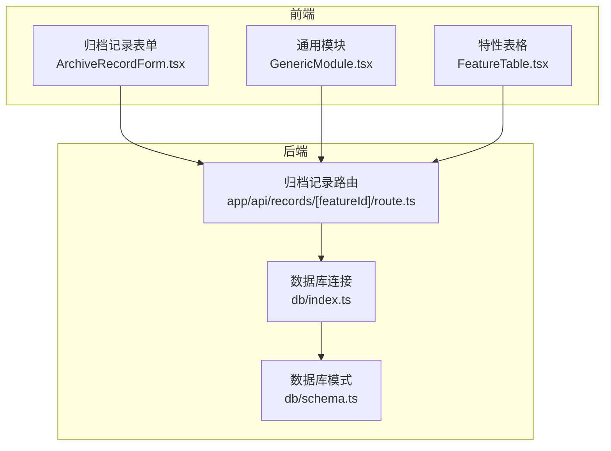
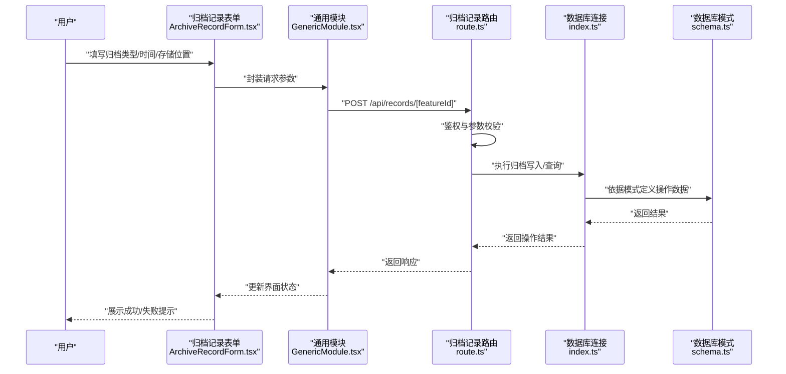
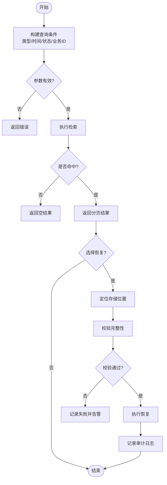
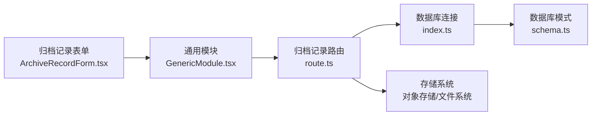

# 归档记录实体

<cite>
**本文引用的文件**   
- [ArchiveRecordForm.tsx](file://app/components/forms/ArchiveRecordForm.tsx)
- [schema.ts](file://db/schema.ts)
- [index.ts](file://db/index.ts)
- [route.ts](file://app/api/records/[featureId]/route.ts)
- [GenericModule.tsx](file://app/components/generic/GenericModule.tsx)
- [FeatureTable.tsx](file://app/components/generic/FeatureTable.tsx)
</cite>

## 目录
1. [简介](#简介)
2. [项目结构](#项目结构)
3. [核心组件](#核心组件)
4. [架构总览](#架构总览)
5. [详细组件分析](#详细组件分析)
6. [依赖分析](#依赖分析)
7. [性能考虑](#性能考虑)
8. [故障排查指南](#故障排查指南)
9. [结论](#结论)
10. [附录](#附录)

## 简介
本文件围绕“归档记录实体”进行系统化文档化，覆盖数据表结构设计、触发条件与自动归档策略、检索与恢复机制、压缩存储与备份策略、访问控制与审计日志等关键主题。内容基于仓库中的数据库模式定义、API 路由以及前端表单与通用模块的实现进行归纳与说明，帮助读者快速理解归档记录的端到端流程与最佳实践。

## 项目结构
与归档记录相关的关键位置如下：
- 数据库层：模式定义与连接初始化位于 db 目录
- API 层：按功能维度组织的路由，包含归档相关的接口
- 前端层：归档记录表单与通用表格/模块组件

图表来源
- [ArchiveRecordForm.tsx](file://app/components/forms/ArchiveRecordForm.tsx)
- [GenericModule.tsx](file://app/components/generic/GenericModule.tsx)
- [FeatureTable.tsx](file://app/components/generic/FeatureTable.tsx)
- [route.ts](file://app/api/records/[featureId]/route.ts)
- [index.ts](file://db/index.ts)
- [schema.ts](file://db/schema.ts)

章节来源
- [schema.ts](file://db/schema.ts)
- [index.ts](file://db/index.ts)
- [route.ts](file://app/api/records/[featureId]/route.ts)
- [ArchiveRecordForm.tsx](file://app/components/forms/ArchiveRecordForm.tsx)
- [GenericModule.tsx](file://app/components/generic/GenericModule.tsx)
- [FeatureTable.tsx](file://app/components/generic/FeatureTable.tsx)

## 核心组件
- 归档记录表单（前端）
  - 负责用户输入归档类型、归档时间、存储位置等信息，并调用后端 API 提交归档请求。
- 归档记录路由（后端）
  - 接收前端请求，校验参数，执行归档写入或查询操作，返回结果。
- 数据库模式（Schema）
  - 定义归档记录表结构与字段约束，包括归档类型、归档时间、存储位置等。
- 数据库连接（DB 初始化）
  - 提供数据库连接与事务能力，供 API 层使用。
- 通用模块与表格（前端）
  - 提供统一的列表展示、分页、筛选与导出能力，便于检索归档记录。

章节来源
- [ArchiveRecordForm.tsx](file://app/components/forms/ArchiveRecordForm.tsx)
- [route.ts](file://app/api/records/[featureId]/route.ts)
- [schema.ts](file://db/schema.ts)
- [index.ts](file://db/index.ts)
- [GenericModule.tsx](file://app/components/generic/GenericModule.tsx)
- [FeatureTable.tsx](file://app/components/generic/FeatureTable.tsx)

## 架构总览
归档记录的整体交互流程如下：
- 用户在归档记录表单中填写归档信息并提交
- 前端通过通用模块发起 HTTP 请求到归档记录路由
- 路由层对请求进行鉴权与参数校验
- 路由层调用数据库层执行归档数据的插入或查询
- 数据库层根据模式定义持久化数据
- 前端通过通用表格展示归档记录列表，支持检索与恢复

图表来源
- [ArchiveRecordForm.tsx](file://app/components/forms/ArchiveRecordForm.tsx)
- [GenericModule.tsx](file://app/components/generic/GenericModule.tsx)
- [route.ts](file://app/api/records/[featureId]/route.ts)
- [index.ts](file://db/index.ts)
- [schema.ts](file://db/schema.ts)

## 详细组件分析

### 归档记录表数据结构设计
- 字段建议与职责
  - 归档类型：标识归档的业务类别（如学生档案、工作流实例、通知等），用于分类检索与权限控制
  - 归档时间：归档发生的时间戳，支持范围查询与排序
  - 存储位置：归档数据的物理或逻辑存储路径（如对象存储桶键、文件路径、数据库分区等）
  - 关联业务 ID：指向被归档的业务主键，便于溯源与恢复
  - 元数据：JSON 或结构化字段，记录压缩格式、版本、哈希校验值等
  - 创建/更新时间：审计字段，记录数据生命周期
  - 状态：归档状态（待归档、已归档、已删除、恢复中）
- 索引与约束
  - 在归档时间与归档类型上建立复合索引，提升范围查询与分组统计性能
  - 为关联业务 ID 建立索引，加速按业务维度的归档检索
  - 对存储位置与状态设置唯一性约束，避免重复归档
- 扩展性
  - 预留扩展字段以支持未来新增的归档策略与合规要求

章节来源
- [schema.ts](file://db/schema.ts)

### 归档触发条件与自动归档策略
- 触发条件
  - 事件驱动：当业务实体达到特定状态（如审批完成、任务结束）时触发归档
  - 定时任务：周期性扫描过期或满足条件的数据，批量触发归档
  - 手动触发：管理员或授权用户主动发起归档
- 自动归档策略
  - 优先级与队列：高优先级归档优先处理，避免阻塞关键业务
  - 幂等性：确保重复触发不会产生重复归档记录
  - 失败重试与补偿：失败时进入重试队列，超过阈值后告警并人工介入
  - 资源限流：限制并发归档任务数量，保护下游存储系统

章节来源
- [route.ts](file://app/api/records/[featureId]/route.ts)
- [schema.ts](file://db/schema.ts)

### 归档记录的检索与恢复机制
- 检索
  - 多条件筛选：按归档类型、时间范围、状态、业务 ID 等组合查询
  - 分页与排序：支持按归档时间倒序、按类型分组等
  - 全文检索：对元数据进行关键词搜索（可选）
- 恢复
  - 按归档记录定位存储位置，读取归档数据并还原至目标系统
  - 校验完整性：比对哈希值与版本信息，确保数据一致性
  - 恢复审计：记录恢复操作人、时间、来源与目标位置

图表来源
- [route.ts](file://app/api/records/[featureId]/route.ts)
- [schema.ts](file://db/schema.ts)

### 归档数据的压缩存储与备份策略
- 压缩存储
  - 选择合适的压缩算法（如 gzip、zstd），平衡压缩率与解压速度
  - 分块压缩：大文件分块压缩，提升并行度与容错性
  - 元数据记录：保存压缩格式、原始大小、压缩比、哈希值
- 备份策略
  - 本地快照：定期生成归档数据的快照，保留一定周期
  - 异地备份：将归档数据同步至异地存储，防范单点故障
  - 版本管理：保留多个历史版本，支持回滚与对比
  - 备份验证：定期对备份数据进行恢复演练，确保可用性

章节来源
- [schema.ts](file://db/schema.ts)
- [route.ts](file://app/api/records/[featureId]/route.ts)

### 访问控制与审计日志
- 访问控制
  - 角色与权限：基于角色的访问控制（RBAC），限制归档与恢复操作
  - 细粒度授权：按归档类型与业务域进行权限划分
  - 安全传输：使用 HTTPS 与签名校验，防止篡改
- 审计日志
  - 记录操作主体、时间、动作、目标与结果
  - 不可篡改：采用追加式日志与哈希链，保证可追溯性
  - 告警与监控：异常操作实时告警，支持审计报表导出

章节来源
- [route.ts](file://app/api/records/[featureId]/route.ts)
- [schema.ts](file://db/schema.ts)

## 依赖分析
归档记录模块的依赖关系如下：
- 前端依赖：归档记录表单依赖通用模块进行网络请求与状态管理
- 后端依赖：归档记录路由依赖数据库连接与模式定义
- 外部依赖：对象存储或文件系统用于归档数据存储

图表来源
- [ArchiveRecordForm.tsx](file://app/components/forms/ArchiveRecordForm.tsx)
- [GenericModule.tsx](file://app/components/generic/GenericModule.tsx)
- [route.ts](file://app/api/records/[featureId]/route.ts)
- [index.ts](file://db/index.ts)
- [schema.ts](file://db/schema.ts)

章节来源
- [route.ts](file://app/api/records/[featureId]/route.ts)
- [index.ts](file://db/index.ts)
- [schema.ts](file://db/schema.ts)

## 性能考虑
- 数据库优化
  - 合理索引：针对高频查询字段建立索引，减少全表扫描
  - 分页查询：避免一次性加载大量数据，降低内存占用
  - 读写分离：读多写少场景下，使用只读副本提升查询性能
- 存储优化
  - 压缩与去重：减少存储空间占用，提升 I/O 效率
  - 分层存储：热数据与冷数据分离，降低成本
- 并发与限流
  - 队列化处理：异步处理归档任务，避免阻塞主流程
  - 速率限制：防止恶意请求与资源耗尽

[本节为通用指导，不直接分析具体文件]

## 故障排查指南
- 常见问题
  - 归档失败：检查参数校验、权限、存储可用性与网络连通性
  - 恢复失败：核对存储位置、完整性校验与版本兼容性
  - 性能问题：分析慢查询、索引缺失与存储瓶颈
- 调试步骤
  - 查看 API 日志与数据库日志，定位错误堆栈
  - 使用通用表格的筛选与导出功能，验证数据一致性
  - 对归档数据进行恢复演练，确认备份有效性

章节来源
- [route.ts](file://app/api/records/[featureId]/route.ts)
- [FeatureTable.tsx](file://app/components/generic/FeatureTable.tsx)

## 结论
归档记录实体是保障数据安全与合规的重要基础设施。通过清晰的数据结构设计、可靠的触发与自动归档策略、高效的检索与恢复机制、完善的压缩与备份方案，以及严格的访问控制与审计日志，系统能够有效支撑长期数据留存与合规需求。建议在实施过程中结合业务特点持续优化性能与安全性，并定期进行演练与审计。

[本节为总结性内容，不直接分析具体文件]

## 附录
- 术语表
  - 归档记录：对业务数据进行归档后生成的记录，包含类型、时间、存储位置等元数据
  - 归档类型：归档数据的业务分类标识
  - 存储位置：归档数据的物理或逻辑存放地址
  - 恢复：从归档数据还原至目标系统的过程
- 参考实现
  - 归档记录表单：[ArchiveRecordForm.tsx](file://app/components/forms/ArchiveRecordForm.tsx)
  - 归档记录路由：[route.ts](file://app/api/records/[featureId]/route.ts)
  - 数据库模式：[schema.ts](file://db/schema.ts)
  - 数据库连接：[index.ts](file://db/index.ts)
  - 通用模块：[GenericModule.tsx](file://app/components/generic/GenericModule.tsx)
  - 特性表格：[FeatureTable.tsx](file://app/components/generic/FeatureTable.tsx)