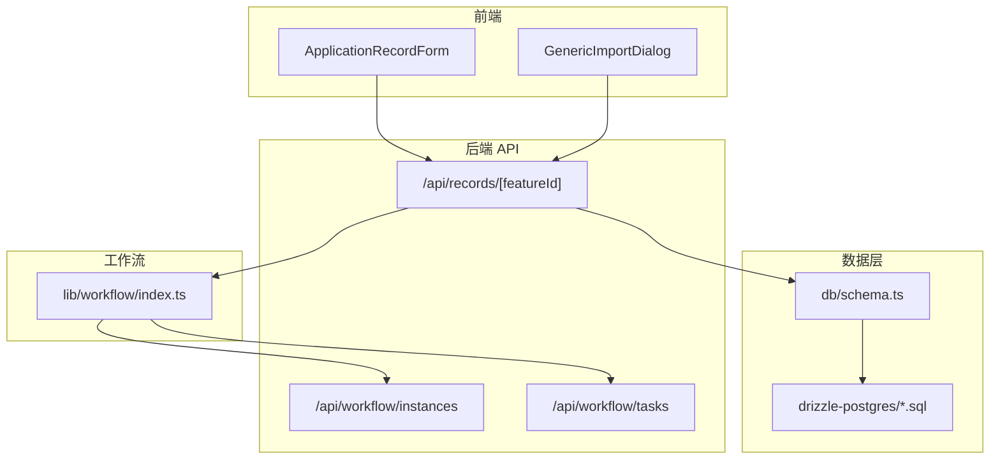
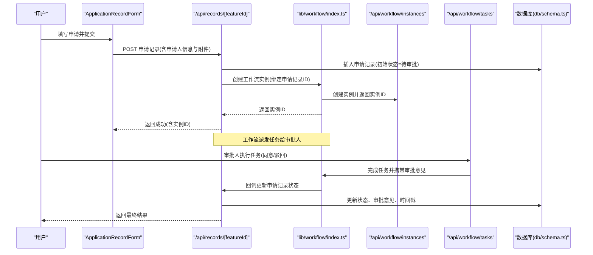
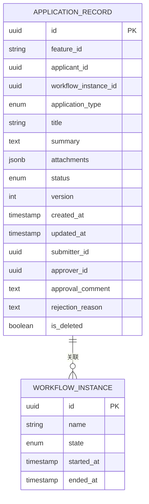
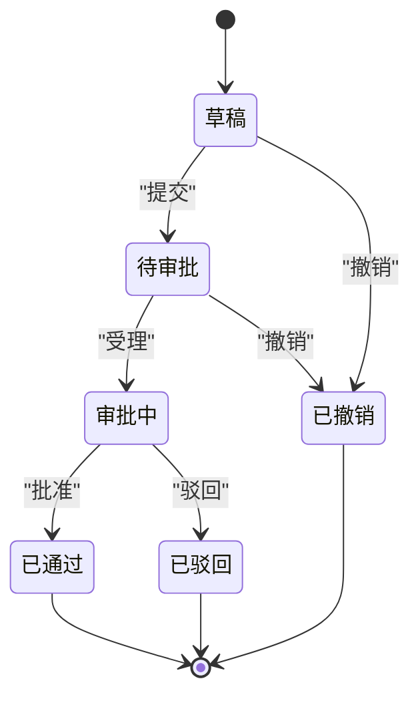
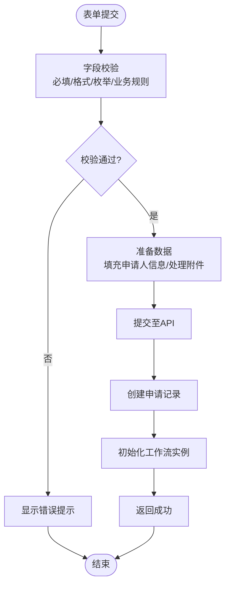
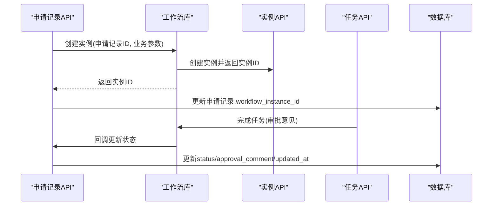
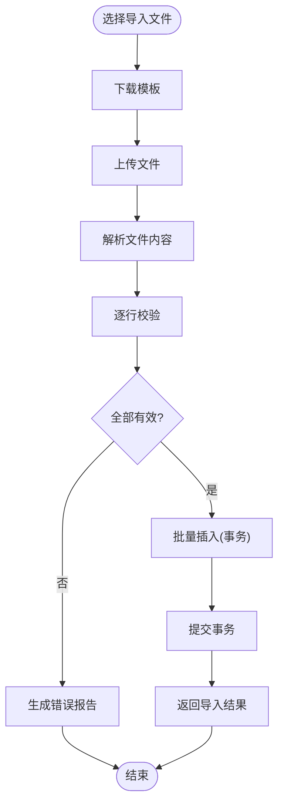
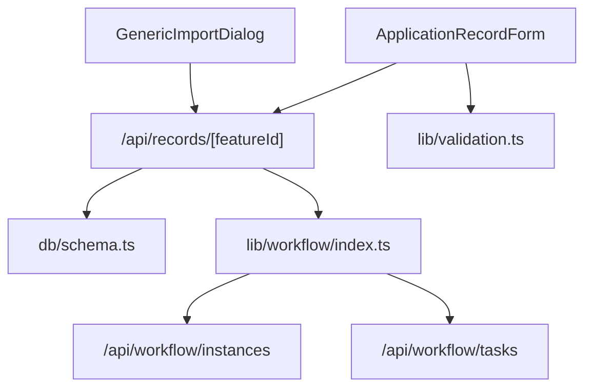

# 申请记录实体

<cite>
**本文引用的文件**   
- [db/schema.ts](file://db/schema.ts)
- [drizzle-postgres/0000_fine_psylocke.sql](file://drizzle-postgres/0000_fine_psylocke.sql)
- [drizzle-postgres/0001_thin_queen_noir.sql](file://drizzle-postgres/0001_thin_queen_noir.sql)
- [drizzle-postgres/0002_crazy_ravenous.sql](file://drizzle-postgres/0002_crazy_ravenous.sql)
- [drizzle-postgres/0003_fine_quentin_quire.sql](file://drizzle-postgres/0003_fine_quentin_quire.sql)
- [app/api/records/[featureId]/route.ts](file://app/api/records/[featureId]/route.ts)
- [app/components/forms/ApplicationRecordForm.tsx](file://app/components/forms/ApplicationRecordForm.tsx)
- [app/components/generic/GenericImportDialog.tsx](file://app/components/generic/GenericImportDialog.tsx)
- [lib/validation.ts](file://lib/validation.ts)
- [lib/workflow/index.ts](file://lib/workflow/index.ts)
- [app/api/workflow/instances/route.ts](file://app/api/workflow/instances/route.ts)
- [app/api/workflow/tasks/route.ts](file://app/api/workflow/tasks/route.ts)
</cite>

## 目录
1. [简介](#简介)
2. [项目结构](#项目结构)
3. [核心组件](#核心组件)
4. [架构总览](#架构总览)
5. [详细组件分析](#详细组件分析)
6. [依赖关系分析](#依赖关系分析)
7. [性能考虑](#性能考虑)
8. [故障排查指南](#故障排查指南)
9. [结论](#结论)
10. [附录](#附录)

## 简介
本文件围绕“申请记录”实体，系统化阐述其数据模型设计、字段含义与约束、生命周期管理（从提交到审批完成）、表单验证规则与数据处理逻辑、与工作流引擎的集成及状态同步机制，以及批量操作与导入导出能力。文档面向不同技术背景的读者，提供由浅入深的说明与可视化图示，帮助快速理解并正确使用该模块。

## 项目结构
申请记录相关代码分布在数据库定义、API 路由、前端表单与通用导入对话框、校验工具以及工作流集成等位置：
- 数据库层：通过 Drizzle ORM 在 schema 中定义表结构，并通过迁移脚本生成 DDL。
- API 层：按功能划分的路由处理请求，包含申请记录的增删改查以及与工作流的交互。
- 前端层：表单组件负责用户输入与校验提示；通用导入对话框支持批量导入。
- 校验层：统一的校验工具函数用于前后端一致的规则。
- 工作流层：封装工作流实例与任务接口，驱动申请记录的状态流转。

图表来源
- [app/components/forms/ApplicationRecordForm.tsx](file://app/components/forms/ApplicationRecordForm.tsx)
- [app/components/generic/GenericImportDialog.tsx](file://app/components/generic/GenericImportDialog.tsx)
- [app/api/records/[featureId]/route.ts](file://app/api/records/[featureId]/route.ts)
- [lib/workflow/index.ts](file://lib/workflow/index.ts)
- [app/api/workflow/instances/route.ts](file://app/api/workflow/instances/route.ts)
- [app/api/workflow/tasks/route.ts](file://app/api/workflow/tasks/route.ts)
- [db/schema.ts](file://db/schema.ts)
- [drizzle-postgres/0000_fine_psylocke.sql](file://drizzle-postgres/0000_fine_psylocke.sql)
- [drizzle-postgres/0001_thin_queen_noir.sql](file://drizzle-postgres/0001_thin_queen_noir.sql)
- [drizzle-postgres/0002_crazy_ravenous.sql](file://drizzle-postgres/0002_crazy_ravenous.sql)
- [drizzle-postgres/0003_fine_quentin_quire.sql](file://drizzle-postgres/0003_fine_quentin_quire.sql)

章节来源
- [db/schema.ts](file://db/schema.ts)
- [app/api/records/[featureId]/route.ts](file://app/api/records/[featureId]/route.ts)
- [app/components/forms/ApplicationRecordForm.tsx](file://app/components/forms/ApplicationRecordForm.tsx)
- [app/components/generic/GenericImportDialog.tsx](file://app/components/generic/GenericImportDialog.tsx)
- [lib/validation.ts](file://lib/validation.ts)
- [lib/workflow/index.ts](file://lib/workflow/index.ts)
- [app/api/workflow/instances/route.ts](file://app/api/workflow/instances/route.ts)
- [app/api/workflow/tasks/route.ts](file://app/api/workflow/tasks/route.ts)

## 核心组件
- 数据模型（申请记录）
  - 标识与关联：主键 ID、业务特征标识 featureId、关联学生或用户 ID、关联工作流实例 ID。
  - 申请信息：申请类型、标题、摘要、附件、备注、期望时间等。
  - 申请人信息：姓名、学号/工号、联系方式、所属组织等。
  - 状态与流程：当前状态、版本、创建/更新时间、提交人、审批意见、驳回原因等。
  - 审计字段：创建者、更新者、删除标记、版本号等。
- API 路由
  - 申请记录的增删改查、分页查询、条件筛选、批量操作。
  - 与工作流实例和任务的交互，触发状态变更。
- 前端表单
  - 字段渲染、必填校验、格式校验、错误提示、提交前预处理。
- 导入导出
  - 通用导入对话框支持 CSV/Excel 模板下载、批量解析、错误回滚与结果反馈。
  - 导出为 CSV/Excel，支持字段映射与过滤。
- 校验工具
  - 统一的前后端校验规则，包括必填、长度、格式、枚举值等。

章节来源
- [db/schema.ts](file://db/schema.ts)
- [app/api/records/[featureId]/route.ts](file://app/api/records/[featureId]/route.ts)
- [app/components/forms/ApplicationRecordForm.tsx](file://app/components/forms/ApplicationRecordForm.tsx)
- [app/components/generic/GenericImportDialog.tsx](file://app/components/generic/GenericImportDialog.tsx)
- [lib/validation.ts](file://lib/validation.ts)

## 架构总览
申请记录的生命周期由“前端表单 → API 路由 → 工作流引擎 → 数据库”协同完成。提交后，API 调用工作流库创建实例并派发任务；审批完成后，工作流回调更新申请记录状态，确保状态一致性与可追溯性。

图表来源
- [app/components/forms/ApplicationRecordForm.tsx](file://app/components/forms/ApplicationRecordForm.tsx)
- [app/api/records/[featureId]/route.ts](file://app/api/records/[featureId]/route.ts)
- [lib/workflow/index.ts](file://lib/workflow/index.ts)
- [app/api/workflow/instances/route.ts](file://app/api/workflow/instances/route.ts)
- [app/api/workflow/tasks/route.ts](file://app/api/workflow/tasks/route.ts)
- [db/schema.ts](file://db/schema.ts)

## 详细组件分析

### 数据模型与表结构设计
申请记录表的核心字段涵盖标识、申请信息、申请人信息、状态与流程、审计字段等。字段设计遵循规范化原则，保证可扩展性与一致性。

- 关键字段说明
  - id：主键，唯一标识申请记录。
  - feature_id：业务特征标识，区分不同业务场景的申请。
  - applicant_id：申请人关联 ID（学生或用户）。
  - workflow_instance_id：关联工作流实例 ID，用于状态同步。
  - application_type：申请类型（如奖学金、助学金、勤工助学等），枚举值。
  - title/summary：标题与摘要，便于列表展示与检索。
  - attachments：附件路径或元数据，支持多文件。
  - status：当前状态（草稿、待审批、审批中、已通过、已驳回、已撤销等）。
  - version：乐观锁版本号，防止并发覆盖。
  - created_at/updated_at：时间戳，记录创建与更新时间。
  - submitter_id/approver_id：提交人与审批人 ID。
  - approval_comment/rejection_reason：审批意见与驳回原因。
  - is_deleted：软删除标记。

图表来源
- [db/schema.ts](file://db/schema.ts)
- [drizzle-postgres/0000_fine_psylocke.sql](file://drizzle-postgres/0000_fine_psylocke.sql)
- [drizzle-postgres/0001_thin_queen_noir.sql](file://drizzle-postgres/0001_thin_queen_noir.sql)
- [drizzle-postgres/0002_crazy_ravenous.sql](file://drizzle-postgres/0002_crazy_ravenous.sql)
- [drizzle-postgres/0003_fine_quentin_quire.sql](file://drizzle-postgres/0003_fine_quentin_quire.sql)

章节来源
- [db/schema.ts](file://db/schema.ts)
- [drizzle-postgres/0000_fine_psylocke.sql](file://drizzle-postgres/0000_fine_psylocke.sql)
- [drizzle-postgres/0001_thin_queen_noir.sql](file://drizzle-postgres/0001_thin_queen_noir.sql)
- [drizzle-postgres/0002_crazy_ravenous.sql](file://drizzle-postgres/0002_crazy_ravenous.sql)
- [drizzle-postgres/0003_fine_quentin_quire.sql](file://drizzle-postgres/0003_fine_quentin_quire.sql)

### 生命周期管理与状态机
申请记录的生命周期从“草稿”开始，经“待审批”、“审批中”，最终到达“已通过”或“已驳回”。若需要撤回，则进入“已撤销”。状态转换受工作流驱动，确保每一步都有明确的操作人和时间戳。

图表来源
- [app/api/records/[featureId]/route.ts](file://app/api/records/[featureId]/route.ts)
- [lib/workflow/index.ts](file://lib/workflow/index.ts)
- [app/api/workflow/tasks/route.ts](file://app/api/workflow/tasks/route.ts)

章节来源
- [app/api/records/[featureId]/route.ts](file://app/api/records/[featureId]/route.ts)
- [lib/workflow/index.ts](file://lib/workflow/index.ts)
- [app/api/workflow/tasks/route.ts](file://app/api/workflow/tasks/route.ts)

### 表单验证规则与数据处理逻辑
前端表单使用统一的校验工具进行字段验证，确保提交数据的完整性与合法性。常见规则包括：
- 必填项：标题、摘要、申请类型、附件（如需）。
- 格式校验：邮箱、手机号、日期范围、文件大小与类型限制。
- 枚举校验：申请类型、状态等取值必须在允许范围内。
- 业务校验：例如同一时间段内不可重复提交同类申请。

数据处理逻辑：
- 提交前对附件进行压缩与校验。
- 将申请人信息自动填充（基于登录态）。
- 提交成功后创建申请记录并初始化工作流实例。
- 失败时返回具体错误信息，支持重试与部分回滚。

图表来源
- [app/components/forms/ApplicationRecordForm.tsx](file://app/components/forms/ApplicationRecordForm.tsx)
- [lib/validation.ts](file://lib/validation.ts)
- [app/api/records/[featureId]/route.ts](file://app/api/records/[featureId]/route.ts)

章节来源
- [app/components/forms/ApplicationRecordForm.tsx](file://app/components/forms/ApplicationRecordForm.tsx)
- [lib/validation.ts](file://lib/validation.ts)
- [app/api/records/[featureId]/route.ts](file://app/api/records/[featureId]/route.ts)

### 与工作流引擎的集成与状态同步
申请记录通过工作流库与实例/任务 API 集成，实现状态同步：
- 创建申请记录后，调用工作流库创建实例，并将实例 ID 绑定到申请记录。
- 工作流根据配置派发任务给审批人，审批人执行任务后回调更新申请记录状态。
- 状态变更需保持幂等性，避免重复回调导致状态不一致。
- 失败重试与补偿机制确保可靠性。

图表来源
- [lib/workflow/index.ts](file://lib/workflow/index.ts)
- [app/api/workflow/instances/route.ts](file://app/api/workflow/instances/route.ts)
- [app/api/workflow/tasks/route.ts](file://app/api/workflow/tasks/route.ts)
- [app/api/records/[featureId]/route.ts](file://app/api/records/[featureId]/route.ts)

章节来源
- [lib/workflow/index.ts](file://lib/workflow/index.ts)
- [app/api/workflow/instances/route.ts](file://app/api/workflow/instances/route.ts)
- [app/api/workflow/tasks/route.ts](file://app/api/workflow/tasks/route.ts)
- [app/api/records/[featureId]/route.ts](file://app/api/records/[featureId]/route.ts)

### 批量操作与导入导出
- 批量操作
  - 支持批量创建、批量更新状态、批量删除（软删除）。
  - 事务性处理，任一失败整体回滚，保证数据一致性。
- 导入功能
  - 提供模板下载，支持 CSV/Excel 格式。
  - 解析上传文件，逐行校验并批量插入，错误行单独记录并返回。
  - 支持增量导入与冲突处理策略（跳过/覆盖）。
- 导出功能
  - 支持按条件筛选导出，字段映射与格式化。
  - 大文件分块导出，避免内存溢出。

图表来源
- [app/components/generic/GenericImportDialog.tsx](file://app/components/generic/GenericImportDialog.tsx)
- [app/api/records/[featureId]/route.ts](file://app/api/records/[featureId]/route.ts)

章节来源
- [app/components/generic/GenericImportDialog.tsx](file://app/components/generic/GenericImportDialog.tsx)
- [app/api/records/[featureId]/route.ts](file://app/api/records/[featureId]/route.ts)

## 依赖关系分析
申请记录模块依赖数据库 schema、API 路由、工作流库与校验工具。各组件之间职责清晰，耦合度低，便于扩展与维护。

图表来源
- [db/schema.ts](file://db/schema.ts)
- [app/api/records/[featureId]/route.ts](file://app/api/records/[featureId]/route.ts)
- [lib/workflow/index.ts](file://lib/workflow/index.ts)
- [app/api/workflow/instances/route.ts](file://app/api/workflow/instances/route.ts)
- [app/api/workflow/tasks/route.ts](file://app/api/workflow/tasks/route.ts)
- [lib/validation.ts](file://lib/validation.ts)
- [app/components/forms/ApplicationRecordForm.tsx](file://app/components/forms/ApplicationRecordForm.tsx)
- [app/components/generic/GenericImportDialog.tsx](file://app/components/generic/GenericImportDialog.tsx)

章节来源
- [db/schema.ts](file://db/schema.ts)
- [app/api/records/[featureId]/route.ts](file://app/api/records/[featureId]/route.ts)
- [lib/workflow/index.ts](file://lib/workflow/index.ts)
- [app/api/workflow/instances/route.ts](file://app/api/workflow/instances/route.ts)
- [app/api/workflow/tasks/route.ts](file://app/api/workflow/tasks/route.ts)
- [lib/validation.ts](file://lib/validation.ts)
- [app/components/forms/ApplicationRecordForm.tsx](file://app/components/forms/ApplicationRecordForm.tsx)
- [app/components/generic/GenericImportDialog.tsx](file://app/components/generic/GenericImportDialog.tsx)

## 性能考虑
- 数据库索引：对常用查询字段（feature_id、applicant_id、status、created_at）建立索引，提升查询效率。
- 分页与过滤：API 支持分页与条件过滤，避免一次性加载大量数据。
- 事务与批处理：批量操作使用事务，减少往返次数与锁竞争。
- 附件存储：大附件采用对象存储，数据库仅存元数据，降低负载。
- 缓存策略：热点数据（如枚举字典、审批人列表）可引入缓存，提高响应速度。

[本节为通用指导，不直接分析具体文件]

## 故障排查指南
- 状态不一致
  - 检查工作流回调是否幂等，避免重复更新。
  - 核对 workflow_instance_id 是否正确绑定。
- 导入失败
  - 查看错误报告，定位问题行与原因。
  - 确认模板字段映射与数据类型正确。
- 表单校验失败
  - 检查前端校验规则与后端校验逻辑是否一致。
  - 查看网络请求与响应，确认错误码与消息。
- 权限问题
  - 确认用户角色与权限配置，确保有提交/审批权限。

章节来源
- [app/api/records/[featureId]/route.ts](file://app/api/records/[featureId]/route.ts)
- [lib/validation.ts](file://lib/validation.ts)
- [lib/workflow/index.ts](file://lib/workflow/index.ts)

## 结论
申请记录实体作为学生事务管理的核心，具备清晰的数据模型、严谨的生命周期管理、完善的表单验证与导入导出能力，并与工作流引擎深度集成，确保状态一致性与可追溯性。通过合理的索引、分页、事务与缓存策略，系统具备良好的性能与可扩展性。建议在实际使用中严格遵循校验规则与操作流程，确保数据质量与业务合规。

[本节为总结性内容，不直接分析具体文件]

## 附录
- 术语表
  - 申请记录：学生提交的各类事务申请数据实体。
  - 工作流实例：一次完整的审批流程实例，包含多个任务节点。
  - 状态同步：申请记录状态与工作流状态的实时一致性维护。
- 参考文件
  - 数据模型定义：[db/schema.ts](file://db/schema.ts)
  - 迁移脚本：[drizzle-postgres/*.sql](file://drizzle-postgres/0000_fine_psylocke.sql)
  - API 路由：[app/api/records/[featureId]/route.ts](file://app/api/records/[featureId]/route.ts)
  - 表单组件：[app/components/forms/ApplicationRecordForm.tsx](file://app/components/forms/ApplicationRecordForm.tsx)
  - 导入对话框：[app/components/generic/GenericImportDialog.tsx](file://app/components/generic/GenericImportDialog.tsx)
  - 校验工具：[lib/validation.ts](file://lib/validation.ts)
  - 工作流库：[lib/workflow/index.ts](file://lib/workflow/index.ts)
  - 工作流实例/任务 API：[app/api/workflow/instances/route.ts](file://app/api/workflow/instances/route.ts), [app/api/workflow/tasks/route.ts](file://app/api/workflow/tasks/route.ts)