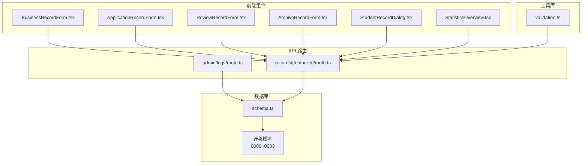
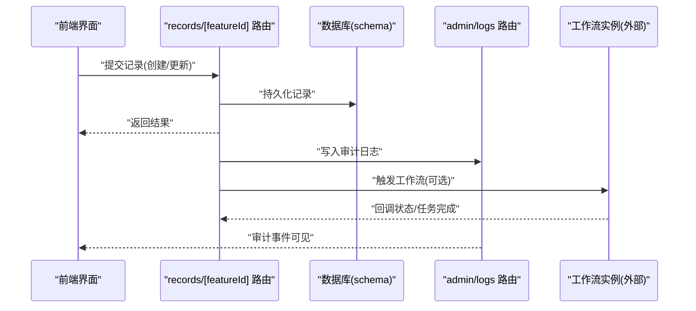
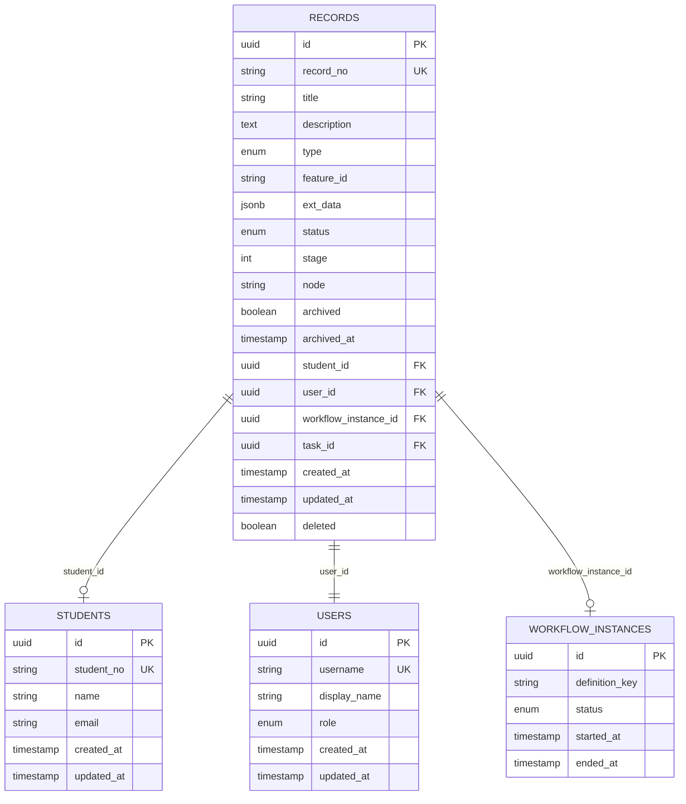
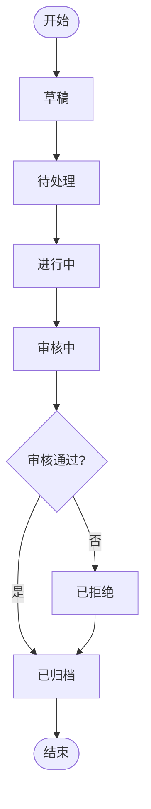
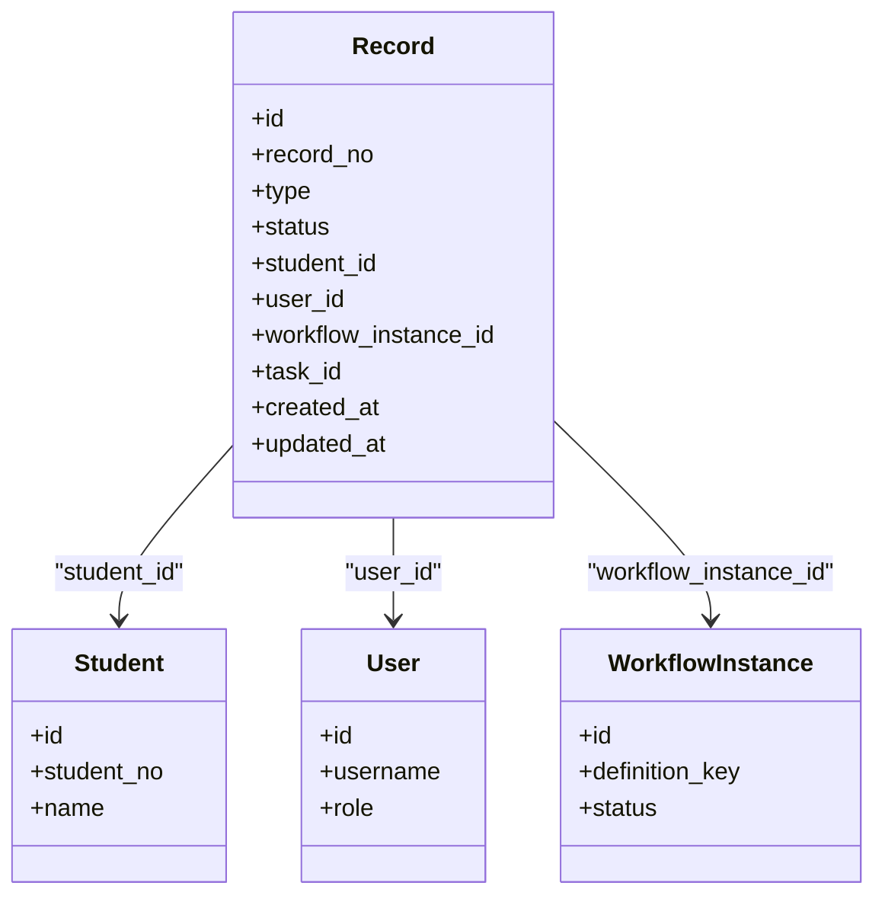
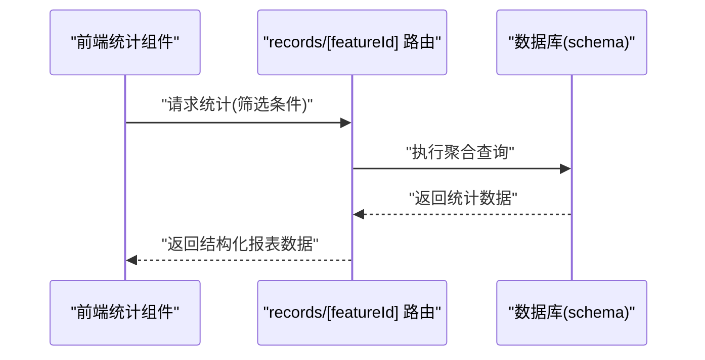
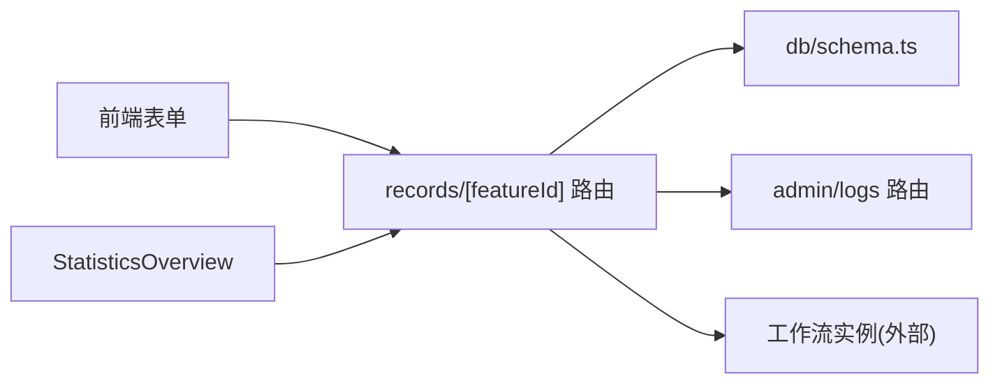

# 记录管理实体

<cite>
**本文引用的文件**   
- [db/schema.ts](file://db/schema.ts)
- [drizzle-postgres/0000_fine_psylocke.sql](file://drizzle-postgres/0000_fine_psylocke.sql)
- [drizzle-postgres/0001_thin_queen_noir.sql](file://drizzle-postgres/0001_thin_queen_noir.sql)
- [drizzle-postgres/0002_crazy_ravenous.sql](file://drizzle-postgres/0002_crazy_ravenous.sql)
- [drizzle-postgres/0003_fine_quentin_quire.sql](file://drizzle-postgres/0003_fine_quentin_quire.sql)
- [app/api/admin/logs/route.ts](file://app/api/admin/logs/route.ts)
- [app/api/records/[featureId]/route.ts](file://app/api/records/%5BfeatureId%5D/route.ts)
- [app/components/forms/BusinessRecordForm.tsx](file://app/components/forms/BusinessRecordForm.tsx)
- [app/components/forms/ApplicationRecordForm.tsx](file://app/components/forms/ApplicationRecordForm.tsx)
- [app/components/forms/ReviewRecordForm.tsx](file://app/components/forms/ReviewRecordForm.tsx)
- [app/components/forms/ArchiveRecordForm.tsx](file://app/components/forms/ArchiveRecordForm.tsx)
- [app/components/student/StudentRecordDialog.tsx](file://app/components/student/StudentRecordDialog.tsx)
- [app/components/generic/StatisticsOverview.tsx](file://app/components/generic/StatisticsOverview.tsx)
- [lib/validation.ts](file://lib/validation.ts)
</cite>

## 目录
1. [简介](#简介)
2. [项目结构](#项目结构)
3. [核心组件](#核心组件)
4. [架构总览](#架构总览)
5. [详细组件分析](#详细组件分析)
6. [依赖关系分析](#依赖关系分析)
7. [性能考量](#性能考量)
8. [故障排查指南](#故障排查指南)
9. [结论](#结论)
10. [附录](#附录)

## 简介
本文件围绕“记录管理”相关的数据实体与流程进行系统化文档化，覆盖业务记录、申请记录、审核记录等类型记录的字段设计、分类体系、状态流转与审批流程数据模型；解释记录与学生、用户、工作流的关联关系；并提供查询统计接口与报表生成的数据结构说明；同时给出归档策略与数据保留政策的建议。

## 项目结构
记录管理相关的代码分布在数据库定义、API路由、前端表单与通用组件中：
- 数据库层：使用 Drizzle ORM 定义表结构与迁移脚本
- API 层：提供记录创建、查询、归档、日志审计等接口
- 前端层：提供各类记录的表单与统计概览组件
- 工具层：校验与通用逻辑

图表来源
- [db/schema.ts](file://db/schema.ts)
- [drizzle-postgres/0000_fine_psylocke.sql](file://drizzle-postgres/0000_fine_psylocke.sql)
- [drizzle-postgres/0001_thin_queen_noir.sql](file://drizzle-postgres/0001_thin_queen_noir.sql)
- [drizzle-postgres/0002_crazy_ravenous.sql](file://drizzle-postgres/0002_crazy_ravenous.sql)
- [drizzle-postgres/0003_fine_quentin_quire.sql](file://drizzle-postgres/0003_fine_quentin_quire.sql)
- [app/api/admin/logs/route.ts](file://app/api/admin/logs/route.ts)
- [app/api/records/[featureId]/route.ts](file://app/api/records/%5BfeatureId%5D/route.ts)
- [app/components/forms/BusinessRecordForm.tsx](file://app/components/forms/BusinessRecordForm.tsx)
- [app/components/forms/ApplicationRecordForm.tsx](file://app/components/forms/ApplicationRecordForm.tsx)
- [app/components/forms/ReviewRecordForm.tsx](file://app/components/forms/ReviewRecordForm.tsx)
- [app/components/forms/ArchiveRecordForm.tsx](file://app/components/forms/ArchiveRecordForm.tsx)
- [app/components/student/StudentRecordDialog.tsx](file://app/components/student/StudentRecordDialog.tsx)
- [app/components/generic/StatisticsOverview.tsx](file://app/components/generic/StatisticsOverview.tsx)
- [lib/validation.ts](file://lib/validation.ts)

章节来源
- [db/schema.ts](file://db/schema.ts)
- [drizzle-postgres/0000_fine_psylocke.sql](file://drizzle-postgres/0000_fine_psylocke.sql)
- [drizzle-postgres/0001_thin_queen_noir.sql](file://drizzle-postgres/0001_thin_queen_noir.sql)
- [drizzle-postgres/0002_crazy_ravenous.sql](file://drizzle-postgres/0002_crazy_ravenous.sql)
- [drizzle-postgres/0003_fine_quentin_quire.sql](file://drizzle-postgres/0003_fine_quentin_quire.sql)
- [app/api/admin/logs/route.ts](file://app/api/admin/logs/route.ts)
- [app/api/records/[featureId]/route.ts](file://app/api/records/%5BfeatureId%5D/route.ts)
- [app/components/forms/BusinessRecordForm.tsx](file://app/components/forms/BusinessRecordForm.tsx)
- [app/components/forms/ApplicationRecordForm.tsx](file://app/components/forms/ApplicationRecordForm.tsx)
- [app/components/forms/ReviewRecordForm.tsx](file://app/components/forms/ReviewRecordForm.tsx)
- [app/components/forms/ArchiveRecordForm.tsx](file://app/components/forms/ArchiveRecordForm.tsx)
- [app/components/student/StudentRecordDialog.tsx](file://app/components/student/StudentRecordDialog.tsx)
- [app/components/generic/StatisticsOverview.tsx](file://app/components/generic/StatisticsOverview.tsx)
- [lib/validation.ts](file://lib/validation.ts)

## 核心组件
- 数据模型（数据库）
  - 通过 Drizzle schema 定义记录主表及关联表，包含基础字段（标识、类型、状态、时间戳、操作人等）与扩展字段（JSON 或文本），并建立索引以支撑查询与统计。
  - 迁移脚本按版本演进，确保字段变更可追溯。
- API 路由
  - records/[featureId]：按功能维度组织记录，支持创建、查询、分页、筛选、导出等能力。
  - admin/logs：审计日志，用于追踪记录的生命周期事件。
- 前端表单与对话框
  - BusinessRecordForm：业务记录录入
  - ApplicationRecordForm：申请记录录入
  - ReviewRecordForm：审核记录录入
  - ArchiveRecordForm：归档操作
  - StudentRecordDialog：学生维度的记录查看与操作入口
- 统计与报表
  - StatisticsOverview：聚合展示关键指标，为报表生成提供数据源

章节来源
- [db/schema.ts](file://db/schema.ts)
- [drizzle-postgres/0000_fine_psylocke.sql](file://drizzle-postgres/0000_fine_psylocke.sql)
- [drizzle-postgres/0001_thin_queen_noir.sql](file://drizzle-postgres/0001_thin_queen_noir.sql)
- [drizzle-postgres/0002_crazy_ravenous.sql](file://drizzle-postgres/0002_crazy_ravenous.sql)
- [drizzle-postgres/0003_fine_quentin_quire.sql](file://drizzle-postgres/0003_fine_quentin_quire.sql)
- [app/api/records/[featureId]/route.ts](file://app/api/records/%5BfeatureId%5D/route.ts)
- [app/api/admin/logs/route.ts](file://app/api/admin/logs/route.ts)
- [app/components/forms/BusinessRecordForm.tsx](file://app/components/forms/BusinessRecordForm.tsx)
- [app/components/forms/ApplicationRecordForm.tsx](file://app/components/forms/ApplicationRecordForm.tsx)
- [app/components/forms/ReviewRecordForm.tsx](file://app/components/forms/ReviewRecordForm.tsx)
- [app/components/forms/ArchiveRecordForm.tsx](file://app/components/forms/ArchiveRecordForm.tsx)
- [app/components/student/StudentRecordDialog.tsx](file://app/components/student/StudentRecordDialog.tsx)
- [app/components/generic/StatisticsOverview.tsx](file://app/components/generic/StatisticsOverview.tsx)

## 架构总览
记录管理的整体架构遵循“前端表单 → API 路由 → 数据库”的分层模式，并通过审计日志与工作流实例进行跨模块联动。

图表来源
- [app/api/records/[featureId]/route.ts](file://app/api/records/%5BfeatureId%5D/route.ts)
- [app/api/admin/logs/route.ts](file://app/api/admin/logs/route.ts)
- [db/schema.ts](file://db/schema.ts)

## 详细组件分析

### 数据模型与字段设计
- 记录主表
  - 标识与元信息：唯一ID、记录编号、标题、描述、备注
  - 分类与类型：记录类型（业务/申请/审核/配置等）、业务域、功能维度(featureId)、标签
  - 状态与流程：当前状态、阶段、节点、是否已归档、归档时间
  - 关联关系：学生ID、用户ID（创建/修改/审核人）、工作流实例ID、任务ID
  - 时间与审计：创建时间、更新时间、删除标记、审计轨迹
  - 扩展字段：JSON 或文本，承载动态表单数据
- 关联表
  - 学生表：学生基本信息与账号绑定
  - 用户表：系统用户、角色与权限
  - 工作流实例表：流程定义、实例、任务与状态
- 索引与约束
  - 针对常用查询字段（如学生ID、记录类型、状态、时间范围）建立索引
  - 外键约束保证数据一致性

图表来源
- [db/schema.ts](file://db/schema.ts)
- [drizzle-postgres/0000_fine_psylocke.sql](file://drizzle-postgres/0000_fine_psylocke.sql)
- [drizzle-postgres/0001_thin_queen_noir.sql](file://drizzle-postgres/0001_thin_queen_noir.sql)
- [drizzle-postgres/0002_crazy_ravenous.sql](file://drizzle-postgres/0002_crazy_ravenous.sql)
- [drizzle-postgres/0003_fine_quentin_quire.sql](file://drizzle-postgres/0003_fine_quentin_quire.sql)

章节来源
- [db/schema.ts](file://db/schema.ts)
- [drizzle-postgres/0000_fine_psylocke.sql](file://drizzle-postgres/0000_fine_psylocke.sql)
- [drizzle-postgres/0001_thin_queen_noir.sql](file://drizzle-postgres/0001_thin_queen_noir.sql)
- [drizzle-postgres/0002_crazy_ravenous.sql](file://drizzle-postgres/0002_crazy_ravenous.sql)
- [drizzle-postgres/0003_fine_quentin_quire.sql](file://drizzle-postgres/0003_fine_quentin_quire.sql)

### 记录分类体系
- 类型维度：业务记录、申请记录、审核记录、配置记录等
- 功能维度：按 featureId 划分不同业务域（如学生事务、资助、奖惩等）
- 标签维度：用于细粒度检索与统计
- 状态维度：草稿、待处理、进行中、已通过、已拒绝、已归档等

章节来源
- [app/components/forms/BusinessRecordForm.tsx](file://app/components/forms/BusinessRecordForm.tsx)
- [app/components/forms/ApplicationRecordForm.tsx](file://app/components/forms/ApplicationRecordForm.tsx)
- [app/components/forms/ReviewRecordForm.tsx](file://app/components/forms/ReviewRecordForm.tsx)
- [app/components/forms/ConfigRecordForm.tsx](file://app/components/forms/ConfigRecordForm.tsx)

### 状态流转与审批流程
- 状态机
  - 初始态：草稿
  - 流转态：待处理 → 进行中 → 审核中 → 已通过/已拒绝
  - 终态：已归档
- 审批流程
  - 基于工作流实例驱动，记录与任务关联
  - 节点级状态与全局状态同步
  - 审计日志记录每次状态变更

图表来源
- [app/api/records/[featureId]/route.ts](file://app/api/records/%5BfeatureId%5D/route.ts)
- [app/api/admin/logs/route.ts](file://app/api/admin/logs/route.ts)

章节来源
- [app/api/records/[featureId]/route.ts](file://app/api/records/%5BfeatureId%5D/route.ts)
- [app/api/admin/logs/route.ts](file://app/api/admin/logs/route.ts)

### 与学生、用户、工作流的关联关系
- 学生关联：记录归属到具体学生，便于学生视角的汇总与跟踪
- 用户关联：记录由特定用户创建/修改/审核，支持权限控制与责任追溯
- 工作流关联：记录作为流程对象，参与任务编排与状态同步

图表来源
- [db/schema.ts](file://db/schema.ts)

章节来源
- [db/schema.ts](file://db/schema.ts)

### 查询统计接口与报表数据结构
- 查询接口
  - 支持按类型、状态、时间范围、学生、用户、功能维度筛选
  - 分页与排序，支持导出 CSV/Excel
- 统计接口
  - 聚合指标：总数、各状态占比、趋势图数据、TopN 分类
- 报表数据结构
  - 列表项：记录基础信息与关键字段
  - 聚合项：分组统计、同比环比、阈值告警

图表来源
- [app/components/generic/StatisticsOverview.tsx](file://app/components/generic/StatisticsOverview.tsx)
- [app/api/records/[featureId]/route.ts](file://app/api/records/%5BfeatureId%5D/route.ts)
- [db/schema.ts](file://db/schema.ts)

章节来源
- [app/components/generic/StatisticsOverview.tsx](file://app/components/generic/StatisticsOverview.tsx)
- [app/api/records/[featureId]/route.ts](file://app/api/records/%5BfeatureId%5D/route.ts)
- [db/schema.ts](file://db/schema.ts)

### 归档策略与数据保留政策
- 归档策略
  - 自动归档：达到终态且满足保留期后自动归档
  - 手动归档：管理员或授权用户触发归档
  - 归档快照：归档时生成只读快照，保留关键审计信息
- 数据保留政策
  - 保留期限：按法规与业务需求设定（如 3/5/7 年）
  - 清理策略：过期数据脱敏或物理删除，保留审计痕迹
  - 合规性：支持导出与审计，满足合规检查

章节来源
- [app/components/forms/ArchiveRecordForm.tsx](file://app/components/forms/ArchiveRecordForm.tsx)
- [app/api/admin/logs/route.ts](file://app/api/admin/logs/route.ts)

## 依赖关系分析
- 组件耦合
  - 前端表单依赖 API 路由进行数据交互
  - API 路由依赖数据库 schema 与迁移脚本
  - 审计日志与工作流实例作为外部依赖，增强可观测性与流程编排
- 潜在循环依赖
  - 通过解耦 API 与数据库访问、引入中间件与工具库避免循环引用
- 外部集成点
  - 工作流引擎：状态回调与任务完成通知
  - 存储与备份：归档数据的长期保存

图表来源
- [app/components/forms/BusinessRecordForm.tsx](file://app/components/forms/BusinessRecordForm.tsx)
- [app/components/forms/ApplicationRecordForm.tsx](file://app/components/forms/ApplicationRecordForm.tsx)
- [app/components/forms/ReviewRecordForm.tsx](file://app/components/forms/ReviewRecordForm.tsx)
- [app/components/forms/ArchiveRecordForm.tsx](file://app/components/forms/ArchiveRecordForm.tsx)
- [app/api/records/[featureId]/route.ts](file://app/api/records/%5BfeatureId%5D/route.ts)
- [app/api/admin/logs/route.ts](file://app/api/admin/logs/route.ts)
- [db/schema.ts](file://db/schema.ts)

章节来源
- [app/api/records/[featureId]/route.ts](file://app/api/records/%5BfeatureId%5D/route.ts)
- [app/api/admin/logs/route.ts](file://app/api/admin/logs/route.ts)
- [db/schema.ts](file://db/schema.ts)

## 性能考量
- 查询优化
  - 对高频筛选字段建立复合索引（如学生ID+类型+状态+时间）
  - 使用分页与增量加载减少数据传输量
- 写入优化
  - 批量插入与更新，减少事务开销
  - 异步写入审计日志，避免阻塞主流程
- 缓存策略
  - 统计结果短期缓存，降低重复聚合压力
- 归档与清理
  - 定期归档历史数据，分离冷热数据
  - 清理过期数据时采用分批删除，避免锁竞争

[本节为通用指导，不直接分析具体文件]

## 故障排查指南
- 常见问题
  - 状态不一致：检查工作流回调与状态同步逻辑
  - 审计缺失：确认日志写入路径与权限
  - 查询缓慢：检查索引与查询条件
- 定位方法
  - 通过审计日志回溯变更记录
  - 使用统计组件验证聚合结果
  - 检查迁移脚本与 schema 一致性

章节来源
- [app/api/admin/logs/route.ts](file://app/api/admin/logs/route.ts)
- [app/components/generic/StatisticsOverview.tsx](file://app/components/generic/StatisticsOverview.tsx)
- [lib/validation.ts](file://lib/validation.ts)

## 结论
记录管理实体以统一的 schema 为核心，结合 API 路由与前端表单实现全生命周期管理；通过工作流与审计日志保障流程一致性与可追溯性；统计与报表提供决策支持；归档与保留策略满足合规与性能需求。建议在后续迭代中持续优化索引与查询、完善错误处理与监控告警，提升系统的稳定性与可维护性。

[本节为总结性内容，不直接分析具体文件]

## 附录
- 术语表
  - 记录：业务活动产生的结构化数据实体
  - 工作流实例：一次流程执行的上下文与状态集合
  - 审计日志：记录系统操作与状态变更的可追溯信息
- 参考文件
  - 数据库定义与迁移脚本
  - API 路由与前端组件
  - 校验与工具库

[本节为补充信息，不直接分析具体文件]