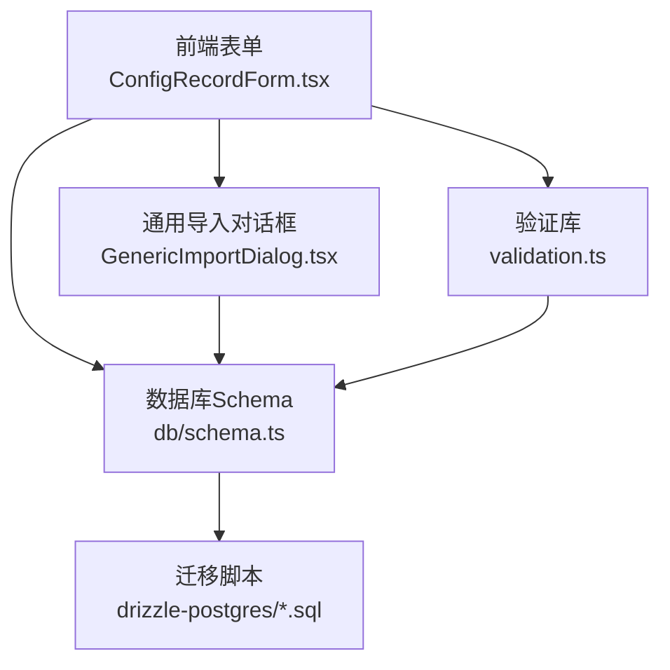
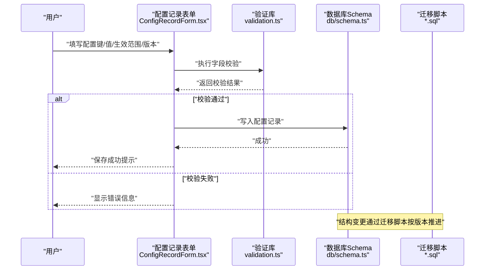
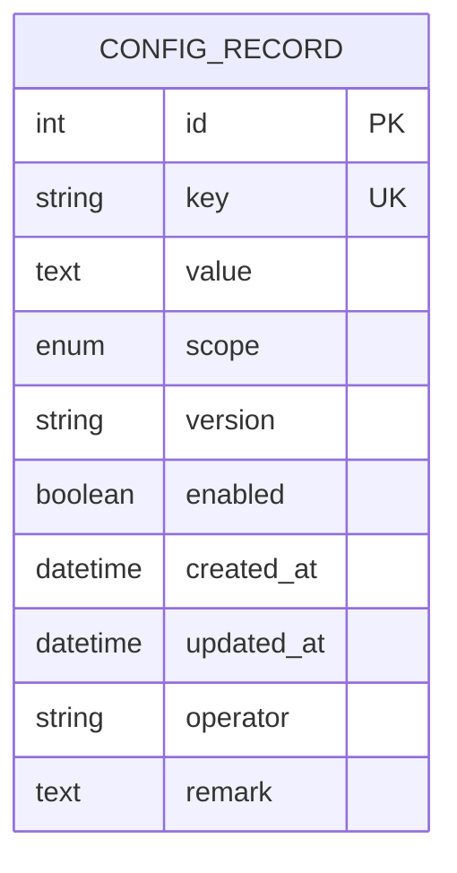
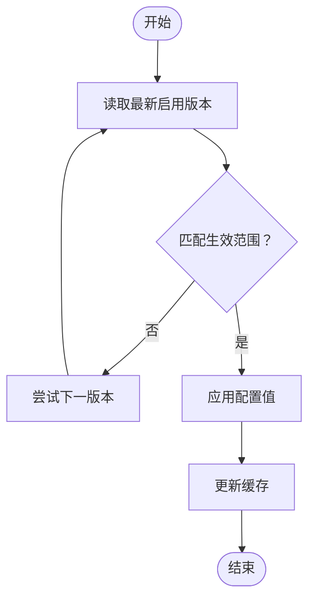
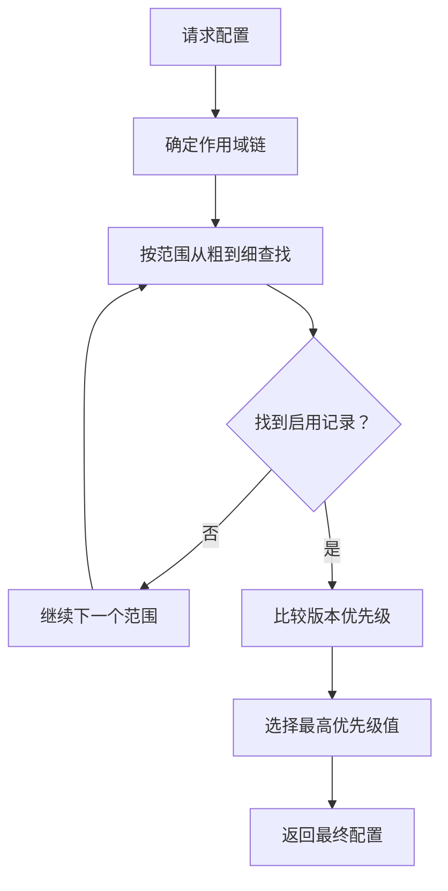
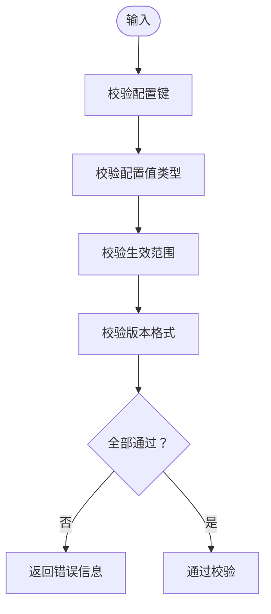
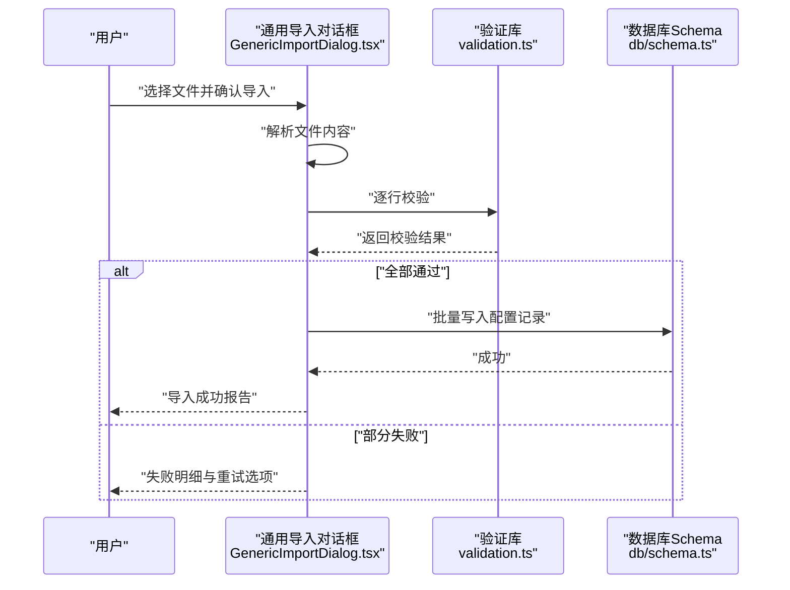
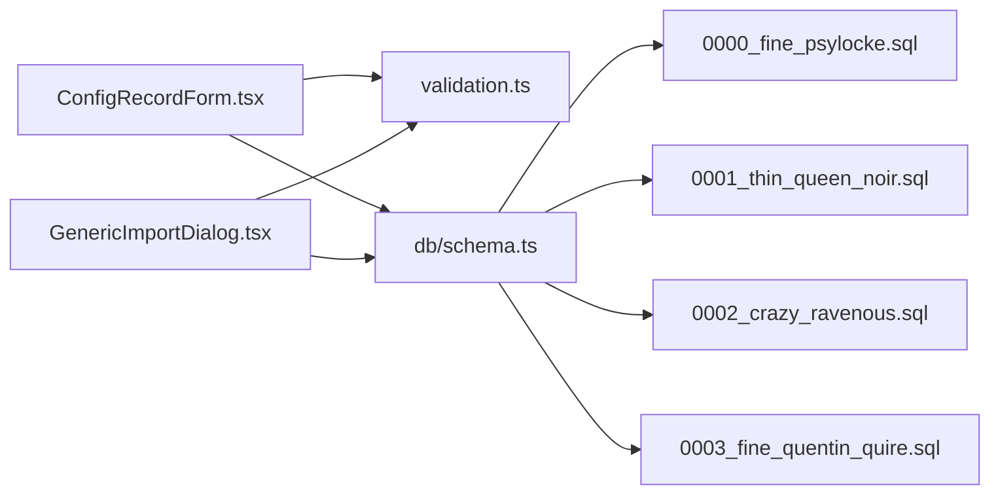

# 配置记录实体

<cite>
**本文引用的文件**   
- [ConfigRecordForm.tsx](file://app/components/forms/ConfigRecordForm.tsx)
- [GenericImportDialog.tsx](file://app/components/generic/GenericImportDialog.tsx)
- [validation.ts](file://lib/validation.ts)
- [schema.ts](file://db/schema.ts)
- [0000_fine_psylocke.sql](file://drizzle-postgres/0000_fine_psylocke.sql)
- [0001_thin_queen_noir.sql](file://drizzle-postgres/0001_thin_queen_noir.sql)
- [0002_crazy_ravenous.sql](file://drizzle-postgres/0002_crazy_ravenous.sql)
- [0003_fine_quentin_quire.sql](file://drizzle-postgres/0003_fine_quentin_quire.sql)
</cite>

## 目录
1. [简介](#简介)
2. [项目结构](#项目结构)
3. [核心组件](#核心组件)
4. [架构总览](#架构总览)
5. [详细组件分析](#详细组件分析)
6. [依赖分析](#依赖分析)
7. [性能考虑](#性能考虑)
8. [故障排查指南](#故障排查指南)
9. [结论](#结论)
10. [附录](#附录)

## 简介
本文件围绕“配置记录实体”进行系统化文档化，覆盖数据表结构设计（配置键、配置值、生效范围等）、版本管理与热更新机制、继承与覆盖规则、验证与校验能力，以及批量导入导出与配置模板管理。内容面向不同技术背景的读者，既提供高层概览，也给出代码级映射与可视化图示，帮助快速理解与落地使用。

## 项目结构
与配置记录相关的前端表单、通用导入对话框、后端数据库 Schema 与迁移脚本分布如下：
- 前端表单：用于创建、编辑配置记录的交互界面
- 通用导入对话框：支持批量导入配置记录
- 验证库：集中定义字段校验规则
- 数据库 Schema：定义配置记录表的字段、约束与索引
- 迁移脚本：按版本演进数据库结构

**图表来源** 
- [ConfigRecordForm.tsx](file://app/components/forms/ConfigRecordForm.tsx)
- [GenericImportDialog.tsx](file://app/components/generic/GenericImportDialog.tsx)
- [validation.ts](file://lib/validation.ts)
- [schema.ts](file://db/schema.ts)
- [0000_fine_psylocke.sql](file://drizzle-postgres/0000_fine_psylocke.sql)
- [0001_thin_queen_noir.sql](file://drizzle-postgres/0001_thin_queen_noir.sql)
- [0002_crazy_ravenous.sql](file://drizzle-postgres/0002_crazy_ravenous.sql)
- [0003_fine_quentin_quire.sql](file://drizzle-postgres/0003_fine_quentin_quire.sql)

**章节来源**
- [ConfigRecordForm.tsx](file://app/components/forms/ConfigRecordForm.tsx)
- [GenericImportDialog.tsx](file://app/components/generic/GenericImportDialog.tsx)
- [validation.ts](file://lib/validation.ts)
- [schema.ts](file://db/schema.ts)
- [0000_fine_psylocke.sql](file://drizzle-postgres/0000_fine_psylocke.sql)
- [0001_thin_queen_noir.sql](file://drizzle-postgres/0001_thin_queen_noir.sql)
- [0002_crazy_ravenous.sql](file://drizzle-postgres/0002_crazy_ravenous.sql)
- [0003_fine_quentin_quire.sql](file://drizzle-postgres/0003_fine_quentin_quire.sql)

## 核心组件
- 配置记录表单：负责用户输入配置键、配置值、生效范围、版本等元信息，并触发校验与提交
- 通用导入对话框：支持从文件或接口批量导入配置记录，便于初始化或变更同步
- 验证库：统一对配置键格式、值类型、必填项、长度限制等进行校验
- 数据库 Schema：定义配置记录表结构与约束，确保数据一致性与可查询性
- 迁移脚本：按版本推进表结构变更，保证环境一致性

**章节来源**
- [ConfigRecordForm.tsx](file://app/components/forms/ConfigRecordForm.tsx)
- [GenericImportDialog.tsx](file://app/components/generic/GenericImportDialog.tsx)
- [validation.ts](file://lib/validation.ts)
- [schema.ts](file://db/schema.ts)
- [0000_fine_psylocke.sql](file://drizzle-postgres/0000_fine_psylocke.sql)
- [0001_thin_queen_noir.sql](file://drizzle-postgres/0001_thin_queen_noir.sql)
- [0002_crazy_ravenous.sql](file://drizzle-postgres/0002_crazy_ravenous.sql)
- [0003_fine_quentin_quire.sql](file://drizzle-postgres/0003_fine_quentin_quire.sql)

## 架构总览
配置记录实体的端到端流程包括：用户在表单中录入配置，系统执行前端校验，持久化到数据库；在运行时通过读取当前生效版本实现热更新；批量导入通过通用对话框完成；模板管理通过预置标准配置集实现。

**图表来源** 
- [ConfigRecordForm.tsx](file://app/components/forms/ConfigRecordForm.tsx)
- [validation.ts](file://lib/validation.ts)
- [schema.ts](file://db/schema.ts)
- [0000_fine_psylocke.sql](file://drizzle-postgres/0000_fine_psylocke.sql)
- [0001_thin_queen_noir.sql](file://drizzle-postgres/0001_thin_queen_noir.sql)
- [0002_crazy_ravenous.sql](file://drizzle-postgres/0002_crazy_ravenous.sql)
- [0003_fine_quentin_quire.sql](file://drizzle-postgres/0003_fine_quentin_quire.sql)

## 详细组件分析

### 数据表结构设计（配置记录）
- 主键与标识：自增 ID 作为唯一标识
- 配置键：字符串类型，建议采用命名空间前缀（如模块名.子键），保证全局唯一
- 配置值：文本或结构化值（JSON），根据业务需要选择合适类型
- 生效范围：支持多粒度（如全局、租户、部门、角色、用户等），可通过枚举或关联表表达
- 版本管理：版本号字段（语义化版本或递增整数），配合启用状态控制生效
- 元数据：创建时间、更新时间、操作人、备注等审计字段
- 约束与索引：对配置键建立唯一索引；对生效范围与版本建立复合索引以加速查询

**图表来源** 
- [schema.ts](file://db/schema.ts)
- [0000_fine_psylocke.sql](file://drizzle-postgres/0000_fine_psylocke.sql)
- [0001_thin_queen_noir.sql](file://drizzle-postgres/0001_thin_queen_noir.sql)
- [0002_crazy_ravenous.sql](file://drizzle-postgres/0002_crazy_ravenous.sql)
- [0003_fine_quentin_quire.sql](file://drizzle-postgres/0003_fine_quentin_quire.sql)

**章节来源**
- [schema.ts](file://db/schema.ts)
- [0000_fine_psylocke.sql](file://drizzle-postgres/0000_fine_psylocke.sql)
- [0001_thin_queen_noir.sql](file://drizzle-postgres/0001_thin_queen_noir.sql)
- [0002_crazy_ravenous.sql](file://drizzle-postgres/0002_crazy_ravenous.sql)
- [0003_fine_quentin_quire.sql](file://drizzle-postgres/0003_fine_quentin_quire.sql)

### 版本管理与热更新机制
- 版本策略：采用递增版本号或语义化版本，每次修改生成新版本；旧版本保留用于回滚与审计
- 生效控制：通过“启用状态”与“版本优先级”决定最终生效配置；高优先级范围覆盖低优先级
- 热更新：运行时读取最新启用版本，结合缓存层实现无重启热更新；变更后立即刷新缓存
- 回滚机制：支持将指定版本设为启用，其他版本禁用，实现快速回滚

**图表来源** 
- [schema.ts](file://db/schema.ts)
- [0000_fine_psylocke.sql](file://drizzle-postgres/0000_fine_psylocke.sql)
- [0001_thin_queen_noir.sql](file://drizzle-postgres/0001_thin_queen_noir.sql)
- [0002_crazy_ravenous.sql](file://drizzle-postgres/0002_crazy_ravenous.sql)
- [0003_fine_quentin_quire.sql](file://drizzle-postgres/0003_fine_quentin_quire.sql)

**章节来源**
- [schema.ts](file://db/schema.ts)
- [0000_fine_psylocke.sql](file://drizzle-postgres/0000_fine_psylocke.sql)
- [0001_thin_queen_noir.sql](file://drizzle-postgres/0001_thin_queen_noir.sql)
- [0002_crazy_ravenous.sql](file://drizzle-postgres/0002_crazy_ravenous.sql)
- [0003_fine_quentin_quire.sql](file://drizzle-postgres/0003_fine_quentin_quire.sql)

### 继承与覆盖规则
- 继承顺序：全局 < 租户 < 部门 < 角色 < 用户（由粗到细）
- 覆盖原则：更具体的范围覆盖更通用的范围；同范围内更高版本优先
- 合并策略：对于对象型配置值，可按字段级合并；对于标量值，直接覆盖
- 冲突处理：当同一范围存在多条启用记录时，按版本优先级选择

**图表来源** 
- [schema.ts](file://db/schema.ts)
- [0000_fine_psylocke.sql](file://drizzle-postgres/0000_fine_psylocke.sql)
- [0001_thin_queen_noir.sql](file://drizzle-postgres/0001_thin_queen_noir.sql)
- [0002_crazy_ravenous.sql](file://drizzle-postgres/0002_crazy_ravenous.sql)
- [0003_fine_quentin_quire.sql](file://drizzle-postgres/0003_fine_quentin_quire.sql)

**章节来源**
- [schema.ts](file://db/schema.ts)
- [0000_fine_psylocke.sql](file://drizzle-postgres/0000_fine_psylocke.sql)
- [0001_thin_queen_noir.sql](file://drizzle-postgres/0001_thin_queen_noir.sql)
- [0002_crazy_ravenous.sql](file://drizzle-postgres/0002_crazy_ravenous.sql)
- [0003_fine_quentin_quire.sql](file://drizzle-postgres/0003_fine_quentin_quire.sql)

### 验证与校验功能
- 键格式校验：命名规范、禁止非法字符、长度限制
- 值类型校验：字符串、数值、布尔、JSON 等类型检查
- 必填与可选：关键字段必填，可选字段允许为空
- 范围合法性：生效范围必须在预定义集合内
- 版本有效性：版本号符合递增或语义化规则
- 错误反馈：前端即时提示，后端二次校验并返回明确错误码

**图表来源** 
- [validation.ts](file://lib/validation.ts)

**章节来源**
- [validation.ts](file://lib/validation.ts)

### 批量导入导出与配置模板管理
- 批量导入：通过通用导入对话框上传 CSV/JSON，解析后逐条校验并入库；支持幂等与冲突处理
- 批量导出：按条件筛选配置记录，导出为 CSV/JSON，便于备份或迁移
- 模板管理：预置标准配置模板（如默认开关、阈值、颜色主题等），一键应用或对比差异
- 导入流程：文件解析 → 行级校验 → 批量事务写入 → 结果报告

**图表来源** 
- [GenericImportDialog.tsx](file://app/components/generic/GenericImportDialog.tsx)
- [validation.ts](file://lib/validation.ts)
- [schema.ts](file://db/schema.ts)

**章节来源**
- [GenericImportDialog.tsx](file://app/components/generic/GenericImportDialog.tsx)
- [validation.ts](file://lib/validation.ts)
- [schema.ts](file://db/schema.ts)

## 依赖分析
- 前端依赖：表单组件依赖验证库进行输入校验；导入对话框依赖验证库与 Schema 定义
- 后端依赖：数据库 Schema 定义表结构；迁移脚本驱动结构演进
- 耦合关系：表单与导入均依赖验证逻辑，避免重复实现；Schema 与迁移保持版本一致

**图表来源** 
- [ConfigRecordForm.tsx](file://app/components/forms/ConfigRecordForm.tsx)
- [GenericImportDialog.tsx](file://app/components/generic/GenericImportDialog.tsx)
- [validation.ts](file://lib/validation.ts)
- [schema.ts](file://db/schema.ts)
- [0000_fine_psylocke.sql](file://drizzle-postgres/0000_fine_psylocke.sql)
- [0001_thin_queen_noir.sql](file://drizzle-postgres/0001_thin_queen_noir.sql)
- [0002_crazy_ravenous.sql](file://drizzle-postgres/0002_crazy_ravenous.sql)
- [0003_fine_quentin_quire.sql](file://drizzle-postgres/0003_fine_quentin_quire.sql)

**章节来源**
- [ConfigRecordForm.tsx](file://app/components/forms/ConfigRecordForm.tsx)
- [GenericImportDialog.tsx](file://app/components/generic/GenericImportDialog.tsx)
- [validation.ts](file://lib/validation.ts)
- [schema.ts](file://db/schema.ts)
- [0000_fine_psylocke.sql](file://drizzle-postgres/0000_fine_psylocke.sql)
- [0001_thin_queen_noir.sql](file://drizzle-postgres/0001_thin_queen_noir.sql)
- [0002_crazy_ravenous.sql](file://drizzle-postgres/0002_crazy_ravenous.sql)
- [0003_fine_quentin_quire.sql](file://drizzle-postgres/0003_fine_quentin_quire.sql)

## 性能考虑
- 查询优化：对配置键与生效范围建立复合索引，提升热点配置读取性能
- 缓存策略：对常用配置启用内存缓存，设置合理过期时间与失效策略
- 批量操作：导入导出使用事务与分批写入，降低锁竞争与内存占用
- 版本扫描：仅扫描启用版本，减少无效计算

[本节为通用指导，不直接分析具体文件]

## 故障排查指南
- 校验失败：检查配置键格式、值类型、必填项与范围合法性；查看前端错误提示与后端返回码
- 版本冲突：确认是否存在同范围多条启用记录；按版本优先级解决冲突
- 导入异常：核对文件格式与字段映射；查看失败明细并修正后重试
- 热更新未生效：检查缓存是否刷新；确认版本启用状态与作用域匹配

**章节来源**
- [validation.ts](file://lib/validation.ts)
- [GenericImportDialog.tsx](file://app/components/generic/GenericImportDialog.tsx)
- [schema.ts](file://db/schema.ts)

## 结论
配置记录实体通过清晰的表结构、严格的验证、完善的版本管理与热更新机制，以及便捷的批量导入导出与模板管理，为系统提供了灵活且可靠的配置管理能力。遵循本文档的设计与实践，可在保障一致性的同时提升运维效率与用户体验。

[本节为总结性内容，不直接分析具体文件]

## 附录
- 术语说明：配置键、配置值、生效范围、版本、启用状态、模板
- 最佳实践：命名规范、范围设计、版本策略、缓存策略、导入模板设计

[本节为补充信息，不直接分析具体文件]