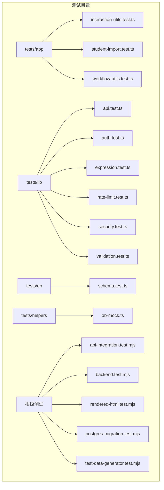
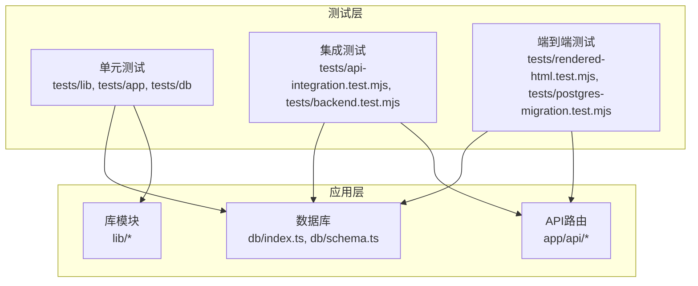
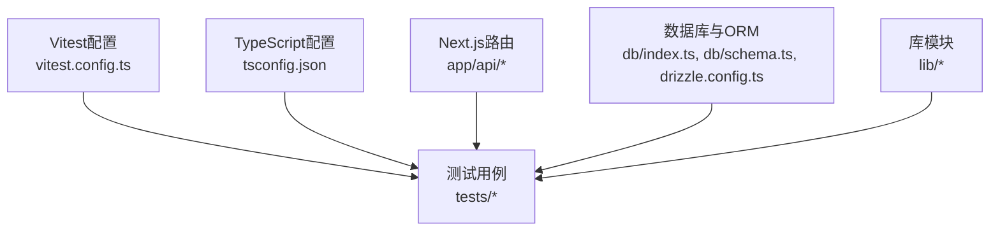

# 测试指南

<cite>
**本文引用的文件**   
- [package.json](file://package.json)
- [vitest.config.ts](file://vitest.config.ts)
- [vite.config.ts](file://vite.config.ts)
- [tsconfig.json](file://tsconfig.json)
- [tests/api-integration.test.mjs](file://tests/api-integration.test.mjs)
- [tests/backend.test.mjs](file://tests/backend.test.mjs)
- [tests/rendered-html.test.mjs](file://tests/rendered-html.test.mjs)
- [tests/postgres-migration.test.mjs](file://tests/postgres-migration.test.mjs)
- [tests/test-data-generator.test.mjs](file://tests/test-data-generator.test.mjs)
- [tests/app/interaction-utils.test.ts](file://tests/app/interaction-utils.test.ts)
- [tests/app/student-import.test.ts](file://tests/app/student-import.test.ts)
- [tests/app/workflow-utils.test.ts](file://tests/app/workflow-utils.test.ts)
- [tests/db/schema.test.ts](file://tests/db/schema.test.ts)
- [tests/lib/api.test.ts](file://tests/lib/api.test.ts)
- [tests/lib/auth.test.ts](file://tests/lib/auth.test.ts)
- [tests/lib/expression.test.ts](file://tests/lib/expression.test.ts)
- [tests/lib/rate-limit.test.ts](file://tests/lib/rate-limit.test.ts)
- [tests/lib/security.test.ts](file://tests/lib/security.test.ts)
- [tests/lib/validation.test.ts](file://tests/lib/validation.test.ts)
- [tests/helpers/db-mock.ts](file://tests/helpers/db-mock.ts)
- [lib/test-data-generator.js](file://lib/test-data-generator.js)
- [scripts/seed-full-test-data.mjs](file://scripts/seed-full-test-data.mjs)
- [db/index.ts](file://db/index.ts)
- [db/schema.ts](file://db/schema.ts)
- [drizzle.config.ts](file://drizzle.config.ts)
- [app/api/auth/login/route.ts](file://app/api/auth/login/route.ts)
- [app/api/auth/session/route.ts](file://app/api/auth/session/route.ts)
- [app/api/students/route.ts](file://app/api/students/route.ts)
- [app/api/students/[id]/route.ts](file://app/api/students/[id]/route.ts)
- [app/api/students/batch/route.ts](file://app/api/students/batch/route.ts)
- [app/api/admin/users/route.ts](file://app/api/admin/users/route.ts)
- [app/api/admin/logs/route.ts](file://app/api/admin/logs/route.ts)
- [app/api/workflows/route.ts](file://app/api/workflows/route.ts)
- [app/api/workflow/instances/route.ts](file://app/api/workflow/instances/route.ts)
- [app/api/workflow/tasks/route.ts](file://app/api/workflow/tasks/route.ts)
- [app/api/notifications/route.ts](file://app/api/notifications/route.ts)
- [app/api/counselor-classes/route.ts](file://app/api/counselor-classes/route.ts)
- [app/api/records/[featureId]/route.ts](file://app/api/records/[featureId]/route.ts)
- [lib/api.ts](file://lib/api.ts)
- [lib/auth.ts](file://lib/auth.ts)
- [lib/rate-limit.ts](file://lib/rate-limit.ts)
- [lib/security.ts](file://lib/security.ts)
- [lib/validation.ts](file://lib/validation.ts)
</cite>

## 目录
1. [简介](#简介)
2. [项目结构](#项目结构)
3. [核心组件](#核心组件)
4. [架构总览](#架构总览)
5. [详细组件分析](#详细组件分析)
6. [依赖分析](#依赖分析)
7. [性能考虑](#性能考虑)
8. [故障排查指南](#故障排查指南)
9. [结论](#结论)
10. [附录](#附录)

## 简介
本测试指南面向CS1学生事务管理系统的开发与维护，覆盖单元测试、集成测试与端到端测试的策略与实现。内容包含：
- 测试框架配置（Vitest）与环境设置
- 测试数据准备与Mock策略
- API测试、数据库测试与组件测试最佳实践
- 覆盖率要求与持续集成建议
- 异步测试、数据库隔离与外部服务模拟

本指南基于仓库现有测试结构与代码组织进行说明，确保读者能快速搭建并扩展测试体系。

## 项目结构
本项目采用Next.js应用结构，测试集中在tests目录，按功能域划分：
- tests/app：前端工具函数与导入流程的单元测试
- tests/lib：后端库模块（API客户端、鉴权、限流、安全、校验等）的单元测试
- tests/db：数据库Schema与迁移相关测试
- tests/helpers：测试辅助（如数据库Mock）
- 根级*.test.mjs：集成测试与端到端测试入口

**图表来源** 
- [tests/app/interaction-utils.test.ts](file://tests/app/interaction-utils.test.ts)
- [tests/lib/api.test.ts](file://tests/lib/api.test.ts)
- [tests/db/schema.test.ts](file://tests/db/schema.test.ts)
- [tests/helpers/db-mock.ts](file://tests/helpers/db-mock.ts)
- [tests/api-integration.test.mjs](file://tests/api-integration.test.mjs)
- [tests/backend.test.mjs](file://tests/backend.test.mjs)
- [tests/rendered-html.test.mjs](file://tests/rendered-html.test.mjs)
- [tests/postgres-migration.test.mjs](file://tests/postgres-migration.test.mjs)
- [tests/test-data-generator.test.mjs](file://tests/test-data-generator.test.mjs)

**章节来源**
- [package.json](file://package.json)
- [vitest.config.ts](file://vitest.config.ts)
- [vite.config.ts](file://vite.config.ts)
- [tsconfig.json](file://tsconfig.json)

## 核心组件
- 测试框架与运行器：Vitest（通过vitest.config.ts与vite.config.ts配置），支持TS与MJS测试用例
- 数据库层：Drizzle ORM（db/index.ts、db/schema.ts、drizzle.config.ts），用于Schema定义与迁移
- API路由：Next.js App Router（app/api/*），提供认证、学生管理、工作流、通知等接口
- 库模块：lib/*（api.ts、auth.ts、rate-limit.ts、security.ts、validation.ts）封装通用能力
- 测试数据：lib/test-data-generator.js与scripts/seed-full-test-data.mjs生成与填充测试数据
- 测试辅助：tests/helpers/db-mock.ts提供数据库Mock能力

**章节来源**
- [vitest.config.ts](file://vitest.config.ts)
- [vite.config.ts](file://vite.config.ts)
- [db/index.ts](file://db/index.ts)
- [db/schema.ts](file://db/schema.ts)
- [drizzle.config.ts](file://drizzle.config.ts)
- [lib/test-data-generator.js](file://lib/test-data-generator.js)
- [scripts/seed-full-test-data.mjs](file://scripts/seed-full-test-data.mjs)
- [tests/helpers/db-mock.ts](file://tests/helpers/db-mock.ts)

## 架构总览
下图展示测试在系统中的位置与交互关系：测试用例调用API路由或库模块，必要时通过Mock或真实数据库执行验证。

**图表来源** 
- [tests/lib/api.test.ts](file://tests/lib/api.test.ts)
- [tests/app/interaction-utils.test.ts](file://tests/app/interaction-utils.test.ts)
- [tests/db/schema.test.ts](file://tests/db/schema.test.ts)
- [tests/api-integration.test.mjs](file://tests/api-integration.test.mjs)
- [tests/backend.test.mjs](file://tests/backend.test.mjs)
- [tests/rendered-html.test.mjs](file://tests/rendered-html.test.mjs)
- [tests/postgres-migration.test.mjs](file://tests/postgres-migration.test.mjs)
- [app/api/auth/login/route.ts](file://app/api/auth/login/route.ts)
- [app/api/students/route.ts](file://app/api/students/route.ts)
- [db/index.ts](file://db/index.ts)
- [db/schema.ts](file://db/schema.ts)

## 详细组件分析

### 单元测试策略与实现
- 目标：对纯函数、工具方法、校验逻辑、表达式解析等进行快速、稳定的验证
- 范围：
  - tests/lib：API客户端、鉴权、限流、安全、校验等模块
  - tests/app：交互工具、学生导入、工作流工具等
  - tests/db：Schema约束与类型正确性
- 要点：
  - 使用Vitest的describe/it断言，避免IO与网络依赖
  - 对复杂分支与边界条件编写充分用例
  - 对随机性或时间敏感逻辑使用固定种子与时区控制

**章节来源**
- [tests/lib/api.test.ts](file://tests/lib/api.test.ts)
- [tests/lib/auth.test.ts](file://tests/lib/auth.test.ts)
- [tests/lib/expression.test.ts](file://tests/lib/expression.test.ts)
- [tests/lib/rate-limit.test.ts](file://tests/lib/rate-limit.test.ts)
- [tests/lib/security.test.ts](file://tests/lib/security.test.ts)
- [tests/lib/validation.test.ts](file://tests/lib/validation.test.ts)
- [tests/app/interaction-utils.test.ts](file://tests/app/interaction-utils.test.ts)
- [tests/app/student-import.test.ts](file://tests/app/student-import.test.ts)
- [tests/app/workflow-utils.test.ts](file://tests/app/workflow-utils.test.ts)
- [tests/db/schema.test.ts](file://tests/db/schema.test.ts)

### 集成测试策略与实现
- 目标：验证API路由与数据库交互的正确性与一致性
- 范围：
  - tests/api-integration.test.mjs：调用API路由，验证请求/响应与状态码
  - tests/backend.test.mjs：后端服务启动与基础行为验证
- 要点：
  - 使用独立测试数据库或事务回滚保证隔离
  - 预置测试数据（seed脚本或Mock）
  - 对鉴权、权限、限流等横切关注点进行验证

**章节来源**
- [tests/api-integration.test.mjs](file://tests/api-integration.test.mjs)
- [tests/backend.test.mjs](file://tests/backend.test.mjs)
- [app/api/auth/login/route.ts](file://app/api/auth/login/route.ts)
- [app/api/auth/session/route.ts](file://app/api/auth/session/route.ts)
- [app/api/students/route.ts](file://app/api/students/route.ts)
- [app/api/students/[id]/route.ts](file://app/api/students/[id]/route.ts)
- [app/api/students/batch/route.ts](file://app/api/students/batch/route.ts)
- [app/api/admin/users/route.ts](file://app/api/admin/users/route.ts)
- [app/api/admin/logs/route.ts](file://app/api/admin/logs/route.ts)
- [app/api/workflows/route.ts](file://app/api/workflows/route.ts)
- [app/api/workflow/instances/route.ts](file://app/api/workflow/instances/route.ts)
- [app/api/workflow/tasks/route.ts](file://app/api/workflow/tasks/route.ts)
- [app/api/notifications/route.ts](file://app/api/notifications/route.ts)
- [app/api/counselor-classes/route.ts](file://app/api/counselor-classes/route.ts)
- [app/api/records/[featureId]/route.ts](file://app/api/records/[featureId]/route.ts)

### 端到端测试策略与实现
- 目标：从用户视角验证页面渲染、导航与关键业务流程
- 范围：
  - tests/rendered-html.test.mjs：检查页面HTML渲染与关键元素存在性
  - tests/postgres-migration.test.mjs：验证数据库迁移完整性
- 要点：
  - 使用浏览器自动化或HTTP断言结合页面快照
  - 对迁移脚本进行幂等性与回滚路径验证

**章节来源**
- [tests/rendered-html.test.mjs](file://tests/rendered-html.test.mjs)
- [tests/postgres-migration.test.mjs](file://tests/postgres-migration.test.mjs)

### 数据库测试与Mock策略
- 目标：确保Schema定义、迁移与查询逻辑正确
- 范围：
  - tests/db/schema.test.ts：校验字段类型、约束与关系
  - tests/helpers/db-mock.ts：提供数据库Mock，避免真实IO
- 要点：
  - 使用事务包裹测试，确保数据隔离与清理
  - Mock外部依赖（如第三方库、文件系统、网络）
  - 对Drizzle查询进行断言，确保SQL生成与执行符合预期

**章节来源**
- [tests/db/schema.test.ts](file://tests/db/schema.test.ts)
- [tests/helpers/db-mock.ts](file://tests/helpers/db-mock.ts)
- [db/index.ts](file://db/index.ts)
- [db/schema.ts](file://db/schema.ts)
- [drizzle.config.ts](file://drizzle.config.ts)

### 测试数据准备与Seed
- 目标：为各类测试提供稳定、可重复的数据集
- 范围：
  - lib/test-data-generator.js：生成结构化测试数据
  - scripts/seed-full-test-data.mjs：批量填充数据库
- 要点：
  - 数据应覆盖正常、边界与异常场景
  - 提供清理与重置机制，避免数据污染

**章节来源**
- [lib/test-data-generator.js](file://lib/test-data-generator.js)
- [scripts/seed-full-test-data.mjs](file://scripts/seed-full-test-data.mjs)

### API测试最佳实践
- 目标：全面覆盖CRUD、鉴权、限流、错误处理
- 范围：
  - 认证：登录与会话创建（login、session）
  - 学生管理：列表、详情、批量操作（students、batch）
  - 管理员：用户与日志（admin/users、admin/logs）
  - 工作流：实例与任务（workflows、workflow/instances、workflow/tasks）
  - 其他：通知、辅导员课程、记录（notifications、counselor-classes、records）
- 要点：
  - 使用有效Token与角色上下文
  - 断言状态码、响应体结构与业务语义
  - 对并发与限流场景进行压力与回归测试

**章节来源**
- [app/api/auth/login/route.ts](file://app/api/auth/login/route.ts)
- [app/api/auth/session/route.ts](file://app/api/auth/session/route.ts)
- [app/api/students/route.ts](file://app/api/students/route.ts)
- [app/api/students/[id]/route.ts](file://app/api/students/[id]/route.ts)
- [app/api/students/batch/route.ts](file://app/api/students/batch/route.ts)
- [app/api/admin/users/route.ts](file://app/api/admin/users/route.ts)
- [app/api/admin/logs/route.ts](file://app/api/admin/logs/route.ts)
- [app/api/workflows/route.ts](file://app/api/workflows/route.ts)
- [app/api/workflow/instances/route.ts](file://app/api/workflow/instances/route.ts)
- [app/api/workflow/tasks/route.ts](file://app/api/workflow/tasks/route.ts)
- [app/api/notifications/route.ts](file://app/api/notifications/route.ts)
- [app/api/counselor-classes/route.ts](file://app/api/counselor-classes/route.ts)
- [app/api/records/[featureId]/route.ts](file://app/api/records/[featureId]/route.ts)

### 组件测试最佳实践
- 目标：验证UI组件渲染、交互与状态更新
- 范围：
  - 表单组件（forms/*）、通用表格（generic/*）、学生页面（student/*）、工作流设计（workflow/*）
- 要点：
  - 使用React Testing Library或等效工具进行断言
  - 模拟用户事件与异步状态变化
  - 对副作用（如API调用）进行Mock

[本节为概念性指导，不直接分析具体文件]

## 依赖分析
测试对应用与基础设施的依赖如下：
- 测试框架：Vitest（vitest.config.ts、vite.config.ts）
- 运行时：Node.js与TypeScript（tsconfig.json）
- 数据库：PostgreSQL与Drizzle（db/index.ts、db/schema.ts、drizzle.config.ts）
- API路由：Next.js App Router（app/api/*）
- 库模块：lib/*（鉴权、限流、安全、校验、API客户端）

**图表来源** 
- [vitest.config.ts](file://vitest.config.ts)
- [tsconfig.json](file://tsconfig.json)
- [db/index.ts](file://db/index.ts)
- [db/schema.ts](file://db/schema.ts)
- [drizzle.config.ts](file://drizzle.config.ts)
- [app/api/auth/login/route.ts](file://app/api/auth/login/route.ts)
- [lib/api.ts](file://lib/api.ts)
- [lib/auth.ts](file://lib/auth.ts)
- [lib/rate-limit.ts](file://lib/rate-limit.ts)
- [lib/security.ts](file://lib/security.ts)
- [lib/validation.ts](file://lib/validation.ts)

**章节来源**
- [vitest.config.ts](file://vitest.config.ts)
- [tsconfig.json](file://tsconfig.json)
- [db/index.ts](file://db/index.ts)
- [db/schema.ts](file://db/schema.ts)
- [drizzle.config.ts](file://drizzle.config.ts)
- [lib/api.ts](file://lib/api.ts)
- [lib/auth.ts](file://lib/auth.ts)
- [lib/rate-limit.ts](file://lib/rate-limit.ts)
- [lib/security.ts](file://lib/security.ts)
- [lib/validation.ts](file://lib/validation.ts)

## 性能考虑
- 单元测试应保持毫秒级执行，避免IO与网络；对耗时操作进行Mock
- 集成测试使用内存数据库或事务隔离，减少磁盘I/O
- 端到端测试按需启用，避免全量页面渲染与浏览器自动化开销
- 并行执行测试套件，利用Vitest的多进程能力
- 对大数据集生成与导入进行分页与批处理优化

[本节为通用指导，不直接分析具体文件]

## 故障排查指南
- 测试环境无法启动：检查Node版本、依赖安装与配置文件（vitest.config.ts、vite.config.ts、tsconfig.json）
- 数据库连接失败：确认PostgreSQL服务、连接参数与迁移脚本（db/index.ts、drizzle.config.ts）
- 鉴权失败：验证Token生成与会话逻辑（lib/auth.ts、app/api/auth/*）
- 限流触发：检查速率限制配置与测试并发（lib/rate-limit.ts）
- 校验失败：核对输入模型与校验规则（lib/validation.ts）
- 页面渲染异常：检查组件依赖与Mock策略（tests/rendered-html.test.mjs）

**章节来源**
- [vitest.config.ts](file://vitest.config.ts)
- [vite.config.ts](file://vite.config.ts)
- [tsconfig.json](file://tsconfig.json)
- [db/index.ts](file://db/index.ts)
- [drizzle.config.ts](file://drizzle.config.ts)
- [lib/auth.ts](file://lib/auth.ts)
- [lib/rate-limit.ts](file://lib/rate-limit.ts)
- [lib/validation.ts](file://lib/validation.ts)
- [tests/rendered-html.test.mjs](file://tests/rendered-html.test.mjs)

## 结论
本测试指南围绕CS1学生事务管理系统，构建了从单元到端到端的完整测试体系。通过Vitest驱动、Drizzle ORM与Next.js路由，结合Mock与数据Seed，确保系统质量与可维护性。建议在CI中集成覆盖率阈值与自动化测试，持续提升交付质量。

[本节为总结性内容，不直接分析具体文件]

## 附录
- 覆盖率要求：建议单元测试≥80%，集成测试≥70%，端到端≥50%（可按模块调整）
- 持续集成：在CI流水线中执行Vitest、数据库迁移与关键端到端用例
- 异步测试：使用async/await与超时控制，避免悬挂Promise
- 外部服务模拟：使用本地Mock或服务虚拟化，确保测试稳定性

[本节为补充信息，不直接分析具体文件]