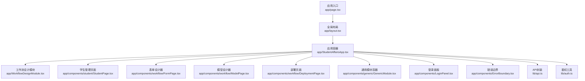
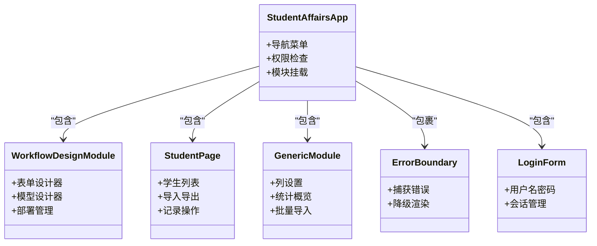
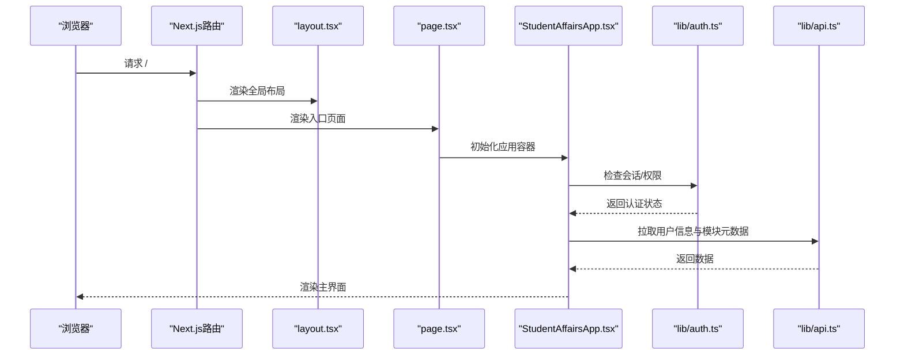
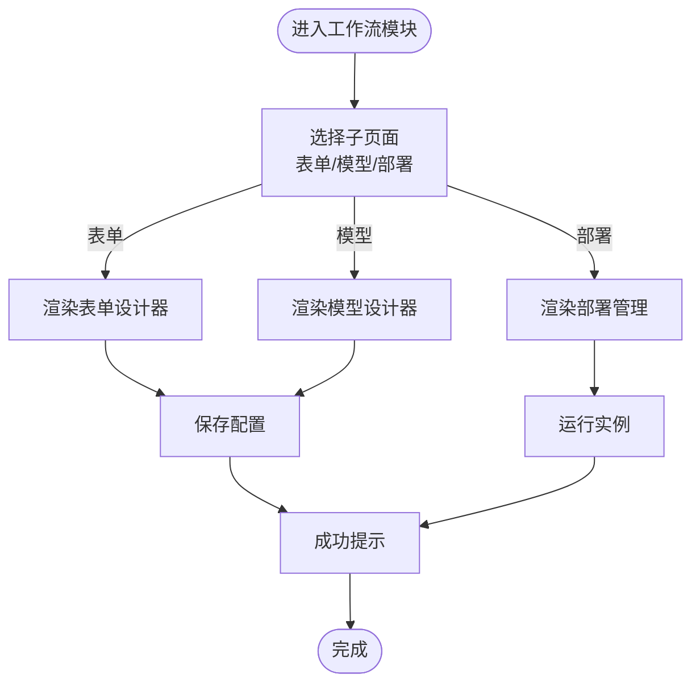
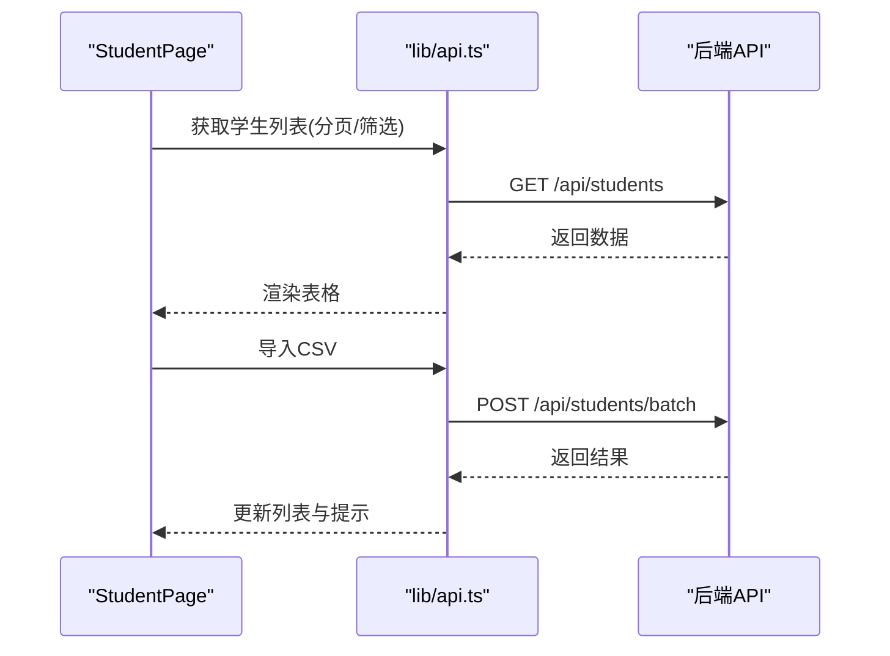
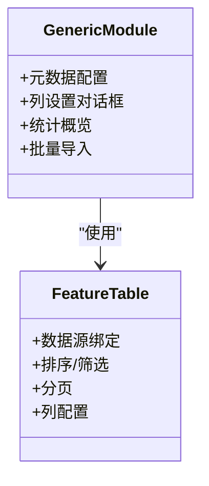
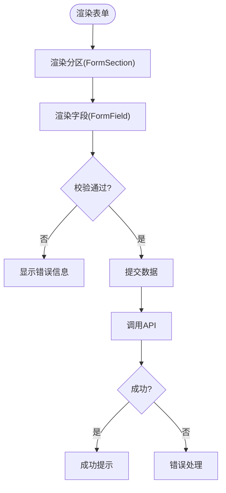
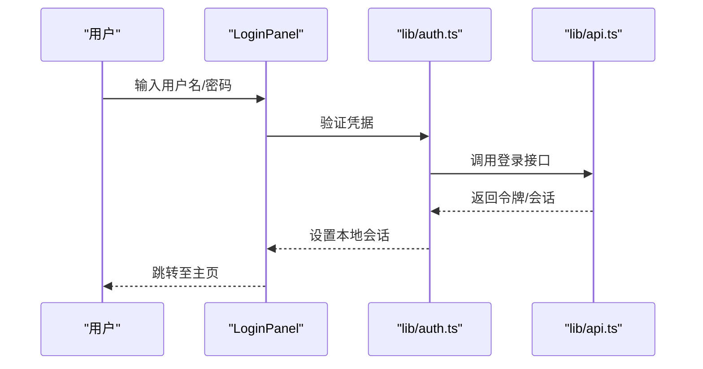
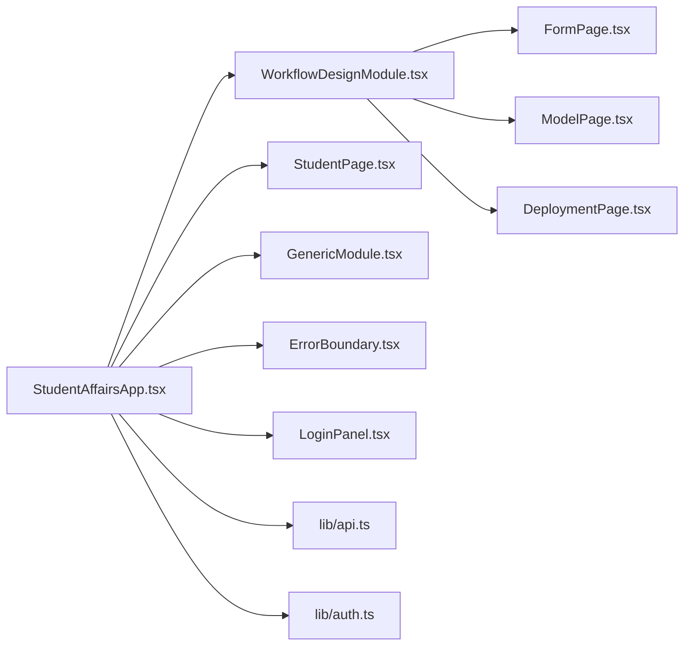

# 前端架构

<cite>
**本文引用的文件**   
- [app/layout.tsx](file://app/layout.tsx)
- [app/page.tsx](file://app/page.tsx)
- [app/StudentAffairsApp.tsx](file://app/StudentAffairsApp.tsx)
- [app/WorkflowDesignModule.tsx](file://app/WorkflowDesignModule.tsx)
- [app/components/ErrorBoundary.tsx](file://app/components/ErrorBoundary.tsx)
- [app/components/LoginPanel.tsx](file://app/components/LoginPanel.tsx)
- [app/components/AppWrapper.tsx](file://app/components/AppWrapper.tsx)
- [app/components/generic/GenericModule.tsx](file://app/components/generic/GenericModule.tsx)
- [app/components/generic/FeatureTable.tsx](file://app/components/generic/FeatureTable.tsx)
- [app/components/student/StudentPage.tsx](file://app/components/student/StudentPage.tsx)
- [app/components/workflow/FormPage.tsx](file://app/components/workflow/FormPage.tsx)
- [app/components/workflow/ModelPage.tsx](file://app/components/workflow/ModelPage.tsx)
- [app/components/workflow/DeploymentPage.tsx](file://app/components/workflow/DeploymentPage.tsx)
- [app/components/forms/FormSection.tsx](file://app/components/forms/FormSection.tsx)
- [app/components/forms/FormField.tsx](file://app/components/forms/FormField.tsx)
- [lib/api.ts](file://lib/api.ts)
- [lib/auth.ts](file://lib/auth.ts)
- [next.config.ts](file://next.config.ts)
- [tsconfig.json](file://tsconfig.json)
</cite>

## 目录
1. [简介](#简介)
2. [项目结构](#项目结构)
3. [核心组件](#核心组件)
4. [架构总览](#架构总览)
5. [详细组件分析](#详细组件分析)
6. [依赖关系分析](#依赖关系分析)
7. [性能考虑](#性能考虑)
8. [故障排查指南](#故障排查指南)
9. [结论](#结论)
10. [附录](#附录)

## 简介
本文件面向CS1学生事务管理系统的前端架构，聚焦基于Next.js的React应用组织方式与实现要点。文档涵盖：
- 组件层次结构与页面组织
- 状态管理模式与数据流
- 路由设计与导航策略
- 通用组件设计模式与错误边界
- 前后端API集成策略与错误处理
- 响应式、国际化与可访问性实践
- 组件复用策略与代码组织最佳实践

## 项目结构
本项目采用Next.js App Router组织前端代码，关键目录与职责如下：
- app：应用根目录，包含布局、页面、组件与API路由
- app/components：按功能域划分的组件（forms、generic、student、workflow等）
- lib：共享库（API封装、鉴权、校验、安全等）
- next.config.ts：Next.js构建与运行时配置
- tsconfig.json：TypeScript编译与路径别名配置

**图表来源** 
- [app/page.tsx](file://app/page.tsx)
- [app/layout.tsx](file://app/layout.tsx)
- [app/StudentAffairsApp.tsx](file://app/StudentAffairsApp.tsx)
- [app/WorkflowDesignModule.tsx](file://app/WorkflowDesignModule.tsx)
- [app/components/student/StudentPage.tsx](file://app/components/student/StudentPage.tsx)
- [app/components/workflow/FormPage.tsx](file://app/components/workflow/FormPage.tsx)
- [app/components/workflow/ModelPage.tsx](file://app/components/workflow/ModelPage.tsx)
- [app/components/workflow/DeploymentPage.tsx](file://app/components/workflow/DeploymentPage.tsx)
- [app/components/generic/GenericModule.tsx](file://app/components/generic/GenericModule.tsx)
- [app/components/LoginPanel.tsx](file://app/components/LoginPanel.tsx)
- [app/components/ErrorBoundary.tsx](file://app/components/ErrorBoundary.tsx)
- [lib/api.ts](file://lib/api.ts)
- [lib/auth.ts](file://lib/auth.ts)

**章节来源**
- [app/page.tsx](file://app/page.tsx)
- [app/layout.tsx](file://app/layout.tsx)
- [next.config.ts](file://next.config.ts)
- [tsconfig.json](file://tsconfig.json)

## 核心组件
- 应用容器 StudentAffairsApp：负责整体布局、菜单导航、权限控制与模块挂载
- 工作流设计模块 WorkflowDesignModule：聚合表单、模型、部署等子页面
- 学生管理 StudentPage：学生数据的展示、导入、记录操作
- 通用模块 GenericModule：基于元数据驱动的通用列表/统计/导入能力
- 表单组件 FormSection/FormField：统一表单结构与字段渲染
- 错误边界 ErrorBoundary：捕获并降级渲染错误信息
- 登录面板 LoginPanel：用户认证入口与会话管理

**章节来源**
- [app/StudentAffairsApp.tsx](file://app/StudentAffairsApp.tsx)
- [app/WorkflowDesignModule.tsx](file://app/WorkflowDesignModule.tsx)
- [app/components/student/StudentPage.tsx](file://app/components/student/StudentPage.tsx)
- [app/components/generic/GenericModule.tsx](file://app/components/generic/GenericModule.tsx)
- [app/components/forms/FormSection.tsx](file://app/components/forms/FormSection.tsx)
- [app/components/forms/FormField.tsx](file://app/components/forms/FormField.tsx)
- [app/components/ErrorBoundary.tsx](file://app/components/ErrorBoundary.tsx)
- [app/components/LoginPanel.tsx](file://app/components/LoginPanel.tsx)

## 架构总览
系统采用“容器-模块-页面-组件”的分层结构：
- 容器层：StudentAffairsApp 提供导航、权限与上下文
- 模块层：WorkflowDesignModule 将工作流相关页面组合
- 页面层：StudentPage、FormPage、ModelPage、DeploymentPage 等
- 组件层：通用表格、表单、对话框等可复用UI

**图表来源** 
- [app/StudentAffairsApp.tsx](file://app/StudentAffairsApp.tsx)
- [app/WorkflowDesignModule.tsx](file://app/WorkflowDesignModule.tsx)
- [app/components/student/StudentPage.tsx](file://app/components/student/StudentPage.tsx)
- [app/components/generic/GenericModule.tsx](file://app/components/generic/GenericModule.tsx)
- [app/components/ErrorBoundary.tsx](file://app/components/ErrorBoundary.tsx)
- [app/components/LoginPanel.tsx](file://app/components/LoginPanel.tsx)

## 详细组件分析

### 应用容器与布局
- 布局 layout.tsx：定义全局HTML结构、主题样式、字体与SEO元信息
- 页面 page.tsx：作为应用入口，渲染 StudentAffairsApp 或重定向到登录
- 容器 StudentAffairsApp：整合导航、权限、模块加载与错误边界

**图表来源** 
- [app/layout.tsx](file://app/layout.tsx)
- [app/page.tsx](file://app/page.tsx)
- [app/StudentAffairsApp.tsx](file://app/StudentAffairsApp.tsx)
- [lib/auth.ts](file://lib/auth.ts)
- [lib/api.ts](file://lib/api.ts)

**章节来源**
- [app/layout.tsx](file://app/layout.tsx)
- [app/page.tsx](file://app/page.tsx)
- [app/StudentAffairsApp.tsx](file://app/StudentAffairsApp.tsx)

### 工作流设计模块
- 表单设计器 FormPage：可视化表单建模与字段配置
- 模型设计器 ModelPage：数据模型定义与关联关系
- 部署页面 DeploymentPage：工作流实例管理与任务调度

**图表来源** 
- [app/WorkflowDesignModule.tsx](file://app/WorkflowDesignModule.tsx)
- [app/components/workflow/FormPage.tsx](file://app/components/workflow/FormPage.tsx)
- [app/components/workflow/ModelPage.tsx](file://app/components/workflow/ModelPage.tsx)
- [app/components/workflow/DeploymentPage.tsx](file://app/components/workflow/DeploymentPage.tsx)

**章节来源**
- [app/WorkflowDesignModule.tsx](file://app/WorkflowDesignModule.tsx)
- [app/components/workflow/FormPage.tsx](file://app/components/workflow/FormPage.tsx)
- [app/components/workflow/ModelPage.tsx](file://app/components/workflow/ModelPage.tsx)
- [app/components/workflow/DeploymentPage.tsx](file://app/components/workflow/DeploymentPage.tsx)

### 学生管理页面
- 列表展示：分页、排序、筛选、列设置
- 导入导出：CSV导入、批量操作
- 记录操作：创建、编辑、归档、审核

**图表来源** 
- [app/components/student/StudentPage.tsx](file://app/components/student/StudentPage.tsx)
- [lib/api.ts](file://lib/api.ts)

**章节来源**
- [app/components/student/StudentPage.tsx](file://app/components/student/StudentPage.tsx)

### 通用模块与表格
- GenericModule：基于元数据驱动的配置化模块，支持列设置、统计概览、批量导入
- FeatureTable：通用表格组件，支持排序、筛选、分页、列宽调整

**图表来源** 
- [app/components/generic/GenericModule.tsx](file://app/components/generic/GenericModule.tsx)
- [app/components/generic/FeatureTable.tsx](file://app/components/generic/FeatureTable.tsx)

**章节来源**
- [app/components/generic/GenericModule.tsx](file://app/components/generic/GenericModule.tsx)
- [app/components/generic/FeatureTable.tsx](file://app/components/generic/FeatureTable.tsx)

### 表单组件体系
- FormSection：表单分区与分组
- FormField：字段渲染与校验
- 具体表单：ApplicationRecordForm、ArchiveRecordForm、BusinessRecordForm、ConfigRecordForm、ReviewRecordForm、BatchRecordForm

**图表来源** 
- [app/components/forms/FormSection.tsx](file://app/components/forms/FormSection.tsx)
- [app/components/forms/FormField.tsx](file://app/components/forms/FormField.tsx)

**章节来源**
- [app/components/forms/FormSection.tsx](file://app/components/forms/FormSection.tsx)
- [app/components/forms/FormField.tsx](file://app/components/forms/FormField.tsx)

### 错误边界与登录面板
- ErrorBoundary：捕获渲染错误，提供降级UI与重试机制
- LoginPanel：登录表单、会话管理、权限判断

**图表来源** 
- [app/components/LoginPanel.tsx](file://app/components/LoginPanel.tsx)
- [lib/auth.ts](file://lib/auth.ts)
- [lib/api.ts](file://lib/api.ts)

**章节来源**
- [app/components/ErrorBoundary.tsx](file://app/components/ErrorBoundary.tsx)
- [app/components/LoginPanel.tsx](file://app/components/LoginPanel.tsx)

## 依赖关系分析
- 组件耦合：StudentAffairsApp 作为顶层容器，依赖各模块组件；模块组件内部通过 props 与事件通信
- 外部依赖：lib/api.ts 统一封装HTTP请求；lib/auth.ts 处理认证与会话
- 构建配置：next.config.ts 控制构建行为；tsconfig.json 定义类型与路径别名

**图表来源** 
- [app/StudentAffairsApp.tsx](file://app/StudentAffairsApp.tsx)
- [app/WorkflowDesignModule.tsx](file://app/WorkflowDesignModule.tsx)
- [app/components/student/StudentPage.tsx](file://app/components/student/StudentPage.tsx)
- [app/components/generic/GenericModule.tsx](file://app/components/generic/GenericModule.tsx)
- [app/components/ErrorBoundary.tsx](file://app/components/ErrorBoundary.tsx)
- [app/components/LoginPanel.tsx](file://app/components/LoginPanel.tsx)
- [app/components/workflow/FormPage.tsx](file://app/components/workflow/FormPage.tsx)
- [app/components/workflow/ModelPage.tsx](file://app/components/workflow/ModelPage.tsx)
- [app/components/workflow/DeploymentPage.tsx](file://app/components/workflow/DeploymentPage.tsx)
- [lib/api.ts](file://lib/api.ts)
- [lib/auth.ts](file://lib/auth.ts)

**章节来源**
- [next.config.ts](file://next.config.ts)
- [tsconfig.json](file://tsconfig.json)

## 性能考虑
- 组件懒加载：按需加载模块与页面，减少首屏体积
- 数据缓存：API响应缓存与本地状态优化，避免重复请求
- 虚拟滚动：大数据列表使用虚拟滚动提升渲染性能
- 图片与资源优化：压缩静态资源，启用CDN与缓存策略
- 构建优化：Tree-shaking、代码分割、预渲染与增量构建

[本节为通用指导，不直接分析具体文件]

## 故障排查指南
- 错误边界：查看 ErrorBoundary 的降级UI与日志输出，定位渲染异常
- 网络请求：检查 lib/api.ts 的错误处理与重试逻辑
- 认证问题：确认 lib/auth.ts 的会话状态与令牌刷新流程
- 表单校验：检查 FormField 的校验规则与错误提示
- 构建问题：核对 next.config.ts 与 tsconfig.json 的配置一致性

**章节来源**
- [app/components/ErrorBoundary.tsx](file://app/components/ErrorBoundary.tsx)
- [lib/api.ts](file://lib/api.ts)
- [lib/auth.ts](file://lib/auth.ts)
- [app/components/forms/FormField.tsx](file://app/components/forms/FormField.tsx)
- [next.config.ts](file://next.config.ts)
- [tsconfig.json](file://tsconfig.json)

## 结论
本前端架构以Next.js为核心，采用清晰的组件分层与模块化组织，结合统一的API封装与鉴权机制，实现了可扩展、易维护的学生事务管理系统。通过错误边界、性能优化与可访问性实践，保障了用户体验与系统稳定性。建议持续完善组件复用策略与测试覆盖，进一步提升开发效率与质量。

[本节为总结性内容，不直接分析具体文件]

## 附录
- 响应式设计：使用CSS媒体查询与弹性布局适配多设备
- 国际化支持：通过i18n库管理多语言文案与格式
- 可访问性：遵循WCAG标准，确保键盘导航与屏幕阅读器兼容
- 组件复用：抽象通用组件与Hooks，建立组件库与文档
- 代码规范：ESLint与Prettier统一风格，Git钩子保障质量

[本节为通用指导，不直接分析具体文件]