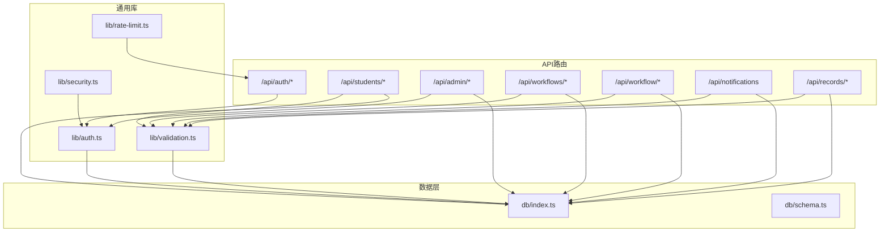
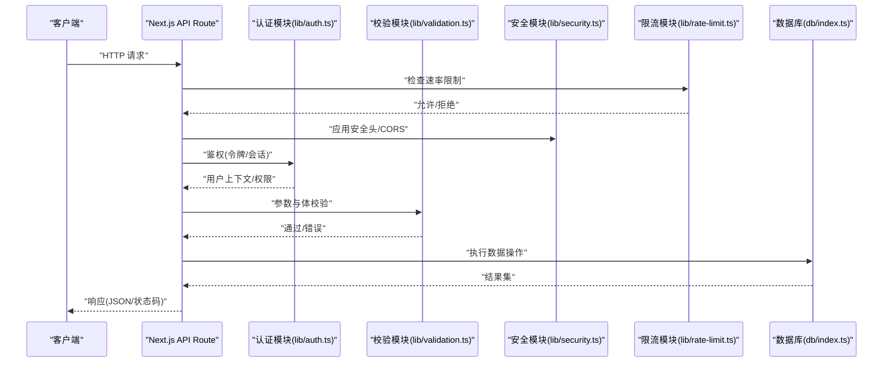
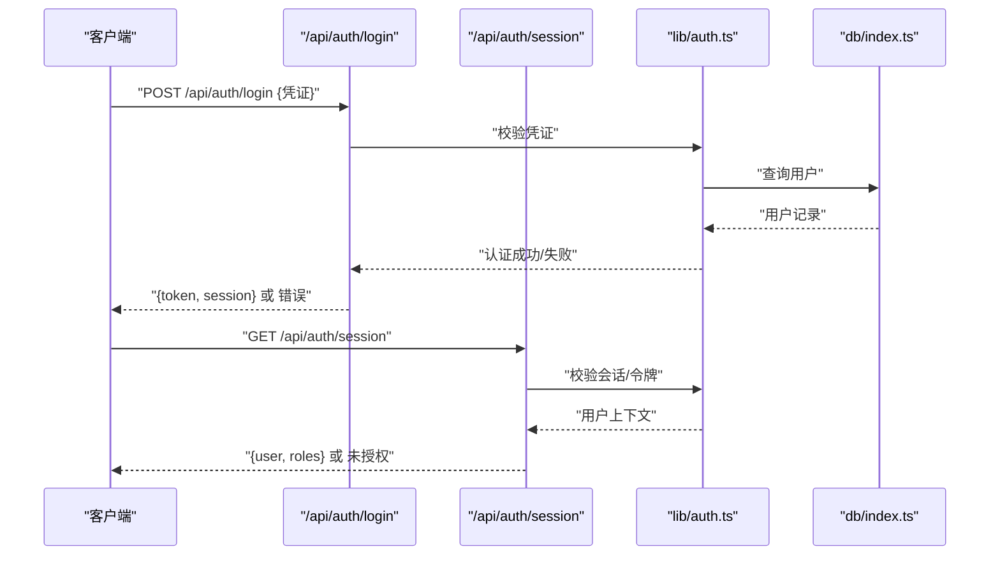
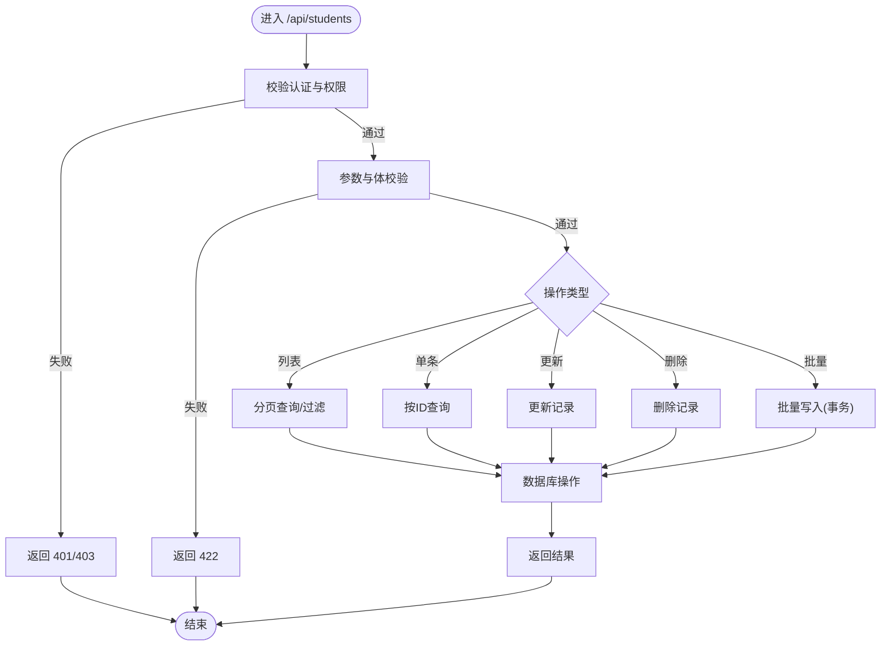
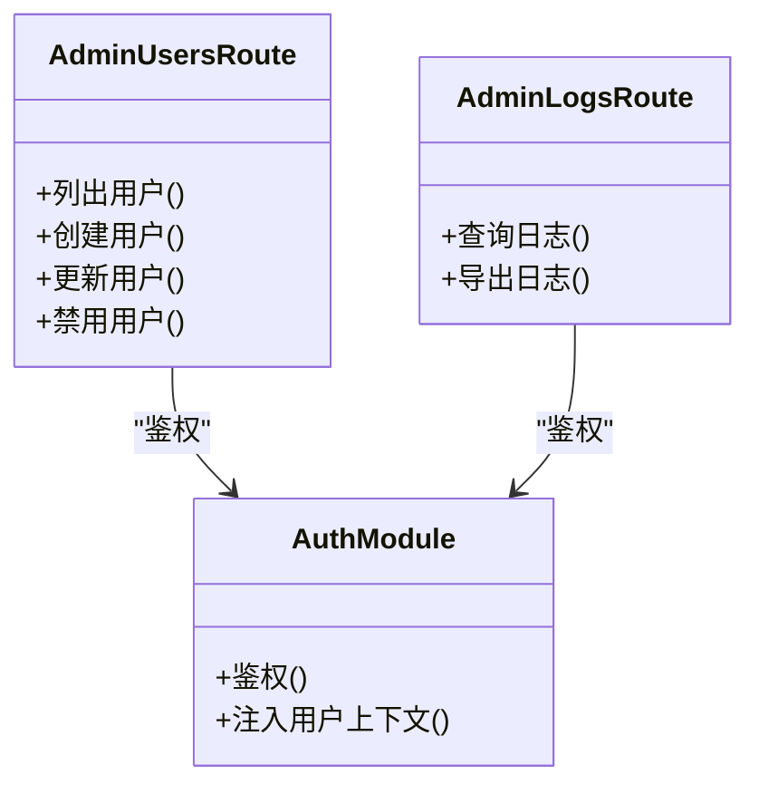
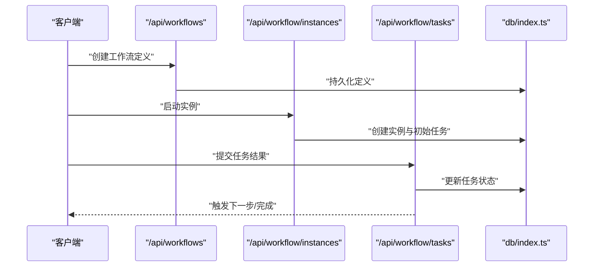
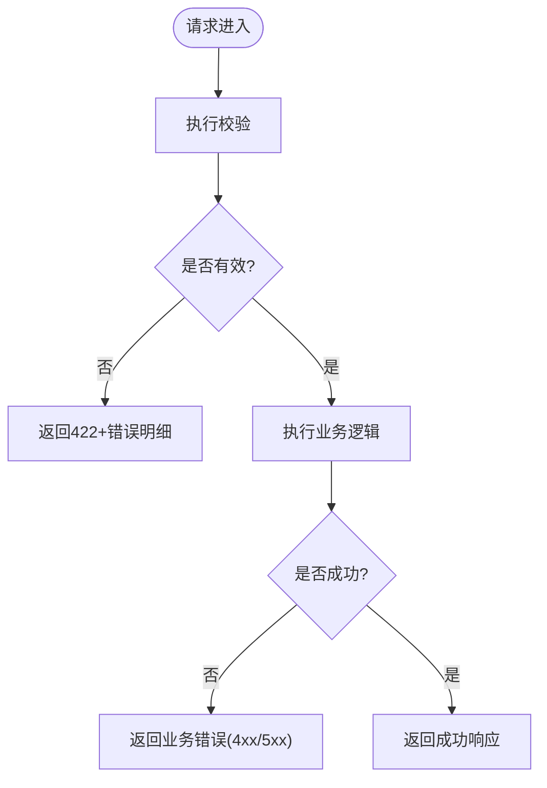
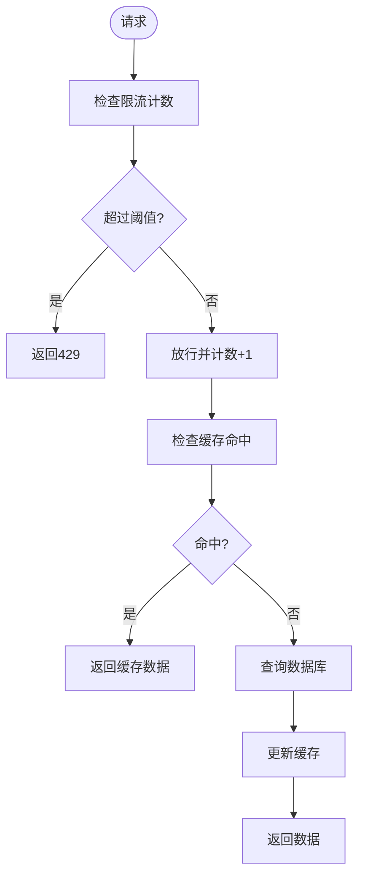
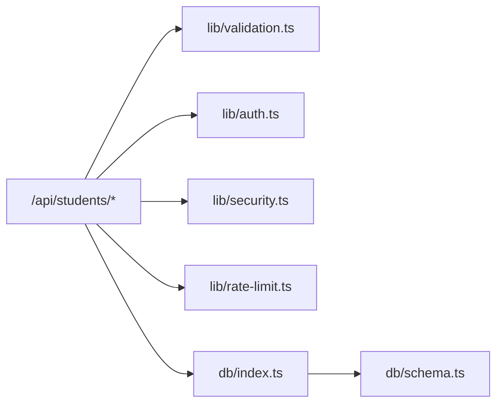

# 后端架构

<cite>
**本文引用的文件**   
- [app/api/auth/login/route.ts](file://app/api/auth/login/route.ts)
- [app/api/auth/session/route.ts](file://app/api/auth/session/route.ts)
- [app/api/students/route.ts](file://app/api/students/route.ts)
- [app/api/students/[id]/route.ts](file://app/api/students/[id]/route.ts)
- [app/api/students/batch/route.ts](file://app/api/students/batch/route.ts)
- [app/api/admin/users/route.ts](file://app/api/admin/users/route.ts)
- [app/api/admin/logs/route.ts](file://app/api/admin/logs/route.ts)
- [lib/auth.ts](file://lib/auth.ts)
- [lib/validation.ts](file://lib/validation.ts)
- [lib/rate-limit.ts](file://lib/rate-limit.ts)
- [lib/security.ts](file://lib/security.ts)
- [db/index.ts](file://db/index.ts)
- [db/schema.ts](file://db/schema.ts)
- [next.config.ts](file://next.config.ts)
- [package.json](file://package.json)
</cite>

## 目录
1. [简介](#简介)
2. [项目结构](#项目结构)
3. [核心组件](#核心组件)
4. [架构总览](#架构总览)
5. [详细组件分析](#详细组件分析)
6. [依赖关系分析](#依赖关系分析)
7. [性能考虑](#性能考虑)
8. [故障排查指南](#故障排查指南)
9. [结论](#结论)
10. [附录](#附录)

## 简介
本文件面向CS1学生事务管理系统的后端架构，聚焦基于Next.js API Routes的服务设计。文档涵盖中间件与认证授权机制、API路由组织、请求处理流程、错误处理、数据验证、速率限制、缓存策略、API版本管理、日志记录与监控集成，以及扩展点设计与第三方服务集成模式。目标是帮助读者快速理解系统整体架构与关键实现要点，并为后续扩展与维护提供指导。

## 项目结构
后端采用Next.js App Router的API Routes组织REST接口，按功能域划分模块：
- 认证与会话：/api/auth/*
- 学生管理：/api/students/*
- 管理员能力：/api/admin/*
- 工作流相关：/api/workflows/*、/api/workflow/*
- 通知与记录：/api/notifications、/api/records/*

通用能力集中在lib目录（认证、校验、安全、限流等），数据库访问在db目录（Drizzle ORM）。部署与构建配置位于根目录配置文件。

图表来源
- [next.config.ts](file://next.config.ts)
- [package.json](file://package.json)

章节来源
- [next.config.ts](file://next.config.ts)
- [package.json](file://package.json)

## 核心组件
- 认证与会话
  - 登录与会话接口：/api/auth/login、/api/auth/session
  - 认证逻辑封装于lib/auth.ts，负责令牌签发、会话校验与权限判断
- 数据验证
  - lib/validation.ts集中定义输入校验规则，供各路由复用
- 安全与防护
  - lib/security.ts提供安全工具（如CORS、头部加固、敏感信息过滤）
- 速率限制
  - lib/rate-limit.ts实现请求频率控制，保护接口免受滥用
- 数据库访问
  - db/index.ts初始化连接与查询封装
  - db/schema.ts使用Drizzle定义表结构与类型

章节来源
- [app/api/auth/login/route.ts](file://app/api/auth/login/route.ts)
- [app/api/auth/session/route.ts](file://app/api/auth/session/route.ts)
- [lib/auth.ts](file://lib/auth.ts)
- [lib/validation.ts](file://lib/validation.ts)
- [lib/security.ts](file://lib/security.ts)
- [lib/rate-limit.ts](file://lib/rate-limit.ts)
- [db/index.ts](file://db/index.ts)
- [db/schema.ts](file://db/schema.ts)

## 架构总览
下图展示从客户端到API路由、再到数据层的典型请求路径，以及认证、校验、限流与安全等横切关注点的介入位置。

图表来源
- [app/api/students/route.ts](file://app/api/students/route.ts)
- [lib/auth.ts](file://lib/auth.ts)
- [lib/validation.ts](file://lib/validation.ts)
- [lib/security.ts](file://lib/security.ts)
- [lib/rate-limit.ts](file://lib/rate-limit.ts)
- [db/index.ts](file://db/index.ts)

## 详细组件分析

### 认证与会话（/api/auth/*）
- 登录流程
  - 接收用户名/密码或凭证
  - 调用认证模块进行身份核验
  - 签发访问令牌与会话标识
  - 返回统一成功响应
- 会话校验
  - 读取请求中的会话/令牌
  - 校验有效性并注入用户上下文
  - 失败时返回未授权错误

图表来源
- [app/api/auth/login/route.ts](file://app/api/auth/login/route.ts)
- [app/api/auth/session/route.ts](file://app/api/auth/session/route.ts)
- [lib/auth.ts](file://lib/auth.ts)
- [db/index.ts](file://db/index.ts)

章节来源
- [app/api/auth/login/route.ts](file://app/api/auth/login/route.ts)
- [app/api/auth/session/route.ts](file://app/api/auth/session/route.ts)
- [lib/auth.ts](file://lib/auth.ts)

### 学生管理（/api/students/*）
- 列表与分页：支持搜索、筛选、排序
- 单条CRUD：根据ID获取、更新、删除
- 批量操作：批量导入/更新，具备事务性与回滚保障
- 数据校验：统一使用lib/validation.ts对入参进行强校验
- 权限控制：仅管理员或特定角色可执行写操作

图表来源
- [app/api/students/route.ts](file://app/api/students/route.ts)
- [app/api/students/[id]/route.ts](file://app/api/students/[id]/route.ts)
- [app/api/students/batch/route.ts](file://app/api/students/batch/route.ts)
- [lib/validation.ts](file://lib/validation.ts)
- [db/index.ts](file://db/index.ts)

章节来源
- [app/api/students/route.ts](file://app/api/students/route.ts)
- [app/api/students/[id]/route.ts](file://app/api/students/[id]/route.ts)
- [app/api/students/batch/route.ts](file://app/api/students/batch/route.ts)
- [lib/validation.ts](file://lib/validation.ts)

### 管理员能力（/api/admin/*）
- 用户管理：创建、更新、禁用、角色分配
- 日志审计：查看系统操作日志，支持时间范围与关键字检索
- 权限模型：基于角色的访问控制（RBAC），确保最小权限原则

图表来源
- [app/api/admin/users/route.ts](file://app/api/admin/users/route.ts)
- [app/api/admin/logs/route.ts](file://app/api/admin/logs/route.ts)
- [lib/auth.ts](file://lib/auth.ts)

章节来源
- [app/api/admin/users/route.ts](file://app/api/admin/users/route.ts)
- [app/api/admin/logs/route.ts](file://app/api/admin/logs/route.ts)
- [lib/auth.ts](file://lib/auth.ts)

### 工作流与任务（/api/workflows/*、/api/workflow/*）
- 工作流定义与实例管理
- 任务编排与状态流转
- 表单与模型设计器后端支撑

图表来源
- [app/api/workflows/route.ts](file://app/api/workflows/route.ts)
- [app/api/workflow/instances/route.ts](file://app/api/workflow/instances/route.ts)
- [app/api/workflow/tasks/route.ts](file://app/api/workflow/tasks/route.ts)
- [db/index.ts](file://db/index.ts)

章节来源
- [app/api/workflows/route.ts](file://app/api/workflows/route.ts)
- [app/api/workflow/instances/route.ts](file://app/api/workflow/instances/route.ts)
- [app/api/workflow/tasks/route.ts](file://app/api/workflow/tasks/route.ts)

### 数据验证与错误处理
- 数据验证
  - 统一入口lib/validation.ts，集中定义字段类型、必填、长度、格式等规则
  - 路由层调用校验函数，失败直接返回422并附带错误详情
- 错误处理
  - 认证失败：401/403
  - 参数错误：422
  - 业务异常：4xx/5xx并按语义分类
  - 统一错误响应结构，便于前端解析

图表来源
- [lib/validation.ts](file://lib/validation.ts)

章节来源
- [lib/validation.ts](file://lib/validation.ts)

### 速率限制与缓存策略
- 速率限制
  - 基于lib/rate-limit.ts实现IP/用户维度的请求计数与窗口控制
  - 超限返回429，避免资源耗尽与暴力破解
- 缓存策略
  - 读多写少接口可采用短期缓存（内存或Redis）提升吞吐
  - 写操作后失效相关缓存键，保证一致性

图表来源
- [lib/rate-limit.ts](file://lib/rate-limit.ts)

章节来源
- [lib/rate-limit.ts](file://lib/rate-limit.ts)

### 安全与防护
- 安全头与CORS：通过lib/security.ts统一设置响应头，限制跨域来源
- 输入净化：防止XSS与SQL注入，严格校验与转义
- 敏感信息过滤：响应中剔除内部字段与密钥
- 最小权限：默认拒绝，显式授权

章节来源
- [lib/security.ts](file://lib/security.ts)

### API版本管理与日志记录
- 版本管理
  - 建议在URL前缀引入v1/v2（如/api/v1/students），向后兼容演进
  - 废弃端点保留过渡期，配合弃用头提示
- 日志记录
  - 结构化日志（JSON）记录请求ID、方法、路径、耗时、状态码、用户ID
  - 敏感字段脱敏，避免泄露
  - 结合admin日志接口与外部日志平台（如ELK/Sentry）

章节来源
- [app/api/admin/logs/route.ts](file://app/api/admin/logs/route.ts)

### 监控集成方案
- 指标采集：暴露健康检查与健康探针（/health）
- 错误追踪：接入Sentry等错误上报，捕获未处理异常
- 性能观测：统计P95/P99延迟、QPS、错误率

[本节为通用建议，不直接分析具体文件]

### 扩展点设计与第三方服务集成
- 扩展点
  - 插件式中间件：在路由入口统一挂载校验、限流、审计钩子
  - 事件总线：异步处理耗时任务（邮件、短信、报表生成）
  - 适配器模式：对外部服务（支付、短信、存储）抽象接口，便于替换
- 第三方集成
  - 统一配置中心管理密钥与端点
  - 重试与熔断：对不稳定服务增加容错
  - 幂等性：对外写操作支持幂等键，避免重复提交

[本节为通用建议，不直接分析具体文件]

## 依赖关系分析
- 路由层依赖认证、校验、安全、限流等通用库
- 数据层通过db/index.ts统一访问，schema定义由drizzle驱动
- 配置与运行时依赖由package.json与next.config.ts管理

图表来源
- [app/api/students/route.ts](file://app/api/students/route.ts)
- [lib/validation.ts](file://lib/validation.ts)
- [lib/auth.ts](file://lib/auth.ts)
- [lib/security.ts](file://lib/security.ts)
- [lib/rate-limit.ts](file://lib/rate-limit.ts)
- [db/index.ts](file://db/index.ts)
- [db/schema.ts](file://db/schema.ts)

章节来源
- [package.json](file://package.json)
- [next.config.ts](file://next.config.ts)

## 性能考虑
- 数据库优化
  - 合理使用索引与分页，避免全表扫描
  - 批量写入使用事务减少往返
- 缓存策略
  - 热点数据短TTL缓存，写后失效
  - 区分读多写少接口策略
- 并发与限流
  - 合理设置限流阈值，保护后端
  - 异步任务队列解耦耗时操作
- 序列化与传输
  - 按需返回字段，减少负载
  - 启用压缩与HTTP/2

[本节为通用建议，不直接分析具体文件]

## 故障排查指南
- 常见问题定位
  - 认证失败：检查会话/令牌有效期与签名
  - 参数错误：核对校验规则与前端传参
  - 限流触发：调整阈值或扩容
  - 数据库异常：检查连接池、慢查询与锁等待
- 日志与追踪
  - 查看结构化日志，定位请求链路
  - 结合错误上报平台分析堆栈
- 健康检查
  - 通过健康探针确认服务可用性与依赖状态

章节来源
- [app/api/admin/logs/route.ts](file://app/api/admin/logs/route.ts)
- [lib/auth.ts](file://lib/auth.ts)
- [lib/validation.ts](file://lib/validation.ts)
- [lib/rate-limit.ts](file://lib/rate-limit.ts)

## 结论
本系统以Next.js API Routes为核心，围绕认证、校验、安全、限流与数据库访问形成清晰的分层与职责边界。通过统一的中间件与通用库，实现了高内聚、低耦合的后端架构。未来可在版本管理、日志监控、缓存与异步任务方面持续完善，以满足更大规模与更高可靠性的需求。

## 附录
- 术语说明
  - API Routes：Next.js提供的服务端路由方式
  - Drizzle ORM：轻量级TypeScript ORM，用于数据库建模与查询
  - RBAC：基于角色的访问控制
- 参考配置
  - next.config.ts：Next.js运行配置
  - package.json：依赖与脚本定义

章节来源
- [next.config.ts](file://next.config.ts)
- [package.json](file://package.json)