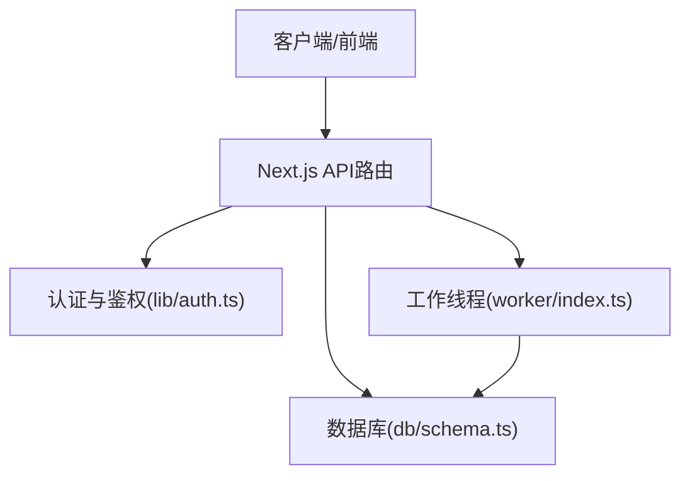
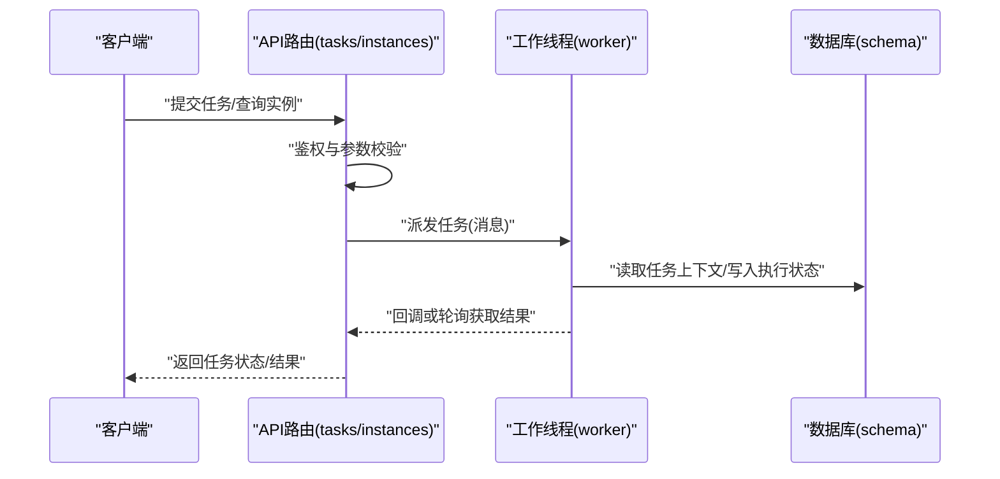
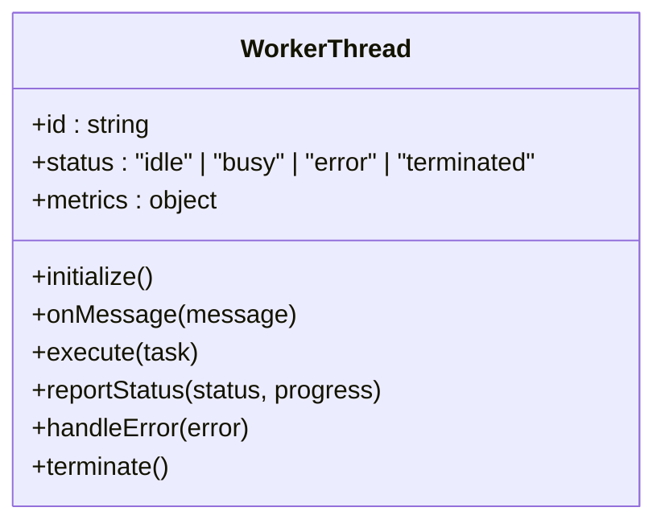
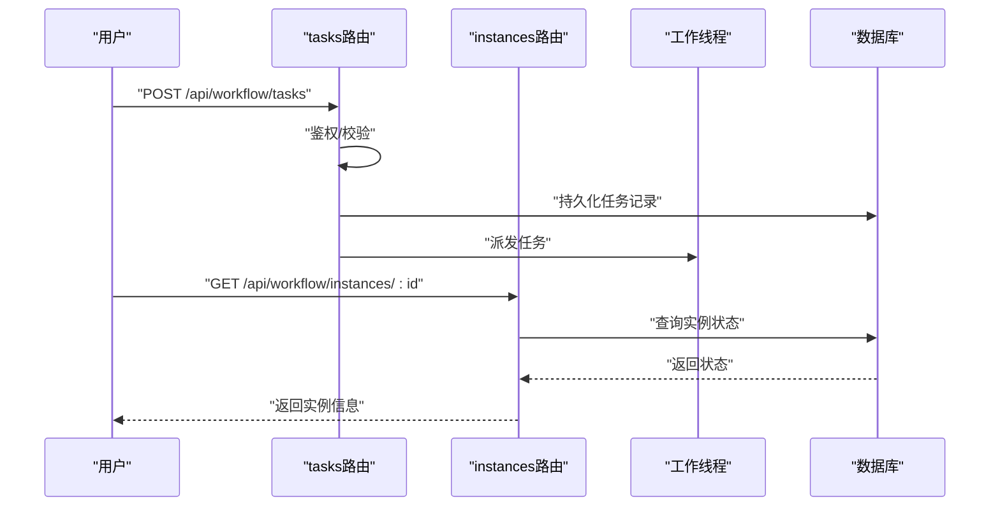
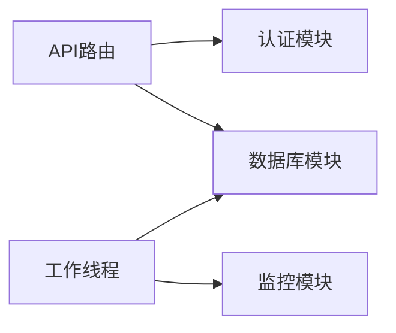

# 工作线程架构

<cite>
**本文引用的文件**   
- [worker/index.ts](file://worker/index.ts)
- [package.json](file://package.json)
- [next.config.ts](file://next.config.ts)
- [app/api/workflow/tasks/route.ts](file://app/api/workflow/tasks/route.ts)
- [app/api/workflow/instances/route.ts](file://app/api/workflow/instances/route.ts)
- [lib/auth.ts](file://lib/auth.ts)
- [db/schema.ts](file://db/schema.ts)
</cite>

## 目录
1. [简介](#简介)
2. [项目结构](#项目结构)
3. [核心组件](#核心组件)
4. [架构总览](#架构总览)
5. [详细组件分析](#详细组件分析)
6. [依赖分析](#依赖分析)
7. [性能考虑](#性能考虑)
8. [故障排查指南](#故障排查指南)
9. [结论](#结论)
10. [附录](#附录)

## 简介
本文件面向CS1学生事务管理系统的工作线程架构，聚焦基于Node.js Worker Threads的异步任务处理设计。文档涵盖任务队列、调度策略与负载均衡、工作线程生命周期管理、错误重试与状态同步、优先级处理、资源隔离、性能监控、分布式扩展、弹性伸缩与故障恢复，以及任务开发指南与调试工具使用建议。内容以仓库现有实现为基础进行归纳与可视化说明，帮助读者快速理解并高效扩展系统能力。

## 项目结构
本项目采用Next.js应用形态，API路由位于app/api下，工作线程入口位于worker/index.ts，数据库模式定义在db/schema.ts，认证与鉴权逻辑在lib/auth.ts，构建与运行时配置由next.config.ts与package.json管理。整体结构清晰，职责分离明确：
- API层负责请求接入、鉴权、参数校验与结果返回
- 工作线程层负责耗时任务的执行与状态上报
- 数据层通过Drizzle ORM与PostgreSQL交互
- 配置与部署脚本支撑生产环境运行

图表来源
- [worker/index.ts](file://worker/index.ts)
- [app/api/workflow/tasks/route.ts](file://app/api/workflow/tasks/route.ts)
- [lib/auth.ts](file://lib/auth.ts)
- [db/schema.ts](file://db/schema.ts)

章节来源
- [package.json](file://package.json)
- [next.config.ts](file://next.config.ts)

## 核心组件
- 工作线程入口：worker/index.ts，作为Worker Threads的独立进程，负责接收任务消息、执行任务、持久化状态与异常上报
- API路由：app/api/workflow/tasks/route.ts与app/api/workflow/instances/route.ts，提供任务提交、实例查询与状态同步接口
- 认证鉴权：lib/auth.ts，确保任务提交与查询的权限控制
- 数据模型：db/schema.ts，定义任务、实例等实体结构与约束

章节来源
- [worker/index.ts](file://worker/index.ts)
- [app/api/workflow/tasks/route.ts](file://app/api/workflow/tasks/route.ts)
- [app/api/workflow/instances/route.ts](file://app/api/workflow/instances/route.ts)
- [lib/auth.ts](file://lib/auth.ts)
- [db/schema.ts](file://db/schema.ts)

## 架构总览
下图展示了从API到工作线程再到数据库的整体调用链与数据流向，体现任务提交、调度、执行与状态回写的闭环流程。

图表来源
- [app/api/workflow/tasks/route.ts](file://app/api/workflow/tasks/route.ts)
- [app/api/workflow/instances/route.ts](file://app/api/workflow/instances/route.ts)
- [worker/index.ts](file://worker/index.ts)
- [db/schema.ts](file://db/schema.ts)

## 详细组件分析

### 工作线程入口（worker/index.ts）
- 职责：创建与管理Worker线程实例，监听主线程消息，执行具体任务逻辑，处理异常与重试，更新数据库状态
- 关键特性：
  - 生命周期：初始化、就绪、执行中、完成/失败、销毁
  - 错误重试：指数退避与最大重试次数限制
  - 状态同步：周期性上报执行进度与最终结果
  - 资源隔离：每个Worker独立内存空间，避免共享状态污染
  - 监控指标：CPU/内存占用、任务吞吐、失败率、平均时延

图表来源
- [worker/index.ts](file://worker/index.ts)

章节来源
- [worker/index.ts](file://worker/index.ts)

### 任务API路由（tasks与instances）
- tasks/route.ts：负责任务提交、参数校验、鉴权、入队与返回任务ID
- instances/route.ts：负责任务实例查询、状态同步、分页与过滤

图表来源
- [app/api/workflow/tasks/route.ts](file://app/api/workflow/tasks/route.ts)
- [app/api/workflow/instances/route.ts](file://app/api/workflow/instances/route.ts)
- [db/schema.ts](file://db/schema.ts)

章节来源
- [app/api/workflow/tasks/route.ts](file://app/api/workflow/tasks/route.ts)
- [app/api/workflow/instances/route.ts](file://app/api/workflow/instances/route.ts)

### 认证与鉴权（lib/auth.ts）
- 职责：验证请求身份、签发/校验令牌、控制访问权限
- 关键点：
  - 令牌有效期与会话管理
  - 角色与权限映射
  - 安全头与防重放机制

章节来源
- [lib/auth.ts](file://lib/auth.ts)

### 数据模型（db/schema.ts）
- 职责：定义任务、实例、用户等表结构与关系
- 关键点：
  - 字段类型与约束
  - 索引优化查询性能
  - 外键关联保证数据一致性

章节来源
- [db/schema.ts](file://db/schema.ts)

## 依赖分析
- 外部依赖：Next.js框架、Node.js Worker Threads、Drizzle ORM、PostgreSQL
- 内部依赖：API路由依赖认证模块与数据库模块；工作线程依赖数据库模块与日志/监控模块
- 耦合度：API与工作线程通过消息通信解耦；数据层统一由schema管理，降低耦合

图表来源
- [app/api/workflow/tasks/route.ts](file://app/api/workflow/tasks/route.ts)
- [app/api/workflow/instances/route.ts](file://app/api/workflow/instances/route.ts)
- [worker/index.ts](file://worker/index.ts)
- [lib/auth.ts](file://lib/auth.ts)
- [db/schema.ts](file://db/schema.ts)

章节来源
- [package.json](file://package.json)
- [next.config.ts](file://next.config.ts)

## 性能考虑
- 任务队列设计：建议使用内存队列+持久化队列混合方案，热点任务优先，冷任务延迟处理
- 调度策略：基于优先级的加权公平调度，避免饥饿现象
- 负载均衡：多Worker实例横向扩展，按CPU/内存利用率动态分配任务
- 资源隔离：每个Worker独立进程，避免内存泄漏影响全局
- 监控指标：QPS、P95/P99延迟、错误率、GC停顿时间、线程池大小
- 缓存策略：热点数据本地缓存，减少数据库压力

## 故障排查指南
- 常见问题：
  - 任务堆积：检查Worker数量与任务速率是否匹配
  - 内存溢出：查看Worker内存快照与垃圾回收频率
  - 数据库锁竞争：优化SQL与索引，减少长事务
  - 网络超时：调整超时阈值与重试策略
- 诊断工具：
  - Node.js内置profiler与heap snapshot
  - Prometheus+Grafana监控面板
  - ELK日志聚合与分析
- 恢复策略：
  - 自动重启失败Worker
  - 任务幂等性与补偿机制
  - 降级与熔断保护

## 结论
本工作线程架构通过清晰的职责分离与模块化设计，实现了高并发、高可用的异步任务处理能力。结合优先级调度、负载均衡与弹性伸缩策略，能够有效应对学生事务系统中的复杂业务场景。未来可进一步引入分布式任务队列与更细粒度的监控告警，提升系统的可扩展性与可观测性。

## 附录
- 任务开发指南：
  - 定义任务接口与数据结构
  - 实现任务执行逻辑与状态上报
  - 编写单元测试与集成测试
- 调试工具使用：
  - Chrome DevTools连接Worker调试
  - VS Code断点调试配置
  - 日志级别与采样策略设置
- 最佳实践：
  - 任务幂等性设计
  - 错误分类与告警规则
  - 容量规划与压测方法