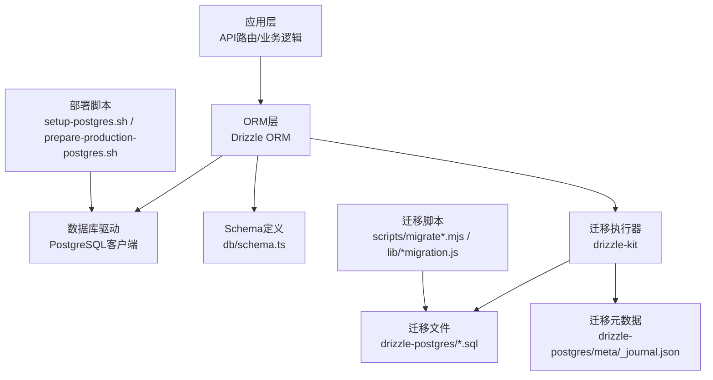
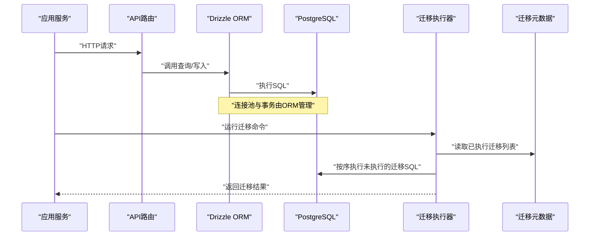
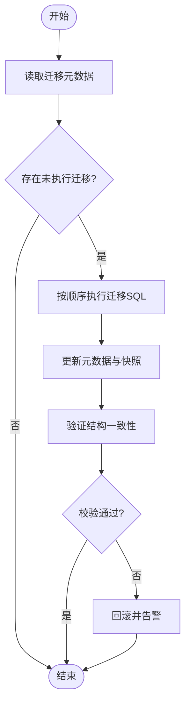
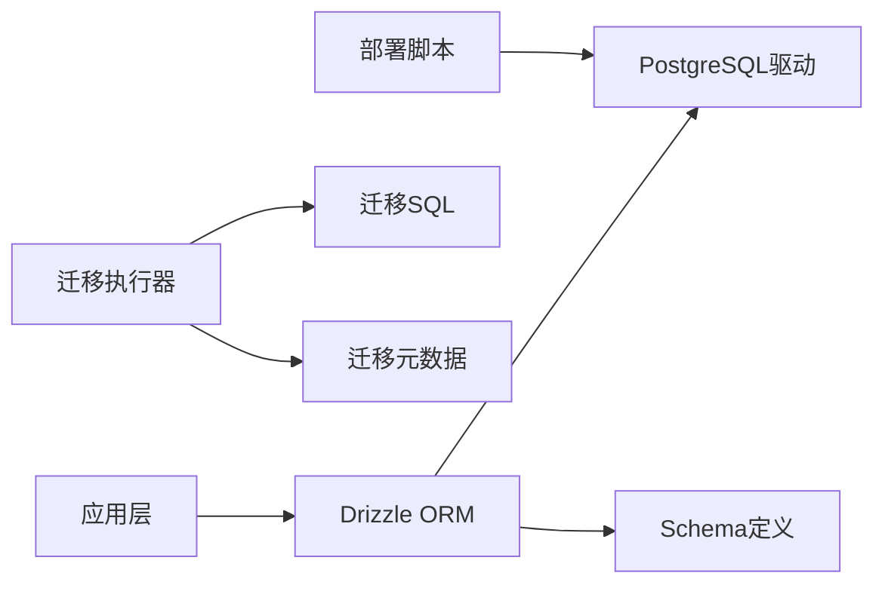

# 数据库架构

<cite>
**本文引用的文件**   
- [db/index.ts](file://db/index.ts)
- [db/schema.ts](file://db/schema.ts)
- [drizzle.config.ts](file://drizzle.config.ts)
- [drizzle-postgres/meta/_journal.json](file://drizzle-postgres/meta/_journal.json)
- [drizzle-postgres/0000_fine_psylocke.sql](file://drizzle-postgres/0000_fine_psylocke.sql)
- [drizzle-postgres/0001_thin_queen_noir.sql](file://drizzle-postgres/0001_thin_queen_noir.sql)
- [drizzle-postgres/0002_crazy_ravenous.sql](file://drizzle-postgres/0002_crazy_ravenous.sql)
- [drizzle-postgres/0003_fine_quentin_quire.sql](file://drizzle-postgres/0003_fine_quentin_quire.sql)
- [scripts/migrate.mjs](file://scripts/migrate.mjs)
- [scripts/migrate-sqlite-to-postgres.mjs](file://scripts/migrate-sqlite-to-postgres.mjs)
- [deploy/setup-postgres.sh](file://deploy/setup-postgres.sh)
- [deploy/prepare-production-postgres.sh](file://deploy/prepare-production-postgres.sh)
- [lib/sqlite-postgres-migration.js](file://lib/sqlite-postgres-migration.js)
- [tests/db/schema.test.ts](file://tests/db/schema.test.ts)
</cite>

## 目录
1. [简介](#简介)
2. [项目结构](#项目结构)
3. [核心组件](#核心组件)
4. [架构总览](#架构总览)
5. [详细组件分析](#详细组件分析)
6. [依赖关系分析](#依赖关系分析)
7. [性能与索引优化](#性能与索引优化)
8. [数据完整性、事务与并发控制](#数据完整性事务与并发控制)
9. [备份恢复与监控告警](#备份恢复与监控告警)
10. [容量规划](#容量规划)
11. [故障排查指南](#故障排查指南)
12. [结论](#结论)
13. [附录：迁移与版本管理](#附录迁移与版本管理)

## 简介
本文件面向CS1学生事务管理系统的数据库架构，聚焦基于Drizzle ORM的PostgreSQL设计。内容涵盖表结构与关系建模、Schema定义、索引与查询优化、数据完整性约束、事务与并发控制、备份恢复、监控告警与容量规划，以及数据迁移工具与版本管理策略。文档力求在技术深度与可读性之间取得平衡，帮助开发者与维护者快速理解并高效运维。

## 项目结构
与数据库相关的代码主要分布在以下位置：
- db: Drizzle ORM 的数据库连接与Schema定义
- drizzle-postgres: Drizzle 迁移SQL与元数据
- scripts: 迁移与种子脚本
- deploy: 生产环境PostgreSQL初始化与准备脚本
- lib: SQLite到PostgreSQL的迁移辅助脚本
- tests: Schema测试用例

图表来源
- [db/index.ts](file://db/index.ts)
- [db/schema.ts](file://db/schema.ts)
- [drizzle.config.ts](file://drizzle.config.ts)
- [drizzle-postgres/meta/_journal.json](file://drizzle-postgres/meta/_journal.json)
- [drizzle-postgres/0000_fine_psylocke.sql](file://drizzle-postgres/0000_fine_psylocke.sql)
- [drizzle-postgres/0001_thin_queen_noir.sql](file://drizzle-postgres/0001_thin_queen_noir.sql)
- [drizzle-postgres/0002_crazy_ravenous.sql](file://drizzle-postgres/0002_crazy_ravenous.sql)
- [drizzle-postgres/0003_fine_quentin_quire.sql](file://drizzle-postgres/0003_fine_quentin_quire.sql)
- [scripts/migrate.mjs](file://scripts/migrate.mjs)
- [scripts/migrate-sqlite-to-postgres.mjs](file://scripts/migrate-sqlite-to-postgres.mjs)
- [deploy/setup-postgres.sh](file://deploy/setup-postgres.sh)
- [deploy/prepare-production-postgres.sh](file://deploy/prepare-production-postgres.sh)

章节来源
- [db/index.ts](file://db/index.ts)
- [db/schema.ts](file://db/schema.ts)
- [drizzle.config.ts](file://drizzle.config.ts)

## 核心组件
- 数据库连接与配置
  - 通过db/index.ts建立PostgreSQL连接池与Drizzle实例，集中管理连接参数、超时与重试策略。
- Schema定义
  - 在db/schema.ts中以类型安全的方式声明表、字段、约束与索引，作为ORM与迁移的单一事实源。
- 迁移系统
  - 使用drizzle-kit生成与执行迁移，迁移SQL存放于drizzle-postgres目录，元数据记录于meta/_journal.json。
- 迁移与种子脚本
  - scripts/migrate.mjs用于常规迁移；scripts/migrate-sqlite-to-postgres.mjs与lib/sqlite-postgres-migration.js用于历史数据迁移。
- 部署与初始化
  - deploy/setup-postgres.sh与deploy/prepare-production-postgres.sh负责创建用户、数据库、扩展与权限。

章节来源
- [db/index.ts](file://db/index.ts)
- [db/schema.ts](file://db/schema.ts)
- [drizzle.config.ts](file://drizzle.config.ts)
- [drizzle-postgres/meta/_journal.json](file://drizzle-postgres/meta/_journal.json)
- [scripts/migrate.mjs](file://scripts/migrate.mjs)
- [scripts/migrate-sqlite-to-postgres.mjs](file://scripts/migrate-sqlite-to-postgres.mjs)
- [lib/sqlite-postgres-migration.js](file://lib/sqlite-postgres-migration.js)
- [deploy/setup-postgres.sh](file://deploy/setup-postgres.sh)
- [deploy/prepare-production-postgres.sh](file://deploy/prepare-production-postgres.sh)

## 架构总览
下图展示了从应用请求到数据库操作的完整链路，包括ORM层、迁移系统与部署初始化。

图表来源
- [db/index.ts](file://db/index.ts)
- [db/schema.ts](file://db/schema.ts)
- [drizzle.config.ts](file://drizzle.config.ts)
- [drizzle-postgres/meta/_journal.json](file://drizzle-postgres/meta/_journal.json)
- [scripts/migrate.mjs](file://scripts/migrate.mjs)

## 详细组件分析

### 数据库连接与ORM配置
- 连接池与超时
  - 通过环境变量或配置文件设置主机、端口、用户名、密码、数据库名与连接池大小，确保在高并发场景下稳定可用。
- 事务支持
  - 所有写操作建议包裹在事务中，保证原子性与一致性；长事务需避免持有锁过久。
- 错误处理
  - 统一捕获连接失败、查询异常与超时，提供可观测性日志与降级策略。

章节来源
- [db/index.ts](file://db/index.ts)
- [drizzle.config.ts](file://drizzle.config.ts)

### Schema定义与关系建模
- 表与字段
  - 以强类型方式定义主键、外键、唯一约束、非空约束与默认值，确保数据结构一致。
- 索引设计
  - 为高频查询条件列添加B-tree索引；对复合查询使用复合索引；避免过度索引影响写入性能。
- 关系建模
  - 使用外键约束维护实体间关系；合理拆分大表与关联表，减少跨表JOIN开销。

章节来源
- [db/schema.ts](file://db/schema.ts)
- [tests/db/schema.test.ts](file://tests/db/schema.test.ts)

### 迁移系统与版本管理
- 迁移文件组织
  - 每个变更对应一个SQL文件，命名包含序号与描述，便于追踪与回滚。
- 元数据与状态
  - _journal.json记录已执行迁移与快照，确保幂等与可重复部署。
- 执行流程
  - 启动时检查并执行未完成的迁移，保证数据库结构与代码同步。

图表来源
- [drizzle-postgres/meta/_journal.json](file://drizzle-postgres/meta/_journal.json)
- [drizzle-postgres/0000_fine_psylocke.sql](file://drizzle-postgres/0000_fine_psylocke.sql)
- [drizzle-postgres/0001_thin_queen_noir.sql](file://drizzle-postgres/0001_thin_queen_noir.sql)
- [drizzle-postgres/0002_crazy_ravenous.sql](file://drizzle-postgres/0002_crazy_ravenous.sql)
- [drizzle-postgres/0003_fine_quentin_quire.sql](file://drizzle-postgres/0003_fine_quentin_quire.sql)
- [scripts/migrate.mjs](file://scripts/migrate.mjs)

章节来源
- [drizzle-postgres/meta/_journal.json](file://drizzle-postgres/meta/_journal.json)
- [scripts/migrate.mjs](file://scripts/migrate.mjs)

### 历史数据迁移（SQLite到PostgreSQL）
- 迁移目标
  - 将现有SQLite数据无损迁移至PostgreSQL，保持数据类型与约束语义一致。
- 迁移步骤
  - 导出SQLite数据，转换类型与约束，批量导入PostgreSQL，校验行数与关键指标。
- 回滚策略
  - 保留原始SQLite快照，迁移失败时快速回滚并恢复服务。

章节来源
- [scripts/migrate-sqlite-to-postgres.mjs](file://scripts/migrate-sqlite-to-postgres.mjs)
- [lib/sqlite-postgres-migration.js](file://lib/sqlite-postgres-migration.js)

### 部署与初始化
- 数据库用户与权限
  - 创建专用数据库用户，最小权限原则分配读写权限。
- 扩展与配置
  - 启用必要的PostgreSQL扩展（如uuid-ossp），调整内存与工作进程参数。
- 健康检查
  - 启动后执行简单查询验证连通性与Schema版本。

章节来源
- [deploy/setup-postgres.sh](file://deploy/setup-postgres.sh)
- [deploy/prepare-production-postgres.sh](file://deploy/prepare-production-postgres.sh)

## 依赖关系分析
- 模块耦合
  - 应用层依赖ORM层，ORM层依赖PostgreSQL驱动；迁移系统独立但共享Schema定义。
- 外部依赖
  - Drizzle ORM、drizzle-kit、PostgreSQL客户端库。
- 潜在循环依赖
  - 通过分层与接口隔离避免循环引用；迁移脚本不反向依赖应用逻辑。

图表来源
- [db/index.ts](file://db/index.ts)
- [db/schema.ts](file://db/schema.ts)
- [drizzle.config.ts](file://drizzle.config.ts)
- [drizzle-postgres/meta/_journal.json](file://drizzle-postgres/meta/_journal.json)
- [scripts/migrate.mjs](file://scripts/migrate.mjs)

章节来源
- [db/index.ts](file://db/index.ts)
- [db/schema.ts](file://db/schema.ts)
- [drizzle.config.ts](file://drizzle.config.ts)
- [drizzle-postgres/meta/_journal.json](file://drizzle-postgres/meta/_journal.json)
- [scripts/migrate.mjs](file://scripts/migrate.mjs)

## 性能与索引优化
- 索引策略
  - 针对WHERE、JOIN、ORDER BY常用列建立索引；复合索引遵循最左前缀原则。
  - 定期分析慢查询，评估索引选择性，删除冗余索引。
- 查询优化
  - 避免SELECT *，仅选择必要字段；合理使用分页与限制返回行数。
  - 将复杂计算下沉到数据库层，减少应用侧处理。
- 连接池与缓存
  - 根据CPU核数与I/O能力调优连接池大小；对热点读数据引入应用级缓存。
- 监控与诊断
  - 启用pg_stat_statements统计慢查询；结合EXPLAIN ANALYZE定位瓶颈。

[本节为通用指导，不直接分析具体文件]

## 数据完整性、事务与并发控制
- 完整性约束
  - 使用NOT NULL、UNIQUE、CHECK与外键约束保障数据质量与关系一致性。
- 事务处理
  - 写操作必须包裹在事务中；长事务拆分为短事务，降低锁竞争。
- 并发控制
  - 利用行级锁与MVCC机制避免脏读；必要时使用SELECT FOR UPDATE进行悲观锁。
- 幂等设计
  - 写入接口具备幂等键，防止重复提交导致数据不一致。

章节来源
- [db/schema.ts](file://db/schema.ts)
- [db/index.ts](file://db/index.ts)

## 备份恢复与监控告警
- 备份策略
  - 全量备份每日一次，增量备份每小时一次；异地多副本存储。
  - 使用pg_dump与pg_basebackup组合，确保一致性。
- 恢复演练
  - 定期在预发环境演练恢复流程，验证RTO/RPO目标。
- 监控告警
  - 监控连接数、锁等待、慢查询、磁盘空间与复制延迟；阈值触发告警。
- 审计与合规
  - 开启审计日志，记录敏感操作；满足合规要求。

[本节为通用指导，不直接分析具体文件]

## 容量规划
- 存储容量
  - 预估数据增长速率，预留3-6个月缓冲；分区与归档冷热数据。
- 计算资源
  - 根据QPS与延迟目标规划CPU与内存；读写分离提升吞吐。
- 网络与IO
  - 评估磁盘IOPS与带宽；SSD优先，RAID级别按需选择。
- 弹性伸缩
  - 容器化部署，自动扩缩容；数据库采用托管服务或主从集群。

[本节为通用指导，不直接分析具体文件]

## 故障排查指南
- 常见问题
  - 连接池耗尽：检查连接泄漏与长事务；增加池大小或优化查询。
  - 死锁：分析锁等待图，缩短事务，调整访问顺序。
  - 迁移失败：核对迁移元数据与SQL语法；回滚到上一版本。
- 诊断工具
  - 使用EXPLAIN ANALYZE分析执行计划；查看pg_stat_activity与pg_locks。
- 日志与追踪
  - 统一结构化日志，关联请求ID；关键路径埋点。

章节来源
- [tests/db/schema.test.ts](file://tests/db/schema.test.ts)
- [scripts/migrate.mjs](file://scripts/migrate.mjs)

## 结论
本架构以Drizzle ORM为核心，结合PostgreSQL的强大能力，构建了高可靠、可扩展的学生事务管理系统数据库方案。通过严格的Schema定义、完善的迁移体系与全面的运维策略，确保系统在演进过程中保持稳定与高性能。建议持续监控与优化，逐步完善备份与容灾能力，支撑业务持续增长。

[本节为总结性内容，不直接分析具体文件]

## 附录：迁移与版本管理
- 迁移规范
  - 每次变更生成独立迁移文件，包含清晰的描述与回滚逻辑。
- 版本控制
  - 迁移文件纳入Git版本管理；禁止修改已发布迁移，新增变更以新文件形式追加。
- 自动化流水线
  - CI/CD中集成迁移校验与执行；失败阻断部署。
- 数据一致性
  - 迁移前后执行一致性校验脚本，确保数据完整与正确。

章节来源
- [drizzle-postgres/meta/_journal.json](file://drizzle-postgres/meta/_journal.json)
- [scripts/migrate.mjs](file://scripts/migrate.mjs)
- [scripts/migrate-sqlite-to-postgres.mjs](file://scripts/migrate-sqlite-to-postgres.mjs)
- [lib/sqlite-postgres-migration.js](file://lib/sqlite-postgres-migration.js)