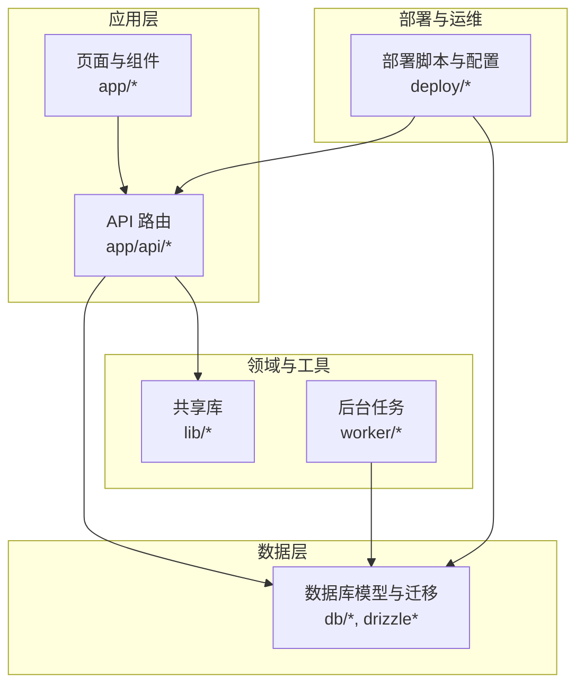
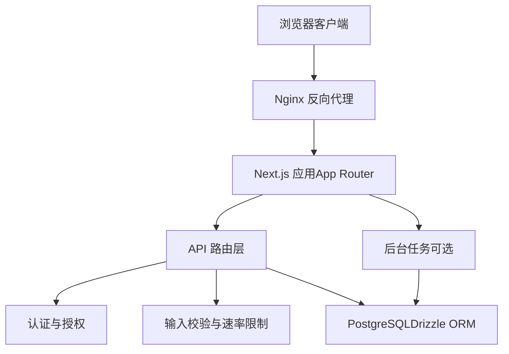
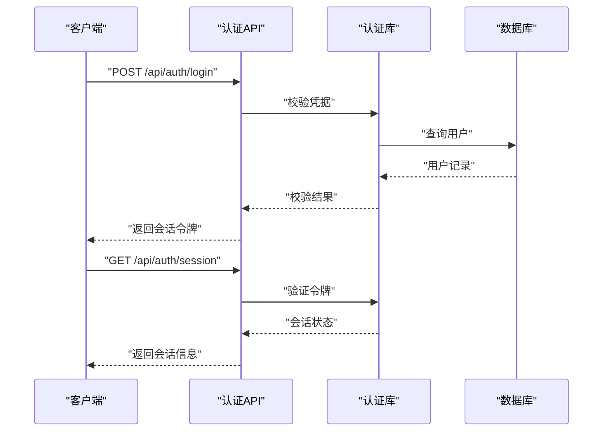
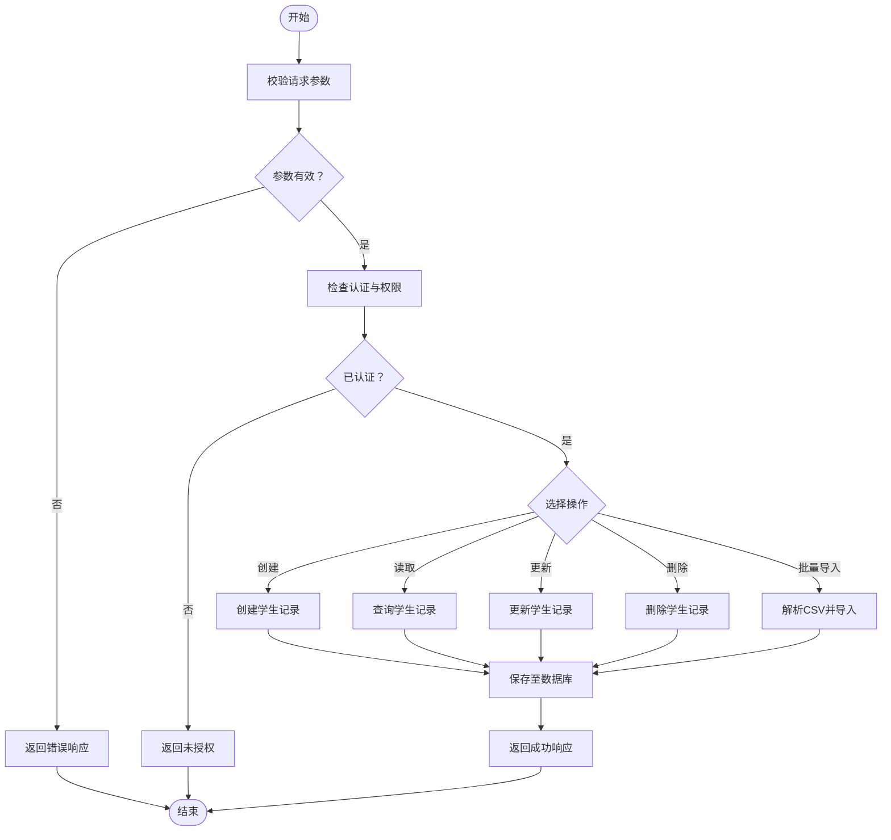
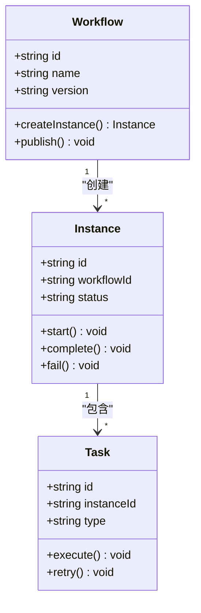
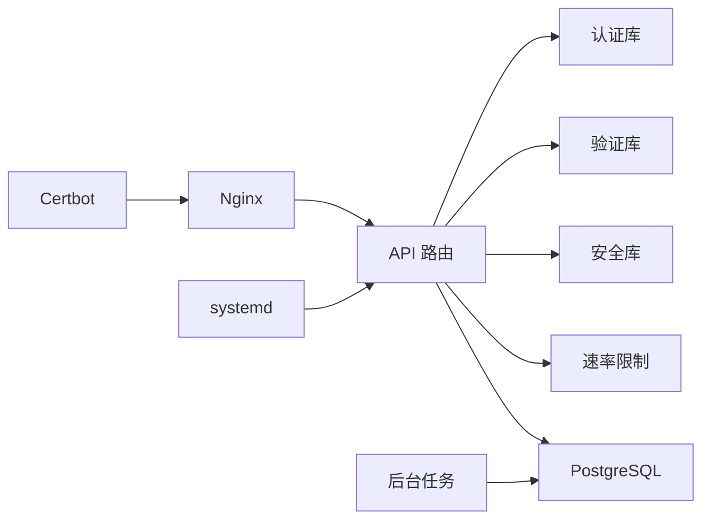
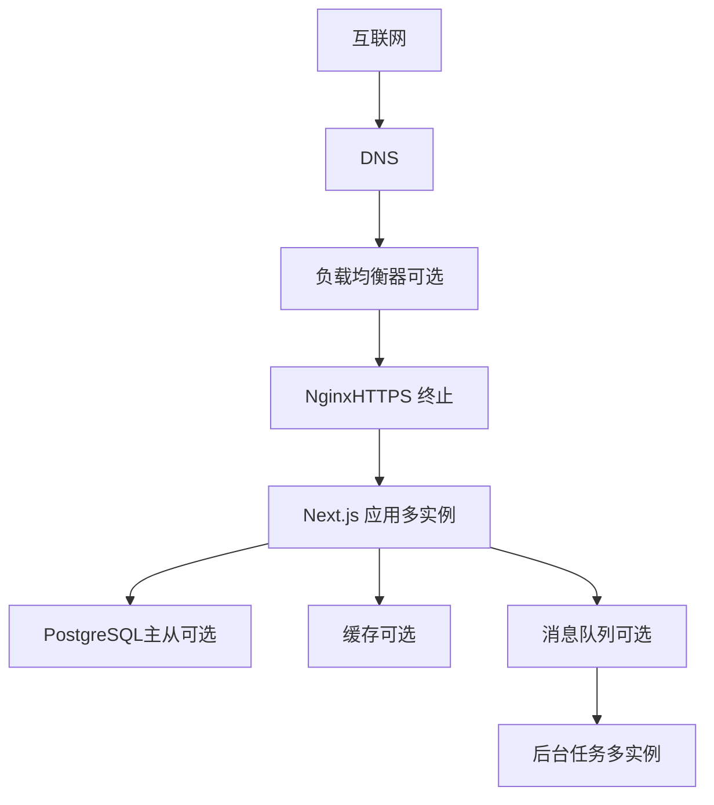

# 系统架构

<cite>
**本文引用的文件**   
- [README.md](file://README.md)
- [package.json](file://package.json)
- [next.config.ts](file://next.config.ts)
- [app/layout.tsx](file://app/layout.tsx)
- [app/page.tsx](file://app/page.tsx)
- [app/StudentAffairsApp.tsx](file://app/StudentAffairsApp.tsx)
- [app/WorkflowDesignModule.tsx](file://app/WorkflowDesignModule.tsx)
- [db/index.ts](file://db/index.ts)
- [db/schema.ts](file://db/schema.ts)
- [drizzle.config.ts](file://drizzle.config.ts)
- [lib/auth.ts](file://lib/auth.ts)
- [lib/security.ts](file://lib/security.ts)
- [lib/validation.ts](file://lib/validation.ts)
- [lib/rate-limit.ts](file://lib/rate-limit.ts)
- [worker/index.ts](file://worker/index.ts)
- [deploy/cs1.service](file://deploy/cs1.service)
- [deploy/nginx.conf](file://deploy/nginx.conf)
- [deploy/prepare-production-postgres.sh](file://deploy/prepare-production-postgres.sh)
- [deploy/setup-postgres.sh](file://deploy/setup-postgres.sh)
- [app/api/auth/login/route.ts](file://app/api/auth/login/route.ts)
- [app/api/auth/session/route.ts](file://app/api/auth/session/route.ts)
- [app/api/students/route.ts](file://app/api/students/route.ts)
- [app/api/students/[id]/route.ts](file://app/api/students/[id]/route.ts)
- [app/api/workflows/route.ts](file://app/api/workflows/route.ts)
- [app/api/workflow/instances/route.ts](file://app/api/workflow/instances/route.ts)
- [app/api/workflow/tasks/route.ts](file://app/api/workflow/tasks/route.ts)
</cite>

## 目录
1. [简介](#简介)
2. [项目结构](#项目结构)
3. [核心组件](#核心组件)
4. [架构总览](#架构总览)
5. [详细组件分析](#详细组件分析)
6. [依赖关系分析](#依赖关系分析)
7. [性能考虑](#性能考虑)
8. [故障排查指南](#故障排查指南)
9. [结论](#结论)
10. [附录](#附录)

## 简介
本文件为 CS1 学生事务管理系统的架构文档，面向初学者与工程人员，旨在以循序渐进的方式说明系统的高层设计、架构模式、系统边界、组件交互、数据流与集成方式。文档同时覆盖技术决策与权衡、基础设施需求、可扩展性、部署拓扑，以及安全性、监控与灾难恢复等横切关注点，并记录技术栈、第三方依赖与版本兼容性。

## 项目结构
系统采用 Next.js App Router 组织前后端代码：前端页面与组件位于 app 目录；服务端 API 路由通过 app/api 暴露；数据库模型与迁移由 Drizzle ORM 管理；部署脚本与 Nginx 配置位于 deploy；后台任务与异步处理由 worker 提供。整体遵循“功能域 + 分层”的组织方式，API 路由按领域划分（认证、学生、工作流等），共享逻辑集中在 lib 目录。

图表来源
- [app/layout.tsx:1-200](file://app/layout.tsx#L1-L200)
- [app/page.tsx:1-200](file://app/page.tsx#L1-L200)
- [db/index.ts:1-200](file://db/index.ts#L1-L200)
- [db/schema.ts:1-200](file://db/schema.ts#L1-L200)
- [deploy/nginx.conf:1-200](file://deploy/nginx.conf#L1-L200)

章节来源
- [README.md:1-200](file://README.md#L1-L200)
- [package.json:1-200](file://package.json#L1-L200)
- [next.config.ts:1-200](file://next.config.ts#L1-L200)

## 核心组件
- 应用入口与布局
  - 页面与布局负责渲染主界面、挂载全局样式与上下文，承载学生与工作流模块的导航与容器。
- API 路由层
  - 认证：登录与会话校验。
  - 学生：学生信息 CRUD、批量导入、关联用户。
  - 工作流：流程定义、实例与任务管理。
- 数据访问层
  - 使用 Drizzle ORM 进行类型安全的数据库操作，配合迁移脚本管理 schema 演进。
- 安全与验证
  - 鉴权、权限控制、输入校验、速率限制与安全头设置。
- 后台任务
  - 异步处理耗时任务（如批量导入、通知发送）。
- 部署与运维
  - Nginx 反向代理、HTTPS 证书续期、PostgreSQL 初始化与生产环境准备。

章节来源
- [app/StudentAffairsApp.tsx:1-200](file://app/StudentAffairsApp.tsx#L1-L200)
- [app/WorkflowDesignModule.tsx:1-200](file://app/WorkflowDesignModule.tsx#L1-L200)
- [app/api/auth/login/route.ts:1-200](file://app/api/auth/login/route.ts#L1-L200)
- [app/api/auth/session/route.ts:1-200](file://app/api/auth/session/route.ts#L1-L200)
- [app/api/students/route.ts:1-200](file://app/api/students/route.ts#L1-L200)
- [app/api/students/[id]/route.ts:1-200](file://app/api/students/[id]/route.ts#L1-L200)
- [app/api/workflows/route.ts:1-200](file://app/api/workflows/route.ts#L1-L200)
- [app/api/workflow/instances/route.ts:1-200](file://app/api/workflow/instances/route.ts#L1-L200)
- [app/api/workflow/tasks/route.ts:1-200](file://app/api/workflow/tasks/route.ts#L1-L200)
- [db/index.ts:1-200](file://db/index.ts#L1-L200)
- [db/schema.ts:1-200](file://db/schema.ts#L1-L200)
- [lib/auth.ts:1-200](file://lib/auth.ts#L1-L200)
- [lib/security.ts:1-200](file://lib/security.ts#L1-L200)
- [lib/validation.ts:1-200](file://lib/validation.ts#L1-L200)
- [lib/rate-limit.ts:1-200](file://lib/rate-limit.ts#L1-L200)
- [worker/index.ts:1-200](file://worker/index.ts#L1-L200)
- [deploy/cs1.service:1-200](file://deploy/cs1.service#L1-L200)
- [deploy/nginx.conf:1-200](file://deploy/nginx.conf#L1-L200)
- [deploy/prepare-production-postgres.sh:1-200](file://deploy/prepare-production-postgres.sh#L1-L200)
- [deploy/setup-postgres.sh:1-200](file://deploy/setup-postgres.sh#L1-L200)

## 架构总览
系统采用前后端一体化（Next.js）与 API 路由分离的设计，前端通过 React 组件渲染页面，后端通过 API 路由提供服务。数据持久化使用 PostgreSQL，借助 Drizzle ORM 进行类型安全的数据访问。Nginx 作为反向代理与 HTTPS 终止点，服务进程由 systemd 管理，证书由 Certbot 自动续期。

图表来源
- [deploy/nginx.conf:1-200](file://deploy/nginx.conf#L1-L200)
- [deploy/cs1.service:1-200](file://deploy/cs1.service#L1-L200)
- [app/api/auth/login/route.ts:1-200](file://app/api/auth/login/route.ts#L1-L200)
- [lib/auth.ts:1-200](file://lib/auth.ts#L1-L200)
- [lib/validation.ts:1-200](file://lib/validation.ts#L1-L200)
- [lib/rate-limit.ts:1-200](file://lib/rate-limit.ts#L1-L200)
- [db/index.ts:1-200](file://db/index.ts#L1-L200)
- [worker/index.ts:1-200](file://worker/index.ts#L1-L200)

## 详细组件分析

### 认证与会话
- 登录流程：客户端提交用户名与密码，API 路由调用认证库进行校验，成功后生成会话令牌并返回。
- 会话校验：后续请求携带会话令牌，API 路由或中间件校验有效性，决定访问权限。
- 安全策略：密码哈希、最小权限原则、敏感头设置、速率限制与防暴力破解。

图表来源
- [app/api/auth/login/route.ts:1-200](file://app/api/auth/login/route.ts#L1-L200)
- [app/api/auth/session/route.ts:1-200](file://app/api/auth/session/route.ts#L1-L200)
- [lib/auth.ts:1-200](file://lib/auth.ts#L1-L200)
- [db/index.ts:1-200](file://db/index.ts#L1-L200)

章节来源
- [app/api/auth/login/route.ts:1-200](file://app/api/auth/login/route.ts#L1-L200)
- [app/api/auth/session/route.ts:1-200](file://app/api/auth/session/route.ts#L1-L200)
- [lib/auth.ts:1-200](file://lib/auth.ts#L1-L200)

### 学生管理
- 学生 CRUD：提供学生信息的增删改查接口，支持按 ID 获取与更新。
- 批量导入：通过 CSV 导入学生数据，包含数据清洗、去重与错误报告。
- 用户关联：将学生与系统用户账户关联，实现统一身份管理。

图表来源
- [app/api/students/route.ts:1-200](file://app/api/students/route.ts#L1-L200)
- [app/api/students/[id]/route.ts:1-200](file://app/api/students/[id]/route.ts#L1-L200)
- [lib/validation.ts:1-200](file://lib/validation.ts#L1-L200)
- [db/schema.ts:1-200](file://db/schema.ts#L1-L200)

章节来源
- [app/api/students/route.ts:1-200](file://app/api/students/route.ts#L1-L200)
- [app/api/students/[id]/route.ts:1-200](file://app/api/students/[id]/route.ts#L1-L200)
- [lib/validation.ts:1-200](file://lib/validation.ts#L1-L200)

### 工作流引擎
- 流程定义：可视化设计与发布工作流模板。
- 实例管理：根据模板创建工作流实例，跟踪生命周期。
- 任务调度：分配与执行任务节点，支持回调与重试。

图表来源
- [app/api/workflows/route.ts:1-200](file://app/api/workflows/route.ts#L1-L200)
- [app/api/workflow/instances/route.ts:1-200](file://app/api/workflow/instances/route.ts#L1-L200)
- [app/api/workflow/tasks/route.ts:1-200](file://app/api/workflow/tasks/route.ts#L1-L200)
- [db/schema.ts:1-200](file://db/schema.ts#L1-L200)

章节来源
- [app/api/workflows/route.ts:1-200](file://app/api/workflows/route.ts#L1-L200)
- [app/api/workflow/instances/route.ts:1-200](file://app/api/workflow/instances/route.ts#L1-L200)
- [app/api/workflow/tasks/route.ts:1-200](file://app/api/workflow/tasks/route.ts#L1-L200)

### 安全与合规
- 认证与授权：基于会话令牌的身份验证与细粒度权限控制。
- 输入校验：严格校验所有外部输入，防止注入与非法数据。
- 速率限制：对关键接口实施限流，抵御滥用与攻击。
- 安全头：启用 CSP、HSTS、X-Frame-Options 等安全响应头。

章节来源
- [lib/auth.ts:1-200](file://lib/auth.ts#L1-L200)
- [lib/security.ts:1-200](file://lib/security.ts#L1-L200)
- [lib/validation.ts:1-200](file://lib/validation.ts#L1-L200)
- [lib/rate-limit.ts:1-200](file://lib/rate-limit.ts#L1-L200)

### 数据模型与迁移
- 模型定义：使用 Drizzle Schema 定义表结构与关系。
- 迁移管理：通过迁移脚本逐步演进数据库结构，确保一致性。
- 连接管理：集中管理数据库连接池与事务。

章节来源
- [db/schema.ts:1-200](file://db/schema.ts#L1-L200)
- [db/index.ts:1-200](file://db/index.ts#L1-L200)
- [drizzle.config.ts:1-200](file://drizzle.config.ts#L1-L200)

### 后台任务与异步处理
- 任务队列：将耗时操作放入队列，避免阻塞请求。
- 重试机制：失败任务自动重试，提高可靠性。
- 监控与日志：记录任务执行状态与异常，便于追踪。

章节来源
- [worker/index.ts:1-200](file://worker/index.ts#L1-L200)

## 依赖关系分析
系统依赖关系清晰，API 路由依赖认证、验证与安全库，数据访问依赖 Drizzle ORM 与 PostgreSQL。部署层依赖 Nginx、systemd 与 Certbot。

图表来源
- [app/api/auth/login/route.ts:1-200](file://app/api/auth/login/route.ts#L1-L200)
- [lib/auth.ts:1-200](file://lib/auth.ts#L1-L200)
- [lib/validation.ts:1-200](file://lib/validation.ts#L1-L200)
- [lib/security.ts:1-200](file://lib/security.ts#L1-L200)
- [lib/rate-limit.ts:1-200](file://lib/rate-limit.ts#L1-L200)
- [db/index.ts:1-200](file://db/index.ts#L1-L200)
- [deploy/nginx.conf:1-200](file://deploy/nginx.conf#L1-L200)
- [deploy/cs1.service:1-200](file://deploy/cs1.service#L1-L200)

章节来源
- [package.json:1-200](file://package.json#L1-L200)
- [next.config.ts:1-200](file://next.config.ts#L1-L200)

## 性能考虑
- 数据库优化：合理索引、连接池配置与查询优化。
- 缓存策略：对热点数据实施缓存，减少数据库压力。
- 异步处理：将耗时任务移至后台，提升响应速度。
- 资源限制：设置合理的内存与 CPU 限制，防止资源耗尽。

[本节为通用指导，无需特定文件引用]

## 故障排查指南
- 认证失败：检查会话令牌、密码哈希与用户状态。
- 数据库连接：验证连接字符串、权限与网络连通性。
- API 错误：查看请求参数、输入校验与业务逻辑。
- 部署问题：检查 Nginx 配置、证书状态与服务运行状态。

章节来源
- [lib/auth.ts:1-200](file://lib/auth.ts#L1-L200)
- [lib/security.ts:1-200](file://lib/security.ts#L1-L200)
- [deploy/nginx.conf:1-200](file://deploy/nginx.conf#L1-L200)
- [deploy/cs1.service:1-200](file://deploy/cs1.service#L1-L200)

## 结论
CS1 学生事务管理系统采用现代化全栈架构，具备清晰的职责分离、类型安全的数据访问与完善的部署方案。通过模块化设计与横切关注点的系统化处理，系统在可维护性、可扩展性与安全性方面表现良好。建议在生产环境中加强监控与告警，持续优化性能与用户体验。

[本节为总结性内容，无需特定文件引用]

## 附录

### 技术栈与依赖
- 前端框架：Next.js（App Router）、React
- 后端运行时：Node.js
- 数据库：PostgreSQL
- ORM：Drizzle ORM
- 部署：Nginx、systemd、Certbot
- 测试：Vitest

章节来源
- [package.json:1-200](file://package.json#L1-L200)
- [next.config.ts:1-200](file://next.config.ts#L1-L200)
- [drizzle.config.ts:1-200](file://drizzle.config.ts#L1-L200)

### 基础设施需求
- 服务器：Linux 发行版，安装 Node.js、Nginx、PostgreSQL
- 证书：Let's Encrypt 证书，Certbot 自动续期
- 服务管理：systemd 单元文件管理服务进程
- 环境变量：数据库连接、密钥与配置项

章节来源
- [deploy/setup-postgres.sh:1-200](file://deploy/setup-postgres.sh#L1-L200)
- [deploy/prepare-production-postgres.sh:1-200](file://deploy/prepare-production-postgres.sh#L1-L200)
- [deploy/cs1.service:1-200](file://deploy/cs1.service#L1-L200)
- [deploy/nginx.conf:1-200](file://deploy/nginx.conf#L1-L200)

### 部署拓扑

[此图为概念性拓扑，不直接映射具体文件，故无图表来源]

### 版本兼容性
- Node.js：建议使用 LTS 版本
- PostgreSQL：推荐 14+ 版本
- Drizzle ORM：与 TypeScript 与 Node.js 版本兼容
- Nginx：稳定版本即可

章节来源
- [package.json:1-200](file://package.json#L1-L200)
- [drizzle.config.ts:1-200](file://drizzle.config.ts#L1-L200)