# 集成模式

<cite>
**本文引用的文件**   
- [README.md](file://README.md)
- [package.json](file://package.json)
- [next.config.ts](file://next.config.ts)
- [app/layout.tsx](file://app/layout.tsx)
- [app/page.tsx](file://app/page.tsx)
- [app/StudentAffairsApp.tsx](file://app/StudentAffairsApp.tsx)
- [lib/api.ts](file://lib/api.ts)
- [lib/auth.ts](file://lib/auth.ts)
- [lib/security.ts](file://lib/security.ts)
- [lib/rate-limit.ts](file://lib/rate-limit.ts)
- [db/index.ts](file://db/index.ts)
- [db/schema.ts](file://db/schema.ts)
- [drizzle.config.ts](file://drizzle.config.ts)
- [worker/index.ts](file://worker/index.ts)
- [deploy/nginx.conf](file://deploy/nginx.conf)
- [deploy/cs1.service](file://deploy/cs1.service)
- [deploy/prepare-production-postgres.sh](file://deploy/prepare-production-postgres.sh)
- [scripts/migrate.mjs](file://scripts/migrate.mjs)
- [tests/api-integration.test.mjs](file://tests/api-integration.test.mjs)
- [tests/backend.test.mjs](file://tests/backend.test.mjs)
- [tests/lib/api.test.ts](file://tests/lib/api.test.ts)
</cite>

## 目录
1. [简介](#简介)
2. [项目结构](#项目结构)
3. [核心组件](#核心组件)
4. [架构总览](#架构总览)
5. [详细组件分析](#详细组件分析)
6. [依赖关系分析](#依赖关系分析)
7. [性能考虑](#性能考虑)
8. [故障排查指南](#故障排查指南)
9. [结论](#结论)
10. [附录](#附录)

## 简介
本文件面向CS1学生事务管理系统的“集成模式”，聚焦系统内外部服务的集成架构与实现要点，涵盖：
- 第三方API集成（HTTP/REST、鉴权、限流）
- 消息队列与事件驱动（后台任务、异步处理）
- 微服务间通信协议、数据同步策略与服务发现
- 配置管理、环境变量与密钥存储
- 服务网格、API网关与负载均衡
- 集成测试策略、Mock服务与降级方案

本仓库采用Next.js全栈应用形态，后端以API路由组织业务接口，数据库使用Drizzle ORM与PostgreSQL，部署通过Nginx反向代理与systemd服务管理。整体集成以HTTP为主，辅以后台Worker进行异步任务处理，并通过环境变量与脚本完成配置与迁移。

## 项目结构
从集成视角看，关键目录与职责如下：
- app/api：Next.js API路由，承载对外HTTP接口（认证、学生、工作流、通知等）
- lib：共享库（API客户端封装、鉴权、安全、限流、校验）
- db：数据库连接与Schema定义
- worker：后台任务入口（用于消息队列/异步处理）
- deploy：生产部署相关（Nginx、systemd、初始化脚本）
- scripts：数据迁移与种子脚本
- tests：单元测试与集成测试

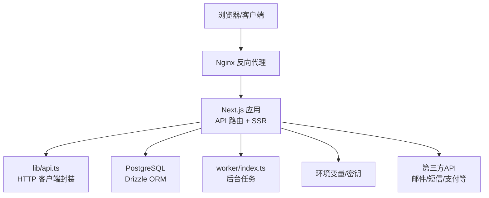

图表来源
- [deploy/nginx.conf](file://deploy/nginx.conf)
- [app/page.tsx](file://app/page.tsx)
- [lib/api.ts](file://lib/api.ts)
- [db/index.ts](file://db/index.ts)
- [worker/index.ts](file://worker/index.ts)

章节来源
- [README.md](file://README.md)
- [package.json](file://package.json)
- [next.config.ts](file://next.config.ts)

## 核心组件
- API层（app/api/*）：按功能域划分的路由处理器，提供RESTful接口，统一鉴权与输入校验。
- 共享库（lib/*）：
  - api.ts：统一的HTTP请求封装，负责基础URL、超时、重试、错误处理。
  - auth.ts：会话与鉴权逻辑（如JWT或Session）。
  - security.ts：安全相关工具（签名、加密、敏感信息处理）。
  - rate-limit.ts：接口限流，保护下游与数据库。
- 数据层（db/*）：Drizzle ORM连接与Schema定义，配合迁移脚本保证一致性。
- 后台任务（worker/index.ts）：异步处理长耗时任务（如批量导入、报表生成），可对接消息队列。
- 部署与网关（deploy/*）：Nginx作为API网关与负载均衡器，systemd管理服务进程。

章节来源
- [lib/api.ts](file://lib/api.ts)
- [lib/auth.ts](file://lib/auth.ts)
- [lib/security.ts](file://lib/security.ts)
- [lib/rate-limit.ts](file://lib/rate-limit.ts)
- [db/index.ts](file://db/index.ts)
- [db/schema.ts](file://db/schema.ts)
- [worker/index.ts](file://worker/index.ts)
- [deploy/nginx.conf](file://deploy/nginx.conf)

## 架构总览
系统采用“前端+Next.js API网关+数据库+后台任务”的轻量微服务化架构。Nginx承担反向代理与静态资源缓存；Next.js暴露API路由；数据库通过ORM访问；后台Worker处理异步任务。第三方服务通过HTTP调用接入，必要时通过消息队列解耦。

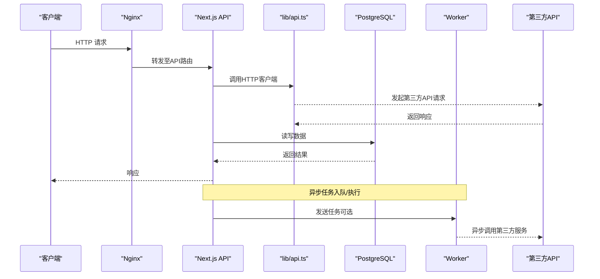

图表来源
- [deploy/nginx.conf](file://deploy/nginx.conf)
- [app/page.tsx](file://app/page.tsx)
- [lib/api.ts](file://lib/api.ts)
- [db/index.ts](file://db/index.ts)
- [worker/index.ts](file://worker/index.ts)

## 详细组件分析

### API网关与反向代理（Nginx）
- 作用：统一入口、TLS终止、静态资源缓存、请求路由、限流与访问控制。
- 关键点：
  - 将 /api/* 转发到Next.js应用
  - 健康检查与负载均衡（多实例部署时）
  - 日志与监控接入

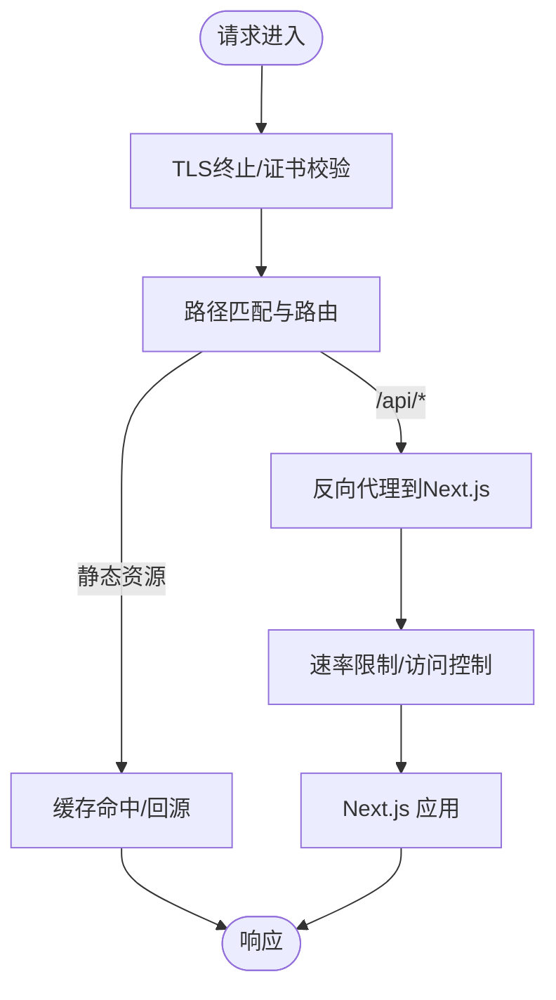

图表来源
- [deploy/nginx.conf](file://deploy/nginx.conf)

章节来源
- [deploy/nginx.conf](file://deploy/nginx.conf)

### Next.js API路由与鉴权
- 路由组织：按功能模块划分（auth、students、workflow、notifications等）
- 鉴权流程：统一鉴权中间件，校验会话/JWT，注入用户上下文
- 输入校验：基于schema验证，确保数据一致性

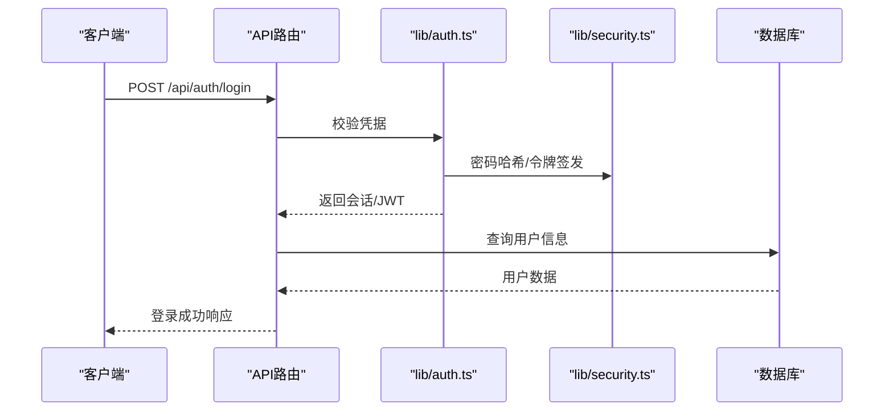

图表来源
- [lib/auth.ts](file://lib/auth.ts)
- [lib/security.ts](file://lib/security.ts)

章节来源
- [lib/auth.ts](file://lib/auth.ts)
- [lib/security.ts](file://lib/security.ts)

### HTTP客户端与第三方API集成（lib/api.ts）
- 统一封装：基础URL、超时、重试、错误码映射、鉴权头注入
- 第三方集成：邮件、短信、支付等外部服务通过该客户端调用
- 错误处理：网络异常、超时、业务错误的统一捕获与上报

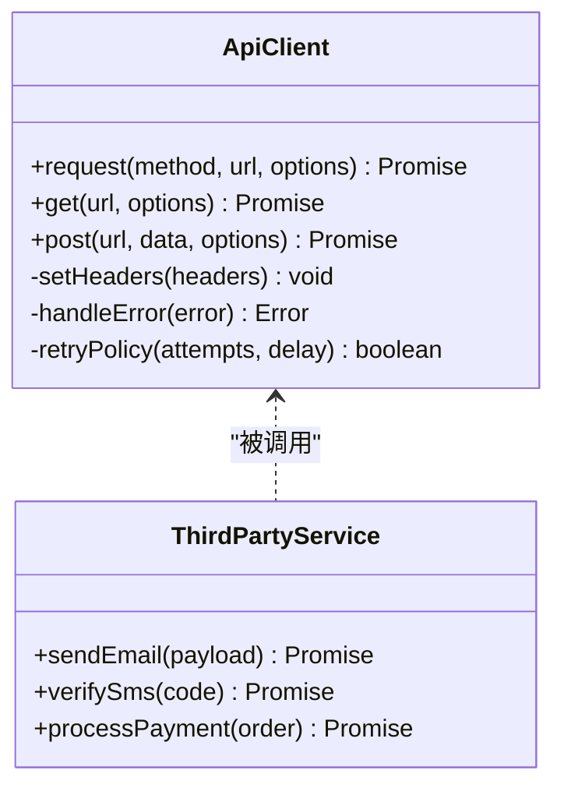

图表来源
- [lib/api.ts](file://lib/api.ts)

章节来源
- [lib/api.ts](file://lib/api.ts)

### 数据层与ORM（db/index.ts, db/schema.ts）
- 连接管理：单例连接池、连接参数来自环境变量
- Schema定义：强类型表结构，约束与索引
- 迁移管理：Drizzle迁移脚本，保证版本一致

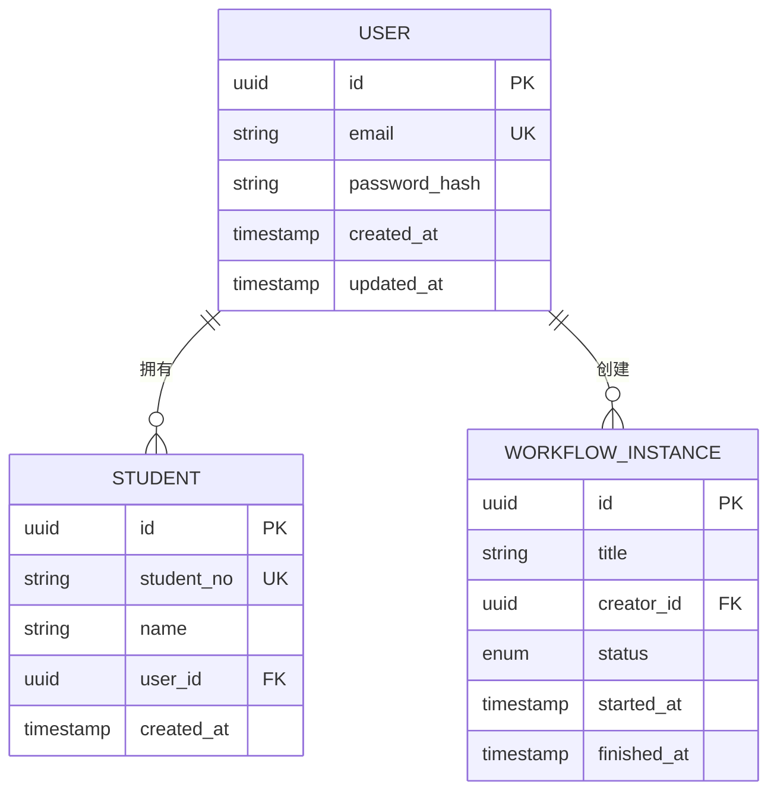

图表来源
- [db/schema.ts](file://db/schema.ts)

章节来源
- [db/index.ts](file://db/index.ts)
- [db/schema.ts](file://db/schema.ts)
- [drizzle.config.ts](file://drizzle.config.ts)

### 后台任务与消息队列（worker/index.ts）
- 任务模型：支持批量导入、报表生成、通知发送等长耗时操作
- 队列实现：可使用内存队列或外部消息队列（RabbitMQ/Kafka/Redis）
- 消费策略：幂等性、重试、死信队列、监控告警

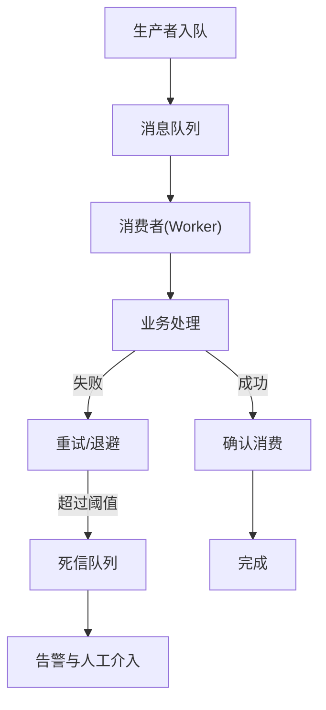

图表来源
- [worker/index.ts](file://worker/index.ts)

章节来源
- [worker/index.ts](file://worker/index.ts)

### 配置管理与密钥存储
- 环境变量：数据库连接、第三方API密钥、限流策略等通过环境变量注入
- 密钥管理：建议使用专用密钥管理服务（如Vault、云KMS），避免硬编码
- 运行时配置：支持热更新与灰度发布时的动态配置

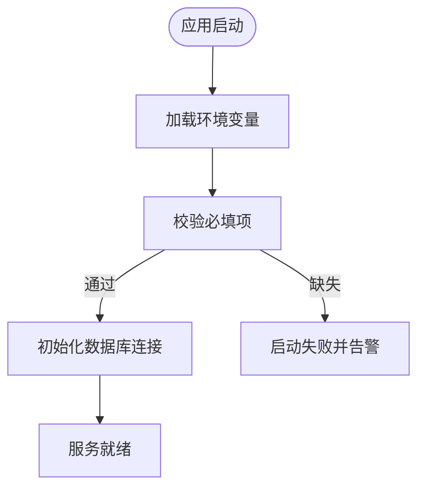

图表来源
- [deploy/prepare-production-postgres.sh](file://deploy/prepare-production-postgres.sh)
- [scripts/migrate.mjs](file://scripts/migrate.mjs)

章节来源
- [deploy/prepare-production-postgres.sh](file://deploy/prepare-production-postgres.sh)
- [scripts/migrate.mjs](file://scripts/migrate.mjs)

### 服务网格、API网关与负载均衡
- API网关：Nginx作为统一入口，负责路由、限流、TLS
- 服务网格：可在容器化部署中引入Istio/Linkerd，实现mTLS、流量治理
- 负载均衡：多实例部署时，Nginx或云LB分发请求

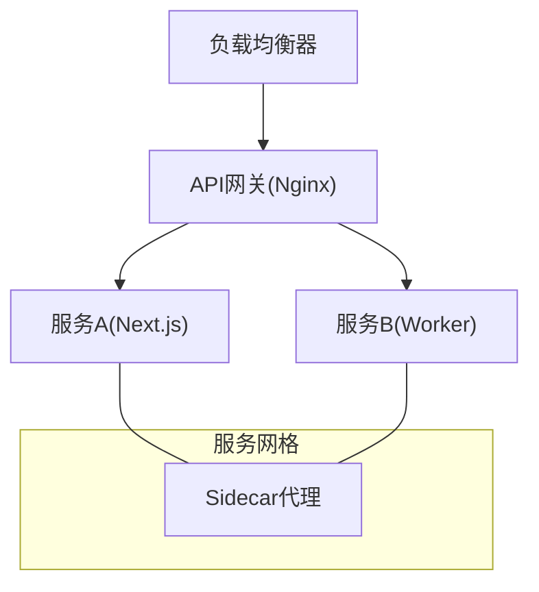

[此图为概念性架构图，不直接映射具体源码文件]

### 微服务间通信协议与数据同步
- 通信协议：优先HTTP/REST，内部服务可用gRPC或消息队列
- 数据同步：主从复制、CDC（变更数据捕获）、最终一致性
- 服务发现：DNS或服务注册中心（Consul/Nacos）

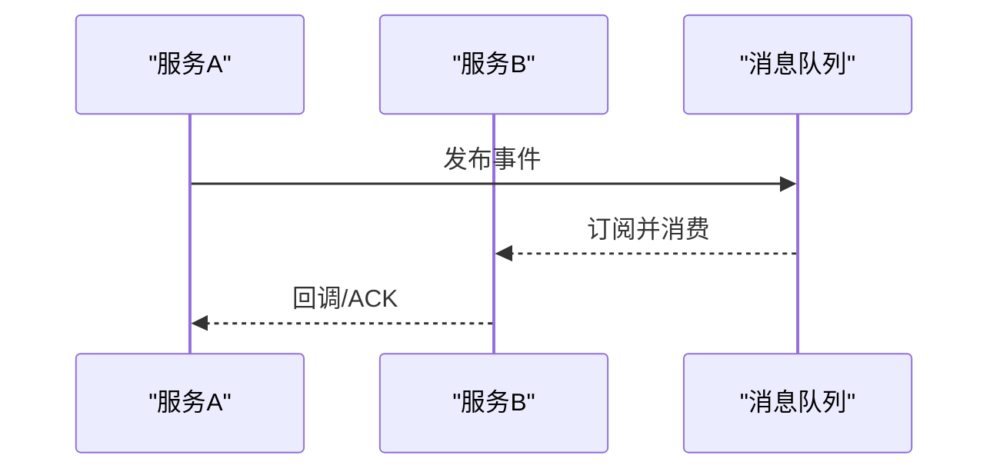

[此图为概念性流程图，不直接映射具体源码文件]

## 依赖关系分析
- 外部依赖：Next.js框架、Drizzle ORM、PostgreSQL、Nginx
- 内部依赖：API路由依赖lib中的鉴权、安全、限流与HTTP客户端
- 数据依赖：ORM与迁移脚本保证Schema一致性

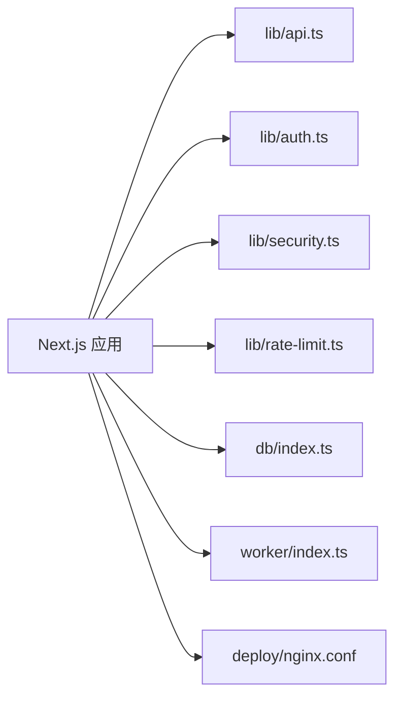

图表来源
- [lib/api.ts](file://lib/api.ts)
- [lib/auth.ts](file://lib/auth.ts)
- [lib/security.ts](file://lib/security.ts)
- [lib/rate-limit.ts](file://lib/rate-limit.ts)
- [db/index.ts](file://db/index.ts)
- [worker/index.ts](file://worker/index.ts)
- [deploy/nginx.conf](file://deploy/nginx.conf)

章节来源
- [package.json](file://package.json)
- [next.config.ts](file://next.config.ts)

## 性能考虑
- 连接池：数据库连接池大小与超时设置需根据负载调优
- 缓存：Nginx静态资源缓存、HTTP缓存头、CDN加速
- 限流：接口级限流保护下游与数据库
- 异步：长耗时任务下沉至Worker，避免阻塞请求线程
- 监控：APM、日志聚合、指标采集（Prometheus/Grafana）

[本节为通用指导，无需特定文件引用]

## 故障排查指南
- 常见问题：
  - 环境变量缺失导致启动失败
  - 数据库连接超时或权限不足
  - 第三方API限流或证书问题
  - Worker任务堆积或失败
- 排查步骤：
  - 查看Nginx与Next.js日志
  - 检查数据库连接与迁移状态
  - 验证第三方API密钥与网络连通性
  - 监控Worker队列长度与失败率

章节来源
- [tests/api-integration.test.mjs](file://tests/api-integration.test.mjs)
- [tests/backend.test.mjs](file://tests/backend.test.mjs)
- [tests/lib/api.test.ts](file://tests/lib/api.test.ts)

## 结论
CS1学生事务管理系统采用Next.js+PostgreSQL+Drizzle的轻量微服务架构，通过Nginx作为API网关，结合lib封装的HTTP客户端与鉴权机制，实现稳定的第三方API集成。后台Worker支持异步任务与消息队列，提升系统吞吐与可靠性。建议在生产环境引入服务网格与集中式密钥管理，完善监控与降级策略，保障高可用与可观测性。

[本节为总结性内容，无需特定文件引用]

## 附录
- 集成测试策略：端到端测试覆盖关键API路径，Mock第三方服务与数据库
- Mock服务：使用本地Mock Server或Wiremock模拟第三方API
- 降级方案：第三方服务不可用时返回缓存或默认值，记录错误并告警

[本节为补充说明，无需特定文件引用]