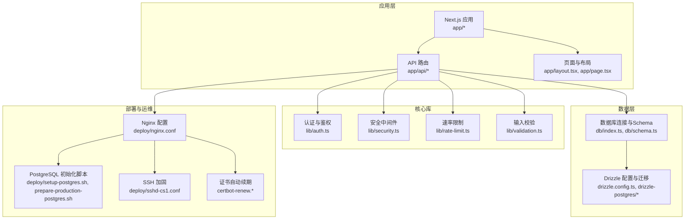
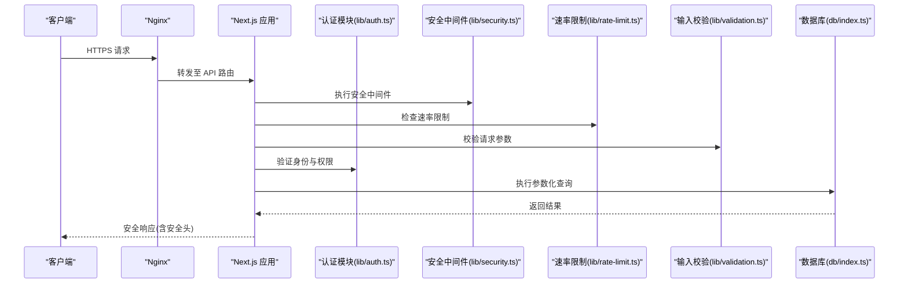
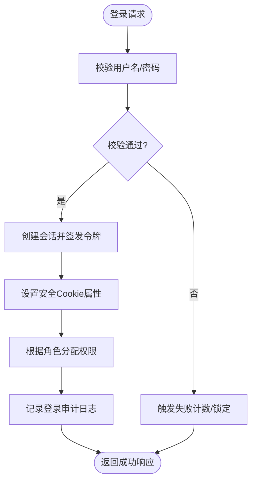
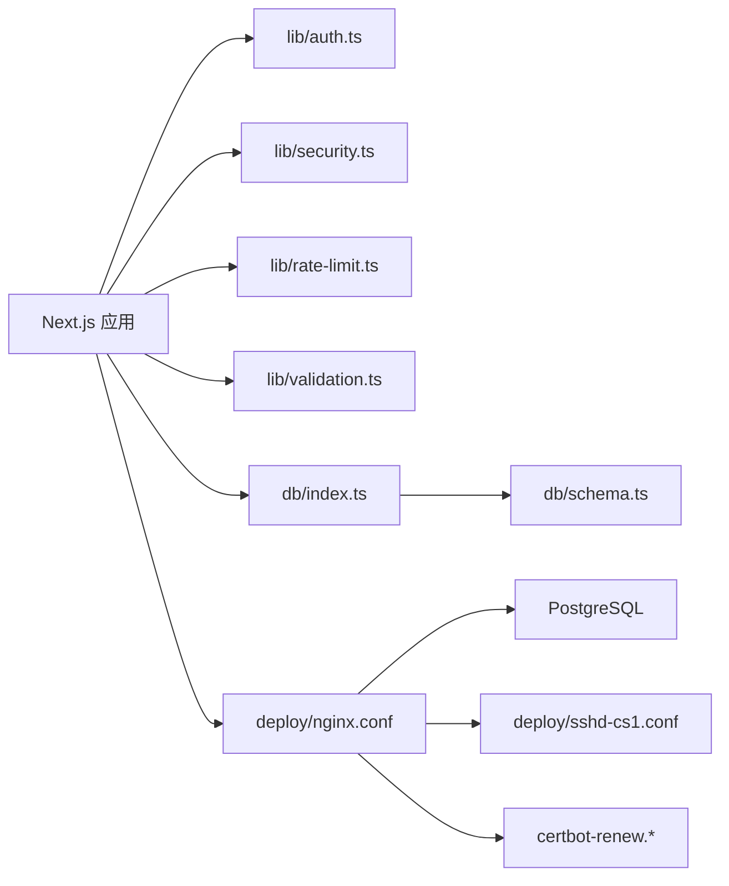

# 安全最佳实践

<cite>
**本文引用的文件**   
- [README.md](file://README.md)
- [package.json](file://package.json)
- [next.config.ts](file://next.config.ts)
- [app/layout.tsx](file://app/layout.tsx)
- [app/page.tsx](file://app/page.tsx)
- [lib/auth.ts](file://lib/auth.ts)
- [lib/security.ts](file://lib/security.ts)
- [lib/rate-limit.ts](file://lib/rate-limit.ts)
- [lib/validation.ts](file://lib/validation.ts)
- [db/index.ts](file://db/index.ts)
- [db/schema.ts](file://db/schema.ts)
- [drizzle.config.ts](file://drizzle.config.ts)
- [deploy/nginx.conf](file://deploy/nginx.conf)
- [deploy/prepare-production-postgres.sh](file://deploy/prepare-production-postgres.sh)
- [deploy/setup-postgres.sh](file://deploy/setup-postgres.sh)
- [deploy/sshd-cs1.conf](file://deploy/sshd-cs1.conf)
- [deploy/certbot-renew.service](file://deploy/certbot-renew.service)
- [deploy/certbot-renew.timer](file://deploy/certbot-renew.timer)
- [scripts/seed-admin.mjs](file://scripts/seed-admin.mjs)
- [tests/lib/security.test.ts](file://tests/lib/security.test.ts)
- [tests/lib/rate-limit.test.ts](file://tests/lib/rate-limit.test.ts)
- [tests/lib/validation.test.ts](file://tests/lib/validation.test.ts)
</cite>

## 目录
1. [简介](#简介)
2. [项目结构](#项目结构)
3. [核心组件](#核心组件)
4. [架构总览](#架构总览)
5. [详细组件分析](#详细组件分析)
6. [依赖关系分析](#依赖关系分析)
7. [性能与安全考量](#性能与安全考量)
8. [故障排查指南](#故障排查指南)
9. [结论](#结论)
10. [附录](#附录)

## 简介
本文件面向CS1学生事务管理系统的安全建设，提供从开发到部署的全链路安全最佳实践。内容涵盖：
- 安全开发规范与代码审查清单
- 常见威胁防护（认证、授权、输入校验、速率限制、加密、CSP等）
- 漏洞扫描与渗透测试方法
- 安全监控告警与事件响应流程
- 持续改进机制
- 安全配置模板、安全检查脚本与安全培训材料

目标读者包括前端/后端开发者、运维工程师、安全审计人员及项目负责人。

## 项目结构
系统采用Next.js应用结构，API路由位于app/api下，业务逻辑与工具库位于lib，数据库访问与迁移位于db与drizzle相关目录，部署与基础设施配置位于deploy，测试覆盖关键安全能力。

图表来源
- [app/layout.tsx:1-200](file://app/layout.tsx#L1-L200)
- [app/page.tsx:1-200](file://app/page.tsx#L1-L200)
- [lib/auth.ts:1-200](file://lib/auth.ts#L1-L200)
- [lib/security.ts:1-200](file://lib/security.ts#L1-L200)
- [lib/rate-limit.ts:1-200](file://lib/rate-limit.ts#L1-L200)
- [lib/validation.ts:1-200](file://lib/validation.ts#L1-L200)
- [db/index.ts:1-200](file://db/index.ts#L1-L200)
- [db/schema.ts:1-200](file://db/schema.ts#L1-L200)
- [drizzle.config.ts:1-200](file://drizzle.config.ts#L1-L200)
- [deploy/nginx.conf:1-200](file://deploy/nginx.conf#L1-L200)
- [deploy/setup-postgres.sh:1-200](file://deploy/setup-postgres.sh#L1-L200)
- [deploy/prepare-production-postgres.sh:1-200](file://deploy/prepare-production-postgres.sh#L1-L200)
- [deploy/sshd-cs1.conf:1-200](file://deploy/sshd-cs1.conf#L1-L200)
- [deploy/certbot-renew.service:1-200](file://deploy/certbot-renew.service#L1-L200)
- [deploy/certbot-renew.timer:1-200](file://deploy/certbot-renew.timer#L1-L200)

章节来源
- [README.md:1-200](file://README.md#L1-L200)
- [package.json:1-200](file://package.json#L1-L200)
- [next.config.ts:1-200](file://next.config.ts#L1-L200)

## 核心组件
- 认证与授权（lib/auth.ts）
  - 负责用户登录、会话管理、权限校验与角色控制。建议结合最小权限原则与细粒度授权策略。
- 安全中间件（lib/security.ts）
  - 统一处理安全头、CSP、XSS防护、请求签名或防重放等通用安全能力。
- 速率限制（lib/rate-limit.ts）
  - 对敏感接口进行限流，防止暴力破解与滥用。
- 输入校验（lib/validation.ts）
  - 对所有外部输入进行白名单校验与类型约束，避免注入与越权。
- 数据库访问（db/index.ts, db/schema.ts）
  - 使用参数化查询与ORM（Drizzle）减少SQL注入风险；严格定义Schema约束。
- 部署与基础设施（deploy/*）
  - Nginx反向代理、HTTPS证书、SSH加固、PostgreSQL初始化与生产环境准备。

章节来源
- [lib/auth.ts:1-200](file://lib/auth.ts#L1-L200)
- [lib/security.ts:1-200](file://lib/security.ts#L1-L200)
- [lib/rate-limit.ts:1-200](file://lib/rate-limit.ts#L1-L200)
- [lib/validation.ts:1-200](file://lib/validation.ts#L1-L200)
- [db/index.ts:1-200](file://db/index.ts#L1-L200)
- [db/schema.ts:1-200](file://db/schema.ts#L1-L200)

## 架构总览
系统以Next.js为入口，API路由承载业务功能，通过认证、鉴权、速率限制与输入校验等安全组件保护后端服务。数据层使用PostgreSQL并通过Drizzle进行迁移与Schema管理。部署层由Nginx提供反向代理与TLS终止，配合证书自动续期与SSH加固保障运行环境安全。

图表来源
- [deploy/nginx.conf:1-200](file://deploy/nginx.conf#L1-L200)
- [app/page.tsx:1-200](file://app/page.tsx#L1-L200)
- [lib/security.ts:1-200](file://lib/security.ts#L1-L200)
- [lib/rate-limit.ts:1-200](file://lib/rate-limit.ts#L1-L200)
- [lib/validation.ts:1-200](file://lib/validation.ts#L1-L200)
- [lib/auth.ts:1-200](file://lib/auth.ts#L1-L200)
- [db/index.ts:1-200](file://db/index.ts#L1-L200)

## 详细组件分析

### 认证与授权（lib/auth.ts）
- 职责：用户登录、会话创建与校验、角色与权限判断、敏感操作二次确认。
- 建议实现要点：
  - 密码哈希与盐值存储，禁止明文保存。
  - 会话令牌设置HttpOnly、Secure、SameSite属性。
  - 基于角色的访问控制（RBAC），最小权限原则。
  - 登录失败计数与锁定策略，结合速率限制。
  - 审计日志记录登录与权限变更。

图表来源
- [lib/auth.ts:1-200](file://lib/auth.ts#L1-L200)

章节来源
- [lib/auth.ts:1-200](file://lib/auth.ts#L1-L200)

### 安全中间件（lib/security.ts）
- 职责：统一设置HTTP安全头、CSP、X-Frame-Options、HSTS、Content-Type嗅探防护等。
- 建议实现要点：
  - 强制HTTPS与HSTS。
  - 严格的CSP策略，限制内联脚本与外部资源来源。
  - 禁用不必要的MIME类型嗅探。
  - 统一错误响应格式，避免泄露堆栈信息。

章节来源
- [lib/security.ts:1-200](file://lib/security.ts#L1-L200)

### 速率限制（lib/rate-limit.ts）
- 职责：对登录、注册、重置密码等敏感接口实施频率限制。
- 建议实现要点：
  - 按IP或用户ID维度限流，支持滑动窗口或令牌桶算法。
  - 动态阈值与黑名单机制。
  - 限流状态可观测与告警。

章节来源
- [lib/rate-limit.ts:1-200](file://lib/rate-limit.ts#L1-L200)

### 输入校验（lib/validation.ts）
- 职责：对所有外部输入进行类型、长度、格式与白名单校验。
- 建议实现要点：
  - 使用强类型Schema定义（如Zod/Yup）。
  - 拒绝未知字段，避免属性注入。
  - 对文件上传进行类型、大小与内容检测。

章节来源
- [lib/validation.ts:1-200](file://lib/validation.ts#L1-L200)

### 数据库访问与Schema（db/index.ts, db/schema.ts）
- 职责：数据库连接管理与表结构定义，确保数据一致性与完整性。
- 建议实现要点：
  - 使用参数化查询与ORM，避免拼接SQL。
  - Schema中定义非空、唯一、外键约束。
  - 敏感字段加密存储（如AES-GCM），密钥与数据分离管理。

章节来源
- [db/index.ts:1-200](file://db/index.ts#L1-L200)
- [db/schema.ts:1-200](file://db/schema.ts#L1-L200)

### 部署与基础设施（deploy/*）
- Nginx（deploy/nginx.conf）
  - 启用HTTPS、HSTS、安全头、请求体大小限制、日志脱敏。
- PostgreSQL（deploy/setup-postgres.sh, deploy/prepare-production-postgres.sh）
  - 初始化数据库、创建只读/读写账户、启用SSL、限制远程访问。
- SSH（deploy/sshd-cs1.conf）
  - 禁用密码登录、仅允许密钥、限制root登录、启用Fail2ban。
- 证书（deploy/certbot-renew.service, deploy/certbot-renew.timer）
  - 自动续期Let's Encrypt证书，确保证书不过期。

章节来源
- [deploy/nginx.conf:1-200](file://deploy/nginx.conf#L1-L200)
- [deploy/setup-postgres.sh:1-200](file://deploy/setup-postgres.sh#L1-L200)
- [deploy/prepare-production-postgres.sh:1-200](file://deploy/prepare-production-postgres.sh#L1-L200)
- [deploy/sshd-cs1.conf:1-200](file://deploy/sshd-cs1.conf#L1-L200)
- [deploy/certbot-renew.service:1-200](file://deploy/certbot-renew.service#L1-L200)
- [deploy/certbot-renew.timer:1-200](file://deploy/certbot-renew.timer#L1-L200)

## 依赖关系分析
- 应用依赖Next.js框架与Node运行时。
- 安全能力集中在lib目录，被API路由复用。
- 数据层通过Drizzle与PostgreSQL交互。
- 部署层通过Nginx与操作系统服务（systemd）管理。

图表来源
- [package.json:1-200](file://package.json#L1-L200)
- [lib/auth.ts:1-200](file://lib/auth.ts#L1-L200)
- [lib/security.ts:1-200](file://lib/security.ts#L1-L200)
- [lib/rate-limit.ts:1-200](file://lib/rate-limit.ts#L1-L200)
- [lib/validation.ts:1-200](file://lib/validation.ts#L1-L200)
- [db/index.ts:1-200](file://db/index.ts#L1-L200)
- [db/schema.ts:1-200](file://db/schema.ts#L1-L200)
- [deploy/nginx.conf:1-200](file://deploy/nginx.conf#L1-L200)
- [deploy/sshd-cs1.conf:1-200](file://deploy/sshd-cs1.conf#L1-L200)
- [deploy/certbot-renew.service:1-200](file://deploy/certbot-renew.service#L1-L200)
- [deploy/certbot-renew.timer:1-200](file://deploy/certbot-renew.timer#L1-L200)

章节来源
- [package.json:1-200](file://package.json#L1-L200)

## 性能与安全考量
- 认证与会话
  - 使用短生命周期令牌与刷新机制，降低泄露影响面。
  - 并发登录限制与设备指纹辅助风控。
- 速率限制
  - 合理设置阈值，避免误伤正常流量；结合缓存提升性能。
- 输入校验
  - 尽早校验与拒绝非法输入，减少后端处理开销。
- 数据库
  - 索引优化与查询计划审查，避免慢查询导致超时与资源耗尽。
- 部署
  - Nginx开启Gzip压缩与静态资源缓存，减轻服务器压力。
  - 健康检查与自动重启，提高可用性。

[本节为通用指导，不直接分析具体文件]

## 故障排查指南
- 认证失败
  - 检查会话Cookie属性与跨域设置；查看登录失败计数与锁定策略。
- 速率限制触发
  - 调整阈值与窗口策略；检查限流统计与黑名单。
- 输入校验失败
  - 核对Schema定义与前端提交字段；查看错误日志定位原因。
- 数据库连接异常
  - 检查连接字符串、SSL配置与账户权限；查看迁移状态。
- 部署问题
  - 验证Nginx配置语法与证书有效性；检查systemd服务状态与日志。

章节来源
- [tests/lib/security.test.ts:1-200](file://tests/lib/security.test.ts#L1-L200)
- [tests/lib/rate-limit.test.ts:1-200](file://tests/lib/rate-limit.test.ts#L1-L200)
- [tests/lib/validation.test.ts:1-200](file://tests/lib/validation.test.ts#L1-L200)

## 结论
通过统一的认证、鉴权、速率限制与输入校验，结合安全的部署配置与自动化运维，CS1学生事务管理系统能够在开发与生产环境中有效抵御常见安全威胁。建议持续集成安全扫描与渗透测试，完善监控告警与事件响应流程，形成闭环的安全治理体系。

[本节为总结性内容，不直接分析具体文件]

## 附录

### 安全开发规范与代码审查清单
- 认证与会话
  - 密码哈希、会话安全属性、登录失败锁定、审计日志。
- 授权与权限
  - RBAC模型、最小权限、资源级鉴权、越权防护。
- 输入输出
  - 白名单校验、类型约束、文件上传检测、输出编码。
- 通信安全
  - HTTPS强制、HSTS、证书管理、密钥轮换。
- 数据安全
  - 敏感字段加密、备份加密、脱敏导出。
- 代码质量
  - 静态分析、依赖漏洞扫描、单元测试覆盖率。

[本节为通用指导，不直接分析具体文件]

### 常见安全威胁防护
- 注入攻击（SQL/命令/模板）
  - 使用参数化查询与模板引擎白名单。
- XSS与CSRF
  - CSP、HttpOnly Cookie、同源策略与Token校验。
- 暴力破解与滥用
  - 速率限制、验证码、账号锁定。
- 文件上传风险
  - 类型与大小限制、病毒扫描、独立存储路径。
- 敏感信息泄露
  - 日志脱敏、错误信息屏蔽、环境变量管理。

[本节为通用指导，不直接分析具体文件]

### 漏洞扫描与渗透测试方法
- 静态扫描（SAST）
  - 集成ESLint规则与TypeScript类型检查，发现潜在安全问题。
- 动态扫描（DAST）
  - 使用OWASP ZAP或Burp Suite对API与页面进行扫描。
- 依赖扫描（SCA）
  - 使用npm audit或第三方工具检查依赖漏洞。
- 渗透测试
  - 模拟真实攻击路径，验证认证、授权、输入校验与速率限制效果。

[本节为通用指导，不直接分析具体文件]

### 安全监控告警与事件响应流程
- 监控指标
  - 登录失败率、限流触发次数、错误率、慢查询、证书过期。
- 告警策略
  - 阈值告警、异常行为检测、证书到期提醒。
- 事件响应
  - 分级响应、隔离与回滚、取证与复盘、修复与验证。

[本节为通用指导，不直接分析具体文件]

### 安全配置模板
- Nginx安全头与HTTPS
  - 参考：[deploy/nginx.conf:1-200](file://deploy/nginx.conf#L1-L200)
- PostgreSQL安全初始化
  - 参考：[deploy/setup-postgres.sh:1-200](file://deploy/setup-postgres.sh#L1-L200)、[deploy/prepare-production-postgres.sh:1-200](file://deploy/prepare-production-postgres.sh#L1-L200)
- SSH加固
  - 参考：[deploy/sshd-cs1.conf:1-200](file://deploy/sshd-cs1.conf#L1-L200)
- 证书自动续期
  - 参考：[deploy/certbot-renew.service:1-200](file://deploy/certbot-renew.service#L1-L200)、[deploy/certbot-renew.timer:1-200](file://deploy/certbot-renew.timer#L1-L200)

章节来源
- [deploy/nginx.conf:1-200](file://deploy/nginx.conf#L1-L200)
- [deploy/setup-postgres.sh:1-200](file://deploy/setup-postgres.sh#L1-L200)
- [deploy/prepare-production-postgres.sh:1-200](file://deploy/prepare-production-postgres.sh#L1-L200)
- [deploy/sshd-cs1.conf:1-200](file://deploy/sshd-cs1.conf#L1-L200)
- [deploy/certbot-renew.service:1-200](file://deploy/certbot-renew.service#L1-L200)
- [deploy/certbot-renew.timer:1-200](file://deploy/certbot-renew.timer#L1-L200)

### 安全检查脚本
- 依赖漏洞扫描
  - 使用npm audit或第三方工具在CI中执行。
- 静态分析
  - 集成ESLint与TypeScript编译检查。
- 单元测试与覆盖率
  - 参考测试用例：[tests/lib/security.test.ts:1-200](file://tests/lib/security.test.ts#L1-L200)、[tests/lib/rate-limit.test.ts:1-200](file://tests/lib/rate-limit.test.ts#L1-L200)、[tests/lib/validation.test.ts:1-200](file://tests/lib/validation.test.ts#L1-L200)

章节来源
- [tests/lib/security.test.ts:1-200](file://tests/lib/security.test.ts#L1-L200)
- [tests/lib/rate-limit.test.ts:1-200](file://tests/lib/rate-limit.test.ts#L1-L200)
- [tests/lib/validation.test.ts:1-200](file://tests/lib/validation.test.ts#L1-L200)

### 安全培训材料
- 开发者培训
  - 安全编码规范、常见漏洞与修复、代码审查要点。
- 运维培训
  - 安全配置基线、监控告警、事件响应流程。
- 安全意识
  - 钓鱼防范、密码管理、数据脱敏与合规要求。

[本节为通用指导，不直接分析具体文件]

### 初始化管理员账户（示例）
- 使用种子脚本创建管理员账户，确保默认密码强制修改与最小权限分配。
- 参考：[scripts/seed-admin.mjs:1-200](file://scripts/seed-admin.mjs#L1-L200)

章节来源
- [scripts/seed-admin.mjs:1-200](file://scripts/seed-admin.mjs#L1-L200)