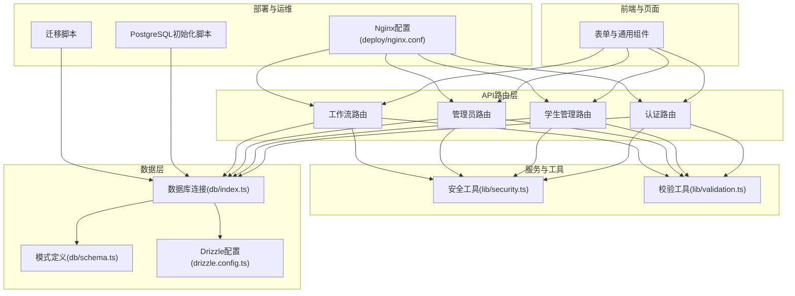
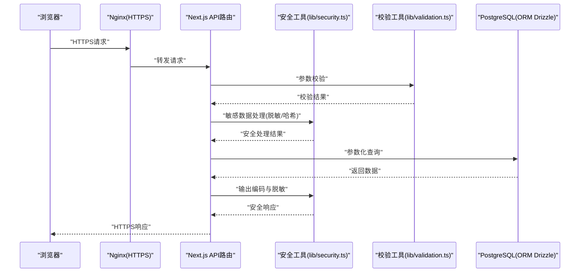
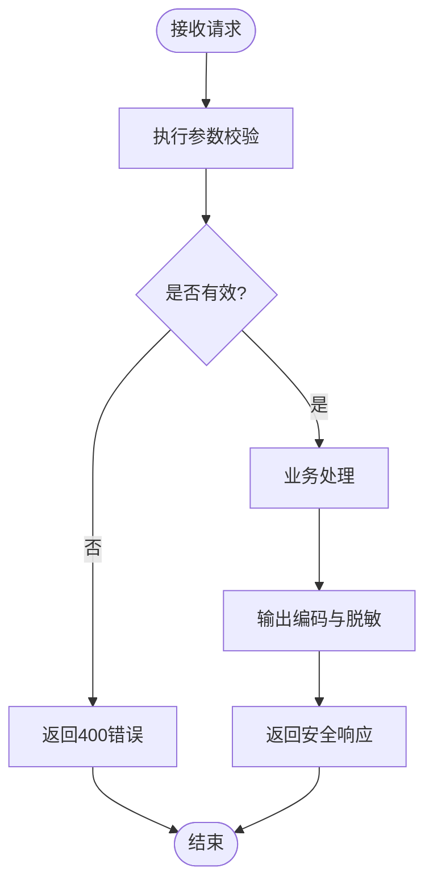
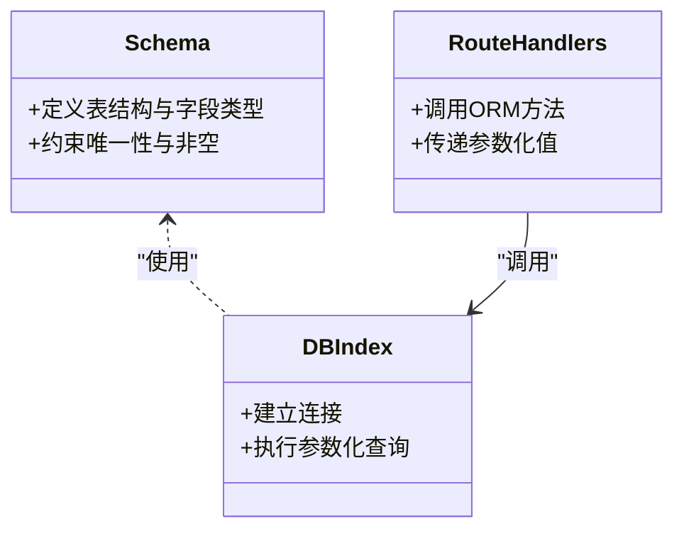
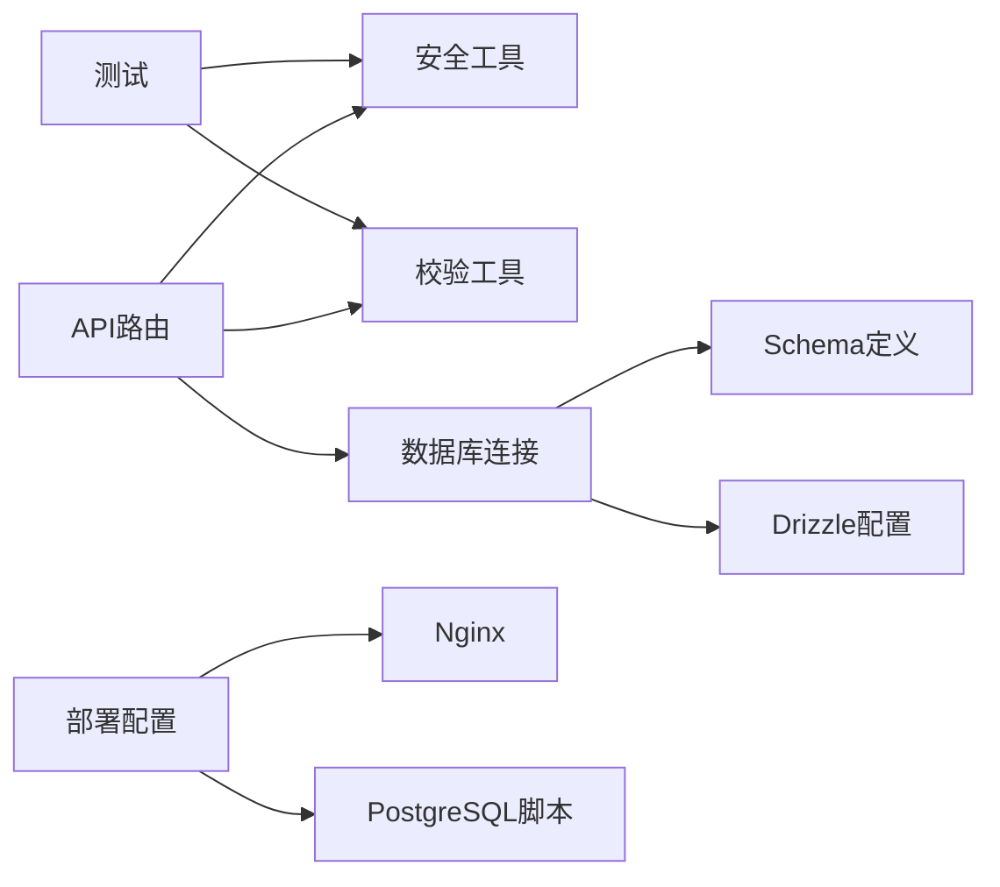

# 数据安全

<cite>
**本文引用的文件**   
- [lib/security.ts](file://lib/security.ts)
- [lib/validation.ts](file://lib/validation.ts)
- [db/index.ts](file://db/index.ts)
- [db/schema.ts](file://db/schema.ts)
- [drizzle.config.ts](file://drizzle.config.ts)
- [deploy/nginx.conf](file://deploy/nginx.conf)
- [deploy/prepare-production-postgres.sh](file://deploy/prepare-production-postgres.sh)
- [deploy/setup-postgres.sh](file://deploy/setup-postgres.sh)
- [scripts/migrate.mjs](file://scripts/migrate.mjs)
- [scripts/migrate-sqlite-to-postgres.mjs](file://scripts/migrate-sqlite-to-postgres.mjs)
- [app/api/auth/login/route.ts](file://app/api/auth/login/route.ts)
- [app/api/auth/session/route.ts](file://app/api/auth/session/route.ts)
- [app/api/admin/users/route.ts](file://app/api/admin/users/route.ts)
- [app/api/students/route.ts](file://app/api/students/route.ts)
- [app/api/students/[id]/route.ts](file://app/api/students/[id]/route.ts)
- [app/api/students/batch/route.ts](file://app/api/students/batch/route.ts)
- [app/api/workflow/instances/route.ts](file://app/api/workflow/instances/route.ts)
- [app/api/workflow/tasks/route.ts](file://app/api/workflow/tasks/route.ts)
- [app/components/forms/FormSection.tsx](file://app/components/forms/FormSection.tsx)
- [app/components/generic/GenericImportDialog.tsx](file://app/components/generic/GenericImportDialog.tsx)
- [tests/lib/security.test.ts](file://tests/lib/security.test.ts)
- [tests/lib/validation.test.ts](file://tests/lib/validation.test.ts)
</cite>

## 目录
1. [简介](#简介)
2. [项目结构](#项目结构)
3. [核心组件](#核心组件)
4. [架构总览](#架构总览)
5. [详细组件分析](#详细组件分析)
6. [依赖关系分析](#依赖关系分析)
7. [性能与安全权衡](#性能与安全权衡)
8. [故障排查指南](#故障排查指南)
9. [结论](#结论)
10. [附录](#附录)

## 简介
本文件为CS1学生事务管理系统的数据安全详细文档，面向CS1课程学生与开发者。内容覆盖输入验证与输出编码、SQL注入与XSS防护、数据脱敏、敏感数据加密存储与传输层安全、数据库访问控制、备份策略、隐私合规与审计、安全配置参数、数据迁移安全措施及安全测试方法。目标是帮助读者理解系统如何保护学生个人信息与业务数据，并在实际开发中遵循最佳实践。

## 项目结构
本项目采用Next.js应用结构，API路由位于app/api下，数据库相关逻辑在db目录，Drizzle ORM用于类型安全的数据库访问，部署与Nginx配置在deploy目录，安全与校验工具集中在lib目录，测试用例在tests目录。

图表来源
- [lib/security.ts:1-200](file://lib/security.ts#L1-L200)
- [lib/validation.ts:1-200](file://lib/validation.ts#L1-L200)
- [db/index.ts:1-200](file://db/index.ts#L1-L200)
- [db/schema.ts:1-200](file://db/schema.ts#L1-L200)
- [drizzle.config.ts:1-200](file://drizzle.config.ts#L1-L200)
- [deploy/nginx.conf:1-200](file://deploy/nginx.conf#L1-L200)
- [deploy/setup-postgres.sh:1-200](file://deploy/setup-postgres.sh#L1-L200)
- [scripts/migrate.mjs:1-200](file://scripts/migrate.mjs#L1-L200)

章节来源
- [lib/security.ts:1-200](file://lib/security.ts#L1-L200)
- [lib/validation.ts:1-200](file://lib/validation.ts#L1-L200)
- [db/index.ts:1-200](file://db/index.ts#L1-L200)
- [db/schema.ts:1-200](file://db/schema.ts#L1-L200)
- [drizzle.config.ts:1-200](file://drizzle.config.ts#L1-L200)
- [deploy/nginx.conf:1-200](file://deploy/nginx.conf#L1-L200)
- [deploy/setup-postgres.sh:1-200](file://deploy/setup-postgres.sh#L1-L200)
- [scripts/migrate.mjs:1-200](file://scripts/migrate.mjs#L1-L200)

## 核心组件
- 输入验证与输出编码：通过lib/validation.ts进行请求参数与表单数据的严格校验；前端组件对渲染内容进行转义或白名单过滤，避免XSS。
- SQL注入防护：使用Drizzle ORM的参数化查询与类型化Schema，避免拼接SQL字符串。
- 数据脱敏：在响应前对敏感字段（如身份证号、手机号）进行掩码处理。
- 敏感数据加密：密码等敏感信息在入库前进行哈希处理；传输层强制HTTPS。
- 数据库访问控制：最小权限原则，按角色授权访问敏感表。
- 备份与恢复：基于PostgreSQL的定期快照与导出策略。
- 审计与日志：关键操作记录审计日志，包含时间、用户、动作与结果。

章节来源
- [lib/validation.ts:1-200](file://lib/validation.ts#L1-L200)
- [lib/security.ts:1-200](file://lib/security.ts#L1-L200)
- [db/schema.ts:1-200](file://db/schema.ts#L1-L200)
- [db/index.ts:1-200](file://db/index.ts#L1-L200)

## 架构总览
下图展示从浏览器到数据库的关键安全路径：请求进入Nginx后由Next.js API路由处理，经过安全与校验中间件，再通过Drizzle ORM访问数据库。所有敏感数据在入库前进行哈希或脱敏，响应返回前再次进行输出编码与脱敏。

图表来源
- [deploy/nginx.conf:1-200](file://deploy/nginx.conf#L1-L200)
- [app/api/auth/login/route.ts:1-200](file://app/api/auth/login/route.ts#L1-L200)
- [lib/validation.ts:1-200](file://lib/validation.ts#L1-L200)
- [lib/security.ts:1-200](file://lib/security.ts#L1-L200)
- [db/index.ts:1-200](file://db/index.ts#L1-L200)

## 详细组件分析

### 输入验证与输出编码
- 输入验证：对所有API入口的请求体、查询参数、路径参数进行类型与格式校验，拒绝非法输入并返回明确错误信息。
- 输出编码：对JSON响应中的富文本或用户生成内容进行转义，防止XSS；对CSV导出进行安全处理，避免公式注入。
- 前端表单：统一使用FormSection等组件，内置字段规则与提示，减少客户端绕过风险。

图表来源
- [lib/validation.ts:1-200](file://lib/validation.ts#L1-L200)
- [app/components/forms/FormSection.tsx:1-200](file://app/components/forms/FormSection.tsx#L1-L200)
- [app/components/generic/GenericImportDialog.tsx:1-200](file://app/components/generic/GenericImportDialog.tsx#L1-L200)

章节来源
- [lib/validation.ts:1-200](file://lib/validation.ts#L1-L200)
- [app/components/forms/FormSection.tsx:1-200](file://app/components/forms/FormSection.tsx#L1-L200)
- [app/components/generic/GenericImportDialog.tsx:1-200](file://app/components/generic/GenericImportDialog.tsx#L1-L200)

### SQL注入防护
- 使用Drizzle ORM进行参数化查询，禁止拼接SQL字符串。
- Schema定义约束字段类型与长度，降低越界与类型混淆风险。
- 数据库连接使用最小权限账户，限制DDL与高危操作。

图表来源
- [db/schema.ts:1-200](file://db/schema.ts#L1-L200)
- [db/index.ts:1-200](file://db/index.ts#L1-L200)
- [app/api/students/route.ts:1-200](file://app/api/students/route.ts#L1-L200)

章节来源
- [db/schema.ts:1-200](file://db/schema.ts#L1-L200)
- [db/index.ts:1-200](file://db/index.ts#L1-L200)
- [app/api/students/route.ts:1-200](file://app/api/students/route.ts#L1-L200)

### XSS攻击防护
- 服务端输出编码：对可能包含HTML或脚本的内容进行转义。
- 前端渲染：避免直接插入未经验证的用户输入；使用受控组件与白名单过滤。
- CSV导入：禁用公式解析或进行安全转换，防止Excel公式注入。

章节来源
- [lib/security.ts:1-200](file://lib/security.ts#L1-L200)
- [app/components/generic/GenericImportDialog.tsx:1-200](file://app/components/generic/GenericImportDialog.tsx#L1-L200)

### 数据脱敏处理
- 响应前对敏感字段进行掩码（如身份证号、手机号、邮箱）。
- 日志中自动脱敏，避免泄露敏感信息。
- 导出文件时对敏感列进行脱敏或加密。

章节来源
- [lib/security.ts:1-200](file://lib/security.ts#L1-L200)

### 敏感数据加密存储与传输层安全
- 密码等敏感信息入库前进行哈希处理，禁止明文存储。
- 全站启用HTTPS，Nginx配置TLS证书与强加密套件。
- 会话令牌使用安全Cookie属性（HttpOnly、Secure、SameSite）。

章节来源
- [deploy/nginx.conf:1-200](file://deploy/nginx.conf#L1-L200)
- [app/api/auth/login/route.ts:1-200](file://app/api/auth/login/route.ts#L1-L200)
- [app/api/auth/session/route.ts:1-200](file://app/api/auth/session/route.ts#L1-L200)

### 数据库访问控制
- 使用最小权限数据库用户，仅授予必要表的SELECT/INSERT/UPDATE权限。
- 按功能模块划分访问范围，管理员接口需额外鉴权。
- 连接池与超时设置合理，防止资源耗尽。

章节来源
- [db/index.ts:1-200](file://db/index.ts#L1-L200)
- [app/api/admin/users/route.ts:1-200](file://app/api/admin/users/route.ts#L1-L200)

### 数据备份策略
- 定期全量与增量备份PostgreSQL数据库。
- 备份文件加密存储，保留周期符合合规要求。
- 恢复演练定期进行，确保可恢复性。

章节来源
- [deploy/prepare-production-postgres.sh:1-200](file://deploy/prepare-production-postgres.sh#L1-L200)
- [deploy/setup-postgres.sh:1-200](file://deploy/setup-postgres.sh#L1-L200)

### 隐私保护合规与敏感操作审计
- 收集与处理学生个人信息遵循最小必要原则。
- 敏感操作（如批量删除、导出）记录审计日志，包含操作人、时间与结果。
- 提供数据访问与修改的可追溯性。

章节来源
- [app/api/students/batch/route.ts:1-200](file://app/api/students/batch/route.ts#L1-L200)
- [app/api/workflow/instances/route.ts:1-200](file://app/api/workflow/instances/route.ts#L1-L200)
- [app/api/workflow/tasks/route.ts:1-200](file://app/api/workflow/tasks/route.ts#L1-L200)

### 安全配置参数
- HTTPS强制与重定向配置。
- 会话Cookie安全属性（HttpOnly、Secure、SameSite）。
- 数据库连接参数（最小权限、SSL连接）。
- 速率限制与防暴力破解策略。

章节来源
- [deploy/nginx.conf:1-200](file://deploy/nginx.conf#L1-L200)
- [drizzle.config.ts:1-200](file://drizzle.config.ts#L1-L200)

### 数据迁移安全措施
- 迁移脚本幂等设计，支持回滚。
- 迁移前后进行数据一致性校验。
- 生产环境迁移需审批与灰度发布。

章节来源
- [scripts/migrate.mjs:1-200](file://scripts/migrate.mjs#L1-L200)
- [scripts/migrate-sqlite-to-postgres.mjs:1-200](file://scripts/migrate-sqlite-to-postgres.mjs#L1-L200)

### 安全测试方法
- 单元测试覆盖输入校验与脱敏逻辑。
- 集成测试模拟SQL注入与XSS攻击场景。
- 渗透测试与依赖漏洞扫描定期执行。

章节来源
- [tests/lib/validation.test.ts:1-200](file://tests/lib/validation.test.ts#L1-L200)
- [tests/lib/security.test.ts:1-200](file://tests/lib/security.test.ts#L1-L200)

## 依赖关系分析
- API路由依赖安全与校验工具库。
- 数据库访问依赖Drizzle ORM与Schema定义。
- 部署依赖Nginx与PostgreSQL初始化脚本。
- 测试依赖Mock与Fixture数据。

图表来源
- [app/api/students/route.ts:1-200](file://app/api/students/route.ts#L1-L200)
- [lib/security.ts:1-200](file://lib/security.ts#L1-L200)
- [lib/validation.ts:1-200](file://lib/validation.ts#L1-L200)
- [db/index.ts:1-200](file://db/index.ts#L1-L200)
- [db/schema.ts:1-200](file://db/schema.ts#L1-L200)
- [drizzle.config.ts:1-200](file://drizzle.config.ts#L1-L200)
- [deploy/nginx.conf:1-200](file://deploy/nginx.conf#L1-L200)
- [deploy/setup-postgres.sh:1-200](file://deploy/setup-postgres.sh#L1-L200)
- [tests/lib/security.test.ts:1-200](file://tests/lib/security.test.ts#L1-L200)
- [tests/lib/validation.test.ts:1-200](file://tests/lib/validation.test.ts#L1-L200)

章节来源
- [app/api/students/route.ts:1-200](file://app/api/students/route.ts#L1-L200)
- [lib/security.ts:1-200](file://lib/security.ts#L1-L200)
- [lib/validation.ts:1-200](file://lib/validation.ts#L1-L200)
- [db/index.ts:1-200](file://db/index.ts#L1-L200)
- [db/schema.ts:1-200](file://db/schema.ts#L1-L200)
- [drizzle.config.ts:1-200](file://drizzle.config.ts#L1-L200)
- [deploy/nginx.conf:1-200](file://deploy/nginx.conf#L1-L200)
- [deploy/setup-postgres.sh:1-200](file://deploy/setup-postgres.sh#L1-L200)
- [tests/lib/security.test.ts:1-200](file://tests/lib/security.test.ts#L1-L200)
- [tests/lib/validation.test.ts:1-200](file://tests/lib/validation.test.ts#L1-L200)

## 性能与安全权衡
- 严格的输入校验会增加CPU开销，但能显著降低攻击面。
- 输出编码与脱敏在高频接口上应缓存结果，避免重复计算。
- 数据库连接池大小需根据负载调整，避免过多连接导致内存压力。
- 备份与审计日志应异步写入，减少对主流程的影响。

[本节为通用指导，不直接分析具体文件]

## 故障排查指南
- 输入校验失败：检查请求参数类型与格式，查看校验错误日志。
- SQL异常：确认参数化查询与Schema定义一致，检查数据库权限。
- XSS问题：定位输出位置，确认是否进行转义或白名单过滤。
- 登录失败：检查会话Cookie属性与HTTPS配置。
- 备份失败：验证备份脚本权限与存储空间。

章节来源
- [lib/validation.ts:1-200](file://lib/validation.ts#L1-L200)
- [lib/security.ts:1-200](file://lib/security.ts#L1-L200)
- [app/api/auth/login/route.ts:1-200](file://app/api/auth/login/route.ts#L1-L200)
- [deploy/prepare-production-postgres.sh:1-200](file://deploy/prepare-production-postgres.sh#L1-L200)

## 结论
本系统通过严格的输入验证、参数化查询、输出编码与脱敏、HTTPS传输、最小权限数据库访问以及完善的备份与审计机制，构建了较为完整的数据安全体系。建议在后续迭代中持续完善敏感操作审计、依赖漏洞扫描与渗透测试，确保学生个人信息的长期安全与合规。

[本节为总结，不直接分析具体文件]

## 附录
- 术语表：SQL注入、XSS、脱敏、哈希、HTTPS、会话Cookie等。
- 参考规范：OWASP Top 10、GDPR隐私保护原则。
- 常用命令：数据库备份、恢复、迁移脚本执行示例。

[本节为补充信息，不直接分析具体文件]