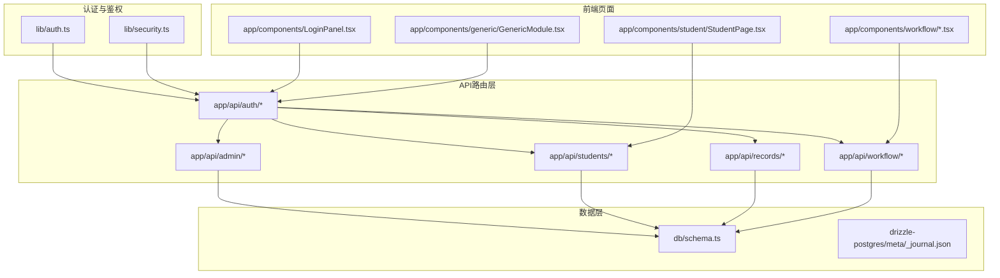
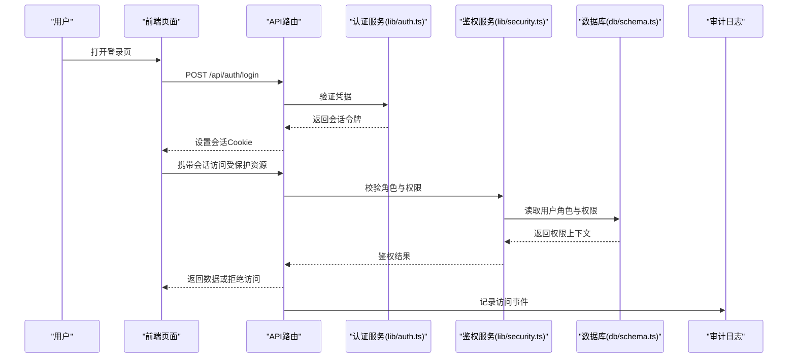
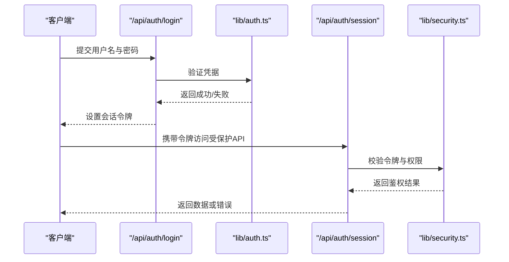
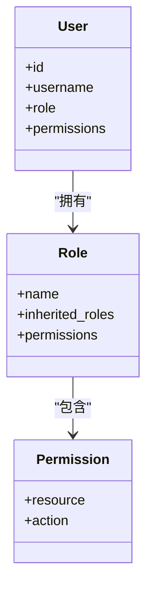
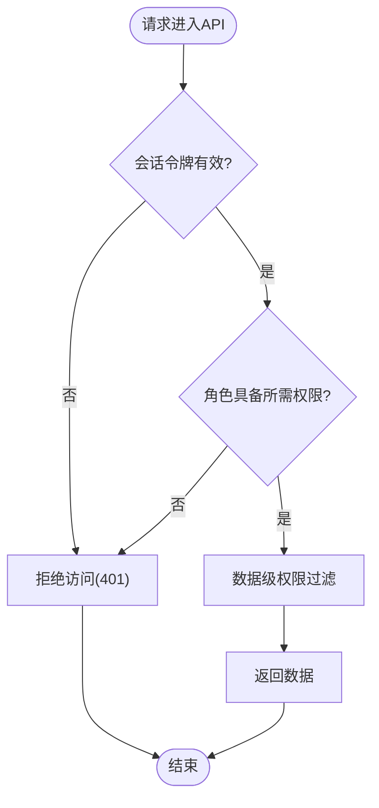
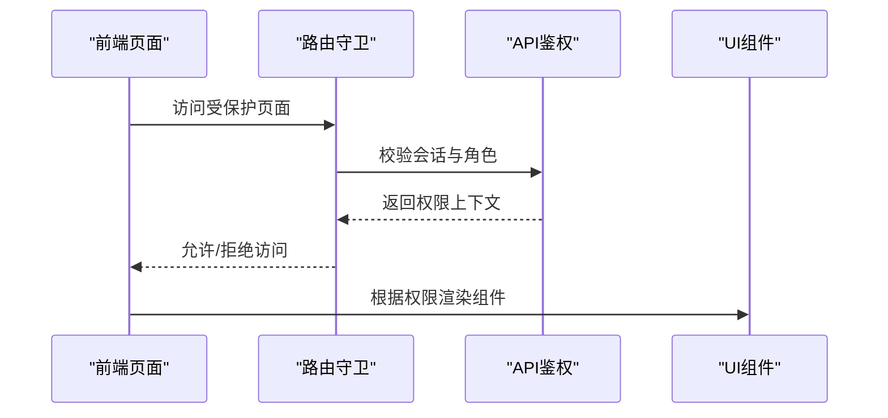
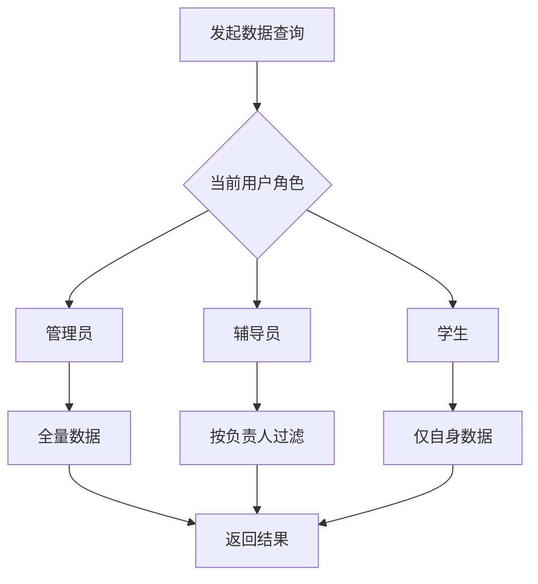
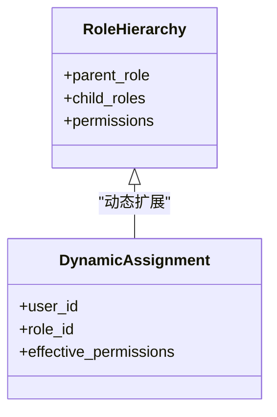
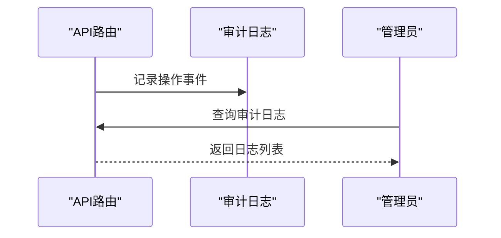
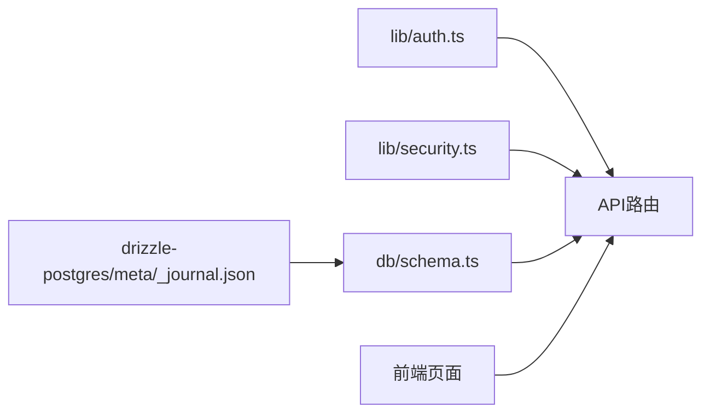

# 权限控制

<cite>
**本文引用的文件**   
- [lib/auth.ts](file://lib/auth.ts)
- [lib/security.ts](file://lib/security.ts)
- [app/api/auth/login/route.ts](file://app/api/auth/login/route.ts)
- [app/api/auth/session/route.ts](file://app/api/auth/session/route.ts)
- [app/api/admin/users/route.ts](file://app/api/admin/users/route.ts)
- [app/api/admin/users/[id]/route.ts](file://app/api/admin/users/[id]/route.ts)
- [app/api/admin/logs/route.ts](file://app/api/admin/logs/route.ts)
- [app/api/students/route.ts](file://app/api/students/route.ts)
- [app/api/students/[id]/route.ts](file://app/api/students/[id]/route.ts)
- [app/api/students/batch/route.ts](file://app/api/students/batch/route.ts)
- [app/api/records/[featureId]/route.ts](file://app/api/records/[featureId]/route.ts)
- [app/api/workflow/instances/route.ts](file://app/api/workflow/instances/route.ts)
- [app/api/workflow/instances/[id]/route.ts](file://app/api/workflow/instances/[id]/route.ts)
- [app/api/workflow/tasks/route.ts](file://app/api/workflow/tasks/route.ts)
- [app/api/workflows/route.ts](file://app/api/workflows/route.ts)
- [db/schema.ts](file://db/schema.ts)
- [drizzle-postgres/meta/_journal.json](file://drizzle-postgres/meta/_journal.json)
- [scripts/seed-admin.mjs](file://scripts/seed-admin.mjs)
- [app/chatgpt-auth.ts](file://app/chatgpt-auth.ts)
- [app/layout.tsx](file://app/layout.tsx)
- [app/page.tsx](file://app/page.tsx)
- [app/components/LoginPanel.tsx](file://app/components/LoginPanel.tsx)
- [app/components/student/StudentPage.tsx](file://app/components/student/StudentPage.tsx)
- [app/components/workflow/FormPage.tsx](file://app/components/workflow/FormPage.tsx)
- [app/components/workflow/ModelPage.tsx](file://app/components/workflow/ModelPage.tsx)
- [app/components/workflow/DeploymentPage.tsx](file://app/components/workflow/DeploymentPage.tsx)
- [app/components/workflow/WorkflowSettingsPage.tsx](file://app/components/workflow/WorkflowSettingsPage.tsx)
- [app/components/generic/GenericModule.tsx](file://app/components/generic/GenericModule.tsx)
- [app/components/AppWrapper.tsx](file://app/components/AppWrapper.tsx)
- [lib/validation.ts](file://lib/validation.ts)
- [lib/rate-limit.ts](file://lib/rate-limit.ts)
</cite>

## 目录
1. [简介](#简介)
2. [项目结构](#项目结构)
3. [核心组件](#核心组件)
4. [架构总览](#架构总览)
5. [详细组件分析](#详细组件分析)
6. [依赖关系分析](#依赖关系分析)
7. [性能考虑](#性能考虑)
8. [故障排查指南](#故障排查指南)
9. [结论](#结论)
10. [附录](#附录)

## 简介
本文件面向CS1学生事务管理系统的权限控制，聚焦基于角色的访问控制（RBAC）实现、管理员权限模型与用户角色定义。文档覆盖API级权限检查、页面级访问控制与数据级权限过滤，并说明权限继承机制、动态权限分配与权限审计日志。同时提供权限配置方法、自定义角色创建流程以及权限调试工具使用指南，帮助开发者快速定位和解决权限相关问题。

## 项目结构
权限相关代码主要分布在以下位置：
- 认证与鉴权库：lib/auth.ts、lib/security.ts
- API路由：app/api/* 下的各路由文件，负责请求入口、会话校验、角色校验与数据过滤
- 数据库模式：db/schema.ts 与 drizzle-postgres 迁移元数据，定义用户、角色、权限等实体
- 前端页面与组件：app/components 下的登录面板、学生模块、工作流模块等，负责页面级权限展示与拦截
- 初始化脚本：scripts/seed-admin.mjs，用于初始化管理员账号与默认角色
- 应用布局与入口：app/layout.tsx、app/page.tsx，负责全局状态与导航权限

图表来源
- [lib/auth.ts](file://lib/auth.ts)
- [lib/security.ts](file://lib/security.ts)
- [app/api/auth/login/route.ts](file://app/api/auth/login/route.ts)
- [app/api/auth/session/route.ts](file://app/api/auth/session/route.ts)
- [app/api/admin/users/route.ts](file://app/api/admin/users/route.ts)
- [app/api/students/route.ts](file://app/api/students/route.ts)
- [app/api/records/[featureId]/route.ts](file://app/api/records/[featureId]/route.ts)
- [app/api/workflow/instances/route.ts](file://app/api/workflow/instances/route.ts)
- [db/schema.ts](file://db/schema.ts)
- [drizzle-postgres/meta/_journal.json](file://drizzle-postgres/meta/_journal.json)
- [app/components/LoginPanel.tsx](file://app/components/LoginPanel.tsx)
- [app/components/student/StudentPage.tsx](file://app/components/student/StudentPage.tsx)
- [app/components/workflow/FormPage.tsx](file://app/components/workflow/FormPage.tsx)
- [app/components/workflow/ModelPage.tsx](file://app/components/workflow/ModelPage.tsx)
- [app/components/workflow/DeploymentPage.tsx](file://app/components/workflow/DeploymentPage.tsx)
- [app/components/workflow/WorkflowSettingsPage.tsx](file://app/components/workflow/WorkflowSettingsPage.tsx)
- [app/components/generic/GenericModule.tsx](file://app/components/generic/GenericModule.tsx)

章节来源
- [lib/auth.ts](file://lib/auth.ts)
- [lib/security.ts](file://lib/security.ts)
- [app/api/auth/login/route.ts](file://app/api/auth/login/route.ts)
- [app/api/auth/session/route.ts](file://app/api/auth/session/route.ts)
- [app/api/admin/users/route.ts](file://app/api/admin/users/route.ts)
- [app/api/students/route.ts](file://app/api/students/route.ts)
- [app/api/records/[featureId]/route.ts](file://app/api/records/[featureId]/route.ts)
- [app/api/workflow/instances/route.ts](file://app/api/workflow/instances/route.ts)
- [db/schema.ts](file://db/schema.ts)
- [drizzle-postgres/meta/_journal.json](file://drizzle-postgres/meta/_journal.json)
- [app/components/LoginPanel.tsx](file://app/components/LoginPanel.tsx)
- [app/components/student/StudentPage.tsx](file://app/components/student/StudentPage.tsx)
- [app/components/workflow/FormPage.tsx](file://app/components/workflow/FormPage.tsx)
- [app/components/workflow/ModelPage.tsx](file://app/components/workflow/ModelPage.tsx)
- [app/components/workflow/DeploymentPage.tsx](file://app/components/workflow/DeploymentPage.tsx)
- [app/components/workflow/WorkflowSettingsPage.tsx](file://app/components/workflow/WorkflowSettingsPage.tsx)
- [app/components/generic/GenericModule.tsx](file://app/components/generic/GenericModule.tsx)

## 核心组件
- 认证与会话管理
  - 登录接口：验证用户名与密码，生成会话令牌，记录登录事件
  - 会话校验：解析令牌，加载用户上下文（角色、权限集合），供后续鉴权使用
- 鉴权中间件与策略
  - 角色校验：按资源路径或操作类型判断是否允许访问
  - 权限继承：支持角色层级与权限聚合，减少重复配置
  - 数据级过滤：根据用户角色与归属关系限制查询结果集
- 审计日志
  - 记录关键操作（登录、授权变更、敏感数据访问）
  - 提供管理员查看与导出能力

章节来源
- [lib/auth.ts](file://lib/auth.ts)
- [lib/security.ts](file://lib/security.ts)
- [app/api/auth/login/route.ts](file://app/api/auth/login/route.ts)
- [app/api/auth/session/route.ts](file://app/api/auth/session/route.ts)
- [app/api/admin/logs/route.ts](file://app/api/admin/logs/route.ts)

## 架构总览
系统采用“认证—鉴权—审计”的分层架构：
- 认证层：处理身份验证与会话生命周期
- 鉴权层：在API路由与前端页面进行角色与权限检查
- 数据层：通过数据库模式与查询条件实现数据级权限过滤
- 审计层：对关键操作进行记录与可追溯

图表来源
- [app/api/auth/login/route.ts](file://app/api/auth/login/route.ts)
- [app/api/auth/session/route.ts](file://app/api/auth/session/route.ts)
- [lib/auth.ts](file://lib/auth.ts)
- [lib/security.ts](file://lib/security.ts)
- [db/schema.ts](file://db/schema.ts)
- [app/api/admin/logs/route.ts](file://app/api/admin/logs/route.ts)

## 详细组件分析

### 认证与会话（登录与会话）
- 登录流程
  - 接收用户名与密码
  - 校验用户存在性与密码正确性
  - 生成会话令牌并写入响应头或Cookie
  - 记录登录审计事件
- 会话校验
  - 解析请求中的会话令牌
  - 加载用户上下文（用户ID、角色、权限集合）
  - 将上下文注入后续鉴权逻辑

图表来源
- [app/api/auth/login/route.ts](file://app/api/auth/login/route.ts)
- [app/api/auth/session/route.ts](file://app/api/auth/session/route.ts)
- [lib/auth.ts](file://lib/auth.ts)
- [lib/security.ts](file://lib/security.ts)

章节来源
- [app/api/auth/login/route.ts](file://app/api/auth/login/route.ts)
- [app/api/auth/session/route.ts](file://app/api/auth/session/route.ts)
- [lib/auth.ts](file://lib/auth.ts)

### 管理员权限模型与用户角色
- 管理员权限模型
  - 管理员具备系统级操作权限，包括用户管理、日志查看、工作流管理等
  - 管理员可通过API对用户进行增删改查与权限分配
- 用户角色定义
  - 常见角色：管理员、辅导员、普通学生
  - 角色具备权限集合，支持继承与扩展
- 用户管理API
  - 列表与分页：仅管理员可访问
  - 单个用户详情与更新：需管理员或特定角色
  - 批量操作：需管理员权限

图表来源
- [db/schema.ts](file://db/schema.ts)
- [app/api/admin/users/route.ts](file://app/api/admin/users/route.ts)
- [app/api/admin/users/[id]/route.ts](file://app/api/admin/users/[id]/route.ts)

章节来源
- [app/api/admin/users/route.ts](file://app/api/admin/users/route.ts)
- [app/api/admin/users/[id]/route.ts](file://app/api/admin/users/[id]/route.ts)
- [db/schema.ts](file://db/schema.ts)

### API级权限检查
- 通用鉴权策略
  - 所有受保护API均需携带有效会话令牌
  - 按资源路径与操作类型进行角色校验
  - 未通过鉴权的请求返回统一错误码
- 典型API权限规则
  - 学生管理：管理员可全量操作；辅导员可查看与编辑本人负责的学生；学生仅能查看自身信息
  - 记录管理：按功能模块(featureId)与用户角色决定读写权限
  - 工作流：实例与任务操作需具备相应工作流权限

图表来源
- [lib/security.ts](file://lib/security.ts)
- [app/api/students/route.ts](file://app/api/students/route.ts)
- [app/api/students/[id]/route.ts](file://app/api/students/[id]/route.ts)
- [app/api/records/[featureId]/route.ts](file://app/api/records/[featureId]/route.ts)
- [app/api/workflow/instances/route.ts](file://app/api/workflow/instances/route.ts)
- [app/api/workflow/instances/[id]/route.ts](file://app/api/workflow/instances/[id]/route.ts)
- [app/api/workflow/tasks/route.ts](file://app/api/workflow/tasks/route.ts)

章节来源
- [lib/security.ts](file://lib/security.ts)
- [app/api/students/route.ts](file://app/api/students/route.ts)
- [app/api/students/[id]/route.ts](file://app/api/students/[id]/route.ts)
- [app/api/records/[featureId]/route.ts](file://app/api/records/[featureId]/route.ts)
- [app/api/workflow/instances/route.ts](file://app/api/workflow/instances/route.ts)
- [app/api/workflow/instances/[id]/route.ts](file://app/api/workflow/instances/[id]/route.ts)
- [app/api/workflow/tasks/route.ts](file://app/api/workflow/tasks/route.ts)

### 页面级访问控制
- 登录面板
  - 未登录用户强制跳转至登录页
  - 登录后根据角色渲染不同菜单与功能入口
- 学生模块页面
  - 辅导员与学生可见范围不同，辅导员可查看与编辑负责学生，学生仅查看自身
- 工作流模块页面
  - 表单设计、模型设计、部署与设置页面需具备相应角色权限
- 通用模块
  - 根据权限动态显示表格、导入对话框与统计概览

图表来源
- [app/components/LoginPanel.tsx](file://app/components/LoginPanel.tsx)
- [app/components/student/StudentPage.tsx](file://app/components/student/StudentPage.tsx)
- [app/components/workflow/FormPage.tsx](file://app/components/workflow/FormPage.tsx)
- [app/components/workflow/ModelPage.tsx](file://app/components/workflow/ModelPage.tsx)
- [app/components/workflow/DeploymentPage.tsx](file://app/components/workflow/DeploymentPage.tsx)
- [app/components/workflow/WorkflowSettingsPage.tsx](file://app/components/workflow/WorkflowSettingsPage.tsx)
- [app/components/generic/GenericModule.tsx](file://app/components/generic/GenericModule.tsx)

章节来源
- [app/components/LoginPanel.tsx](file://app/components/LoginPanel.tsx)
- [app/components/student/StudentPage.tsx](file://app/components/student/StudentPage.tsx)
- [app/components/workflow/FormPage.tsx](file://app/components/workflow/FormPage.tsx)
- [app/components/workflow/ModelPage.tsx](file://app/components/workflow/ModelPage.tsx)
- [app/components/workflow/DeploymentPage.tsx](file://app/components/workflow/DeploymentPage.tsx)
- [app/components/workflow/WorkflowSettingsPage.tsx](file://app/components/workflow/WorkflowSettingsPage.tsx)
- [app/components/generic/GenericModule.tsx](file://app/components/generic/GenericModule.tsx)

### 数据级权限过滤
- 学生数据
  - 辅导员只能访问被分配的学生记录
  - 学生只能访问自己的记录
- 记录与业务数据
  - 按功能模块与用户角色过滤查询结果
- 工作流数据
  - 实例与任务按用户角色与所属组织过滤

图表来源
- [app/api/students/route.ts](file://app/api/students/route.ts)
- [app/api/students/[id]/route.ts](file://app/api/students/[id]/route.ts)
- [app/api/records/[featureId]/route.ts](file://app/api/records/[featureId]/route.ts)
- [app/api/workflow/instances/route.ts](file://app/api/workflow/instances/route.ts)
- [app/api/workflow/instances/[id]/route.ts](file://app/api/workflow/instances/[id]/route.ts)
- [app/api/workflow/tasks/route.ts](file://app/api/workflow/tasks/route.ts)

章节来源
- [app/api/students/route.ts](file://app/api/students/route.ts)
- [app/api/students/[id]/route.ts](file://app/api/students/[id]/route.ts)
- [app/api/records/[featureId]/route.ts](file://app/api/records/[featureId]/route.ts)
- [app/api/workflow/instances/route.ts](file://app/api/workflow/instances/route.ts)
- [app/api/workflow/instances/[id]/route.ts](file://app/api/workflow/instances/[id]/route.ts)
- [app/api/workflow/tasks/route.ts](file://app/api/workflow/tasks/route.ts)

### 权限继承机制与动态权限分配
- 权限继承
  - 角色可继承其他角色的权限集合，简化配置与维护
  - 继承链支持多层级，避免重复定义
- 动态权限分配
  - 管理员可通过API为用户动态添加或移除权限
  - 权限变更即时生效，无需重启服务

图表来源
- [db/schema.ts](file://db/schema.ts)
- [app/api/admin/users/[id]/route.ts](file://app/api/admin/users/[id]/route.ts)

章节来源
- [db/schema.ts](file://db/schema.ts)
- [app/api/admin/users/[id]/route.ts](file://app/api/admin/users/[id]/route.ts)

### 权限审计日志
- 审计内容
  - 登录成功/失败
  - 权限变更（角色分配、权限授予/撤销）
  - 敏感数据访问（学生信息、工作流配置）
- 审计查看
  - 管理员可通过日志API查看与导出审计记录

图表来源
- [app/api/admin/logs/route.ts](file://app/api/admin/logs/route.ts)

章节来源
- [app/api/admin/logs/route.ts](file://app/api/admin/logs/route.ts)

## 依赖关系分析
- 认证与鉴权库依赖
  - lib/auth.ts 负责会话与凭据校验
  - lib/security.ts 负责角色与权限策略
- API路由依赖
  - 各API路由依赖认证与会话校验，调用鉴权策略进行访问控制
- 数据层依赖
  - db/schema.ts 定义用户、角色、权限等实体
  - drizzle-postgres 迁移元数据确保数据库结构与权限模型一致
- 前端依赖
  - 页面组件依赖API返回的权限上下文进行渲染与交互控制

图表来源
- [lib/auth.ts](file://lib/auth.ts)
- [lib/security.ts](file://lib/security.ts)
- [db/schema.ts](file://db/schema.ts)
- [drizzle-postgres/meta/_journal.json](file://drizzle-postgres/meta/_journal.json)
- [app/api/auth/login/route.ts](file://app/api/auth/login/route.ts)
- [app/api/auth/session/route.ts](file://app/api/auth/session/route.ts)
- [app/api/admin/users/route.ts](file://app/api/admin/users/route.ts)
- [app/api/students/route.ts](file://app/api/students/route.ts)
- [app/api/records/[featureId]/route.ts](file://app/api/records/[featureId]/route.ts)
- [app/api/workflow/instances/route.ts](file://app/api/workflow/instances/route.ts)

章节来源
- [lib/auth.ts](file://lib/auth.ts)
- [lib/security.ts](file://lib/security.ts)
- [db/schema.ts](file://db/schema.ts)
- [drizzle-postgres/meta/_journal.json](file://drizzle-postgres/meta/_journal.json)
- [app/api/auth/login/route.ts](file://app/api/auth/login/route.ts)
- [app/api/auth/session/route.ts](file://app/api/auth/session/route.ts)
- [app/api/admin/users/route.ts](file://app/api/admin/users/route.ts)
- [app/api/students/route.ts](file://app/api/students/route.ts)
- [app/api/records/[featureId]/route.ts](file://app/api/records/[featureId]/route.ts)
- [app/api/workflow/instances/route.ts](file://app/api/workflow/instances/route.ts)

## 性能考虑
- 会话校验缓存：对频繁鉴权的API建议缓存用户权限上下文，减少数据库查询
- 数据级过滤优化：为常用查询字段建立索引，提升分页与过滤性能
- 审计日志异步化：将审计写入改为异步队列，降低主流程延迟
- 限流与防抖：结合lib/rate-limit.ts对登录与敏感操作进行限流，防止滥用

[本节为通用指导，不直接分析具体文件]

## 故障排查指南
- 常见问题
  - 登录失败：检查凭据是否正确、会话生成是否成功
  - 权限不足：确认用户角色与权限集合是否包含所需权限
  - 数据不可见：检查数据级过滤条件是否符合用户角色与归属关系
- 调试工具
  - 使用浏览器开发者工具查看会话Cookie与请求头
  - 通过管理员日志API查看审计记录，定位问题发生点
  - 使用测试数据生成脚本验证权限模型与数据过滤

章节来源
- [app/api/auth/login/route.ts](file://app/api/auth/login/route.ts)
- [app/api/auth/session/route.ts](file://app/api/auth/session/route.ts)
- [app/api/admin/logs/route.ts](file://app/api/admin/logs/route.ts)
- [lib/rate-limit.ts](file://lib/rate-limit.ts)

## 结论
本系统通过分层架构实现了完善的RBAC权限控制，涵盖认证、鉴权、数据过滤与审计日志。管理员可灵活配置角色与权限，前端页面根据权限动态渲染，确保用户体验与安全性的平衡。建议在生产环境中启用会话缓存与审计异步化，以提升性能与稳定性。

[本节为总结性内容，不直接分析具体文件]

## 附录
- 权限配置方法
  - 通过管理员API新增或修改用户角色与权限
  - 使用角色继承减少重复配置
- 自定义角色创建
  - 定义新角色并赋予权限集合
  - 将用户关联到新角色以生效权限
- 权限调试工具
  - 使用日志API查看审计记录
  - 结合浏览器开发者工具检查会话与请求头

章节来源
- [app/api/admin/users/route.ts](file://app/api/admin/users/route.ts)
- [app/api/admin/users/[id]/route.ts](file://app/api/admin/users/[id]/route.ts)
- [app/api/admin/logs/route.ts](file://app/api/admin/logs/route.ts)
- [scripts/seed-admin.mjs](file://scripts/seed-admin.mjs)