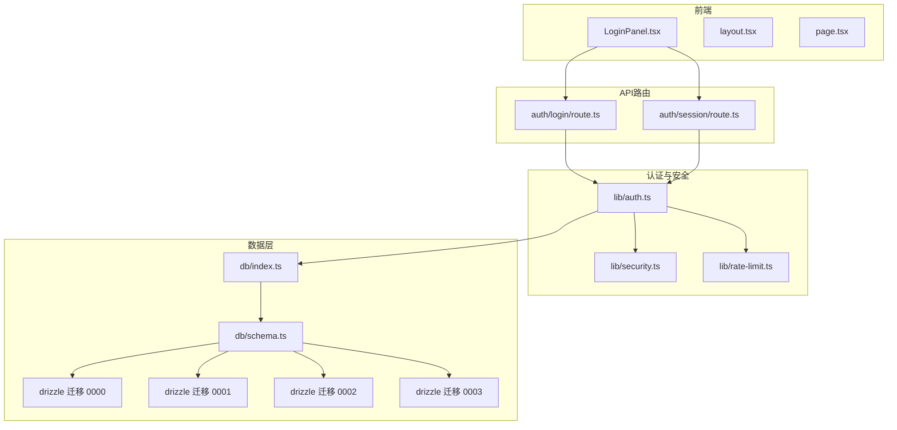
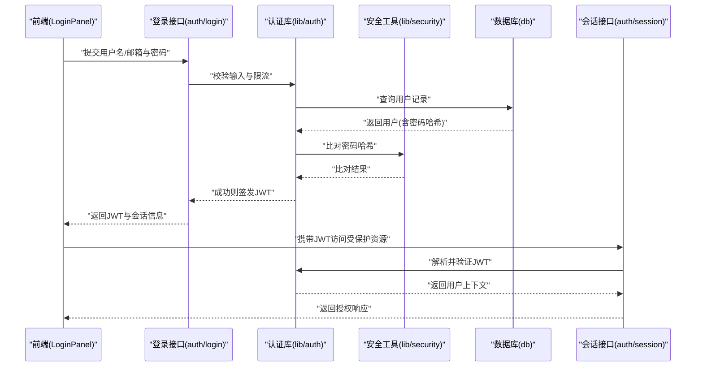
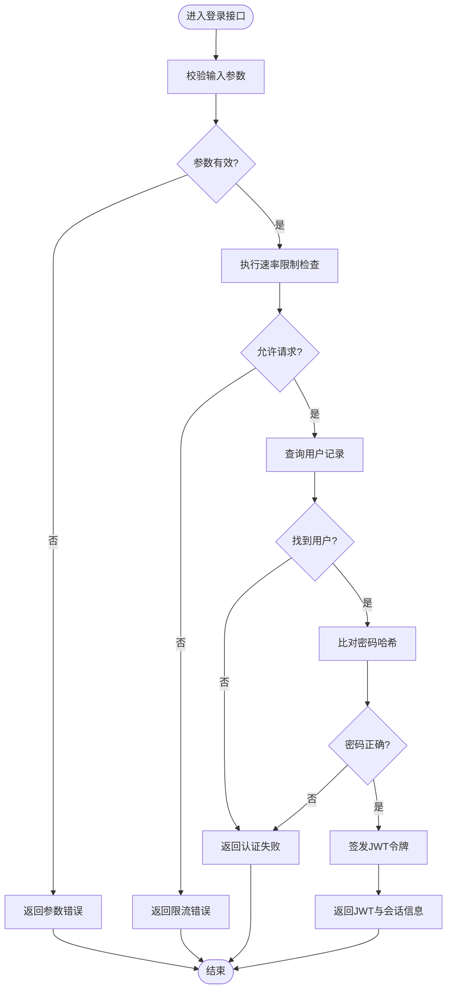
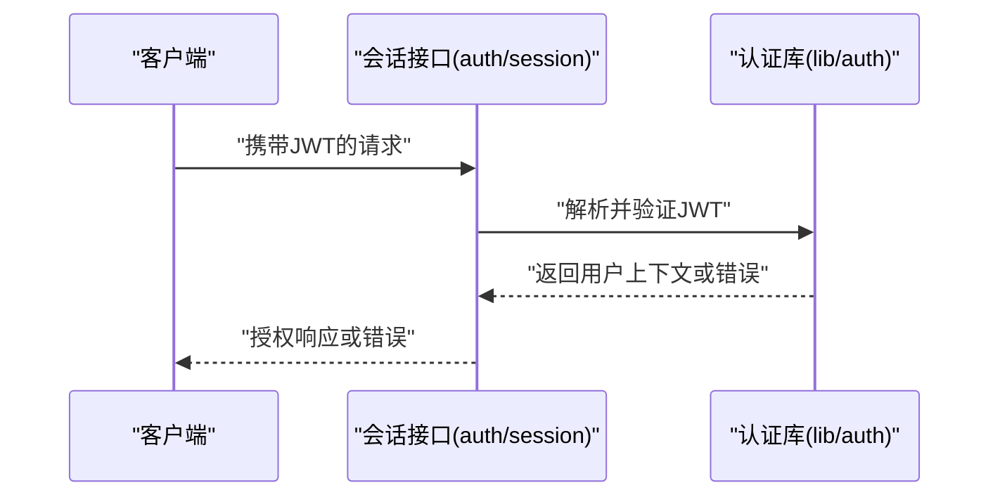
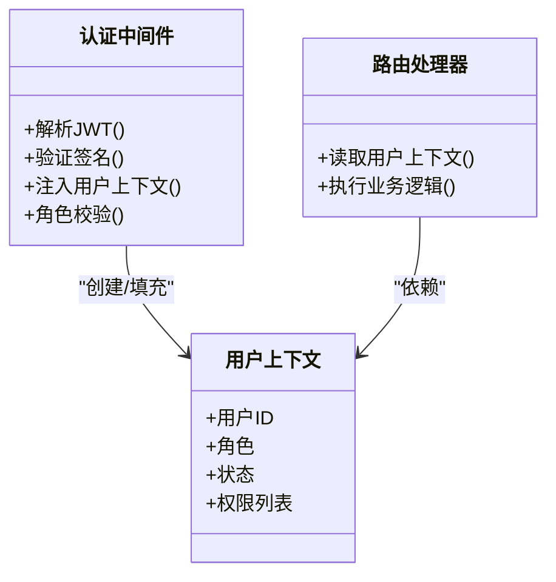
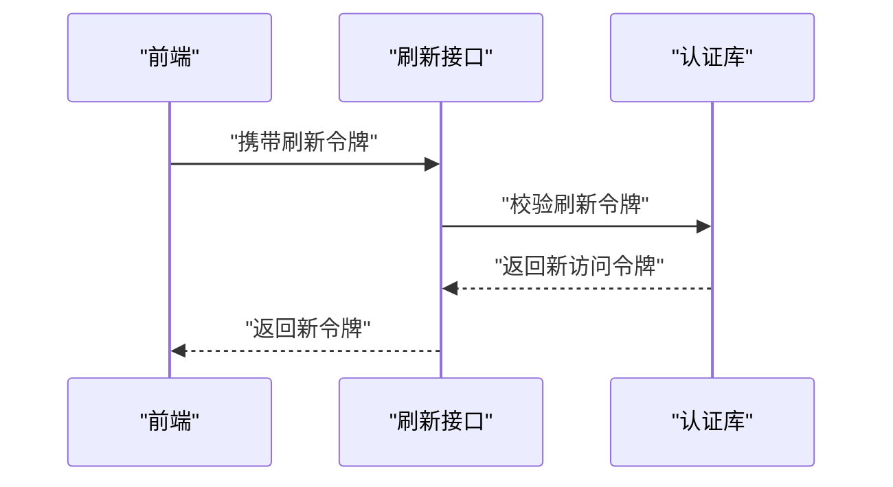
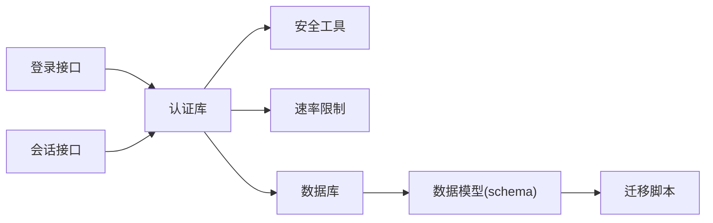

# 用户认证

<cite>
**本文引用的文件**   
- [app/api/auth/login/route.ts](file://app/api/auth/login/route.ts)
- [app/api/auth/session/route.ts](file://app/api/auth/session/route.ts)
- [lib/auth.ts](file://lib/auth.ts)
- [lib/security.ts](file://lib/security.ts)
- [lib/rate-limit.ts](file://lib/rate-limit.ts)
- [db/index.ts](file://db/index.ts)
- [db/schema.ts](file://db/schema.ts)
- [drizzle-postgres/0000_fine_psylocke.sql](file://drizzle-postgres/0000_fine_psylocke.sql)
- [drizzle-postgres/0001_thin_queen_noir.sql](file://drizzle-postgres/0001_thin_queen_noir.sql)
- [drizzle-postgres/0002_crazy_ravenous.sql](file://drizzle-postgres/0002_crazy_ravenous.sql)
- [drizzle-postgres/0003_fine_quentin_quire.sql](file://drizzle-postgres/0003_fine_quentin_quire.sql)
- [app/components/LoginPanel.tsx](file://app/components/LoginPanel.tsx)
- [app/layout.tsx](file://app/layout.tsx)
- [app/page.tsx](file://app/page.tsx)
- [lib/validation.ts](file://lib/validation.ts)
- [tests/lib/auth.test.ts](file://tests/lib/auth.test.ts)
</cite>

## 目录
1. [简介](#简介)
2. [项目结构](#项目结构)
3. [核心组件](#核心组件)
4. [架构总览](#架构总览)
5. [详细组件分析](#详细组件分析)
6. [依赖关系分析](#依赖关系分析)
7. [性能考量](#性能考量)
8. [故障排查指南](#故障排查指南)
9. [结论](#结论)
10. [附录](#附录)

## 简介
本文件面向CS1学生事务管理系统的“用户认证”模块，聚焦JWT令牌生成与验证、登录流程、会话管理、密码加密存储、认证中间件、令牌刷新策略、登出处理、多角色权限基础、用户状态管理与认证错误处理。文档同时提供认证配置选项、安全最佳实践与常见问题解决方案，帮助开发者快速理解并正确扩展认证能力。

## 项目结构
认证相关代码主要分布在以下位置：
- API路由：登录与会话接口位于 app/api/auth/*
- 认证逻辑：lib/auth.ts（JWT、会话、鉴权辅助）
- 安全工具：lib/security.ts（哈希、随机数等）
- 速率限制：lib/rate-limit.ts（防暴力破解）
- 数据库：db/index.ts、db/schema.ts 与 drizzle 迁移脚本
- 前端入口：LoginPanel 组件与页面布局

图表来源
- [app/components/LoginPanel.tsx](file://app/components/LoginPanel.tsx)
- [app/layout.tsx](file://app/layout.tsx)
- [app/page.tsx](file://app/page.tsx)
- [app/api/auth/login/route.ts](file://app/api/auth/login/route.ts)
- [app/api/auth/session/route.ts](file://app/api/auth/session/route.ts)
- [lib/auth.ts](file://lib/auth.ts)
- [lib/security.ts](file://lib/security.ts)
- [lib/rate-limit.ts](file://lib/rate-limit.ts)
- [db/index.ts](file://db/index.ts)
- [db/schema.ts](file://db/schema.ts)
- [drizzle-postgres/0000_fine_psylocke.sql](file://drizzle-postgres/0000_fine_psylocke.sql)
- [drizzle-postgres/0001_thin_queen_noir.sql](file://drizzle-postgres/0001_thin_queen_noir.sql)
- [drizzle-postgres/0002_crazy_ravenous.sql](file://drizzle-postgres/0002_crazy_ravenous.sql)
- [drizzle-postgres/0003_fine_quentin_quire.sql](file://drizzle-postgres/0003_fine_quentin_quire.sql)

章节来源
- [app/api/auth/login/route.ts](file://app/api/auth/login/route.ts)
- [app/api/auth/session/route.ts](file://app/api/auth/session/route.ts)
- [lib/auth.ts](file://lib/auth.ts)
- [lib/security.ts](file://lib/security.ts)
- [lib/rate-limit.ts](file://lib/rate-limit.ts)
- [db/index.ts](file://db/index.ts)
- [db/schema.ts](file://db/schema.ts)
- [drizzle-postgres/0000_fine_psylocke.sql](file://drizzle-postgres/0000_fine_psylocke.sql)
- [drizzle-postgres/0001_thin_queen_noir.sql](file://drizzle-postgres/0001_thin_queen_noir.sql)
- [drizzle-postgres/0002_crazy_ravenous.sql](file://drizzle-postgres/0002_crazy_ravenous.sql)
- [drizzle-postgres/0003_fine_quentin_quire.sql](file://drizzle-postgres/0003_fine_quentin_quire.sql)
- [app/components/LoginPanel.tsx](file://app/components/LoginPanel.tsx)
- [app/layout.tsx](file://app/layout.tsx)
- [app/page.tsx](file://app/page.tsx)

## 核心组件
- 登录接口：接收用户名/邮箱与密码，校验输入、限流、查询用户、比对密码、签发JWT、返回会话信息。
- 会话接口：读取请求中的认证凭据（如Cookie或Authorization头），解析并验证JWT，返回当前用户上下文。
- 认证库：封装JWT签发/验签、会话构造、权限判断、错误映射等通用能力。
- 安全工具：密码哈希、盐值生成、随机令牌、常量时间比较等。
- 速率限制：对登录接口进行频率控制，防止暴力破解。
- 数据模型：用户表、角色字段、状态字段、密码哈希字段等由schema与迁移定义。

章节来源
- [app/api/auth/login/route.ts](file://app/api/auth/login/route.ts)
- [app/api/auth/session/route.ts](file://app/api/auth/session/route.ts)
- [lib/auth.ts](file://lib/auth.ts)
- [lib/security.ts](file://lib/security.ts)
- [lib/rate-limit.ts](file://lib/rate-limit.ts)
- [db/schema.ts](file://db/schema.ts)
- [drizzle-postgres/0000_fine_psylocke.sql](file://drizzle-postgres/0000_fine_psylocke.sql)
- [drizzle-postgres/0001_thin_queen_noir.sql](file://drizzle-postgres/0001_thin_queen_noir.sql)
- [drizzle-postgres/0002_crazy_ravenous.sql](file://drizzle-postgres/0002_crazy_ravenous.sql)
- [drizzle-postgres/0003_fine_quentin_quire.sql](file://drizzle-postgres/0003_fine_quentin_quire.sql)

## 架构总览
下图展示了从前端登录到后端签发JWT、再到后续请求鉴权的完整链路。

图表来源
- [app/api/auth/login/route.ts](file://app/api/auth/login/route.ts)
- [app/api/auth/session/route.ts](file://app/api/auth/session/route.ts)
- [lib/auth.ts](file://lib/auth.ts)
- [lib/security.ts](file://lib/security.ts)
- [db/index.ts](file://db/index.ts)

## 详细组件分析

### 登录流程与JWT签发
- 输入校验：对用户名/邮箱与密码进行格式与长度校验，失败返回统一错误码。
- 速率限制：基于IP或用户标识的滑动窗口计数，超限直接拒绝。
- 用户查询：根据唯一标识查询用户，若不存在返回“账号或密码错误”。
- 密码比对：使用安全工具进行常量时间比较，避免时序攻击。
- JWT签发：包含用户ID、角色、过期时间等声明；签名密钥来自环境变量。
- 会话返回：将JWT通过安全Cookie或响应体返回，前端保存后用于后续请求。

图表来源
- [app/api/auth/login/route.ts](file://app/api/auth/login/route.ts)
- [lib/rate-limit.ts](file://lib/rate-limit.ts)
- [lib/security.ts](file://lib/security.ts)
- [lib/auth.ts](file://lib/auth.ts)

章节来源
- [app/api/auth/login/route.ts](file://app/api/auth/login/route.ts)
- [lib/rate-limit.ts](file://lib/rate-limit.ts)
- [lib/security.ts](file://lib/security.ts)
- [lib/auth.ts](file://lib/auth.ts)

### 会话管理与JWT验证
- 会话接口从请求中提取认证凭据（优先Cookie，其次Authorization头）。
- 解析JWT并验证签名、过期时间与受众/发行者等声明。
- 成功后返回用户上下文（用户ID、角色、状态等），供业务路由使用。
- 失败时返回明确的错误类型（无效令牌、已过期、签名错误等）。

图表来源
- [app/api/auth/session/route.ts](file://app/api/auth/session/route.ts)
- [lib/auth.ts](file://lib/auth.ts)

章节来源
- [app/api/auth/session/route.ts](file://app/api/auth/session/route.ts)
- [lib/auth.ts](file://lib/auth.ts)

### 密码加密存储
- 使用强哈希算法（如bcrypt/argon2）对密码进行加盐哈希。
- 每次登录比对时使用常量时间比较函数，避免时序侧信道。
- 禁止明文存储或可逆加密存储密码。
- 支持未来升级哈希算法时的兼容迁移策略（如双写旧哈希与新哈希）。

章节来源
- [lib/security.ts](file://lib/security.ts)
- [lib/auth.ts](file://lib/auth.ts)

### 认证中间件与权限基础
- 在需要鉴权的API路由前调用认证中间件，完成JWT解析与用户上下文注入。
- 基于角色的访问控制（RBAC）：根据用户角色决定是否允许访问特定资源。
- 支持细粒度权限扩展：可在JWT中附加权限清单或在服务端查表校验。

图表来源
- [lib/auth.ts](file://lib/auth.ts)

章节来源
- [lib/auth.ts](file://lib/auth.ts)

### 令牌刷新策略
- 短生命周期访问令牌：减少泄露风险，频繁刷新。
- 可选刷新令牌：独立于访问令牌，更长生命周期，用于无感续期。
- 刷新流程：客户端携带刷新令牌调用刷新接口，服务端校验后签发新访问令牌。
- 安全建议：刷新令牌应存储在安全Cookie中，设置HttpOnly、Secure、SameSite。

图表来源
- [lib/auth.ts](file://lib/auth.ts)

章节来源
- [lib/auth.ts](file://lib/auth.ts)

### 登出处理
- 服务端登出：使访问令牌失效（黑名单或短期过期）、清除服务端会话（如有）。
- 客户端登出：删除本地存储的令牌与Cookie，重定向至登录页。
- 安全注意：确保所有敏感Cookie被正确清理，避免跨域残留。

章节来源
- [lib/auth.ts](file://lib/auth.ts)

### 多角色权限基础
- 用户角色：管理员、辅导员、学生等，不同角色拥有不同操作权限。
- 权限判定：在认证中间件中根据角色决定是否放行。
- 可扩展性：支持动态权限配置与资源级控制。

章节来源
- [lib/auth.ts](file://lib/auth.ts)
- [db/schema.ts](file://db/schema.ts)

### 用户状态管理
- 用户状态字段：启用/禁用、锁定、待审核等。
- 登录前检查状态：禁用或锁定用户拒绝登录。
- 状态变更审计：记录关键状态变更日志。

章节来源
- [db/schema.ts](file://db/schema.ts)
- [drizzle-postgres/0000_fine_psylocke.sql](file://drizzle-postgres/0000_fine_psylocke.sql)
- [drizzle-postgres/0001_thin_queen_noir.sql](file://drizzle-postgres/0001_thin_queen_noir.sql)
- [drizzle-postgres/0002_crazy_ravenous.sql](file://drizzle-postgres/0002_crazy_ravenous.sql)
- [drizzle-postgres/0003_fine_quentin_quire.sql](file://drizzle-postgres/0003_fine_quentin_quire.sql)

### 认证错误处理
- 统一错误码：参数错误、限流、认证失败、令牌无效、令牌过期等。
- 安全提示：不暴露过多细节，避免枚举用户存在与否。
- 前端处理：根据错误码给出友好提示与重试策略。

章节来源
- [lib/auth.ts](file://lib/auth.ts)
- [lib/rate-limit.ts](file://lib/rate-limit.ts)

## 依赖关系分析
认证模块依赖安全工具、速率限制与数据库访问，形成清晰的分层与职责边界。

图表来源
- [app/api/auth/login/route.ts](file://app/api/auth/login/route.ts)
- [app/api/auth/session/route.ts](file://app/api/auth/session/route.ts)
- [lib/auth.ts](file://lib/auth.ts)
- [lib/security.ts](file://lib/security.ts)
- [lib/rate-limit.ts](file://lib/rate-limit.ts)
- [db/index.ts](file://db/index.ts)
- [db/schema.ts](file://db/schema.ts)
- [drizzle-postgres/0000_fine_psylocke.sql](file://drizzle-postgres/0000_fine_psylocke.sql)
- [drizzle-postgres/0001_thin_queen_noir.sql](file://drizzle-postgres/0001_thin_queen_noir.sql)
- [drizzle-postgres/0002_crazy_ravenous.sql](file://drizzle-postgres/0002_crazy_ravenous.sql)
- [drizzle-postgres/0003_fine_quentin_quire.sql](file://drizzle-postgres/0003_fine_quentin_quire.sql)

章节来源
- [lib/auth.ts](file://lib/auth.ts)
- [lib/security.ts](file://lib/security.ts)
- [lib/rate-limit.ts](file://lib/rate-limit.ts)
- [db/index.ts](file://db/index.ts)
- [db/schema.ts](file://db/schema.ts)

## 性能考量
- 登录接口限流：降低暴力破解成本，避免资源耗尽。
- JWT验证开销：尽量使用高效签名算法，避免重复计算。
- 数据库查询优化：为唯一标识建立索引，减少全表扫描。
- 缓存策略：对热点用户上下文进行短期缓存（需考虑一致性）。
- 连接池：合理配置数据库连接池大小，避免连接泄漏。

[本节为通用指导，无需引用具体文件]

## 故障排查指南
- 登录失败
  - 检查输入校验与限流配置是否正确。
  - 确认用户是否存在且状态正常。
  - 核对密码哈希算法与比对逻辑。
- 令牌无效或过期
  - 检查JWT签名密钥与过期时间配置。
  - 确认客户端是否正确传递与保存令牌。
- 权限不足
  - 检查用户角色与资源权限映射。
  - 确认中间件是否正确注入用户上下文。
- 速率限制触发
  - 调整限流阈值或白名单策略。
  - 检查客户端重试频率。

章节来源
- [lib/auth.ts](file://lib/auth.ts)
- [lib/rate-limit.ts](file://lib/rate-limit.ts)
- [tests/lib/auth.test.ts](file://tests/lib/auth.test.ts)

## 结论
本认证方案以JWT为核心，结合安全哈希、速率限制与中间件鉴权，实现了安全的登录与会话管理。通过清晰的分层与可扩展的权限设计，系统能够支撑多角色与细粒度控制。建议在部署时严格配置密钥与Cookie安全属性，并结合监控与审计提升整体安全性。

[本节为总结性内容，无需引用具体文件]

## 附录

### 认证配置选项
- JWT签名密钥：必须高强度且定期轮换。
- 令牌有效期：访问令牌短时效，刷新令牌长时效（可选）。
- Cookie安全属性：HttpOnly、Secure、SameSite=Strict/Lax。
- 速率限制：按IP或用户维度设置阈值与窗口。
- 数据库连接：连接池大小、超时与重试策略。

章节来源
- [lib/auth.ts](file://lib/auth.ts)
- [lib/rate-limit.ts](file://lib/rate-limit.ts)

### 安全最佳实践
- 使用强哈希算法与盐值，禁止明文存储密码。
- 对所有敏感传输启用HTTPS。
- 最小权限原则：仅授予必要角色与资源访问。
- 定期轮换密钥与令牌，启用审计日志。
- 前端避免在URL或日志中泄露令牌。

章节来源
- [lib/security.ts](file://lib/security.ts)
- [lib/auth.ts](file://lib/auth.ts)

### 常见认证问题解决方案
- 无法登录：检查限流、用户状态与密码哈希。
- 令牌频繁过期：调整过期时间或实现刷新机制。
- 跨域Cookie丢失：配置正确的域名、路径与安全属性。
- 权限异常：核对角色映射与中间件逻辑。

章节来源
- [lib/auth.ts](file://lib/auth.ts)
- [lib/rate-limit.ts](file://lib/rate-limit.ts)