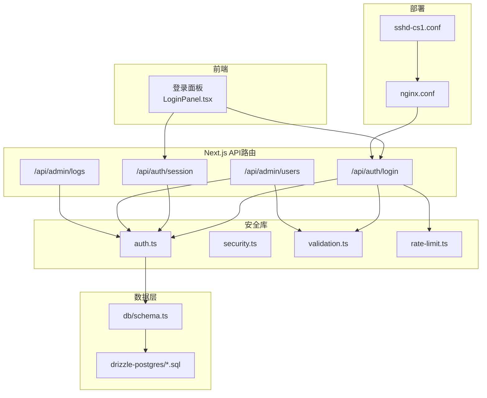
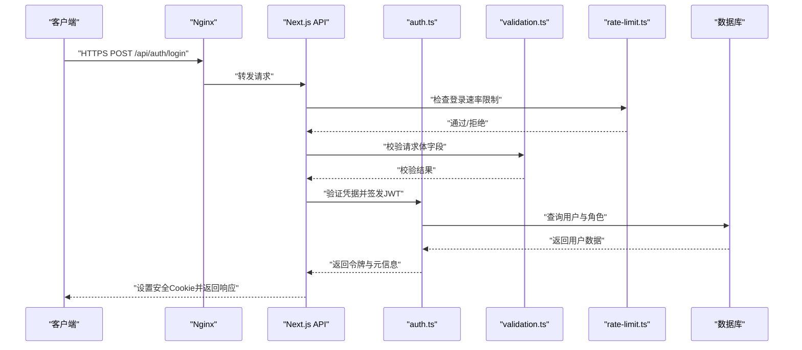
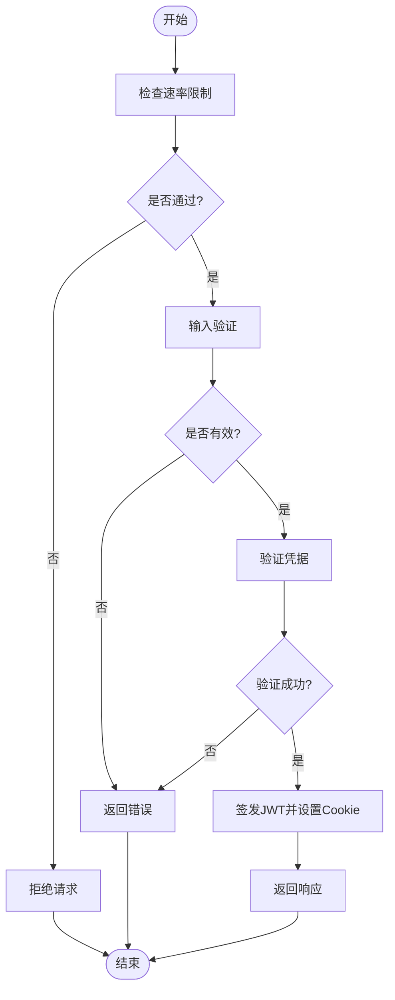
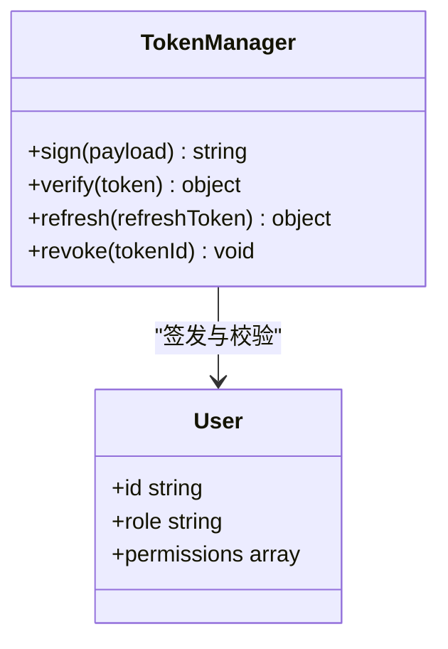
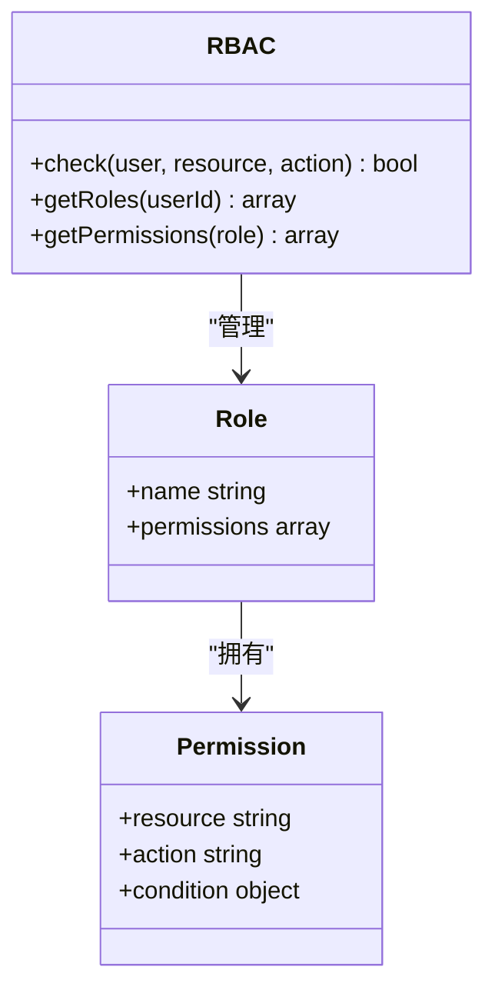
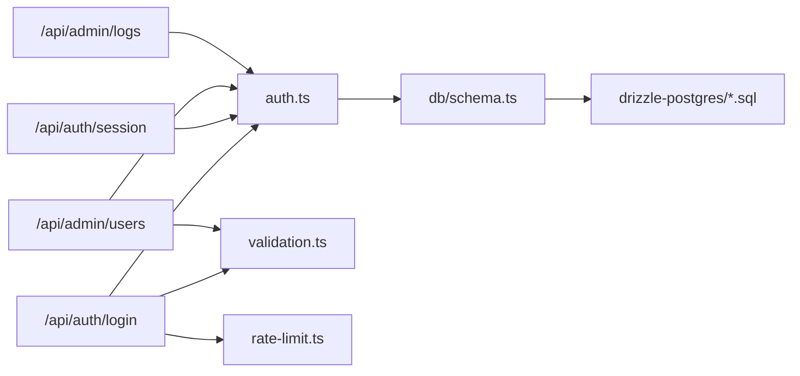

# 认证与安全

<cite>
**本文引用的文件**   
- [lib/auth.ts](file://lib/auth.ts)
- [lib/security.ts](file://lib/security.ts)
- [lib/validation.ts](file://lib/validation.ts)
- [lib/rate-limit.ts](file://lib/rate-limit.ts)
- [app/api/auth/login/route.ts](file://app/api/auth/login/route.ts)
- [app/api/auth/session/route.ts](file://app/api/auth/session/route.ts)
- [app/api/admin/users/route.ts](file://app/api/admin/users/route.ts)
- [app/api/admin/logs/route.ts](file://app/api/admin/logs/route.ts)
- [db/schema.ts](file://db/schema.ts)
- [drizzle-postgres/0000_fine_psylocke.sql](file://drizzle-postgres/0000_fine_psylocke.sql)
- [drizzle-postgres/0001_thin_queen_noir.sql](file://drizzle-postgres/0001_thin_queen_noir.sql)
- [drizzle-postgres/0002_crazy_ravenous.sql](file://drizzle-postgres/0002_crazy_ravenous.sql)
- [drizzle-postgres/0003_fine_quentin_quire.sql](file://drizzle-postgres/0003_fine_quentin_quire.sql)
- [deploy/nginx.conf](file://deploy/nginx.conf)
- [deploy/sshd-cs1.conf](file://deploy/sshd-cs1.conf)
- [tests/lib/auth.test.ts](file://tests/lib/auth.test.ts)
- [tests/lib/security.test.ts](file://tests/lib/security.test.ts)
- [tests/lib/validation.test.ts](file://tests/lib/validation.test.ts)
</cite>

## 目录
1. [简介](#简介)
2. [项目结构](#项目结构)
3. [核心组件](#核心组件)
4. [架构总览](#架构总览)
5. [详细组件分析](#详细组件分析)
6. [依赖分析](#依赖分析)
7. [性能考虑](#性能考虑)
8. [故障排查指南](#故障排查指南)
9. [结论](#结论)
10. [附录](#附录)

## 简介
本文件面向CS1学生事务管理系统的“认证与安全”主题，覆盖用户认证流程、会话管理、权限控制与安全防护。重点包括：
- JWT令牌签发、校验与刷新策略
- 密码加密存储与传输安全
- 输入验证与XSS防护
- 速率限制与防暴力破解
- 多角色权限管理与细粒度访问控制
- 审计日志与合规性要求
- 安全配置与测试方法

## 项目结构
认证与安全相关代码主要分布在以下位置：
- 认证与会话API：app/api/auth/*
- 安全工具库：lib/security.ts、lib/validation.ts、lib/rate-limit.ts、lib/auth.ts
- 数据库模型与迁移：db/schema.ts、drizzle-postgres/*.sql
- 部署与基础设施：deploy/nginx.conf、deploy/sshd-cs1.conf
- 测试用例：tests/lib/*

图表来源
- [app/api/auth/login/route.ts](file://app/api/auth/login/route.ts)
- [app/api/auth/session/route.ts](file://app/api/auth/session/route.ts)
- [lib/auth.ts](file://lib/auth.ts)
- [lib/security.ts](file://lib/security.ts)
- [lib/validation.ts](file://lib/validation.ts)
- [lib/rate-limit.ts](file://lib/rate-limit.ts)
- [db/schema.ts](file://db/schema.ts)
- [drizzle-postgres/0000_fine_psylocke.sql](file://drizzle-postgres/0000_fine_psylocke.sql)
- [drizzle-postgres/0001_thin_queen_noir.sql](file://drizzle-postgres/0001_thin_queen_noir.sql)
- [drizzle-postgres/0002_crazy_ravenous.sql](file://drizzle-postgres/0002_crazy_ravenous.sql)
- [drizzle-postgres/0003_fine_quentin_quire.sql](file://drizzle-postgres/0003_fine_quentin_quire.sql)
- [deploy/nginx.conf](file://deploy/nginx.conf)
- [deploy/sshd-cs1.conf](file://deploy/sshd-cs1.conf)

章节来源
- [app/api/auth/login/route.ts](file://app/api/auth/login/route.ts)
- [app/api/auth/session/route.ts](file://app/api/auth/session/route.ts)
- [lib/auth.ts](file://lib/auth.ts)
- [lib/security.ts](file://lib/security.ts)
- [lib/validation.ts](file://lib/validation.ts)
- [lib/rate-limit.ts](file://lib/rate-limit.ts)
- [db/schema.ts](file://db/schema.ts)
- [drizzle-postgres/0000_fine_psylocke.sql](file://drizzle-postgres/0000_fine_psylocke.sql)
- [drizzle-postgres/0001_thin_queen_noir.sql](file://drizzle-postgres/0001_thin_queen_noir.sql)
- [drizzle-postgres/0002_crazy_ravenous.sql](file://drizzle-postgres/0002_crazy_ravenous.sql)
- [drizzle-postgres/0003_fine_quentin_quire.sql](file://drizzle-postgres/0003_fine_quentin_quire.sql)
- [deploy/nginx.conf](file://deploy/nginx.conf)
- [deploy/sshd-cs1.conf](file://deploy/sshd-cs1.conf)

## 核心组件
- 认证库（auth.ts）：负责JWT的签发、校验、刷新以及会话上下文构建；提供鉴权中间件能力。
- 安全库（security.ts）：统一处理敏感信息脱敏、输出编码、CSP与XSS防护策略、Cookie安全属性等。
- 输入验证（validation.ts）：对请求体字段进行白名单校验、类型检查、长度与格式约束，防止注入与越权。
- 速率限制（rate-limit.ts）：基于IP或用户标识的限流策略，保护登录与会话接口免受暴力破解。
- 认证API（login/session）：实现登录、登出、会话查询与刷新；对接auth库与验证库。
- 管理员API（admin/users、admin/logs）：基于角色的访问控制（RBAC），仅允许管理员操作；记录审计日志。
- 数据模型（schema.ts与迁移脚本）：定义用户、角色、权限、会话与审计表结构，确保数据完整性与一致性。

章节来源
- [lib/auth.ts](file://lib/auth.ts)
- [lib/security.ts](file://lib/security.ts)
- [lib/validation.ts](file://lib/validation.ts)
- [lib/rate-limit.ts](file://lib/rate-limit.ts)
- [app/api/auth/login/route.ts](file://app/api/auth/login/route.ts)
- [app/api/auth/session/route.ts](file://app/api/auth/session/route.ts)
- [app/api/admin/users/route.ts](file://app/api/admin/users/route.ts)
- [app/api/admin/logs/route.ts](file://app/api/admin/logs/route.ts)
- [db/schema.ts](file://db/schema.ts)
- [drizzle-postgres/0000_fine_psylocke.sql](file://drizzle-postgres/0000_fine_psylocke.sql)
- [drizzle-postgres/0001_thin_queen_noir.sql](file://drizzle-postgres/0001_thin_queen_noir.sql)
- [drizzle-postgres/0002_crazy_ravenous.sql](file://drizzle-postgres/0002_crazy_ravenous.sql)
- [drizzle-postgres/0003_fine_quentin_quire.sql](file://drizzle-postgres/0003_fine_quentin_quire.sql)

## 架构总览
系统采用Next.js API路由作为认证入口，结合lib中的安全库完成令牌与权限控制。Nginx作为反向代理与TLS终止点，SSH加固服务器访问。

图表来源
- [app/api/auth/login/route.ts](file://app/api/auth/login/route.ts)
- [lib/auth.ts](file://lib/auth.ts)
- [lib/validation.ts](file://lib/validation.ts)
- [lib/rate-limit.ts](file://lib/rate-limit.ts)
- [db/schema.ts](file://db/schema.ts)
- [deploy/nginx.conf](file://deploy/nginx.conf)

## 详细组件分析

### 认证流程与会话管理
- 登录流程：客户端提交用户名与密码；服务端进行速率限制与输入校验；调用认证库验证凭据并签发JWT；设置HttpOnly、Secure、SameSite Cookie；返回会话状态。
- 会话管理：通过JWT承载用户身份与角色；支持刷新令牌机制；登出时销毁令牌与清理会话。
- 权限控制：在受保护路由中解析JWT，提取角色与权限；基于RBAC进行资源访问决策；支持细粒度到功能模块的授权。

图表来源
- [app/api/auth/login/route.ts](file://app/api/auth/login/route.ts)
- [lib/rate-limit.ts](file://lib/rate-limit.ts)
- [lib/validation.ts](file://lib/validation.ts)
- [lib/auth.ts](file://lib/auth.ts)

章节来源
- [app/api/auth/login/route.ts](file://app/api/auth/login/route.ts)
- [app/api/auth/session/route.ts](file://app/api/auth/session/route.ts)
- [lib/auth.ts](file://lib/auth.ts)
- [lib/validation.ts](file://lib/validation.ts)
- [lib/rate-limit.ts](file://lib/rate-limit.ts)

### JWT令牌处理
- 签发：包含用户ID、角色、过期时间；使用强密钥与算法；避免将敏感信息放入载荷。
- 校验：验证签名、过期时间与受众；失败则拒绝访问。
- 刷新：支持短期访问令牌与长期刷新令牌；刷新时需验证来源与设备指纹（可选）。
- 撤销：黑名单或版本戳机制用于强制登出与撤销令牌。

图表来源
- [lib/auth.ts](file://lib/auth.ts)
- [db/schema.ts](file://db/schema.ts)

章节来源
- [lib/auth.ts](file://lib/auth.ts)
- [db/schema.ts](file://db/schema.ts)

### 密码加密与传输安全
- 存储：使用强哈希算法（如bcrypt/argon2）加盐存储；禁止明文或可逆加密。
- 传输：全程HTTPS；禁用弱协议与套件；启用HSTS。
- 比较：在服务端进行安全比较；避免侧信道泄露。

章节来源
- [lib/security.ts](file://lib/security.ts)
- [deploy/nginx.conf](file://deploy/nginx.conf)

### 输入验证与XSS防护
- 输入验证：白名单校验、类型与长度限制、正则表达式匹配；拒绝非法输入并返回明确错误。
- XSS防护：输出编码、CSP策略、禁用内联脚本；对用户可控内容严格转义。
- CSRF防护：SameSite Cookie与CSRF令牌（如需跨站表单）。

章节来源
- [lib/validation.ts](file://lib/validation.ts)
- [lib/security.ts](file://lib/security.ts)

### 速率限制与防暴力破解
- 策略：按IP或用户标识限制登录尝试次数；指数退避与临时封禁。
- 监控：记录失败尝试与异常模式；告警与自动处置。
- 弹性：区分正常流量与攻击流量，避免误伤。

章节来源
- [lib/rate-limit.ts](file://lib/rate-limit.ts)
- [app/api/auth/login/route.ts](file://app/api/auth/login/route.ts)

### 多角色权限管理与细粒度访问控制
- 角色模型：管理员、辅导员、学生等角色；角色继承与组合。
- 权限模型：资源-动作-条件三维授权；支持模块级与字段级控制。
- 鉴权中间件：在路由层统一校验角色与权限；未授权返回403。

图表来源
- [app/api/admin/users/route.ts](file://app/api/admin/users/route.ts)
- [db/schema.ts](file://db/schema.ts)

章节来源
- [app/api/admin/users/route.ts](file://app/api/admin/users/route.ts)
- [db/schema.ts](file://db/schema.ts)

### 审计日志与合规性
- 事件记录：登录成功/失败、权限变更、数据修改、导出操作等。
- 日志内容：时间、主体、目标、动作、结果、来源IP与UA。
- 存储与访问：只写追加、防篡改、最小化可见范围；定期归档与保留策略。

章节来源
- [app/api/admin/logs/route.ts](file://app/api/admin/logs/route.ts)
- [db/schema.ts](file://db/schema.ts)

## 依赖分析
认证与安全模块之间的依赖关系如下：

图表来源
- [app/api/auth/login/route.ts](file://app/api/auth/login/route.ts)
- [app/api/auth/session/route.ts](file://app/api/auth/session/route.ts)
- [app/api/admin/users/route.ts](file://app/api/admin/users/route.ts)
- [app/api/admin/logs/route.ts](file://app/api/admin/logs/route.ts)
- [lib/auth.ts](file://lib/auth.ts)
- [lib/validation.ts](file://lib/validation.ts)
- [lib/rate-limit.ts](file://lib/rate-limit.ts)
- [db/schema.ts](file://db/schema.ts)
- [drizzle-postgres/0000_fine_psylocke.sql](file://drizzle-postgres/0000_fine_psylocke.sql)
- [drizzle-postgres/0001_thin_queen_noir.sql](file://drizzle-postgres/0001_thin_queen_noir.sql)
- [drizzle-postgres/0002_crazy_ravenous.sql](file://drizzle-postgres/0002_crazy_ravenous.sql)
- [drizzle-postgres/0003_fine_quentin_quire.sql](file://drizzle-postgres/0003_fine_quentin_quire.sql)

章节来源
- [app/api/auth/login/route.ts](file://app/api/auth/login/route.ts)
- [app/api/auth/session/route.ts](file://app/api/auth/session/route.ts)
- [app/api/admin/users/route.ts](file://app/api/admin/users/route.ts)
- [app/api/admin/logs/route.ts](file://app/api/admin/logs/route.ts)
- [lib/auth.ts](file://lib/auth.ts)
- [lib/validation.ts](file://lib/validation.ts)
- [lib/rate-limit.ts](file://lib/rate-limit.ts)
- [db/schema.ts](file://db/schema.ts)
- [drizzle-postgres/0000_fine_psylocke.sql](file://drizzle-postgres/0000_fine_psylocke.sql)
- [drizzle-postgres/0001_thin_queen_noir.sql](file://drizzle-postgres/0001_thin_queen_noir.sql)
- [drizzle-postgres/0002_crazy_ravenous.sql](file://drizzle-postgres/0002_crazy_ravenous.sql)
- [drizzle-postgres/0003_fine_quentin_quire.sql](file://drizzle-postgres/0003_fine_quentin_quire.sql)

## 性能考虑
- 令牌校验开销：尽量缓存用户角色与权限；减少重复数据库查询。
- 速率限制：内存或Redis存储计数；合理设置窗口大小与阈值。
- 输入验证：尽早失败，避免不必要的后端处理。
- 日志写入：异步落盘与批处理，降低I/O阻塞。

[本节为通用指导，不直接分析具体文件]

## 故障排查指南
- 登录失败：检查速率限制是否触发、输入验证规则、凭据是否正确、JWT密钥配置。
- 会话异常：确认Cookie安全属性（HttpOnly、Secure、SameSite）、域名与路径设置。
- 权限拒绝：核对用户角色与权限映射、RBAC中间件逻辑。
- 审计缺失：检查日志写入权限与数据库连接。

章节来源
- [tests/lib/auth.test.ts](file://tests/lib/auth.test.ts)
- [tests/lib/security.test.ts](file://tests/lib/security.test.ts)
- [tests/lib/validation.test.ts](file://tests/lib/validation.test.ts)

## 结论
本系统通过Next.js API路由与lib安全库构建了完整的认证与安全体系，涵盖JWT令牌、密码加密、输入验证、XSS防护、速率限制、RBAC与审计日志。建议在生产环境强化TLS配置、完善监控告警与渗透测试，持续改进安全基线。

[本节为总结，不直接分析具体文件]

## 附录

### 安全配置指南
- TLS与HTTP：启用HTTPS、HSTS、强套件与证书轮换。
- Cookie：设置HttpOnly、Secure、SameSite=Strict/Lax。
- CSP：限制脚本来源、禁用内联脚本、上报违规。
- 速率限制：登录接口限制尝试次数与冷却时间。
- 审计：开启关键操作日志，集中收集与分析。

章节来源
- [deploy/nginx.conf](file://deploy/nginx.conf)
- [deploy/sshd-cs1.conf](file://deploy/sshd-cs1.conf)
- [lib/security.ts](file://lib/security.ts)
- [lib/rate-limit.ts](file://lib/rate-limit.ts)

### 安全测试方法
- 单元测试：覆盖认证、验证、安全函数与边界条件。
- 集成测试：模拟登录、会话、权限与审计流程。
- 渗透测试：扫描常见漏洞（注入、XSS、CSRF、越权）。
- 回归测试：变更后复跑安全用例，确保无退化。

章节来源
- [tests/lib/auth.test.ts](file://tests/lib/auth.test.ts)
- [tests/lib/security.test.ts](file://tests/lib/security.test.ts)
- [tests/lib/validation.test.ts](file://tests/lib/validation.test.ts)