# Nginx反向代理配置

<cite>
**本文档引用的文件**   
- [nginx.conf](file://deploy/nginx.conf)
- [nginx-http-bootstrap.conf](file://deploy/nginx-http-bootstrap.conf)
- [cs1.service](file://deploy/cs1.service)
- [certbot-renew.service](file://deploy/certbot-renew.service)
- [certbot-renew.timer](file://deploy/certbot-renew.timer)
- [prepare-production-postgres.sh](file://deploy/prepare-production-postgres.sh)
- [setup-postgres.sh](file://deploy/setup-postgres.sh)
- [sshd-cs1.conf](file://deploy/sshd-cs1.conf)
</cite>

## 目录
1. [简介](#简介)
2. [项目结构](#项目结构)
3. [核心组件](#核心组件)
4. [架构总览](#架构总览)
5. [详细组件分析](#详细组件分析)
6. [依赖关系分析](#依赖关系分析)
7. [性能优化建议](#性能优化建议)
8. [故障排查指南](#故障排查指南)
9. [结论](#结论)
10. [附录](#附录)

## 简介
本文件面向CS1学生事务管理系统的部署与运维，提供Nginx作为反向代理的完整配置说明。内容涵盖HTTP到HTTPS重定向、SSL证书管理、静态资源缓存策略、负载均衡与WebSocket支持、请求头与安全头部设置、访问日志格式、错误页面定制、域名绑定、CDN集成以及故障转移等关键主题。文档同时给出架构图与流程图，帮助读者快速理解并落地实施。

## 项目结构
本项目在deploy目录下包含Nginx相关配置文件与服务单元，用于生产环境部署：
- deploy/nginx.conf：主Nginx配置，定义HTTP监听、HTTPS监听、上游应用服务、静态资源与API转发、WebSocket升级、安全头部、日志与缓存策略等。
- deploy/nginx-http-bootstrap.conf：仅处理HTTP到HTTPS的重定向，便于在证书未就绪或初始阶段提供最小可用入口。
- deploy/cs1.service：systemd服务单元，确保Nginx与应用服务按序启动与自启。
- deploy/certbot-renew.service 与 deploy/certbot-renew.timer：自动续期Let's Encrypt证书的服务与定时器。
- deploy/prepare-production-postgres.sh 与 deploy/setup-postgres.sh：数据库初始化脚本（与Nginx无直接耦合，但影响整体可用性）。
- deploy/sshd-cs1.conf：SSH加固配置（提升服务器安全性）。

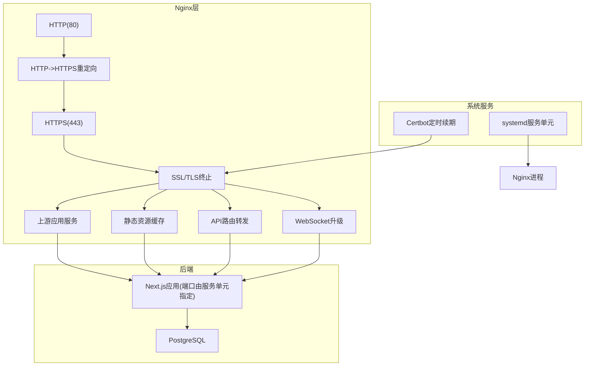

**图示来源** 
- [nginx.conf](file://deploy/nginx.conf)
- [nginx-http-bootstrap.conf](file://deploy/nginx-http-bootstrap.conf)
- [cs1.service](file://deploy/cs1.service)
- [certbot-renew.service](file://deploy/certbot-renew.service)
- [certbot-renew.timer](file://deploy/certbot-renew.timer)

**章节来源**
- [nginx.conf](file://deploy/nginx.conf)
- [nginx-http-bootstrap.conf](file://deploy/nginx-http-bootstrap.conf)
- [cs1.service](file://deploy/cs1.service)
- [certbot-renew.service](file://deploy/certbot-renew.service)
- [certbot-renew.timer](file://deploy/certbot-renew.timer)

## 核心组件
- HTTP到HTTPS重定向
  - 通过独立的HTTP引导配置实现强制跳转，确保所有流量加密。
  - 适用于证书尚未就绪时的最小化入口。
- SSL证书配置
  - 使用Let's Encrypt证书，配合自动续期服务保证长期有效。
  - 推荐启用HSTS、OCSP Stapling与强密码套件。
- 静态资源缓存
  - 对JS/CSS/图片等静态资源设置长缓存与版本化策略。
  - 结合浏览器缓存与CDN缓存提高加载速度。
- 负载均衡与故障转移
  - 将上游应用服务以多实例方式配置，实现横向扩展与故障转移。
  - 可结合健康检查与权重分配策略。
- WebSocket支持
  - 为实时通信路径配置协议升级，保持连接状态。
- 请求头与安全头部
  - 设置X-Forwarded-*、Content-Security-Policy、Strict-Transport-Security等头部。
- 访问日志与错误页面
  - 自定义日志格式，记录关键信息；提供友好错误页以提升用户体验。

**章节来源**
- [nginx.conf](file://deploy/nginx.conf)
- [nginx-http-bootstrap.conf](file://deploy/nginx-http-bootstrap.conf)
- [certbot-renew.service](file://deploy/certbot-renew.service)
- [certbot-renew.timer](file://deploy/certbot-renew.timer)

## 架构总览
下图展示从客户端到Nginx再到上游应用的请求流程，包括HTTP重定向、TLS终止、静态资源与API路由、WebSocket升级及日志记录。

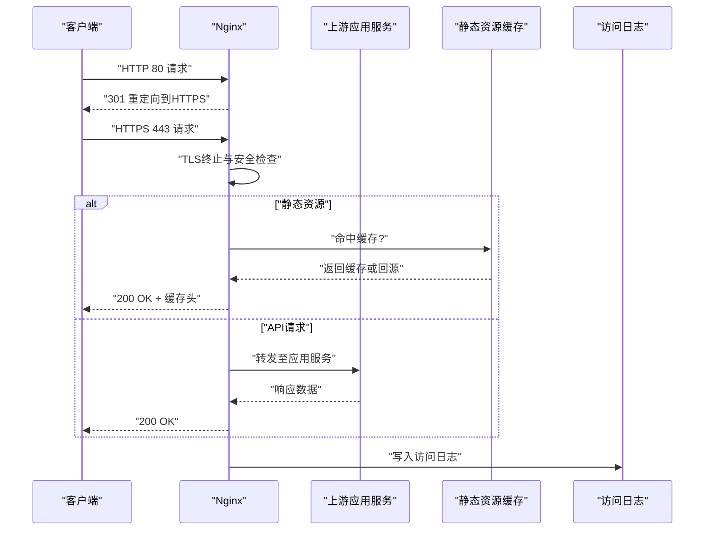

**图示来源** 
- [nginx.conf](file://deploy/nginx.conf)
- [nginx-http-bootstrap.conf](file://deploy/nginx-http-bootstrap.conf)

## 详细组件分析

### HTTP到HTTPS重定向
- 目标：将所有HTTP请求强制跳转到HTTPS，避免明文传输。
- 实现要点：
  - 在HTTP引导配置中监听80端口，匹配Host并返回301重定向到对应HTTPS地址。
  - 保留原始URI与查询参数，确保用户体验一致。
  - 建议在Nginx主配置中禁用不必要的HTTP服务，仅保留重定向逻辑。

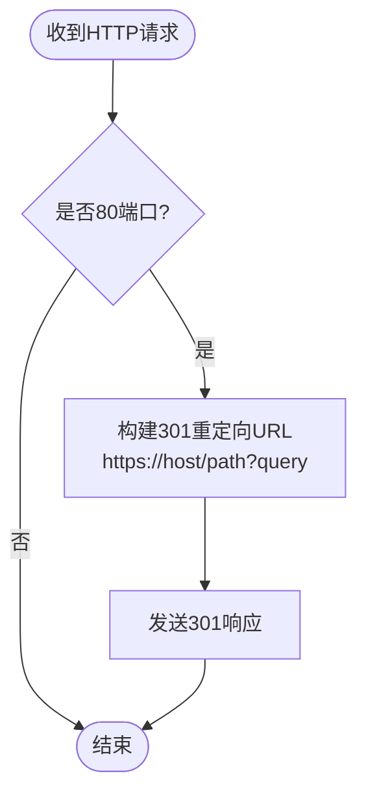

**图示来源** 
- [nginx-http-bootstrap.conf](file://deploy/nginx-http-bootstrap.conf)

**章节来源**
- [nginx-http-bootstrap.conf](file://deploy/nginx-http-bootstrap.conf)

### SSL证书配置与自动续期
- 目标：启用TLS并确保证书长期有效。
- 实现要点：
  - 在HTTPS监听中引入证书与私钥路径。
  - 启用HSTS、OCSP Stapling与强密码套件。
  - 使用Certbot进行证书申请与自动续期，通过systemd定时器触发。

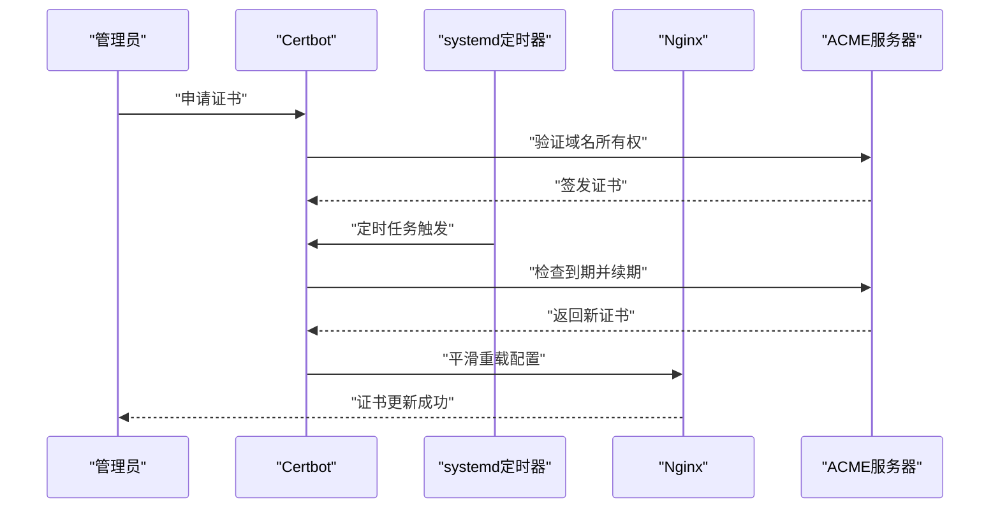

**图示来源** 
- [certbot-renew.service](file://deploy/certbot-renew.service)
- [certbot-renew.timer](file://deploy/certbot-renew.timer)
- [nginx.conf](file://deploy/nginx.conf)

**章节来源**
- [certbot-renew.service](file://deploy/certbot-renew.service)
- [certbot-renew.timer](file://deploy/certbot-renew.timer)
- [nginx.conf](file://deploy/nginx.conf)

### 静态资源缓存策略
- 目标：提升前端资源加载速度与减少带宽消耗。
- 实现要点：
  - 为JS/CSS/图片等设置较长的Cache-Control与Expires。
  - 使用文件名哈希或版本号避免缓存污染。
  - 结合CDN缓存与边缘节点加速。

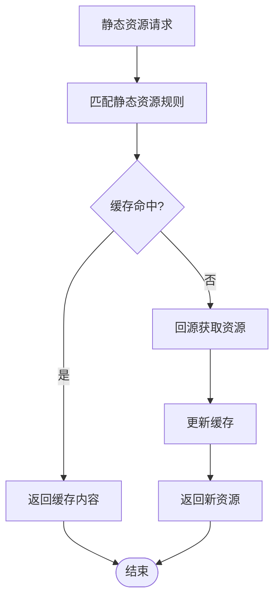

**图示来源** 
- [nginx.conf](file://deploy/nginx.conf)

**章节来源**
- [nginx.conf](file://deploy/nginx.conf)

### 负载均衡与故障转移
- 目标：提高应用可用性与吞吐能力。
- 实现要点：
  - 将多个上游应用实例加入upstream组。
  - 配置健康检查与权重分配，失败实例自动剔除。
  - 结合连接池与超时参数优化性能。

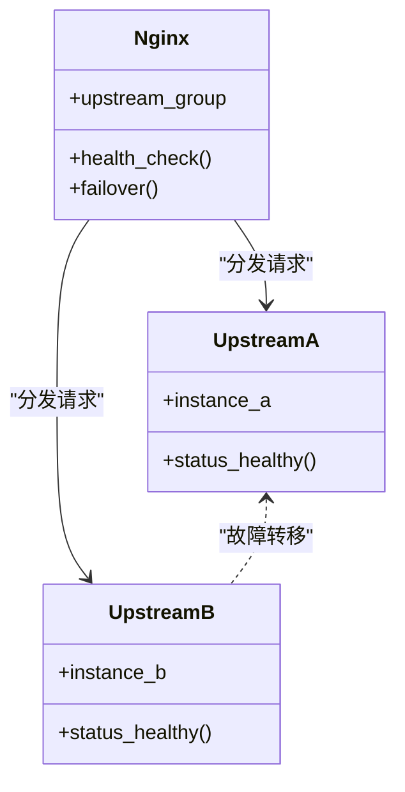

**图示来源** 
- [nginx.conf](file://deploy/nginx.conf)

**章节来源**
- [nginx.conf](file://deploy/nginx.conf)

### WebSocket支持
- 目标：为实时功能（如通知、聊天）提供双向通信。
- 实现要点：
  - 在特定路径下启用Upgrade与Connection头部处理。
  - 设置合理的超时与缓冲参数，避免连接中断。

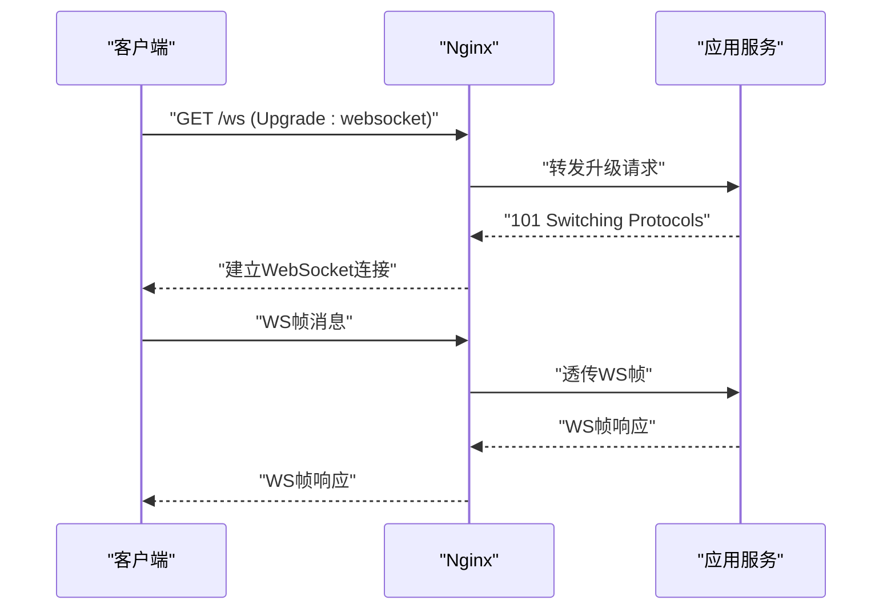

**图示来源** 
- [nginx.conf](file://deploy/nginx.conf)

**章节来源**
- [nginx.conf](file://deploy/nginx.conf)

### 请求头处理与安全头部
- 目标：正确传递客户端信息并增强安全性。
- 实现要点：
  - 设置X-Forwarded-For、X-Forwarded-Proto、Host等头部。
  - 添加CSP、HSTS、Referrer-Policy、X-Frame-Options等安全头部。
  - 限制请求方法与大小，防止滥用。

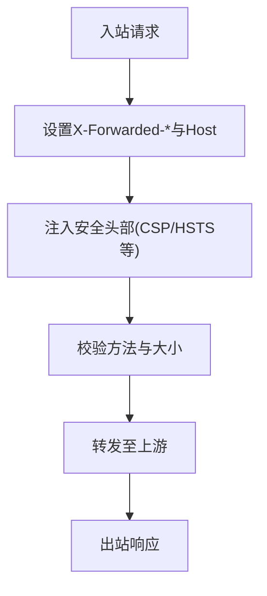

**图示来源** 
- [nginx.conf](file://deploy/nginx.conf)

**章节来源**
- [nginx.conf](file://deploy/nginx.conf)

### 访问日志格式与错误页面定制
- 目标：便于问题定位与提升用户体验。
- 实现要点：
  - 自定义log_format记录时间、客户端IP、请求方法、URI、状态码、耗时等。
  - 配置常见错误码对应的自定义错误页面。
  - 定期轮转与归档日志文件。

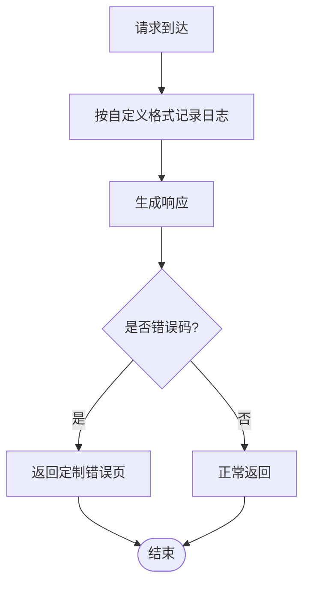

**图示来源** 
- [nginx.conf](file://deploy/nginx.conf)

**章节来源**
- [nginx.conf](file://deploy/nginx.conf)

### 域名绑定与CDN集成
- 目标：实现多域名管理与CDN加速。
- 实现要点：
  - 在server块中绑定不同域名，统一指向HTTPS。
  - 通过CDN缓存静态资源与部分API响应，降低源站压力。
  - 配置CDN回源白名单与签名验证。

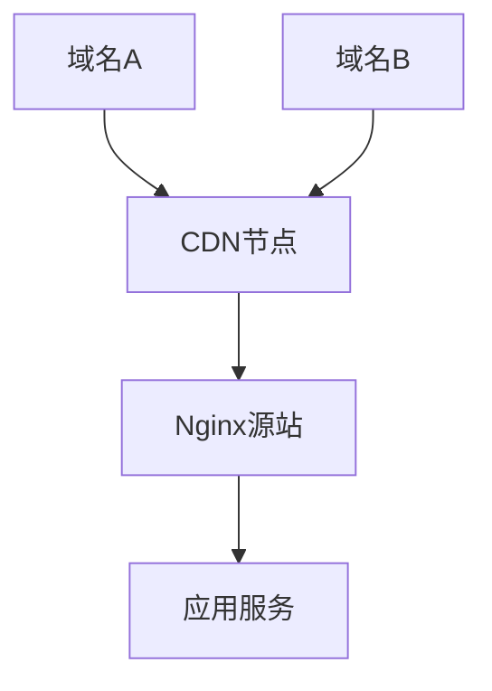

**图示来源** 
- [nginx.conf](file://deploy/nginx.conf)

**章节来源**
- [nginx.conf](file://deploy/nginx.conf)

### 故障转移配置
- 目标：在主节点不可用时自动切换到备用节点。
- 实现要点：
  - 在upstream中配置backup节点与健康检查。
  - 设置重试与超时策略，确保用户体验稳定。

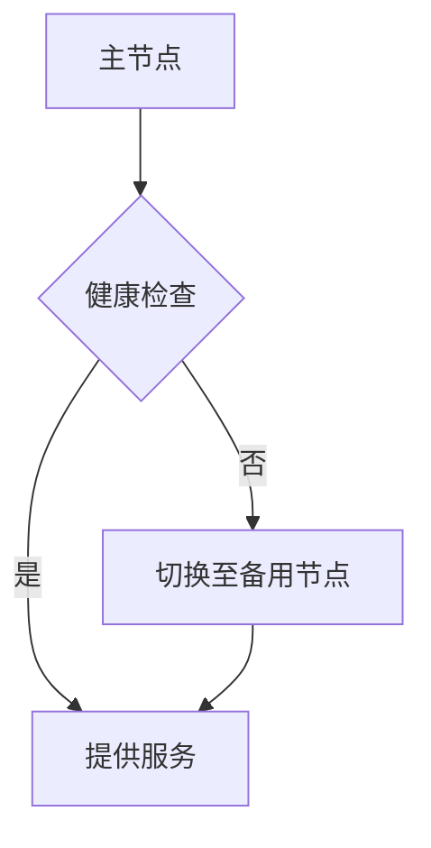

**图示来源** 
- [nginx.conf](file://deploy/nginx.conf)

**章节来源**
- [nginx.conf](file://deploy/nginx.conf)

## 依赖关系分析
Nginx配置与系统服务、证书管理、上游应用与数据库之间存在明确的依赖关系。下图展示了这些组件之间的交互与依赖。

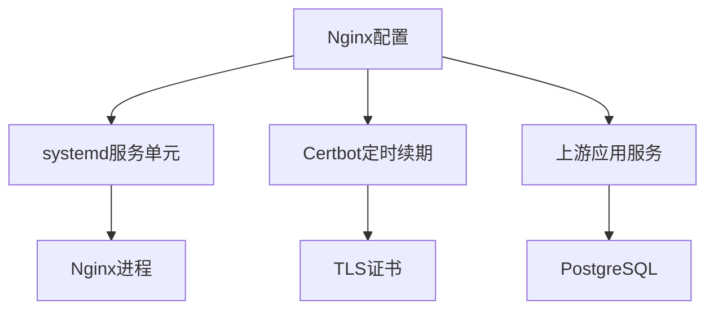

**图示来源** 
- [nginx.conf](file://deploy/nginx.conf)
- [cs1.service](file://deploy/cs1.service)
- [certbot-renew.service](file://deploy/certbot-renew.service)
- [certbot-renew.timer](file://deploy/certbot-renew.timer)

**章节来源**
- [nginx.conf](file://deploy/nginx.conf)
- [cs1.service](file://deploy/cs1.service)
- [certbot-renew.service](file://deploy/certbot-renew.service)
- [certbot-renew.timer](file://deploy/certbot-renew.timer)

## 性能优化建议
- 启用Gzip/Brotli压缩以减少传输体积。
- 合理设置worker_processes与worker_connections，匹配CPU核数与内存。
- 调整keepalive_timeout与sendfile，提升并发处理能力。
- 使用proxy_cache与fastcgi_cache缓存动态与静态内容。
- 开启TCP Fast Open与SO_REUSEPORT优化网络栈。
- 针对大文件上传与下载设置client_max_body_size与缓冲区参数。

[本节为通用性能指导，不直接分析具体文件]

## 故障排查指南
- 证书问题
  - 检查Certbot服务状态与定时器是否正常运行。
  - 确认证书路径与权限正确。
- 连接超时
  - 调整proxy_connect_timeout、proxy_read_timeout与proxy_send_timeout。
  - 检查上游应用服务是否响应缓慢或崩溃。
- 静态资源404
  - 核对静态资源路径与缓存策略。
  - 检查CDN回源配置与白名单。
- WebSocket断开
  - 检查Upgrade与Connection头部是否正确设置。
  - 调整超时与缓冲参数，避免连接被提前关闭。
- 日志分析
  - 查看access_log与error_log定位问题。
  - 使用grep与awk过滤关键错误信息。

**章节来源**
- [nginx.conf](file://deploy/nginx.conf)
- [certbot-renew.service](file://deploy/certbot-renew.service)
- [certbot-renew.timer](file://deploy/certbot-renew.timer)

## 结论
通过本配置文档，CS1学生事务管理系统可在Nginx反向代理层实现安全的HTTPS访问、高效的静态资源缓存、稳定的负载均衡与WebSocket支持，并结合自动化证书管理与CDN集成提升整体性能与可用性。建议在生产环境中持续监控与调优，确保系统在高负载下的稳定运行。

[本节为总结性内容，不直接分析具体文件]

## 附录
- 参考命令
  - 测试Nginx配置语法：nginx -t
  - 平滑重载配置：nginx -s reload
  - 查看服务状态：systemctl status cs1.service
  - 检查证书续期：systemctl status certbot-renew.timer
- 常用路径
  - Nginx主配置：deploy/nginx.conf
  - HTTP引导配置：deploy/nginx-http-bootstrap.conf
  - 服务单元：deploy/cs1.service
  - 证书续期服务：deploy/certbot-renew.service
  - 证书续期定时器：deploy/certbot-renew.timer

**章节来源**
- [nginx.conf](file://deploy/nginx.conf)
- [nginx-http-bootstrap.conf](file://deploy/nginx-http-bootstrap.conf)
- [cs1.service](file://deploy/cs1.service)
- [certbot-renew.service](file://deploy/certbot-renew.service)
- [certbot-renew.timer](file://deploy/certbot-renew.timer)