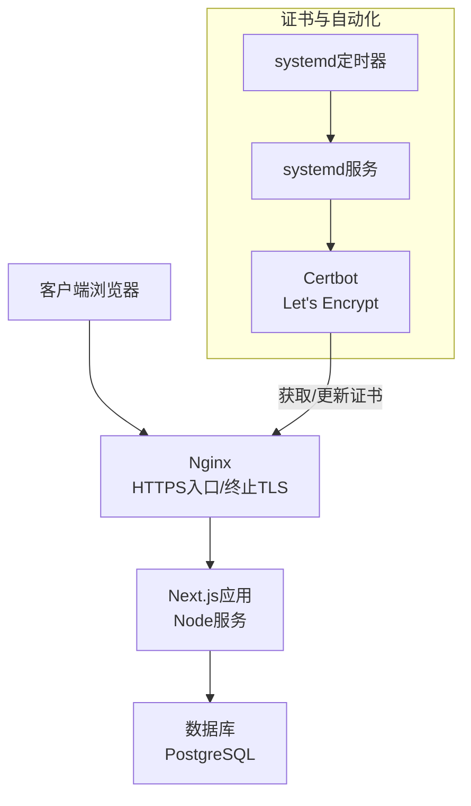
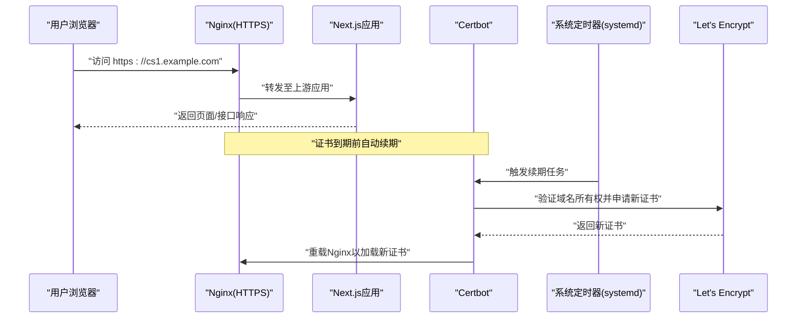
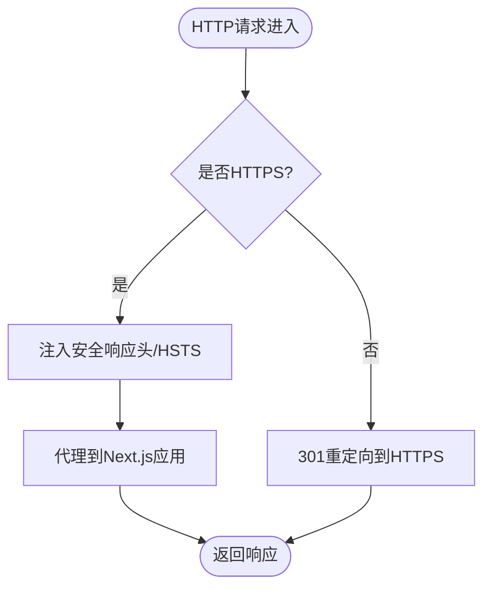
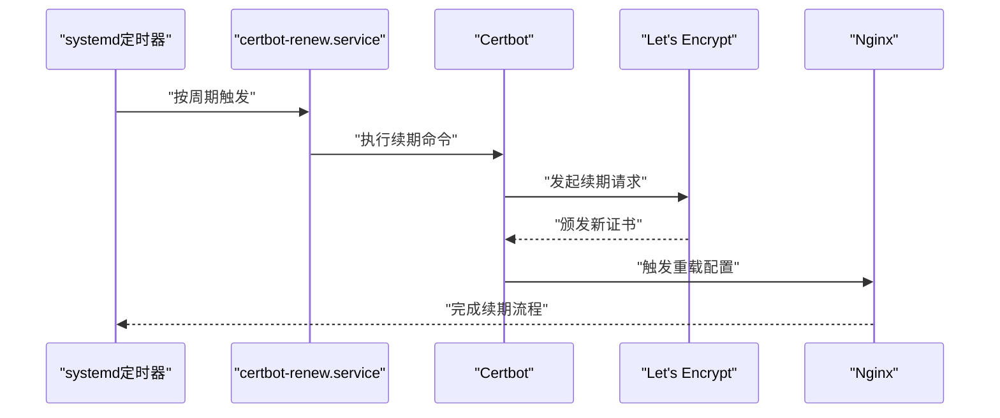
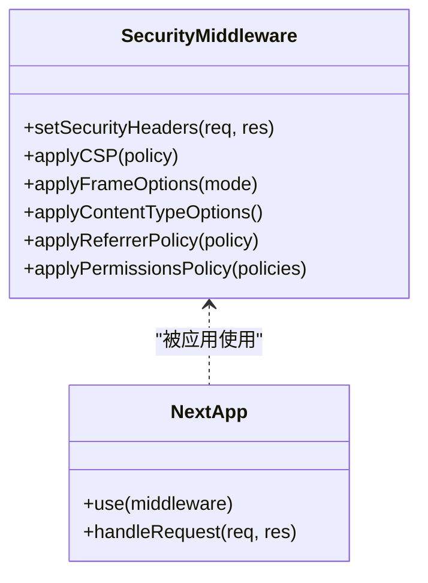
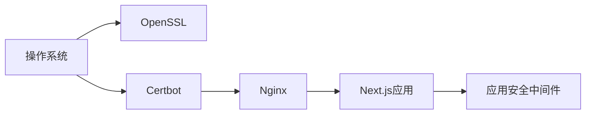

# SSL证书与安全

<cite>
**本文档引用的文件**   
- [deploy/nginx.conf](file://deploy/nginx.conf)
- [deploy/nginx-http-bootstrap.conf](file://deploy/nginx-http-bootstrap.conf)
- [deploy/certbot-renew.service](file://deploy/certbot-renew.service)
- [deploy/certbot-renew.timer](file://deploy/certbot-renew.timer)
- [lib/security.ts](file://lib/security.ts)
- [lib/security.js](file://lib/security.js)
- [next.config.ts](file://next.config.ts)
- [app/layout.tsx](file://app/layout.tsx)
- [app/page.tsx](file://app/page.tsx)
</cite>

## 目录
1. [简介](#简介)
2. [项目结构](#项目结构)
3. [核心组件](#核心组件)
4. [架构总览](#架构总览)
5. [详细组件分析](#详细组件分析)
6. [依赖关系分析](#依赖关系分析)
7. [性能考虑](#性能考虑)
8. [故障排查指南](#故障排查指南)
9. [结论](#结论)
10. [附录](#附录)

## 简介
本文件面向CS1学生事务管理系统的部署与运维，聚焦SSL/TLS证书生命周期管理与整体安全配置。内容涵盖：
- Let's Encrypt证书申请、自动续期与存储管理
- HTTPS强制启用、HSTS与安全响应头
- TLS协议版本与加密套件策略
- 安全审计、漏洞扫描与合规性检查建议

## 项目结构
与SSL和安全相关的配置主要分布在以下位置：
- Nginx反向代理与TLS终止配置（deploy目录下）
- 应用层安全中间件与头部设置（lib下）
- Next.js运行时安全相关配置（根目录配置文件）
- 前端布局中可能包含的安全相关元数据或脚本（app下）

**图示来源** 
- [deploy/nginx.conf](file://deploy/nginx.conf)
- [deploy/nginx-http-bootstrap.conf](file://deploy/nginx-http-bootstrap.conf)
- [deploy/certbot-renew.service](file://deploy/certbot-renew.service)
- [deploy/certbot-renew.timer](file://deploy/certbot-renew.timer)

**章节来源**
- [deploy/nginx.conf](file://deploy/nginx.conf)
- [deploy/nginx-http-bootstrap.conf](file://deploy/nginx-http-bootstrap.conf)
- [deploy/certbot-renew.service](file://deploy/certbot-renew.service)
- [deploy/certbot-renew.timer](file://deploy/certbot-renew.timer)
- [lib/security.ts](file://lib/security.ts)
- [lib/security.js](file://lib/security.js)
- [next.config.ts](file://next.config.ts)
- [app/layout.tsx](file://app/layout.tsx)
- [app/page.tsx](file://app/page.tsx)

## 核心组件
- Nginx作为反向代理与TLS终止点，负责HTTPS监听、HTTP到HTTPS重定向、HSTS与安全响应头注入。
- Certbot用于向Let's Encrypt申请与续期证书，通过systemd定时任务实现自动化。
- 应用层安全模块提供请求级安全策略（如CSP、X-Frame-Options等），并与Nginx共同构成纵深防御。
- Next.js运行时配置确保在受信任代理后正确识别协议与主机头。

**章节来源**
- [deploy/nginx.conf](file://deploy/nginx.conf)
- [deploy/nginx-http-bootstrap.conf](file://deploy/nginx-http-bootstrap.conf)
- [deploy/certbot-renew.service](file://deploy/certbot-renew.service)
- [deploy/certbot-renew.timer](file://deploy/certbot-renew.timer)
- [lib/security.ts](file://lib/security.ts)
- [lib/security.js](file://lib/security.js)
- [next.config.ts](file://next.config.ts)

## 架构总览
下图展示从客户端到后端的数据流以及证书生命周期关键节点。

**图示来源** 
- [deploy/nginx.conf](file://deploy/nginx.conf)
- [deploy/certbot-renew.service](file://deploy/certbot-renew.service)
- [deploy/certbot-renew.timer](file://deploy/certbot-renew.timer)

## 详细组件分析

### Nginx：HTTPS强制、HSTS与安全头
- HTTPS强制：将HTTP请求统一重定向至HTTPS，避免明文传输。
- HSTS：为所有子域启用严格传输安全，防止降级攻击。
- 安全响应头：设置X-Frame-Options、X-Content-Type-Options、Referrer-Policy、Permissions-Policy等，降低常见Web风险。
- TLS参数：限制协议版本（禁用旧版）、选择强加密套件，提升握手安全性。
- 上游代理：正确传递X-Forwarded-*头，使Next.js能识别真实协议与主机。

**图示来源** 
- [deploy/nginx.conf](file://deploy/nginx.conf)
- [deploy/nginx-http-bootstrap.conf](file://deploy/nginx-http-bootstrap.conf)

**章节来源**
- [deploy/nginx.conf](file://deploy/nginx.conf)
- [deploy/nginx-http-bootstrap.conf](file://deploy/nginx-http-bootstrap.conf)

### Certbot：证书申请与自动续期
- 证书申请：首次申请时指定域名与证书保存路径，确保证书对Nginx可读。
- 自动续期：通过systemd定时器定期执行续期任务，成功续期后触发Nginx重载。
- 存储管理：证书与私钥集中存放于只读权限目录，限制访问主体，降低泄露风险。

**图示来源** 
- [deploy/certbot-renew.timer](file://deploy/certbot-renew.timer)
- [deploy/certbot-renew.service](file://deploy/certbot-renew.service)

**章节来源**
- [deploy/certbot-renew.service](file://deploy/certbot-renew.service)
- [deploy/certbot-renew.timer](file://deploy/certbot-renew.timer)

### 应用层安全：中间件与头部策略
- 安全中间件：统一设置CSP、X-Frame-Options、X-Content-Type-Options、Referrer-Policy、Permissions-Policy等响应头。
- 输入校验与错误处理：结合验证库减少注入与异常信息泄露。
- 与Nginx协同：Nginx负责传输层与基础安全头，应用层补充业务相关策略。

**图示来源** 
- [lib/security.ts](file://lib/security.ts)
- [lib/security.js](file://lib/security.js)

**章节来源**
- [lib/security.ts](file://lib/security.ts)
- [lib/security.js](file://lib/security.js)

### Next.js运行时安全相关配置
- 受信任代理：配置trusted proxies，确保在Nginx终止TLS后，应用能正确识别https协议与主机头。
- 安全默认值：开启必要的运行时安全选项，配合Nginx与应用层中间件形成完整防护链。

**章节来源**
- [next.config.ts](file://next.config.ts)

### 前端安全元数据与资源加载
- 安全元标签：在布局或页面中设置meta标签，辅助浏览器安全策略（如X-UA-Compatible、viewport等）。
- 资源加载策略：确保仅加载HTTPS资源，避免混合内容警告。

**章节来源**
- [app/layout.tsx](file://app/layout.tsx)
- [app/page.tsx](file://app/page.tsx)

## 依赖关系分析
- Nginx依赖系统提供的openssl与certbot二进制；证书文件由certbot写入并由Nginx读取。
- Next.js应用依赖Node运行时与受信任代理配置，确保在反向代理后行为一致。
- 应用层安全模块依赖框架的中间件机制，与Nginx安全头互补。

**图示来源** 
- [deploy/nginx.conf](file://deploy/nginx.conf)
- [deploy/certbot-renew.service](file://deploy/certbot-renew.service)
- [lib/security.ts](file://lib/security.ts)

**章节来源**
- [deploy/nginx.conf](file://deploy/nginx.conf)
- [deploy/certbot-renew.service](file://deploy/certbot-renew.service)
- [lib/security.ts](file://lib/security.ts)

## 性能考虑
- TLS会话复用：启用会话缓存与会话票据，减少握手开销。
- HTTP/2与HTTP/3：在Nginx上启用以提升并发性能与延迟表现。
- 压缩与缓存：合理配置静态资源压缩与缓存策略，降低带宽占用。
- 证书链优化：确保服务器证书链完整且顺序正确，减少握手失败与重试。

[本节为通用指导，不直接分析具体文件]

## 故障排查指南
- 证书过期或无法续期：
  - 检查systemd定时器与服务状态，确认定时任务正常触发。
  - 查看certbot日志，定位域名验证失败或网络问题。
  - 确认证书文件权限与路径正确，Nginx可读取。
- HTTPS重定向循环：
  - 检查Nginx的重写规则与X-Forwarded-Proto头是否正确传递。
  - 确认Next.js受信任代理配置与实际部署环境一致。
- HSTS导致无法回退HTTP：
  - 临时清理浏览器HSTS缓存或使用无痕模式测试。
  - 检查max-age与includeSubDomains设置是否符合预期。
- 安全头未生效：
  - 使用curl或浏览器开发者工具检查响应头。
  - 确认Nginx与应用层中间件均正确配置且未被覆盖。

**章节来源**
- [deploy/certbot-renew.timer](file://deploy/certbot-renew.timer)
- [deploy/certbot-renew.service](file://deploy/certbot-renew.service)
- [deploy/nginx.conf](file://deploy/nginx.conf)
- [lib/security.ts](file://lib/security.ts)

## 结论
通过Nginx终止TLS、Certbot自动化证书管理、应用层安全中间件与Next.js运行时配置的协同，CS1学生事务管理系统可实现高标准的传输安全与响应安全。建议持续进行安全审计与漏洞扫描，确保策略随威胁态势演进而更新。

[本节为总结性内容，不直接分析具体文件]

## 附录
- 安全审计与合规建议：
  - 定期进行SSL/TLS配置扫描（如SSL Labs），关注评级与弱套件告警。
  - 启用WAF与速率限制，防范暴力破解与滥用。
  - 建立变更审批与回滚流程，确保配置变更可追溯。
  - 遵循最小权限原则管理证书与密钥文件。

[本节为通用指导，不直接分析具体文件]