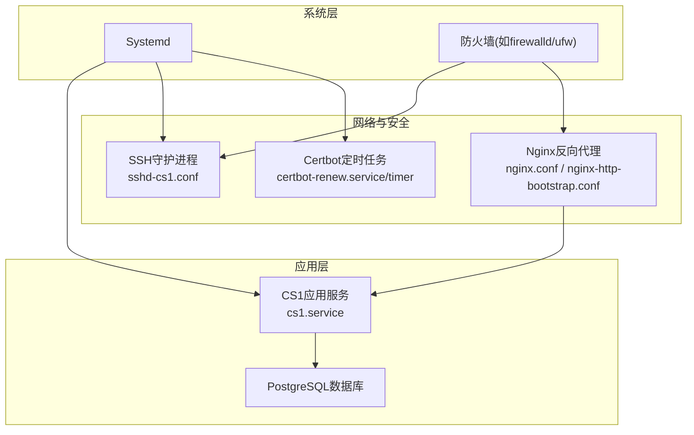
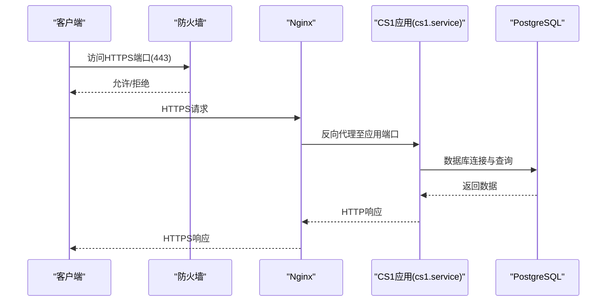
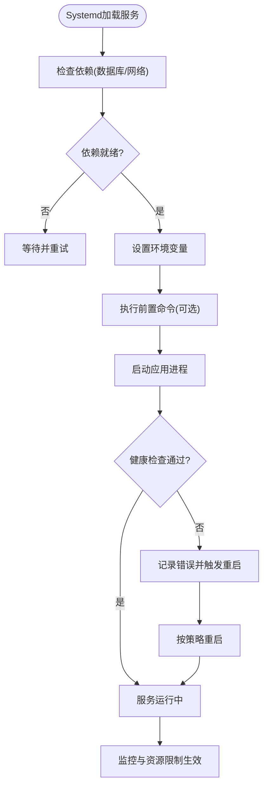
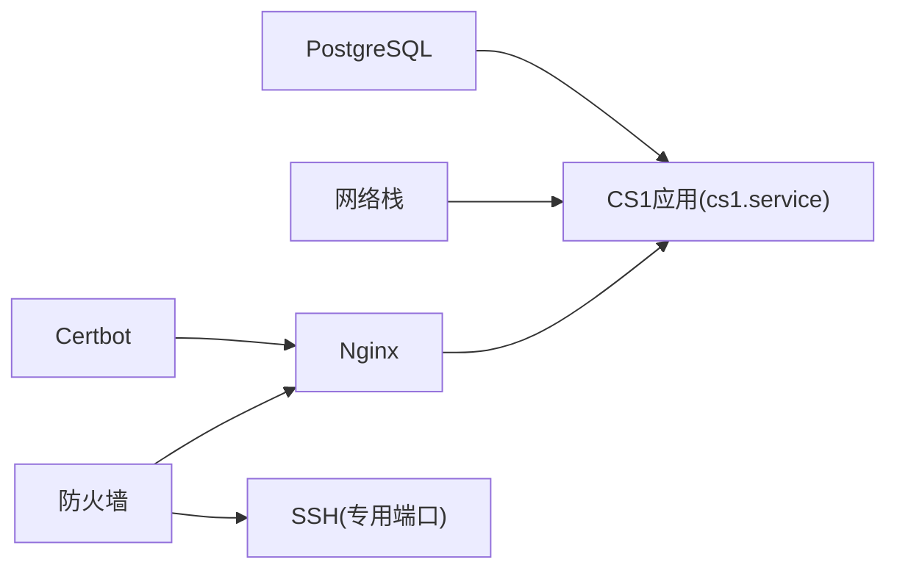

# Systemd服务管理

<cite>
**本文引用的文件**   
- [cs1.service](file://deploy/cs1.service)
- [sshd-cs1.conf](file://deploy/sshd-cs1.conf)
- [nginx.conf](file://deploy/nginx.conf)
- [nginx-http-bootstrap.conf](file://deploy/nginx-http-bootstrap.conf)
- [certbot-renew.service](file://deploy/certbot-renew.service)
- [certbot-renew.timer](file://deploy/certbot-renew.timer)
- [prepare-production-postgres.sh](file://deploy/prepare-production-postgres.sh)
- [setup-postgres.sh](file://deploy/setup-postgres.sh)
</cite>

## 目录
1. [简介](#简介)
2. [项目结构](#项目结构)
3. [核心组件](#核心组件)
4. [架构总览](#架构总览)
5. [详细组件分析](#详细组件分析)
6. [依赖关系分析](#依赖关系分析)
7. [性能考虑](#性能考虑)
8. [故障排查指南](#故障排查指南)
9. [结论](#结论)
10. [附录](#附录)

## 简介
本文件面向CS1学生事务管理系统的运维与部署，聚焦于Systemd服务管理。内容涵盖：
- 服务单元文件配置、环境变量设置与资源限制
- 服务的启动、停止、重启与开机自启命令
- 日志查看方法与自动重启策略
- SSH安全加固、端口管理与防火墙规则
- 服务监控、健康检查与故障恢复策略

## 项目结构
与Systemd服务管理直接相关的部署文件位于deploy目录，包括：
- cs1.service：应用服务单元
- sshd-cs1.conf：SSH专用配置（隔离端口与访问控制）
- nginx.conf与nginx-http-bootstrap.conf：反向代理与HTTP引导配置
- certbot-renew.service与certbot-renew.timer：证书自动续期任务
- prepare-production-postgres.sh与setup-postgres.sh：数据库初始化脚本（供服务启动前准备）

图表来源
- [cs1.service](file://deploy/cs1.service)
- [sshd-cs1.conf](file://deploy/sshd-cs1.conf)
- [nginx.conf](file://deploy/nginx.conf)
- [nginx-http-bootstrap.conf](file://deploy/nginx-http-bootstrap.conf)
- [certbot-renew.service](file://deploy/certbot-renew.service)
- [certbot-renew.timer](file://deploy/certbot-renew.timer)

章节来源
- [cs1.service](file://deploy/cs1.service)
- [sshd-cs1.conf](file://deploy/sshd-cs1.conf)
- [nginx.conf](file://deploy/nginx.conf)
- [nginx-http-bootstrap.conf](file://deploy/nginx-http-bootstrap.conf)
- [certbot-renew.service](file://deploy/certbot-renew.service)
- [certbot-renew.timer](file://deploy/certbot-renew.timer)
- [prepare-production-postgres.sh](file://deploy/prepare-production-postgres.sh)
- [setup-postgres.sh](file://deploy/setup-postgres.sh)

## 核心组件
- 应用服务单元（cs1.service）
  - 负责以非root用户运行应用进程
  - 定义工作目录、环境变量、依赖顺序、重启策略与资源限制
  - 提供标准输入输出到journalctl的集成
- SSH安全配置（sshd-cs1.conf）
  - 为CS1服务分配独立SSH端口，限制登录方式与用户白名单
- Nginx反向代理（nginx.conf, nginx-http-bootstrap.conf）
  - 对外暴露HTTPS（含TLS），将HTTP重定向至HTTPS
  - 转发请求至应用服务监听端口
- 证书自动续期（certbot-renew.service/timer）
  - 通过systemd timer定期执行证书续期并触发重载Nginx
- 数据库准备脚本（prepare-production-postgres.sh, setup-postgres.sh）
  - 在首次部署或升级时创建数据库、用户与迁移数据

章节来源
- [cs1.service](file://deploy/cs1.service)
- [sshd-cs1.conf](file://deploy/sshd-cs1.conf)
- [nginx.conf](file://deploy/nginx.conf)
- [nginx-http-bootstrap.conf](file://deploy/nginx-http-bootstrap.conf)
- [certbot-renew.service](file://deploy/certbot-renew.service)
- [certbot-renew.timer](file://deploy/certbot-renew.timer)
- [prepare-production-postgres.sh](file://deploy/prepare-production-postgres.sh)
- [setup-postgres.sh](file://deploy/setup-postgres.sh)

## 架构总览
下图展示从客户端到应用的请求路径，以及Systemd对关键服务的编排关系。

图表来源
- [nginx.conf](file://deploy/nginx.conf)
- [nginx-http-bootstrap.conf](file://deploy/nginx-http-bootstrap.conf)
- [cs1.service](file://deploy/cs1.service)

## 详细组件分析

### 应用服务单元（cs1.service）
- 运行身份与工作目录
  - 指定非root用户与组，限定工作目录与应用二进制或入口
- 环境变量
  - 通过Environment或EnvironmentFile注入数据库连接串、密钥、运行时开关等
- 依赖与启动顺序
  - After/Requires确保数据库与网络就绪后再启动应用
- 自动重启与失败处理
  - Restart=on-failure/on-abnormal，配合RestartSec实现退避重试
  - SuccessExitStatus/TimeoutStopSec用于优雅退出与超时控制
- 资源限制
  - LimitNOFILE、LimitMEMLOCK、MemoryMax、CPUQuota等限制进程资源使用
- 日志与诊断
  - StandardOutput/StandardError指向journalctl，便于集中查看
  - ExecStartPre可用于前置校验（如端口占用、配置文件语法）

图表来源
- [cs1.service](file://deploy/cs1.service)

章节来源
- [cs1.service](file://deploy/cs1.service)

### SSH安全配置（sshd-cs1.conf）
- 独立端口
  - 修改默认22端口为专用端口，降低暴力破解风险
- 访问控制
  - 仅允许特定用户或组登录；禁用密码登录，强制使用密钥认证
- 会话与权限
  - 限制SFTP与shell类型；启用登录审计与失败告警
- 与防火墙联动
  - 仅放行受信任IP段到该SSH端口

章节来源
- [sshd-cs1.conf](file://deploy/sshd-cs1.conf)

### Nginx反向代理（nginx.conf, nginx-http-bootstrap.conf）
- HTTPS与TLS
  - 配置证书路径与加密套件，强制HTTPS
- HTTP引导
  - 将HTTP请求重定向至HTTPS，避免明文传输
- 反向代理
  - 将请求转发至应用服务监听端口，设置合理的超时与缓冲
- 安全头
  - 添加HSTS、X-Frame-Options、CSP等安全响应头

章节来源
- [nginx.conf](file://deploy/nginx.conf)
- [nginx-http-bootstrap.conf](file://deploy/nginx-http-bootstrap.conf)

### 证书自动续期（certbot-renew.service, certbot-renew.timer）
- 定时任务
  - 通过timer周期性触发证书续期
- 重载配置
  - 续期成功后重载Nginx使新证书生效
- 失败处理
  - 记录失败原因并告警，必要时回滚旧证书

章节来源
- [certbot-renew.service](file://deploy/certbot-renew.service)
- [certbot-renew.timer](file://deploy/certbot-renew.timer)

### 数据库准备脚本（prepare-production-postgres.sh, setup-postgres.sh）
- 首次部署
  - 创建数据库、用户与权限
- 迁移与种子数据
  - 执行数据库迁移与必要的基础数据填充
- 幂等性与回滚
  - 支持重复执行不破坏现有数据；提供回滚步骤说明

章节来源
- [prepare-production-postgres.sh](file://deploy/prepare-production-postgres.sh)
- [setup-postgres.sh](file://deploy/setup-postgres.sh)

## 依赖关系分析
- 服务间依赖
  - cs1.service依赖于数据库与网络；Nginx作为外部入口依赖应用服务
- 启动顺序
  - 数据库与网络先于应用启动；Nginx可在应用就绪后快速接管流量
- 外部依赖
  - TLS证书由Certbot管理；防火墙规则影响SSH与HTTP(S)可达性

图表来源
- [cs1.service](file://deploy/cs1.service)
- [nginx.conf](file://deploy/nginx.conf)
- [nginx-http-bootstrap.conf](file://deploy/nginx-http-bootstrap.conf)
- [certbot-renew.service](file://deploy/certbot-renew.service)
- [certbot-renew.timer](file://deploy/certbot-renew.timer)
- [sshd-cs1.conf](file://deploy/sshd-cs1.conf)

章节来源
- [cs1.service](file://deploy/cs1.service)
- [nginx.conf](file://deploy/nginx.conf)
- [nginx-http-bootstrap.conf](file://deploy/nginx-http-bootstrap.conf)
- [certbot-renew.service](file://deploy/certbot-renew.service)
- [certbot-renew.timer](file://deploy/certbot-renew.timer)
- [sshd-cs1.conf](file://deploy/sshd-cs1.conf)

## 性能考虑
- 进程与线程
  - 合理设置应用并发参数，避免过多线程导致上下文切换开销
- 内存与文件描述符
  - 根据负载调整LimitNOFILE与内存上限，防止OOM或被内核限制
- I/O与缓存
  - 数据库连接池大小与超时；Nginx缓冲与gzip压缩调优
- 资源隔离
  - 使用cgroup限制CPU与内存，保障多实例或多服务共存时的稳定性

[本节为通用指导，无需引用具体文件]

## 故障排查指南
- 服务状态与日志
  - 查看服务状态：systemctl status cs1
  - 实时日志：journalctl -u cs1 -f
  - 历史错误：journalctl -u cs1 --since "今天"
- 常见错误定位
  - 端口冲突：检查应用绑定端口是否被占用
  - 权限问题：确认运行用户对工作目录与证书路径有读权限
  - 数据库连接：验证连接串、用户名、密码与网络可达性
- 自动重启与退避
  - 观察RestartSec与最大重启次数，避免频繁重启风暴
- 健康检查
  - 通过HTTP端点或TCP端口探测判断服务可用性
- 证书问题
  - 检查Certbot定时器是否启用，证书路径与有效期是否正确

章节来源
- [cs1.service](file://deploy/cs1.service)
- [certbot-renew.service](file://deploy/certbot-renew.service)
- [certbot-renew.timer](file://deploy/certbot-renew.timer)

## 结论
通过Systemd统一编排应用、SSH、Nginx与证书续期，结合严格的资源限制与健康检查，可显著提升CS1学生事务管理系统的可用性与安全性。建议在生产环境持续监控服务指标与日志，完善告警与自动化修复流程。

[本节为总结性内容，无需引用具体文件]

## 附录

### 常用Systemd命令
- 启动/停止/重启
  - systemctl start cs1
  - systemctl stop cs1
  - systemctl restart cs1
- 开机自启
  - systemctl enable cs1
- 查看状态与日志
  - systemctl status cs1
  - journalctl -u cs1 -f

### 环境变量与资源限制要点
- 环境变量
  - 数据库连接串、密钥、功能开关等通过Environment或EnvironmentFile注入
- 资源限制
  - LimitNOFILE、LimitMEMLOCK、MemoryMax、CPUQuota等按需调整

### SSH安全与端口管理
- 专用端口
  - 修改默认22端口为自定义端口，并在防火墙放行
- 访问控制
  - 仅允许特定用户/组；禁用密码登录，强制密钥认证
- 审计与告警
  - 启用登录失败告警与审计日志

### 防火墙规则建议
- 放行HTTPS(443)与SSH(自定义端口)
- 限制来源IP段，减少攻击面
- 关闭不必要的端口与服务

### 监控与健康检查
- 健康检查端点
  - 提供轻量级健康接口，返回服务状态码
- 监控指标
  - 收集CPU、内存、I/O与请求延迟等指标
- 告警策略
  - 基于阈值与异常模式触发告警

### 故障恢复策略
- 自动重启
  - 配置Restart策略与退避时间，避免雪崩
- 优雅停机
  - 设置超时与信号处理，确保数据一致性
- 回滚机制
  - 保留上一版本镜像/包与数据库快照，支持快速回滚