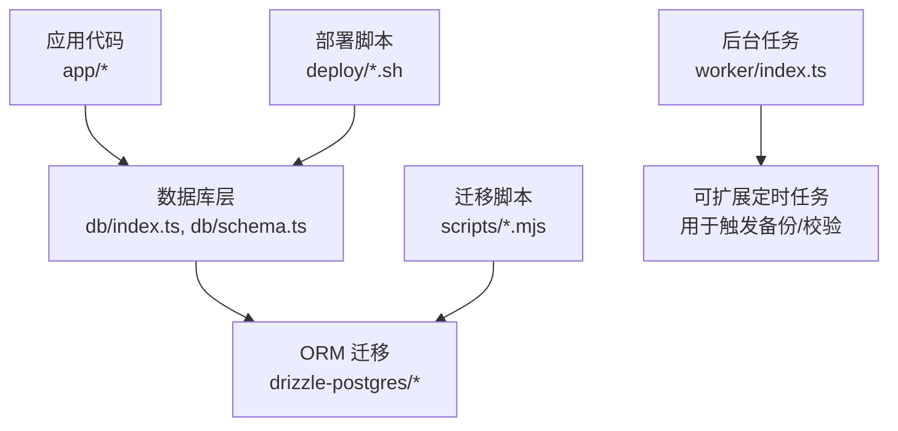
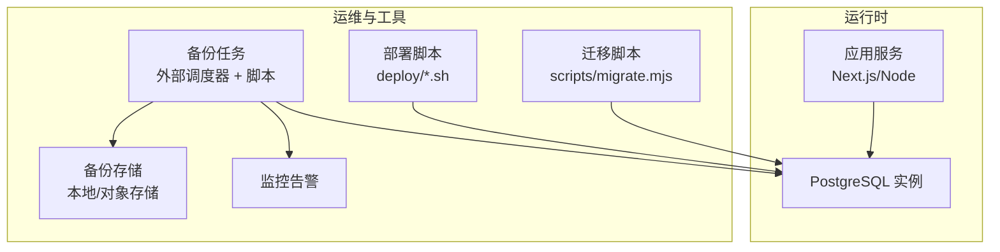
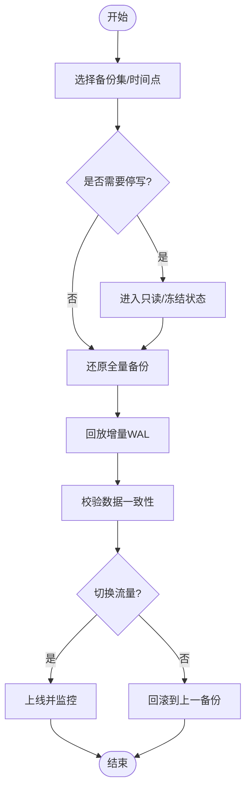
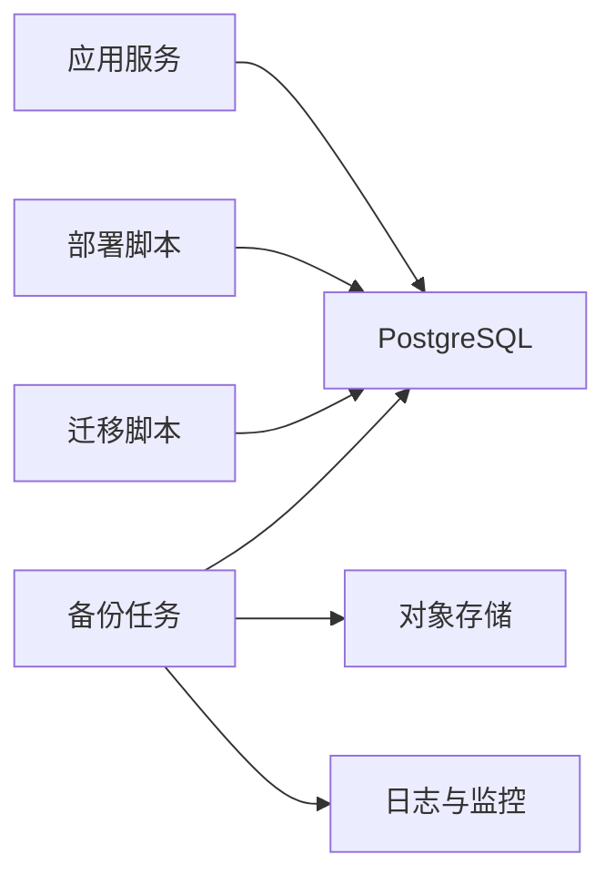

# 备份与恢复

<cite>
**本文引用的文件**   
- [README.md](file://README.md)
- [package.json](file://package.json)
- [db/index.ts](file://db/index.ts)
- [db/schema.ts](file://db/schema.ts)
- [drizzle.config.ts](file://drizzle.config.ts)
- [deploy/prepare-production-postgres.sh](file://deploy/prepare-production-postgres.sh)
- [deploy/setup-postgres.sh](file://deploy/setup-postgres.sh)
- [scripts/migrate.mjs](file://scripts/migrate.mjs)
- [scripts/migrate-sqlite-to-postgres.mjs](file://scripts/migrate-sqlite-to-postgres.mjs)
- [worker/index.ts](file://worker/index.ts)
</cite>

## 目录
1. [简介](#简介)
2. [项目结构](#项目结构)
3. [核心组件](#核心组件)
4. [架构总览](#架构总览)
5. [详细组件分析](#详细组件分析)
6. [依赖关系分析](#依赖关系分析)
7. [性能考虑](#性能考虑)
8. [故障排查指南](#故障排查指南)
9. [结论](#结论)
10. [附录](#附录)

## 简介
本文件为 CS1 学生事务管理系统的“备份与恢复”专项文档，面向运维与开发人员，覆盖以下主题：
- 数据库自动备份策略（全量、增量）
- 备份存储位置与生命周期管理
- 数据恢复流程与灾难恢复计划（DRP）
- 业务连续性保障（RTO/RPO 目标与演练）
- 备份验证方法、完整性检查与恢复测试
- 云存储集成、异地备份与合规性要求

说明：当前仓库未包含内置的数据库备份脚本或调度器。本文基于现有部署脚本与数据库配置，给出可落地的备份与恢复方案，并明确需要在生产环境补充的配置项与自动化手段。

## 项目结构
与备份相关的关键目录与文件：
- db/: 数据库连接与模式定义
- drizzle-postgres/: Drizzle ORM 迁移脚本
- deploy/: 部署与初始化脚本（含 Postgres 准备脚本）
- scripts/: 迁移与种子脚本
- worker/: 后台任务入口（可用于扩展定时任务）

图表来源
- [db/index.ts:1-200](file://db/index.ts#L1-L200)
- [db/schema.ts:1-200](file://db/schema.ts#L1-L200)
- [drizzle.config.ts:1-200](file://drizzle.config.ts#L1-L200)
- [deploy/prepare-production-postgres.sh:1-200](file://deploy/prepare-production-postgres.sh#L1-L200)
- [deploy/setup-postgres.sh:1-200](file://deploy/setup-postgres.sh#L1-L200)
- [scripts/migrate.mjs:1-200](file://scripts/migrate.mjs#L1-L200)
- [scripts/migrate-sqlite-to-postgres.mjs:1-200](file://scripts/migrate-sqlite-to-postgres.mjs#L1-L200)
- [worker/index.ts:1-200](file://worker/index.ts#L1-L200)

章节来源
- [README.md:1-200](file://README.md#L1-L200)
- [package.json:1-200](file://package.json#L1-L200)

## 核心组件
- 数据库连接与模式
  - 连接参数由环境变量注入，驱动为 PostgreSQL；ORM 使用 Drizzle。
  - schema 定义位于 db/schema.ts，迁移脚本位于 drizzle-postgres 目录。
- 部署与初始化
  - deploy/setup-postgres.sh 与 deploy/prepare-production-postgres.sh 负责数据库实例准备与权限设置。
- 迁移与数据种子
  - scripts/migrate.mjs 执行 Drizzle 迁移；scripts/migrate-sqlite-to-postgres.mjs 提供历史迁移能力。
- 后台任务
  - worker/index.ts 可作为扩展点，接入定时任务以触发备份、校验与上报。

章节来源
- [db/index.ts:1-200](file://db/index.ts#L1-L200)
- [db/schema.ts:1-200](file://db/schema.ts#L1-L200)
- [drizzle.config.ts:1-200](file://drizzle.config.ts#L1-L200)
- [deploy/prepare-production-postgres.sh:1-200](file://deploy/prepare-production-postgres.sh#L1-L200)
- [deploy/setup-postgres.sh:1-200](file://deploy/setup-postgres.sh#L1-L200)
- [scripts/migrate.mjs:1-200](file://scripts/migrate.mjs#L1-L200)
- [scripts/migrate-sqlite-to-postgres.mjs:1-200](file://scripts/migrate-sqlite-to-postgres.mjs#L1-L200)
- [worker/index.ts:1-200](file://worker/index.ts#L1-L200)

## 架构总览
下图展示备份与恢复在系统中的角色与交互：应用通过数据库层访问数据；部署脚本准备数据库环境；迁移脚本维护版本；后台任务可触发备份与校验；备份产物落盘或上传至对象存储。

图表来源
- [db/index.ts:1-200](file://db/index.ts#L1-L200)
- [scripts/migrate.mjs:1-200](file://scripts/migrate.mjs#L1-L200)
- [deploy/setup-postgres.sh:1-200](file://deploy/setup-postgres.sh#L1-L200)
- [deploy/prepare-production-postgres.sh:1-200](file://deploy/prepare-production-postgres.sh#L1-L200)
- [worker/index.ts:1-200](file://worker/index.ts#L1-L200)

## 详细组件分析

### 数据库连接与迁移
- 连接配置
  - 数据库连接字符串由环境变量提供，驱动为 PostgreSQL。
  - Drizzle 配置集中管理，便于统一迁移与同步。
- 迁移机制
  - 使用 Drizzle 迁移脚本进行版本控制，确保结构与数据一致性。
  - 提供 SQLite 到 PostgreSQL 的历史迁移脚本，便于升级路径。

建议实践
- 在生产环境启用 WAL 归档，以便实现增量备份与时间点恢复。
- 将数据库连接信息纳入密钥管理服务，避免硬编码。

章节来源
- [db/index.ts:1-200](file://db/index.ts#L1-L200)
- [db/schema.ts:1-200](file://db/schema.ts#L1-L200)
- [drizzle.config.ts:1-200](file://drizzle.config.ts#L1-L200)
- [scripts/migrate.mjs:1-200](file://scripts/migrate.mjs#L1-L200)
- [scripts/migrate-sqlite-to-postgres.mjs:1-200](file://scripts/migrate-sqlite-to-postgres.mjs#L1-L200)

### 部署与初始化脚本
- setup-postgres.sh
  - 负责基础数据库实例创建、用户与权限初始化。
- prepare-production-postgres.sh
  - 针对生产环境的加固与优化（如认证方式、网络与安全组）。

建议实践
- 将脚本参数化，支持多环境（开发/预发/生产）。
- 在执行前进行幂等检查，避免重复初始化导致冲突。

章节来源
- [deploy/setup-postgres.sh:1-200](file://deploy/setup-postgres.sh#L1-L200)
- [deploy/prepare-production-postgres.sh:1-200](file://deploy/prepare-production-postgres.sh#L1-L200)

### 后台任务与扩展点
- worker/index.ts
  - 作为后台任务入口，可接入定时任务框架，触发备份、校验与报告生成。

建议实践
- 引入任务队列与重试机制，保证备份任务的可靠性。
- 输出结构化日志与指标，便于监控与审计。

章节来源
- [worker/index.ts:1-200](file://worker/index.ts#L1-L200)

### 备份策略设计（全量与增量）
- 全量备份
  - 每日一次冷备或热备（推荐 pg_basebackup），保留 N 天。
  - 备份文件名包含时间戳与环境标识，便于检索与清理。
- 增量备份
  - 启用 PostgreSQL WAL 归档，按时间窗口滚动。
  - 结合 PITR（时间点恢复）实现分钟级 RPO。
- 备份存储
  - 本地磁盘：短期保留，快速恢复。
  - 对象存储（S3/OSS/COS）：长期保留、跨地域复制。
- 生命周期与加密
  - 设置保留策略（如 7 日本地 + 90 日云端）。
  - 传输与静态加密，最小权限访问控制。

注意：当前仓库未包含具体备份脚本，需在生产环境补充。

### 数据恢复流程
- 恢复步骤概览
  1) 选择恢复目标时间点或备份集。
  2) 停止写入或切换到只读模式（必要时）。
  3) 还原全量备份。
  4) 回放 WAL 增量至目标时间点。
  5) 验证数据一致性与关键表记录数。
  6) 切换流量到新实例并观察指标。
- 回滚策略
  - 若恢复失败，回退到上一可用快照并重新执行恢复流程。

### 灾难恢复计划（DRP）与业务连续性
- 目标
  - RPO ≤ 5 分钟（启用 WAL 归档与频繁增量）。
  - RTO ≤ 30 分钟（预置恢复模板与自动化脚本）。
- 演练
  - 每月进行一次恢复演练，记录耗时与问题。
  - 演练后更新 DRP 文档与脚本。
- 资源与职责
  - 明确负责人、沟通渠道与升级路径。
  - 准备应急联系人清单与外部供应商支持。

### 备份验证与完整性检查
- 校验方法
  - 校验和（SHA-256）比对。
  - 元数据核对（表数量、索引、约束）。
  - 抽样查询与统计对比（行数、时间范围）。
- 自动化
  - 每次备份完成后自动运行校验任务。
  - 失败时立即告警并触发重试。

### 云存储集成与异地备份
- 集成要点
  - 使用 SDK 或 CLI 上传备份文件。
  - 开启服务端加密与访问日志。
- 异地策略
  - 至少两个地域副本，跨区域复制延迟可控。
  - 定期验证跨域可达性与下载速度。

### 合规性要求
- 数据留存与销毁
  - 根据法规设定保留周期与销毁流程。
- 审计与追踪
  - 记录备份/恢复操作日志，不可篡改。
- 隐私保护
  - 敏感字段脱敏或加密存储。

## 依赖关系分析
备份与恢复涉及的模块依赖如下：

图表来源
- [db/index.ts:1-200](file://db/index.ts#L1-L200)
- [scripts/migrate.mjs:1-200](file://scripts/migrate.mjs#L1-L200)
- [deploy/setup-postgres.sh:1-200](file://deploy/setup-postgres.sh#L1-L200)
- [deploy/prepare-production-postgres.sh:1-200](file://deploy/prepare-production-postgres.sh#L1-L200)
- [worker/index.ts:1-200](file://worker/index.ts#L1-L200)

章节来源
- [package.json:1-200](file://package.json#L1-L200)

## 性能考虑
- 备份窗口
  - 避开业务高峰，采用增量优先策略。
- I/O 影响
  - 限制备份进程并发与带宽，避免影响在线服务。
- 恢复效率
  - 预热缓存、并行回放 WAL，缩短 RTO。
- 存储成本
  - 分层存储（热/温/冷），压缩与去重。

## 故障排查指南
常见问题与处理建议：
- 备份失败
  - 检查数据库连接、权限与磁盘空间。
  - 查看任务日志与错误码，定位失败阶段。
- 恢复失败
  - 校验备份完整性与版本兼容性。
  - 逐步回放 WAL，定位不一致点。
- 监控告警
  - 关注备份成功率、时长与大小异常。
  - 对长时间未更新的备份集发出告警。

章节来源
- [worker/index.ts:1-200](file://worker/index.ts#L1-L200)

## 结论
当前仓库提供了数据库连接、迁移与部署的基础能力，但尚未内置备份与恢复脚本。建议在生产环境尽快补齐：
- 全量与增量备份自动化
- 对象存储与异地副本
- 备份校验与恢复演练
- 监控告警与审计日志

通过上述措施，可实现稳定的 RPO/RTO 目标与合规要求，保障业务连续性与数据安全。

## 附录
- 术语
  - RPO：恢复点目标（允许丢失的数据量）
  - RTO：恢复时间目标（恢复所需时间）
  - WAL：Write-Ahead Logging（预写日志）
  - PITR：Point-in-Time Recovery（时间点恢复）
- 参考
  - 数据库官方备份与恢复文档
  - 对象存储安全与合规最佳实践