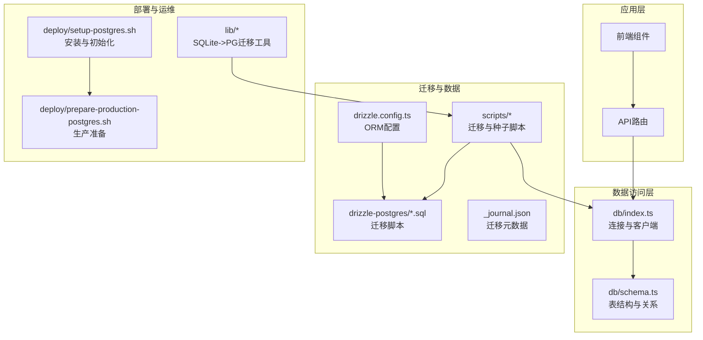
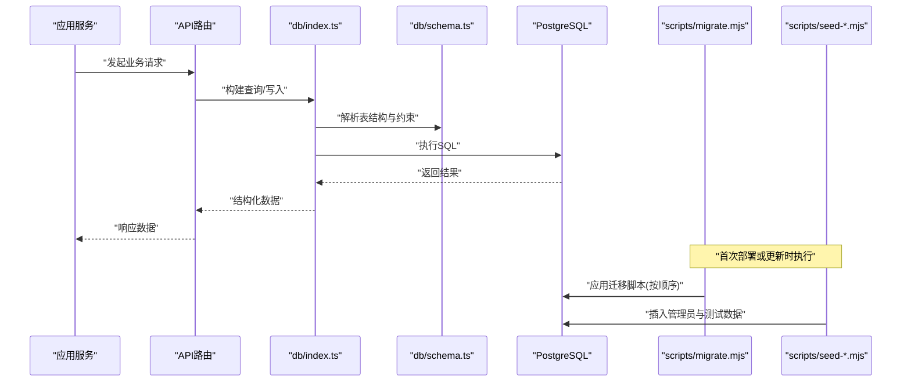
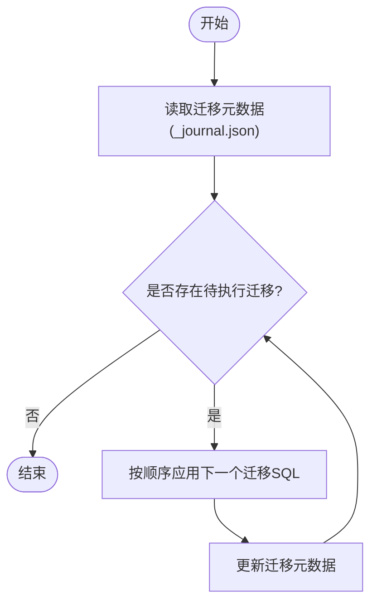
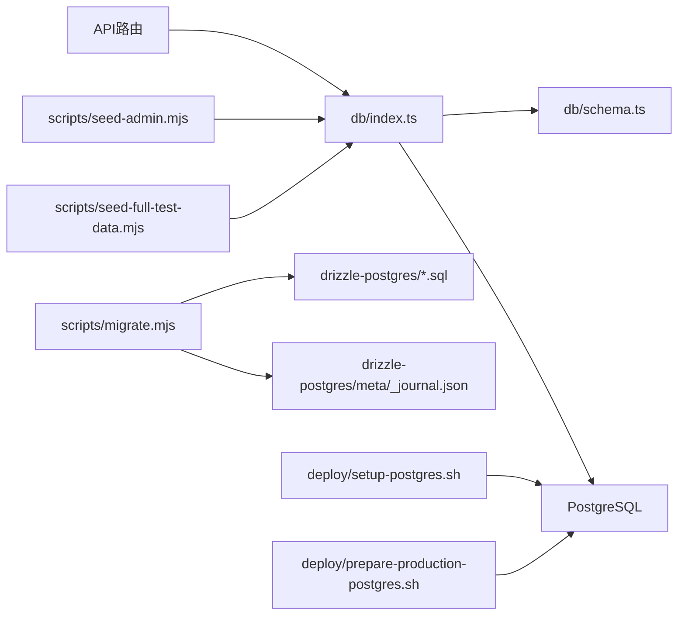

# 数据库部署与配置

<cite>
**本文引用的文件**   
- [db/index.ts](file://db/index.ts)
- [db/schema.ts](file://db/schema.ts)
- [drizzle.config.ts](file://drizzle.config.ts)
- [drizzle-postgres/meta/_journal.json](file://drizzle-postgres/meta/_journal.json)
- [drizzle-postgres/0000_fine_psylocke.sql](file://drizzle-postgres/0000_fine_psylocke.sql)
- [drizzle-postgres/0001_thin_queen_noir.sql](file://drizzle-postgres/0001_thin_queen_noir.sql)
- [drizzle-postgres/0002_crazy_ravenous.sql](file://drizzle-postgres/0002_crazy_ravenous.sql)
- [drizzle-postgres/0003_fine_quentin_quire.sql](file://drizzle-postgres/0003_fine_quentin_quire.sql)
- [scripts/migrate.mjs](file://scripts/migrate.mjs)
- [scripts/seed-admin.mjs](file://scripts/seed-admin.mjs)
- [scripts/seed-full-test-data.mjs](file://scripts/seed-full-test-data.mjs)
- [deploy/setup-postgres.sh](file://deploy/setup-postgres.sh)
- [deploy/prepare-production-postgres.sh](file://deploy/prepare-production-postgres.sh)
- [lib/sqlite-postgres-migration.js](file://lib/sqlite-postgres-migration.js)
- [scripts/migrate-sqlite-to-postgres.mjs](file://scripts/migrate-sqlite-to-postgres.mjs)
</cite>

## 目录
1. [简介](#简介)
2. [项目结构](#项目结构)
3. [核心组件](#核心组件)
4. [架构总览](#架构总览)
5. [详细组件分析](#详细组件分析)
6. [依赖关系分析](#依赖关系分析)
7. [性能考虑](#性能考虑)
8. [故障排查指南](#故障排查指南)
9. [结论](#结论)
10. [附录](#附录)

## 简介
本文件面向CS1学生事务管理系统的数据库部署与配置，覆盖PostgreSQL初始化、用户权限、Drizzle ORM配置、表结构与索引设计、数据迁移执行、数据种子填充、备份恢复策略、性能调优与安全配置，以及迁移流程与版本管理的最佳实践。文档以仓库中的实际代码与脚本为依据，帮助读者在开发、测试与生产环境中正确搭建与维护数据库。

## 项目结构
与数据库相关的核心目录与文件：
- db: Drizzle ORM 连接与Schema定义
- drizzle-postgres: Drizzle 迁移SQL与元数据
- scripts: 迁移与种子脚本
- deploy: PostgreSQL安装与生产环境准备脚本
- lib: SQLite到PostgreSQL的迁移辅助工具

图表来源
- [db/index.ts](file://db/index.ts)
- [db/schema.ts](file://db/schema.ts)
- [drizzle.config.ts](file://drizzle.config.ts)
- [drizzle-postgres/meta/_journal.json](file://drizzle-postgres/meta/_journal.json)
- [drizzle-postgres/0000_fine_psylocke.sql](file://drizzle-postgres/0000_fine_psylocke.sql)
- [drizzle-postgres/0001_thin_queen_noir.sql](file://drizzle-postgres/0001_thin_queen_noir.sql)
- [drizzle-postgres/0002_crazy_ravenous.sql](file://drizzle-postgres/0002_crazy_ravenous.sql)
- [drizzle-postgres/0003_fine_quentin_quire.sql](file://drizzle-postgres/0003_fine_quentin_quire.sql)
- [scripts/migrate.mjs](file://scripts/migrate.mjs)
- [scripts/seed-admin.mjs](file://scripts/seed-admin.mjs)
- [scripts/seed-full-test-data.mjs](file://scripts/seed-full-test-data.mjs)
- [deploy/setup-postgres.sh](file://deploy/setup-postgres.sh)
- [deploy/prepare-production-postgres.sh](file://deploy/prepare-production-postgres.sh)
- [lib/sqlite-postgres-migration.js](file://lib/sqlite-postgres-migration.js)
- [scripts/migrate-sqlite-to-postgres.mjs](file://scripts/migrate-sqlite-to-postgres.mjs)

章节来源
- [db/index.ts](file://db/index.ts)
- [db/schema.ts](file://db/schema.ts)
- [drizzle.config.ts](file://drizzle.config.ts)
- [drizzle-postgres/meta/_journal.json](file://drizzle-postgres/meta/_journal.json)
- [drizzle-postgres/0000_fine_psylocke.sql](file://drizzle-postgres/0000_fine_psylocke.sql)
- [drizzle-postgres/0001_thin_queen_noir.sql](file://drizzle-postgres/0001_thin_queen_noir.sql)
- [drizzle-postgres/0002_crazy_ravenous.sql](file://drizzle-postgres/0002_crazy_ravenous.sql)
- [drizzle-postgres/0003_fine_quentin_quire.sql](file://drizzle-postgres/0003_fine_quentin_quire.sql)
- [scripts/migrate.mjs](file://scripts/migrate.mjs)
- [scripts/seed-admin.mjs](file://scripts/seed-admin.mjs)
- [scripts/seed-full-test-data.mjs](file://scripts/seed-full-test-data.mjs)
- [deploy/setup-postgres.sh](file://deploy/setup-postgres.sh)
- [deploy/prepare-production-postgres.sh](file://deploy/prepare-production-postgres.sh)
- [lib/sqlite-postgres-migration.js](file://lib/sqlite-postgres-migration.js)
- [scripts/migrate-sqlite-to-postgres.mjs](file://scripts/migrate-sqlite-to-postgres.mjs)

## 核心组件
- 数据库连接与客户端：通过db/index.ts提供统一的数据库连接与查询客户端，供API与服务调用。
- 表结构与关系：db/schema.ts使用Drizzle ORM声明式定义表结构、字段类型、约束与关系。
- Drizzle配置：drizzle.config.ts集中配置数据库连接、迁移目录与生成规则。
- 迁移脚本：drizzle-postgres下按版本号生成的SQL文件，配合_journal.json记录迁移状态。
- 迁移与种子脚本：scripts/migrate.mjs负责执行迁移；scripts/seed-admin.mjs与scripts/seed-full-test-data.mjs用于填充初始数据与测试数据。
- 部署脚本：deploy/setup-postgres.sh与deploy/prepare-production-postgres.sh完成PostgreSQL安装、初始化与生产环境加固。
- 迁移工具：lib/sqlite-postgres-migration.js与scripts/migrate-sqlite-to-postgres.mjs支持从SQLite迁移至PostgreSQL。

章节来源
- [db/index.ts](file://db/index.ts)
- [db/schema.ts](file://db/schema.ts)
- [drizzle.config.ts](file://drizzle.config.ts)
- [drizzle-postgres/meta/_journal.json](file://drizzle-postgres/meta/_journal.json)
- [drizzle-postgres/0000_fine_psylocke.sql](file://drizzle-postgres/0000_fine_psylocke.sql)
- [drizzle-postgres/0001_thin_queen_noir.sql](file://drizzle-postgres/0001_thin_queen_noir.sql)
- [drizzle-postgres/0002_crazy_ravenous.sql](file://drizzle-postgres/0002_crazy_ravenous.sql)
- [drizzle-postgres/0003_fine_quentin_quire.sql](file://drizzle-postgres/0003_fine_quentin_quire.sql)
- [scripts/migrate.mjs](file://scripts/migrate.mjs)
- [scripts/seed-admin.mjs](file://scripts/seed-admin.mjs)
- [scripts/seed-full-test-data.mjs](file://scripts/seed-full-test-data.mjs)
- [deploy/setup-postgres.sh](file://deploy/setup-postgres.sh)
- [deploy/prepare-production-postgres.sh](file://deploy/prepare-production-postgres.sh)
- [lib/sqlite-postgres-migration.js](file://lib/sqlite-postgres-migration.js)
- [scripts/migrate-sqlite-to-postgres.mjs](file://scripts/migrate-sqlite-to-postgres.mjs)

## 架构总览
下图展示从应用请求到数据库操作的完整链路，包括迁移与种子流程的关键节点。

图表来源
- [db/index.ts](file://db/index.ts)
- [db/schema.ts](file://db/schema.ts)
- [scripts/migrate.mjs](file://scripts/migrate.mjs)
- [scripts/seed-admin.mjs](file://scripts/seed-admin.mjs)
- [scripts/seed-full-test-data.mjs](file://scripts/seed-full-test-data.mjs)

## 详细组件分析

### PostgreSQL初始化与用户权限
- 安装与初始化：deploy/setup-postgres.sh负责安装PostgreSQL并创建基础数据库与角色。
- 生产环境准备：deploy/prepare-production-postgres.sh进行安全加固（如限制远程访问、设置密码策略、启用日志等）。
- 用户与权限：建议在初始化脚本中为应用创建专用数据库用户，授予最小必要权限（仅对目标库的DDL/DML权限），避免使用超级用户运行应用。

章节来源
- [deploy/setup-postgres.sh](file://deploy/setup-postgres.sh)
- [deploy/prepare-production-postgres.sh](file://deploy/prepare-production-postgres.sh)

### Drizzle ORM配置与连接
- 配置文件：drizzle.config.ts集中配置数据库连接字符串、迁移目录、生成输出路径等。
- 连接客户端：db/index.ts封装连接池、事务与查询方法，确保连接复用与错误处理。
- 建议：在生产环境使用环境变量注入连接信息，避免硬编码敏感参数。

章节来源
- [drizzle.config.ts](file://drizzle.config.ts)
- [db/index.ts](file://db/index.ts)

### 表结构设计与索引优化
- 表结构：db/schema.ts使用Drizzle声明式定义所有表、字段类型、默认值、唯一性与外键约束。
- 索引策略：
  - 主键自动索引：每个表的主键列默认建立B-tree索引。
  - 高频查询列：为常用过滤、排序与关联列添加索引（如学生ID、工号、时间戳等）。
  - 复合索引：针对多列联合查询场景创建复合索引，注意列顺序与选择性。
  - 避免过度索引：减少写放大与空间占用，定期评估未使用索引。
- 关系建模：通过外键约束保证数据一致性，必要时启用级联更新/删除策略。

章节来源
- [db/schema.ts](file://db/schema.ts)

### 数据迁移执行与版本管理
- 迁移脚本：drizzle-postgres下的SQL文件按版本号命名，表示每次变更的增量脚本。
- 迁移元数据：drizzle-postgres/meta/_journal.json记录已应用的迁移版本与状态。
- 执行流程：scripts/migrate.mjs读取迁移元数据并按顺序执行未应用的SQL，确保幂等与回滚能力。
- 版本管理最佳实践：
  - 每次变更生成独立迁移文件，保持原子性。
  - 迁移脚本需幂等，避免重复执行失败。
  - 禁止直接修改已发布迁移，如需修复应新增迁移。
  - 在CI/CD中集成迁移检查与回滚演练。

图表来源
- [drizzle-postgres/meta/_journal.json](file://drizzle-postgres/meta/_journal.json)
- [drizzle-postgres/0000_fine_psylocke.sql](file://drizzle-postgres/0000_fine_psylocke.sql)
- [drizzle-postgres/0001_thin_queen_noir.sql](file://drizzle-postgres/0001_thin_queen_noir.sql)
- [drizzle-postgres/0002_crazy_ravenous.sql](file://drizzle-postgres/0002_crazy_ravenous.sql)
- [drizzle-postgres/0003_fine_quentin_quire.sql](file://drizzle-postgres/0003_fine_quentin_quire.sql)
- [scripts/migrate.mjs](file://scripts/migrate.mjs)

章节来源
- [drizzle-postgres/meta/_journal.json](file://drizzle-postgres/meta/_journal.json)
- [drizzle-postgres/0000_fine_psylocke.sql](file://drizzle-postgres/0000_fine_psylocke.sql)
- [drizzle-postgres/0001_thin_queen_noir.sql](file://drizzle-postgres/0001_thin_queen_noir.sql)
- [drizzle-postgres/0002_crazy_ravenous.sql](file://drizzle-postgres/0002_crazy_ravenous.sql)
- [drizzle-postgres/0003_fine_quentin_quire.sql](file://drizzle-postgres/0003_fine_quentin_quire.sql)
- [scripts/migrate.mjs](file://scripts/migrate.mjs)

### 数据种子填充
- 管理员种子：scripts/seed-admin.mjs用于创建系统管理员账户与基础配置。
- 测试数据：scripts/seed-full-test-data.mjs批量插入学生、记录、工作流等测试数据，便于本地开发与演示。
- 执行时机：在首次部署或重置环境后执行，确保应用可用。

章节来源
- [scripts/seed-admin.mjs](file://scripts/seed-admin.mjs)
- [scripts/seed-full-test-data.mjs](file://scripts/seed-full-test-data.mjs)

### SQLite到PostgreSQL迁移工具
- 转换脚本：lib/sqlite-postgres-migration.js与scripts/migrate-sqlite-to-postgres.mjs提供从SQLite到PostgreSQL的数据迁移能力。
- 适用场景：历史系统由SQLite驱动，需要平滑迁移至PostgreSQL以提升并发与可靠性。
- 注意事项：数据类型映射、约束差异与字符集统一需在迁移前校验。

章节来源
- [lib/sqlite-postgres-migration.js](file://lib/sqlite-postgres-migration.js)
- [scripts/migrate-sqlite-to-postgres.mjs](file://scripts/migrate-sqlite-to-postgres.mjs)

## 依赖关系分析
- 应用层依赖db/index.ts提供的数据库客户端。
- db/index.ts依赖db/schema.ts定义的表结构。
- 迁移脚本依赖drizzle-postgres下的SQL与元数据。
- 部署脚本为PostgreSQL环境与用户权限奠定基础。
- 种子脚本依赖迁移完成后的一致表结构。

图表来源
- [db/index.ts](file://db/index.ts)
- [db/schema.ts](file://db/schema.ts)
- [scripts/migrate.mjs](file://scripts/migrate.mjs)
- [scripts/seed-admin.mjs](file://scripts/seed-admin.mjs)
- [scripts/seed-full-test-data.mjs](file://scripts/seed-full-test-data.mjs)
- [drizzle-postgres/meta/_journal.json](file://drizzle-postgres/meta/_journal.json)
- [drizzle-postgres/0000_fine_psylocke.sql](file://drizzle-postgres/0000_fine_psylocke.sql)
- [drizzle-postgres/0001_thin_queen_noir.sql](file://drizzle-postgres/0001_thin_queen_noir.sql)
- [drizzle-postgres/0002_crazy_ravenous.sql](file://drizzle-postgres/0002_crazy_ravenous.sql)
- [drizzle-postgres/0003_fine_quentin_quire.sql](file://drizzle-postgres/0003_fine_quentin_quire.sql)
- [deploy/setup-postgres.sh](file://deploy/setup-postgres.sh)
- [deploy/prepare-production-postgres.sh](file://deploy/prepare-production-postgres.sh)

## 性能考虑
- 连接池：合理配置最大连接数与空闲超时，避免连接耗尽与资源浪费。
- 查询优化：
  - 为高频查询列添加合适索引，避免全表扫描。
  - 使用EXPLAIN ANALYZE分析慢查询，优化JOIN与WHERE条件。
  - 分页查询使用游标或基于主键的分页，提升稳定性。
- 存储与IO：
  - 调整shared_buffers、work_mem与maintenance_work_mem以适应内存与负载。
  - 启用WAL归档与检查点优化，降低写入抖动。
- 监控与诊断：
  - 启用pg_stat_statements扩展统计热点查询。
  - 定期清理未使用索引与冗余数据。

[本节为通用指导，不直接分析具体文件]

## 故障排查指南
- 迁移失败：
  - 检查_journal.json状态与迁移SQL幂等性。
  - 查看PostgreSQL日志定位具体错误（语法、约束冲突、权限不足）。
- 连接问题：
  - 验证连接字符串、端口、防火墙与pg_hba.conf配置。
  - 确认应用用户具备目标库的CONNECT与USAGE权限。
- 性能问题：
  - 使用EXPLAIN ANALYZE定位慢查询。
  - 检查索引命中率与锁等待情况。
- 数据不一致：
  - 核对迁移顺序与种子数据完整性。
  - 使用备份快照进行回滚与对比。

章节来源
- [drizzle-postgres/meta/_journal.json](file://drizzle-postgres/meta/_journal.json)
- [scripts/migrate.mjs](file://scripts/migrate.mjs)
- [deploy/setup-postgres.sh](file://deploy/setup-postgres.sh)
- [deploy/prepare-production-postgres.sh](file://deploy/prepare-production-postgres.sh)

## 结论
通过规范的PostgreSQL初始化、严格的权限控制、完善的Drizzle ORM配置与迁移管理、合理的表结构与索引设计，以及科学的备份恢复与性能调优策略，CS1学生事务管理系统可在开发、测试与生产环境中稳定运行。遵循本文档的流程与最佳实践，可显著降低部署风险与运维成本。

## 附录

### 部署步骤清单
- 安装PostgreSQL并初始化数据库与用户（deploy/setup-postgres.sh）
- 执行生产环境准备脚本（deploy/prepare-production-postgres.sh）
- 配置Drizzle连接与迁移目录（drizzle.config.ts）
- 执行数据迁移（scripts/migrate.mjs）
- 填充管理员与测试数据（scripts/seed-admin.mjs、scripts/seed-full-test-data.mjs）
- 验证API与数据一致性

章节来源
- [deploy/setup-postgres.sh](file://deploy/setup-postgres.sh)
- [deploy/prepare-production-postgres.sh](file://deploy/prepare-production-postgres.sh)
- [drizzle.config.ts](file://drizzle.config.ts)
- [scripts/migrate.mjs](file://scripts/migrate.mjs)
- [scripts/seed-admin.mjs](file://scripts/seed-admin.mjs)
- [scripts/seed-full-test-data.mjs](file://scripts/seed-full-test-data.mjs)

### 备份与恢复策略
- 逻辑备份：使用pg_dump导出指定库或表，保留DDL与数据。
- 物理备份：使用pg_basebackup进行全量备份，结合WAL归档实现时间点恢复。
- 恢复流程：先恢复基础备份，再回放WAL至目标时间点，最后校验数据一致性。
- 自动化：将备份任务纳入定时任务与监控告警，定期演练恢复流程。

[本节为通用指导，不直接分析具体文件]

### 安全配置要点
- 最小权限原则：应用用户仅授予必要库与表的DML权限，禁用DDL权限。
- 网络隔离：限制远程访问，仅允许可信IP段连接。
- 密码策略：强制复杂密码与定期轮换。
- 审计与日志：启用登录与操作日志，定期审查异常行为。

[本节为通用指导，不直接分析具体文件]