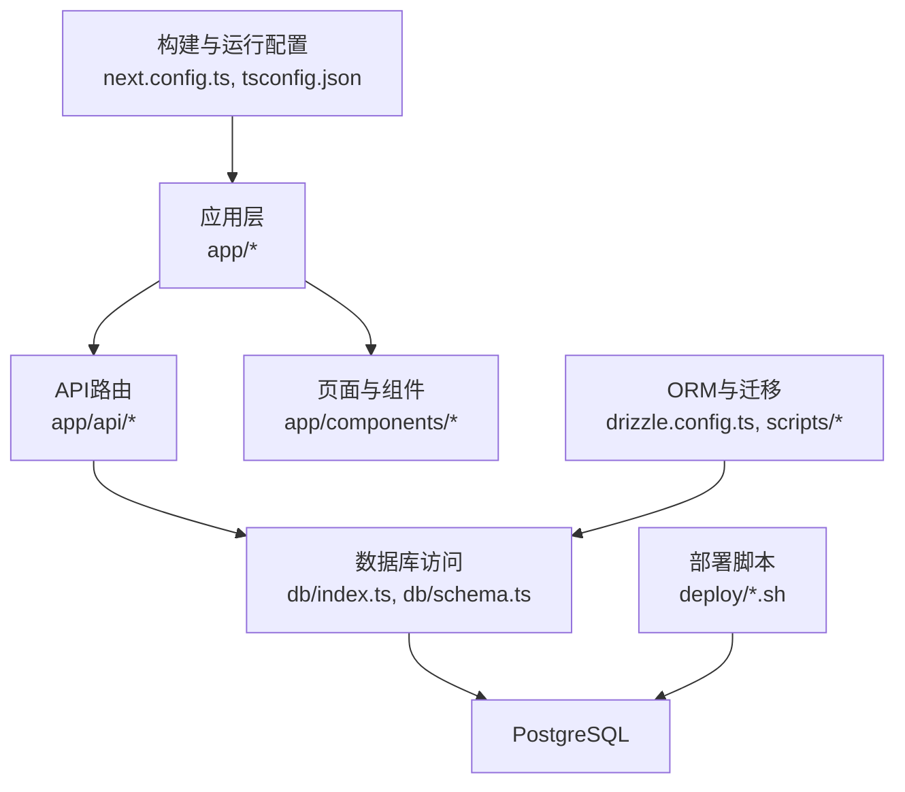
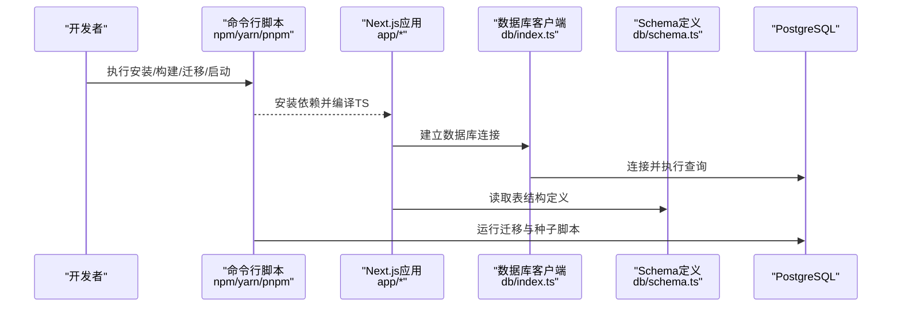
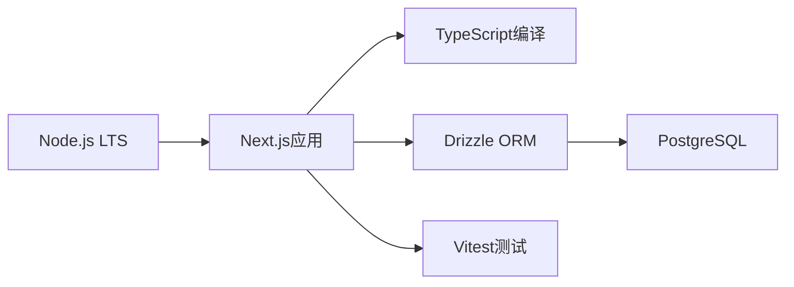

# 环境准备与依赖

<cite>
**本文引用的文件**   
- [package.json](file://package.json)
- [tsconfig.json](file://tsconfig.json)
- [drizzle.config.ts](file://drizzle.config.ts)
- [db/index.ts](file://db/index.ts)
- [db/schema.ts](file://db/schema.ts)
- [deploy/setup-postgres.sh](file://deploy/setup-postgres.sh)
- [deploy/prepare-production-postgres.sh](file://deploy/prepare-production-postgres.sh)
- [scripts/migrate.mjs](file://scripts/migrate.mjs)
- [scripts/seed-admin.mjs](file://scripts/seed-admin.mjs)
- [scripts/seed-full-test-data.mjs](file://scripts/seed-full-test-data.mjs)
- [next.config.ts](file://next.config.ts)
- [vite.config.ts](file://vite.config.ts)
- [vitest.config.ts](file://vitest.config.ts)
- [README.md](file://README.md)
</cite>

## 目录
1. [简介](#简介)
2. [项目结构](#项目结构)
3. [核心组件](#核心组件)
4. [架构总览](#架构总览)
5. [详细组件分析](#详细组件分析)
6. [依赖分析](#依赖分析)
7. [性能考虑](#性能考虑)
8. [故障排查指南](#故障排查指南)
9. [结论](#结论)
10. [附录](#附录)

## 简介
本文件面向CS1学生事务管理系统的开发与部署，聚焦“环境准备与依赖”。内容涵盖：
- 系统要求与Node.js版本兼容性
- PostgreSQL数据库安装与配置
- 开发环境与生产环境的差异
- 依赖包管理策略
- TypeScript编译配置
- 一键安装脚本使用与环境验证方法
- 常见环境问题排查与解决方案

## 项目结构
本项目采用Next.js应用结构，结合Drizzle ORM进行数据库建模与迁移，提供API路由、前端页面与组件、以及部署与数据库初始化脚本。关键目录与职责如下：
- app: Next.js应用代码（页面、组件、API路由）
- db: Drizzle数据库连接与Schema定义
- deploy: 部署相关脚本与Nginx配置
- scripts: 数据迁移与种子数据脚本
- lib: 公共库（鉴权、校验、安全等）
- tests: 测试用例与测试数据
- worker: 后台任务入口
- 根级配置文件: package.json、tsconfig.json、drizzle.config.ts、next.config.ts、vite.config.ts、vitest.config.ts

图表来源
- [next.config.ts](file://next.config.ts)
- [tsconfig.json](file://tsconfig.json)
- [drizzle.config.ts](file://drizzle.config.ts)
- [db/index.ts](file://db/index.ts)
- [db/schema.ts](file://db/schema.ts)
- [deploy/setup-postgres.sh](file://deploy/setup-postgres.sh)
- [deploy/prepare-production-postgres.sh](file://deploy/prepare-production-postgres.sh)

章节来源
- [package.json](file://package.json)
- [README.md](file://README.md)

## 核心组件
- Node.js运行时与包管理
  - 通过package.json声明运行时依赖与脚本命令，统一安装与构建流程。
- TypeScript编译配置
  - tsconfig.json控制编译目标、模块解析、严格模式与输出路径，确保前后端一致的类型检查与构建行为。
- 数据库连接与Schema
  - db/index.ts负责数据库连接与客户端实例化；db/schema.ts定义表结构与关系，配合Drizzle进行迁移。
- 迁移与种子脚本
  - scripts/migrate.mjs执行数据库迁移；scripts/seed-admin.mjs与scripts/seed-full-test-data.mjs用于初始化管理员与测试数据。
- 构建与测试配置
  - next.config.ts配置Next.js构建与运行时行为；vite.config.ts与vitest.config.ts为测试与工具链提供配置。

章节来源
- [package.json](file://package.json)
- [tsconfig.json](file://tsconfig.json)
- [db/index.ts](file://db/index.ts)
- [db/schema.ts](file://db/schema.ts)
- [scripts/migrate.mjs](file://scripts/migrate.mjs)
- [scripts/seed-admin.mjs](file://scripts/seed-admin.mjs)
- [scripts/seed-full-test-data.mjs](file://scripts/seed-full-test-data.mjs)
- [next.config.ts](file://next.config.ts)
- [vite.config.ts](file://vite.config.ts)
- [vitest.config.ts](file://vitest.config.ts)

## 架构总览
下图展示从应用到数据库的调用链路，以及迁移与部署脚本的作用点。

图表来源
- [db/index.ts](file://db/index.ts)
- [db/schema.ts](file://db/schema.ts)
- [scripts/migrate.mjs](file://scripts/migrate.mjs)
- [scripts/seed-admin.mjs](file://scripts/seed-admin.mjs)
- [scripts/seed-full-test-data.mjs](file://scripts/seed-full-test-data.mjs)

## 详细组件分析

### Node.js与包管理
- 版本要求
  - 以package.json中声明的engines字段为准，建议使用LTS版本以获得最佳稳定性。
- 依赖管理
  - 推荐使用pnpm或yarn以提升安装速度与一致性；锁定依赖版本（package-lock.json）保证可重复构建。
- 常用命令
  - 安装依赖、构建、启动开发服务器、运行测试、执行迁移与种子数据等，均通过package.json中的scripts统一管理。

章节来源
- [package.json](file://package.json)

### TypeScript编译配置
- 编译目标与模块
  - tsconfig.json指定目标平台、模块系统与解析策略，确保Next.js与Drizzle的兼容。
- 严格模式与类型检查
  - 启用严格模式提升代码质量，避免潜在运行时错误。
- 输出与增量构建
  - 合理设置outDir与增量构建选项，提高开发体验与构建速度。

章节来源
- [tsconfig.json](file://tsconfig.json)

### 数据库连接与Schema
- 连接配置
  - db/index.ts集中管理数据库连接参数与客户端实例，便于在不同环境切换。
- Schema定义
  - db/schema.ts定义所有表结构，作为迁移与类型生成的依据。
- 驱动选择
  - 根据部署需求选择pg或postgres驱动，确保与PostgreSQL版本兼容。

章节来源
- [db/index.ts](file://db/index.ts)
- [db/schema.ts](file://db/schema.ts)

### 迁移与种子数据
- 迁移脚本
  - scripts/migrate.mjs负责执行Drizzle迁移，确保数据库结构与Schema一致。
- 种子数据
  - scripts/seed-admin.mjs创建默认管理员账户；scripts/seed-full-test-data.mjs生成完整测试数据集，便于本地联调与演示。

章节来源
- [scripts/migrate.mjs](file://scripts/migrate.mjs)
- [scripts/seed-admin.mjs](file://scripts/seed-admin.mjs)
- [scripts/seed-full-test-data.mjs](file://scripts/seed-full-test-data.mjs)

### 构建与测试配置
- Next.js构建
  - next.config.ts配置构建产物、环境变量注入与运行时行为。
- Vite与Vitest
  - vite.config.ts与vitest.config.ts为单元测试与集成测试提供工具链支持。

章节来源
- [next.config.ts](file://next.config.ts)
- [vite.config.ts](file://vite.config.ts)
- [vitest.config.ts](file://vitest.config.ts)

### 部署与数据库初始化脚本
- 开发环境PostgreSQL初始化
  - deploy/setup-postgres.sh用于快速搭建本地PostgreSQL服务与基础用户/数据库。
- 生产环境PostgreSQL准备
  - deploy/prepare-production-postgres.sh在生产服务器上准备数据库角色、权限与初始结构。
- Nginx与系统服务
  - deploy目录下包含Nginx配置与服务单元文件，便于生产环境反向代理与进程管理。

章节来源
- [deploy/setup-postgres.sh](file://deploy/setup-postgres.sh)
- [deploy/prepare-production-postgres.sh](file://deploy/prepare-production-postgres.sh)

## 依赖分析
- 运行时依赖
  - Node.js LTS版本、PostgreSQL（推荐14+）、可选的Redis（若启用限流与会话存储）。
- 构建期依赖
  - TypeScript、Next.js、Drizzle ORM、Vitest等。
- 环境差异
  - 开发环境：启用热重载、详细日志、宽松校验。
  - 生产环境：禁用调试信息、启用最小化构建、严格错误处理与限流。

图表来源
- [package.json](file://package.json)
- [tsconfig.json](file://tsconfig.json)
- [drizzle.config.ts](file://drizzle.config.ts)

章节来源
- [package.json](file://package.json)
- [drizzle.config.ts](file://drizzle.config.ts)

## 性能考虑
- 构建优化
  - 使用增量构建与缓存，减少冷启动时间；按需加载组件与路由。
- 数据库连接池
  - 合理配置连接池大小与超时，避免连接耗尽与阻塞。
- 资源限制
  - 在Nginx与系统层面设置并发与内存上限，保障服务稳定性。
- 监控与日志
  - 开启结构化日志与指标采集，便于定位瓶颈与异常。

[本节为通用指导，不直接分析具体文件]

## 故障排查指南
- Node.js版本不匹配
  - 症状：安装失败或运行时报错。
  - 解决：使用nvm切换至package.json engines指定的LTS版本。
- 数据库连接失败
  - 症状：应用启动时报连接错误或认证失败。
  - 解决：检查db/index.ts中的连接参数；确认PostgreSQL服务状态与防火墙规则；使用deploy/setup-postgres.sh重新初始化。
- 迁移失败
  - 症状：scripts/migrate.mjs执行报错。
  - 解决：核对Schema与现有数据库结构；回滚或清理脏数据后重试。
- 权限不足
  - 症状：读写数据库失败。
  - 解决：使用deploy/prepare-production-postgres.sh赋予正确角色与权限。
- 端口冲突
  - 症状：服务无法启动。
  - 解决：修改端口或在系统层面释放占用端口。
- 环境变量缺失
  - 症状：构建或运行时缺少必要变量。
  - 解决：在.env或系统环境中补齐所需变量，并确保Next.js正确注入。

章节来源
- [db/index.ts](file://db/index.ts)
- [deploy/setup-postgres.sh](file://deploy/setup-postgres.sh)
- [deploy/prepare-production-postgres.sh](file://deploy/prepare-production-postgres.sh)
- [scripts/migrate.mjs](file://scripts/migrate.mjs)

## 结论
通过统一的依赖管理与构建配置、清晰的数据库Schema与迁移流程、以及完善的部署脚本，CS1学生事务管理系统能够在开发与生产环境中保持一致性与稳定性。建议遵循本文的环境准备步骤与排障指南，确保快速上线与可靠运维。

[本节为总结性内容，不直接分析具体文件]

## 附录

### 系统要求与Node.js版本兼容性
- 操作系统：Linux（推荐Ubuntu 20.04+）、macOS、Windows（开发）
- Node.js：LTS版本（以package.json engines为准）
- PostgreSQL：14及以上版本（推荐）
- 其他：pnpm或yarn（可选但推荐）

章节来源
- [package.json](file://package.json)

### PostgreSQL安装与配置
- 安装PostgreSQL服务
  - 使用系统包管理器安装，或参考官方文档。
- 创建用户与数据库
  - 使用deploy/setup-postgres.sh快速完成本地初始化。
- 生产环境准备
  - 使用deploy/prepare-production-postgres.sh创建角色、权限与初始结构。
- 连接参数
  - 在db/index.ts中配置主机、端口、用户名、密码与数据库名。

章节来源
- [deploy/setup-postgres.sh](file://deploy/setup-postgres.sh)
- [deploy/prepare-production-postgres.sh](file://deploy/prepare-production-postgres.sh)
- [db/index.ts](file://db/index.ts)

### 开发环境与生产环境差异
- 开发环境
  - 启用热重载、详细日志、宽松校验；本地PostgreSQL快速初始化。
- 生产环境
  - 禁用调试信息、启用最小化构建；严格错误处理与限流；Nginx反向代理与系统服务管理。

章节来源
- [next.config.ts](file://next.config.ts)
- [deploy/nginx.conf](file://deploy/nginx.conf)
- [deploy/cs1.service](file://deploy/cs1.service)

### 依赖包管理策略
- 锁定依赖版本
  - 使用package-lock.json或pnpm锁文件保证可重复构建。
- 安装与更新
  - 优先使用pnpm或yarn；定期审计依赖漏洞与安全更新。
- 环境变量
  - 将敏感配置放入.env或系统环境变量，避免硬编码。

章节来源
- [package.json](file://package.json)

### TypeScript编译配置
- 编译目标与模块
  - 根据部署目标选择合适的target与module。
- 严格模式
  - 启用strict提升类型安全。
- 输出与缓存
  - 合理设置outDir与增量构建，提高构建效率。

章节来源
- [tsconfig.json](file://tsconfig.json)

### 一键安装脚本使用说明
- 本地开发环境
  - 运行deploy/setup-postgres.sh初始化PostgreSQL与基础数据。
  - 执行scripts/migrate.mjs进行数据库迁移。
  - 执行scripts/seed-admin.mjs与scripts/seed-full-test-data.mjs生成管理员与测试数据。
- 生产环境
  - 运行deploy/prepare-production-postgres.sh准备数据库角色与权限。
  - 执行迁移与种子脚本后启动应用服务。

章节来源
- [deploy/setup-postgres.sh](file://deploy/setup-postgres.sh)
- [deploy/prepare-production-postgres.sh](file://deploy/prepare-production-postgres.sh)
- [scripts/migrate.mjs](file://scripts/migrate.mjs)
- [scripts/seed-admin.mjs](file://scripts/seed-admin.mjs)
- [scripts/seed-full-test-data.mjs](file://scripts/seed-full-test-data.mjs)

### 环境验证方法
- 验证Node.js版本
  - 运行node -v并与package.json engines对比。
- 验证PostgreSQL服务
  - 使用psql或可视化工具连接数据库，确认用户与数据库存在。
- 验证应用启动
  - 启动Next.js开发服务器，访问首页与登录页，确认无报错。
- 验证迁移与种子数据
  - 检查数据库表结构与管理员账户是否已创建。

章节来源
- [package.json](file://package.json)
- [db/index.ts](file://db/index.ts)
- [scripts/migrate.mjs](file://scripts/migrate.mjs)
- [scripts/seed-admin.mjs](file://scripts/seed-admin.mjs)