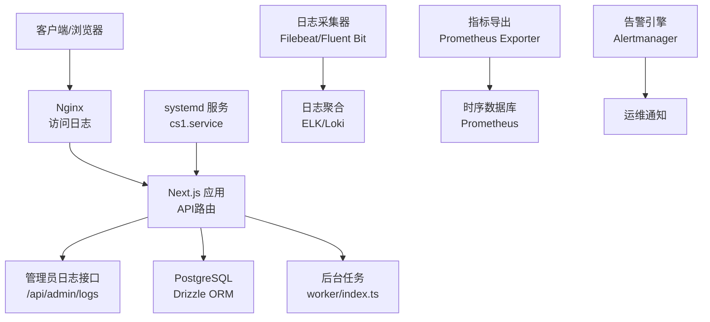
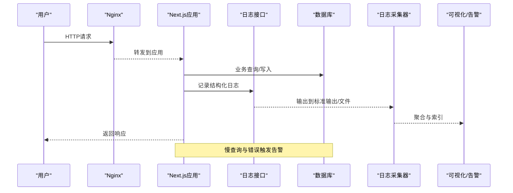
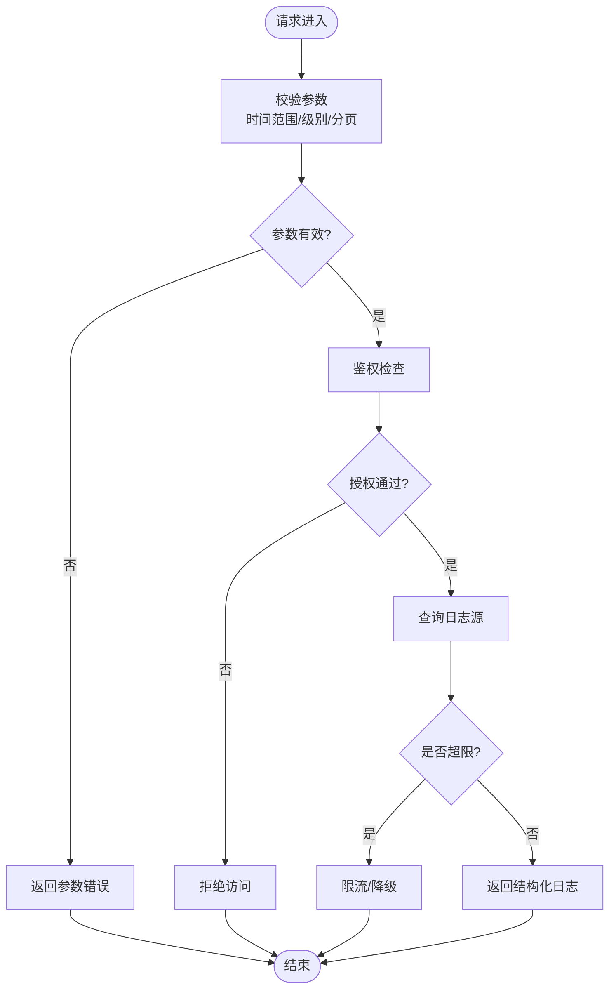
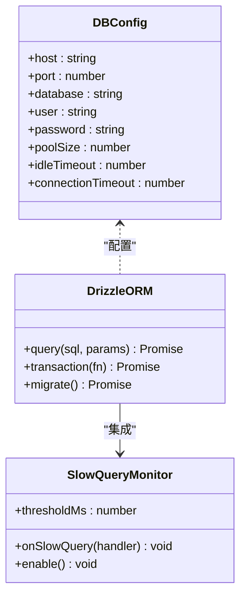
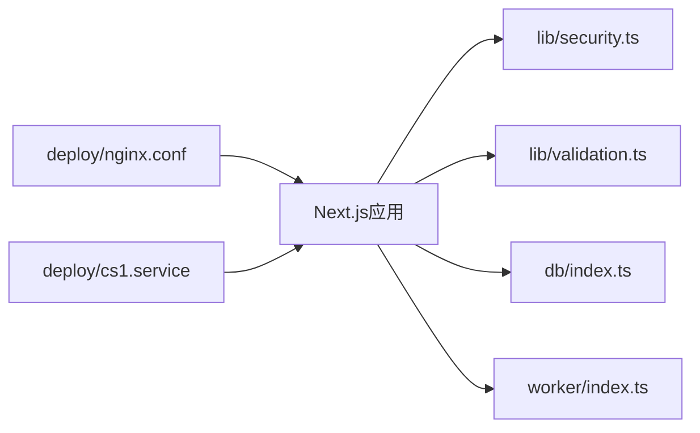
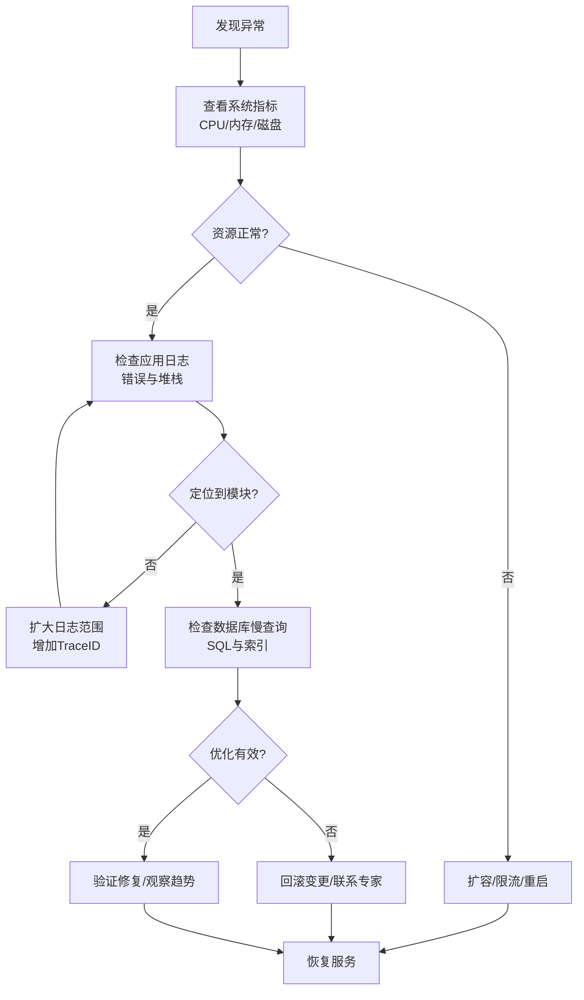

# 监控与日志管理

<cite>
**本文档引用的文件**   
- [app/api/admin/logs/route.ts](file://app/api/admin/logs/route.ts)
- [lib/security.ts](file://lib/security.ts)
- [lib/validation.ts](file://lib/validation.ts)
- [db/index.ts](file://db/index.ts)
- [drizzle.config.ts](file://drizzle.config.ts)
- [deploy/nginx.conf](file://deploy/nginx.conf)
- [deploy/cs1.service](file://deploy/cs1.service)
- [package.json](file://package.json)
- [next.config.ts](file://next.config.ts)
- [worker/index.ts](file://worker/index.ts)
</cite>

## 目录
1. [简介](#简介)
2. [项目结构](#项目结构)
3. [核心组件](#核心组件)
4. [架构总览](#架构总览)
5. [详细组件分析](#详细组件分析)
6. [依赖关系分析](#依赖关系分析)
7. [性能考虑](#性能考虑)
8. [故障排查指南](#故障排查指南)
9. [结论](#结论)
10. [附录](#附录)

## 简介
本文件面向CS1学生事务管理系统的运维与开发团队，提供统一的监控与日志管理方案。内容覆盖：
- 应用日志收集、结构化日志格式与日志轮转配置
- 性能指标监控、错误追踪与告警规则
- 访问日志分析、慢查询检测与内存使用监控
- 日志聚合方案、可视化仪表板与故障排查流程

目标是帮助团队快速定位问题、保障系统稳定性，并为容量规划与性能优化提供数据支撑。

## 项目结构
本项目采用Next.js API路由组织后端能力，数据库通过Drizzle ORM进行迁移与连接，部署由Nginx反向代理与systemd服务管理。监控与日志相关的关键位置包括：
- API层：admin日志接口用于集中获取与筛选日志
- 安全与校验：统一的安全策略与输入校验，有助于减少异常日志噪声
- 数据库层：Drizzle配置与连接，便于接入慢查询与连接池监控
- 部署层：Nginx访问日志与systemd进程守护，便于日志采集与重启恢复
- 构建与运行：Next.js运行时与Worker进程，便于资源与性能观测

图表来源
- [deploy/nginx.conf](file://deploy/nginx.conf)
- [app/api/admin/logs/route.ts](file://app/api/admin/logs/route.ts)
- [db/index.ts](file://db/index.ts)
- [drizzle.config.ts](file://drizzle.config.ts)
- [worker/index.ts](file://worker/index.ts)
- [deploy/cs1.service](file://deploy/cs1.service)

章节来源
- [deploy/nginx.conf](file://deploy/nginx.conf)
- [deploy/cs1.service](file://deploy/cs1.service)
- [app/api/admin/logs/route.ts](file://app/api/admin/logs/route.ts)
- [db/index.ts](file://db/index.ts)
- [drizzle.config.ts](file://drizzle.config.ts)
- [worker/index.ts](file://worker/index.ts)

## 核心组件
- 应用日志接口：提供按时间、级别、模块等维度检索日志的能力，供前端或外部系统调用
- 安全与校验：对请求参数进行严格校验，降低非法输入导致的异常日志
- 数据库连接与迁移：通过Drizzle统一管理连接与迁移，便于接入慢查询与连接池监控
- 部署与进程管理：Nginx负责访问日志与反向代理；systemd确保服务高可用
- 后台任务：异步处理耗时任务，避免阻塞主线程并记录执行结果

章节来源
- [app/api/admin/logs/route.ts](file://app/api/admin/logs/route.ts)
- [lib/security.ts](file://lib/security.ts)
- [lib/validation.ts](file://lib/validation.ts)
- [db/index.ts](file://db/index.ts)
- [drizzle.config.ts](file://drizzle.config.ts)
- [deploy/nginx.conf](file://deploy/nginx.conf)
- [deploy/cs1.service](file://deploy/cs1.service)
- [worker/index.ts](file://worker/index.ts)

## 架构总览
整体监控与日志架构分为四层：
- 采集层：Nginx访问日志、应用结构化日志、数据库慢查询日志、系统指标（CPU/内存/IO）
- 传输层：日志采集器（如Filebeat/Fluent Bit）将日志转发至聚合平台；指标导出器上报Prometheus
- 存储与分析层：日志聚合（ELK/Loki）、时序数据库（Prometheus）、告警引擎（Alertmanager）
- 展示与响应层：Grafana/Kibana仪表板、告警通知（邮件/钉钉/企业微信）

图表来源
- [deploy/nginx.conf](file://deploy/nginx.conf)
- [app/api/admin/logs/route.ts](file://app/api/admin/logs/route.ts)
- [db/index.ts](file://db/index.ts)
- [worker/index.ts](file://worker/index.ts)

## 详细组件分析

### 应用日志接口（/api/admin/logs）
职责
- 接收管理员的日志查询请求，支持按时间范围、日志级别、模块、关键词过滤
- 从日志源（文件/标准输出/集中式存储）读取并返回结构化日志条目
- 提供分页与排序能力，便于前端展示与导出

关键设计
- 输入校验：对时间范围、级别、分页参数进行严格校验，防止注入与越界
- 权限控制：仅允许具备管理员角色的用户访问
- 性能保护：限制单次查询条数与时间跨度，避免大查询拖垮系统

图表来源
- [app/api/admin/logs/route.ts](file://app/api/admin/logs/route.ts)
- [lib/validation.ts](file://lib/validation.ts)
- [lib/security.ts](file://lib/security.ts)

章节来源
- [app/api/admin/logs/route.ts](file://app/api/admin/logs/route.ts)
- [lib/validation.ts](file://lib/validation.ts)
- [lib/security.ts](file://lib/security.ts)

### 安全与校验（lib/security.ts, lib/validation.ts）
职责
- 统一的安全策略：防重放、签名校验、敏感信息脱敏
- 输入校验：类型、长度、枚举值、正则表达式等约束
- 错误规范化：将异常转换为标准错误码与消息，便于日志与告警

最佳实践
- 所有外部输入必须经过校验，失败即记录结构化错误日志
- 敏感字段（密码、令牌）在日志中自动脱敏
- 错误分类：业务错误、系统错误、第三方错误，分别设置不同告警阈值

章节来源
- [lib/security.ts](file://lib/security.ts)
- [lib/validation.ts](file://lib/validation.ts)

### 数据库层（db/index.ts, drizzle.config.ts）
职责
- 管理数据库连接池、重试与超时
- 提供迁移脚本与版本管理
- 支持慢查询日志与SQL审计

监控要点
- 连接池使用率、活跃连接数、等待队列长度
- 慢查询阈值（如超过500ms），记录SQL与上下文
- 事务回滚率、锁等待与死锁检测

图表来源
- [db/index.ts](file://db/index.ts)
- [drizzle.config.ts](file://drizzle.config.ts)

章节来源
- [db/index.ts](file://db/index.ts)
- [drizzle.config.ts](file://drizzle.config.ts)

### 部署与进程管理（deploy/nginx.conf, deploy/cs1.service）
职责
- Nginx作为反向代理与静态资源服务器，记录访问日志
- systemd管理服务生命周期，支持自动重启与日志输出

配置要点
- Nginx访问日志格式包含请求方法、路径、状态码、耗时、客户端IP
- systemd服务定义工作目录、环境变量、重启策略、日志输出到journal

章节来源
- [deploy/nginx.conf](file://deploy/nginx.conf)
- [deploy/cs1.service](file://deploy/cs1.service)

### 后台任务（worker/index.ts）
职责
- 异步处理批量导入、报表生成、通知发送等耗时任务
- 记录任务开始、进度、成功/失败与耗时

监控要点
- 任务队列长度、平均处理时长、失败率
- 资源占用（CPU/内存）与并发度控制

章节来源
- [worker/index.ts](file://worker/index.ts)

## 依赖关系分析
- Next.js应用依赖lib下的安全与校验模块，确保请求处理的一致性与安全性
- 数据库操作通过db/index.ts封装，统一连接与错误处理
- 部署依赖Nginx与systemd，保证服务稳定与可观测性
- 监控与日志依赖外部采集器与聚合平台，形成端到端可观测性

图表来源
- [lib/security.ts](file://lib/security.ts)
- [lib/validation.ts](file://lib/validation.ts)
- [db/index.ts](file://db/index.ts)
- [worker/index.ts](file://worker/index.ts)
- [deploy/nginx.conf](file://deploy/nginx.conf)
- [deploy/cs1.service](file://deploy/cs1.service)

章节来源
- [lib/security.ts](file://lib/security.ts)
- [lib/validation.ts](file://lib/validation.ts)
- [db/index.ts](file://db/index.ts)
- [worker/index.ts](file://worker/index.ts)
- [deploy/nginx.conf](file://deploy/nginx.conf)
- [deploy/cs1.service](file://deploy/cs1.service)

## 性能考虑
- 日志写入：采用异步写入与批处理，避免阻塞主线程；合理设置缓冲与刷新策略
- 查询性能：为常用查询添加索引，限制复杂查询的时间范围与分页大小
- 连接池：根据负载调整连接池大小与超时，避免连接泄漏
- 缓存：热点数据使用内存缓存或Redis，降低数据库压力
- 资源监控：持续监控CPU、内存、磁盘IO与网络带宽，设置阈值告警

[本节为通用指导，不直接分析具体文件]

## 故障排查指南
常见问题与步骤
- 无法访问服务：检查systemd服务状态、端口占用、防火墙规则
- 日志缺失：确认日志采集器运行状态、文件权限、磁盘空间
- 数据库连接失败：检查连接字符串、网络连通性、认证信息
- 慢查询导致延迟：启用慢查询日志，分析执行计划，优化SQL或索引
- 内存泄漏：监控堆内存增长，定位未释放对象或循环引用

建议工具
- 日志：grep/awk/sed、jq解析JSON日志、kibana搜索
- 数据库：pg_stat_statements、EXPLAIN ANALYZE
- 系统：top/htop、free、iostat、netstat/ss
- 应用：Node.js Profiler、内存快照、APM工具

章节来源
- [deploy/cs1.service](file://deploy/cs1.service)
- [deploy/nginx.conf](file://deploy/nginx.conf)
- [db/index.ts](file://db/index.ts)

## 结论
通过统一的日志采集、结构化日志格式、完善的监控与告警体系，CS1学生事务管理系统可实现端到端可观测性。结合Nginx访问日志、应用结构化日志、数据库慢查询与系统指标，配合ELK/Loki与Prometheus/Grafana，能够快速定位问题、优化性能并提升系统稳定性。

[本节为总结，不直接分析具体文件]

## 附录

### 结构化日志格式规范
- 字段：timestamp、level、service、module、trace_id、message、context、duration_ms、error_code
- 示例说明：每个请求生成唯一trace_id，贯穿上下游调用链；错误包含错误码与堆栈摘要
- 脱敏：自动移除或哈希化敏感字段（密码、令牌、身份证号）

[本节为规范说明，不直接分析具体文件]

### 日志轮转配置建议
- 文件大小：单文件不超过50MB，保留最近7天
- 压缩：归档后压缩为.gz，节省磁盘空间
- 清理：定期清理过期日志，避免磁盘写满
- 采集：Filebeat/Fluent Bit按路径与模式采集，避免重复

[本节为配置建议，不直接分析具体文件]

### 性能指标监控清单
- 应用：QPS、P95/P99延迟、错误率、GC停顿、堆内存使用
- 数据库：连接池使用率、慢查询数量、事务回滚率、锁等待
- 系统：CPU使用率、内存占用、磁盘IO、网络吞吐

[本节为指标清单，不直接分析具体文件]

### 告警规则设置
- 错误率：超过阈值（如5%）持续1分钟
- 延迟：P99超过阈值（如2s）持续3分钟
- 资源：CPU>80%、内存>85%、磁盘>90%
- 数据库：慢查询>10次/分钟、连接池耗尽、死锁发生

[本节为告警规则，不直接分析具体文件]

### 访问日志分析要点
- 高频路径：识别热点接口与潜在瓶颈
- 状态码分布：关注4xx/5xx比例与趋势
- 客户端IP：识别异常流量与攻击行为
- 耗时分布：定位慢请求与超时问题

[本节为分析要点，不直接分析具体文件]

### 慢查询检测与优化
- 阈值：默认500ms，可根据业务调整
- 采样：全量记录或采样记录，平衡开销与覆盖率
- 优化：添加索引、重写SQL、拆分事务、引入缓存

[本节为检测与优化，不直接分析具体文件]

### 内存使用监控
- 指标：RSS、Heap Used、Heap Total、GC次数与耗时
- 告警：Heap使用率>80%持续5分钟
- 诊断：生成堆快照，分析对象保留路径

[本节为监控与诊断，不直接分析具体文件]

### 日志聚合与可视化
- 聚合：ELK（Elasticsearch+Logstash+Kibana）或Loki+Grafana
- 仪表板：错误趋势、慢查询TopN、资源使用趋势、业务指标
- 告警：集成Alertmanager或Grafana Alerting，推送至多渠道

[本节为聚合与可视化，不直接分析具体文件]

### 故障排查流程图

[本节为流程图，不直接分析具体文件]