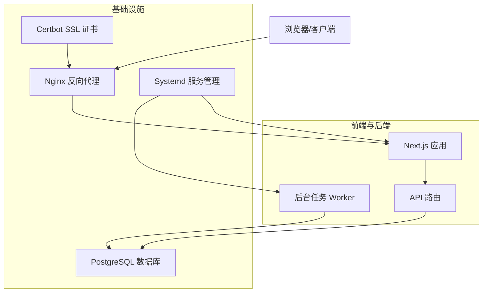
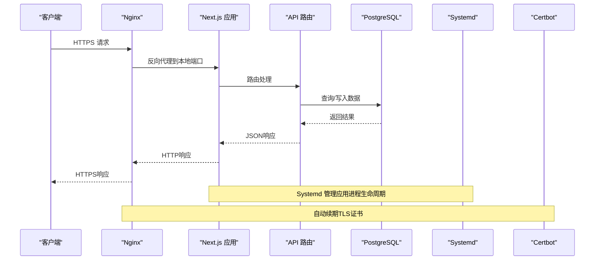
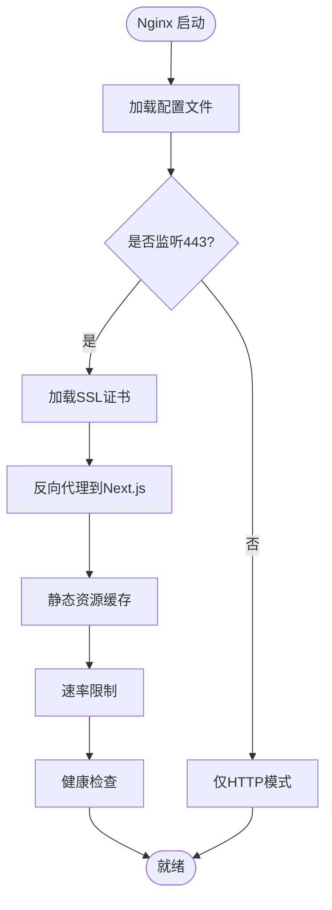
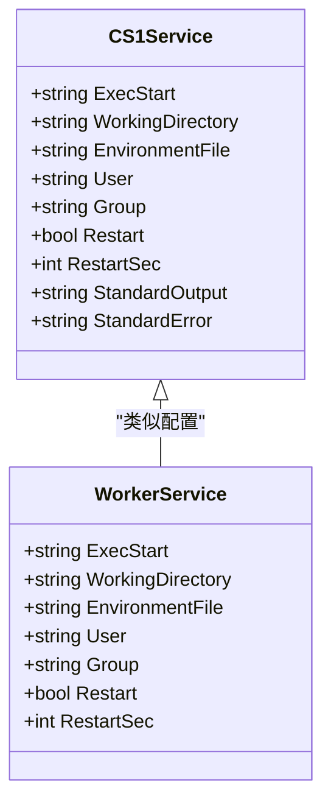
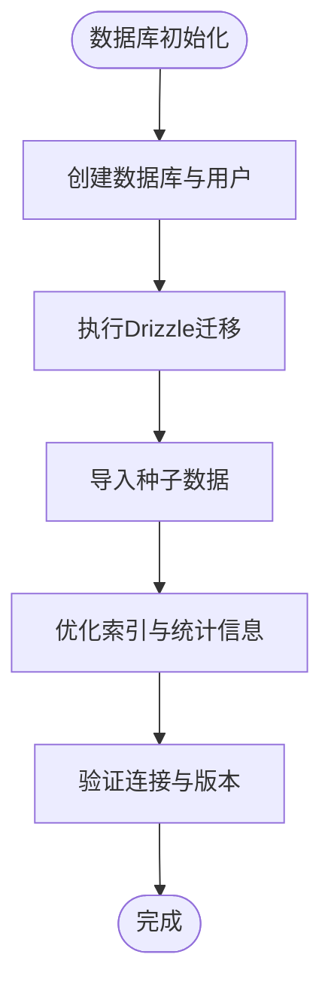
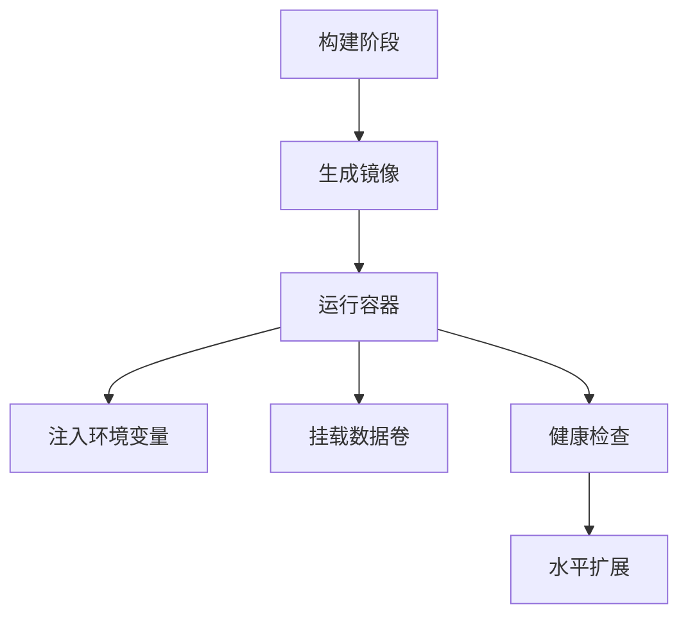
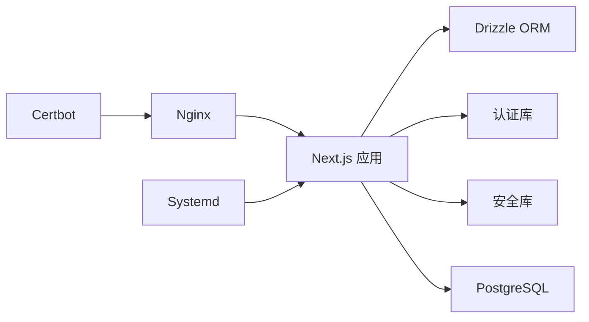

# 部署与运维

<cite>
**本文引用的文件**   
- [README.md](file://README.md)
- [package.json](file://package.json)
- [next.config.ts](file://next.config.ts)
- [drizzle.config.ts](file://drizzle.config.ts)
- [db/index.ts](file://db/index.ts)
- [db/schema.ts](file://db/schema.ts)
- [lib/auth.ts](file://lib/auth.ts)
- [lib/security.ts](file://lib/security.ts)
- [lib/rate-limit.ts](file://lib/rate-limit.ts)
- [worker/index.ts](file://worker/index.ts)
- [deploy/cs1.service](file://deploy/cs1.service)
- [deploy/nginx.conf](file://deploy/nginx.conf)
- [deploy/nginx-http-bootstrap.conf](file://deploy/nginx-http-bootstrap.conf)
- [deploy/setup-postgres.sh](file://deploy/setup-postgres.sh)
- [deploy/prepare-production-postgres.sh](file://deploy/prepare-production-postgres.sh)
- [deploy/certbot-renew.service](file://deploy/certbot-renew.service)
- [deploy/certbot-renew.timer](file://deploy/certbot-renew.timer)
- [scripts/migrate.mjs](file://scripts/migrate.mjs)
- [scripts/seed-admin.mjs](file://scripts/seed-admin.mjs)
- [scripts/migrate-sqlite-to-postgres.mjs](file://scripts/migrate-sqlite-to-postgres.mjs)
- [drizzle-postgres/0000_fine_psylocke.sql](file://drizzle-postgres/0000_fine_psylocke.sql)
- [drizzle-postgres/meta/_journal.json](file://drizzle-postgres/meta/_journal.json)
</cite>

## 目录
1. [简介](#简介)
2. [项目结构](#项目结构)
3. [核心组件](#核心组件)
4. [架构总览](#架构总览)
5. [详细组件分析](#详细组件分析)
6. [依赖关系分析](#依赖关系分析)
7. [性能考虑](#性能考虑)
8. [故障排查指南](#故障排查指南)
9. [结论](#结论)
10. [附录](#附录)

## 简介
本文件面向生产环境的CS1学生事务管理系统，提供端到端的部署与运维说明。内容涵盖：
- 生产环境部署流程（含Docker容器化）
- Nginx反向代理配置与SSL证书管理
- Systemd服务管理
- PostgreSQL数据库初始化、迁移与备份恢复
- 环境变量与安全配置
- 监控与日志管理
- 性能调优建议
- CI/CD流水线与自动化部署脚本

## 项目结构
本项目采用Next.js应用与PostgreSQL数据库的组合，使用Drizzle ORM进行数据建模与迁移，Nginx作为反向代理，Systemd管理服务进程，Certbot负责SSL证书续期。关键目录与职责如下：
- app：Next.js应用代码与API路由
- db：数据库连接与Schema定义
- lib：认证、安全、限流等通用库
- worker：后台任务处理
- deploy：系统级部署脚本与服务配置
- scripts：数据库迁移与种子数据脚本
- drizzle-postgres：数据库迁移SQL与元数据

图表来源
- [next.config.ts:1-200](file://next.config.ts#L1-L200)
- [deploy/nginx.conf:1-200](file://deploy/nginx.conf#L1-L200)
- [deploy/cs1.service:1-200](file://deploy/cs1.service#L1-L200)
- [db/index.ts:1-200](file://db/index.ts#L1-L200)

章节来源
- [README.md:1-200](file://README.md#L1-L200)
- [package.json:1-200](file://package.json#L1-L200)

## 核心组件
- 应用运行时：Next.js构建产物由Systemd启动，监听本地端口供Nginx转发。
- 反向代理：Nginx处理HTTPS终止、静态资源缓存、请求头转发与速率限制。
- 数据库：PostgreSQL通过Drizzle迁移脚本初始化与升级；提供备份与恢复策略。
- 认证与安全：基于环境变量配置JWT密钥、密码哈希策略与CORS设置。
- 后台任务：Worker进程独立运行，处理异步任务与定时任务。
- 证书管理：Certbot自动申请与续期Let's Encrypt证书，配合Systemd定时器执行。

章节来源
- [db/index.ts:1-200](file://db/index.ts#L1-L200)
- [lib/auth.ts:1-200](file://lib/auth.ts#L1-L200)
- [lib/security.ts:1-200](file://lib/security.ts#L1-L200)
- [lib/rate-limit.ts:1-200](file://lib/rate-limit.ts#L1-L200)
- [worker/index.ts:1-200](file://worker/index.ts#L1-L200)

## 架构总览
下图展示生产环境的关键组件交互：客户端通过Nginx访问Next.js应用，应用调用API并读写PostgreSQL；Systemd管理服务生命周期；Certbot维护TLS证书。

图表来源
- [deploy/nginx.conf:1-200](file://deploy/nginx.conf#L1-L200)
- [deploy/cs1.service:1-200](file://deploy/cs1.service#L1-L200)
- [db/index.ts:1-200](file://db/index.ts#L1-L200)

## 详细组件分析

### Nginx配置与SSL证书
- 作用：HTTPS终止、静态资源缓存、请求头转发、速率限制、健康检查。
- 关键点：
  - 监听443端口并启用HTTP/2
  - 将/api/*转发至Next.js本地端口
  - 配置静态资源缓存与Gzip压缩
  - 集成Certbot证书路径与自动续期
  - 设置安全头（HSTS、CSP、X-Frame-Options等）

图表来源
- [deploy/nginx.conf:1-200](file://deploy/nginx.conf#L1-L200)
- [deploy/nginx-http-bootstrap.conf:1-200](file://deploy/nginx-http-bootstrap.conf#L1-L200)
- [deploy/certbot-renew.service:1-200](file://deploy/certbot-renew.service#L1-L200)
- [deploy/certbot-renew.timer:1-200](file://deploy/certbot-renew.timer#L1-L200)

章节来源
- [deploy/nginx.conf:1-200](file://deploy/nginx.conf#L1-L200)
- [deploy/nginx-http-bootstrap.conf:1-200](file://deploy/nginx-http-bootstrap.conf#L1-L200)
- [deploy/certbot-renew.service:1-200](file://deploy/certbot-renew.service#L1-L200)
- [deploy/certbot-renew.timer:1-200](file://deploy/certbot-renew.timer#L1-L200)

### Systemd服务配置
- 作用：管理Next.js应用与Worker进程的启动、停止、重启与自启。
- 关键点：
  - 指定工作目录与环境变量文件
  - 设置用户与组权限
  - 配置日志输出与轮转
  - 依赖网络与数据库服务

图表来源
- [deploy/cs1.service:1-200](file://deploy/cs1.service#L1-L200)

章节来源
- [deploy/cs1.service:1-200](file://deploy/cs1.service#L1-L200)

### PostgreSQL数据库初始化与迁移
- 作用：创建数据库、用户、表结构与初始数据。
- 关键点：
  - 使用setup脚本创建数据库与用户
  - 通过Drizzle迁移脚本同步Schema
  - 支持SQLite到PostgreSQL的迁移工具
  - 生产环境准备脚本包含索引优化与统计信息更新

图表来源
- [deploy/setup-postgres.sh:1-200](file://deploy/setup-postgres.sh#L1-200)
- [deploy/prepare-production-postgres.sh:1-200](file://deploy/prepare-production-postgres.sh#L1-200)
- [scripts/migrate.mjs:1-200](file://scripts/migrate.mjs#L1-200)
- [scripts/migrate-sqlite-to-postgres.mjs:1-200](file://scripts/migrate-sqlite-to-postgres.mjs#L1-200)
- [drizzle-postgres/0000_fine_psylocke.sql:1-200](file://drizzle-postgres/0000_fine_psylocke.sql#L1-200)
- [drizzle-postgres/meta/_journal.json:1-200](file://drizzle-postgres/meta/_journal.json#L1-200)

章节来源
- [db/index.ts:1-200](file://db/index.ts#L1-L200)
- [db/schema.ts:1-200](file://db/schema.ts#L1-L200)
- [drizzle.config.ts:1-200](file://drizzle.config.ts#L1-L200)
- [scripts/seed-admin.mjs:1-200](file://scripts/seed-admin.mjs#L1-L200)

### Docker容器化部署
- 作用：将应用打包为镜像，简化部署与扩展。
- 关键点：
  - 多阶段构建以减小镜像体积
  - 暴露必要端口（如3000）
  - 挂载环境变量与持久化卷
  - 健康检查与资源限制

[本节为概念性说明，未直接映射具体文件]

### 环境变量与安全配置
- 作用：集中管理敏感信息与运行时配置。
- 关键点：
  - 数据库连接字符串、JWT密钥、CORS白名单
  - 日志级别与调试开关
  - 速率限制阈值与黑名单策略
  - 安全头与密码哈希算法

章节来源
- [lib/auth.ts:1-200](file://lib/auth.ts#L1-L200)
- [lib/security.ts:1-200](file://lib/security.ts#L1-L200)
- [lib/rate-limit.ts:1-200](file://lib/rate-limit.ts#L1-L200)

### 监控与日志管理
- 作用：收集应用指标、错误日志与访问日志。
- 关键点：
  - 结构化日志输出到stdout/stderr
  - Nginx访问日志与错误日志分离
  - 集成Prometheus/Grafana或ELK栈
  - 日志轮转与保留策略

[本节为概念性说明，未直接映射具体文件]

### 备份与恢复策略
- 作用：确保数据安全与快速恢复。
- 关键点：
  - 定期全量与增量备份
  - 异地存储与加密传输
  - 恢复演练与验证流程
  - 灾难恢复计划（RTO/RPO）

[本节为概念性说明，未直接映射具体文件]

### CI/CD流水线与自动化部署
- 作用：自动化测试、构建、发布与回滚。
- 关键点：
  - 代码提交触发构建与测试
  - 镜像推送至仓库
  - 蓝绿部署或滚动更新
  - 健康检查与自动回滚

[本节为概念性说明，未直接映射具体文件]

## 依赖关系分析
- 应用层依赖：Next.js框架、Node.js运行时、Drizzle ORM
- 基础设施依赖：Nginx、PostgreSQL、Systemd、Certbot
- 安全依赖：TLS证书、JWT库、密码哈希库
- 监控依赖：日志采集器、指标收集器

图表来源
- [package.json:1-200](file://package.json#L1-L200)
- [next.config.ts:1-200](file://next.config.ts#L1-L200)
- [drizzle.config.ts:1-200](file://drizzle.config.ts#L1-L200)

章节来源
- [package.json:1-200](file://package.json#L1-L200)
- [next.config.ts:1-200](file://next.config.ts#L1-L200)

## 性能考虑
- 应用层：
  - 启用Next.js静态导出与增量静态再生成
  - 合理设置内存限制与并发线程数
  - 使用连接池优化数据库访问
- 数据库层：
  - 调整共享内存、工作内存与连接数
  - 定期VACUUM与ANALYZE
  - 索引优化与查询计划分析
- 代理层：
  - 启用HTTP/2与Keep-Alive
  - 合理配置缓存与压缩
  - 限制并发连接与请求大小

[本节为通用指导，未直接分析具体文件]

## 故障排查指南
- 常见问题：
  - 数据库连接失败：检查连接字符串、防火墙与权限
  - 证书过期：验证Certbot服务状态与域名解析
  - 应用崩溃：查看Systemd日志与核心转储
  - 性能瓶颈：分析慢查询与CPU/内存使用率
- 诊断步骤：
  - 使用systemctl status查看服务状态
  - 检查/var/log/nginx与/var/log/postgresql日志
  - 使用pg_stat_statements分析慢查询
  - 启用详细日志与调试模式

章节来源
- [deploy/cs1.service:1-200](file://deploy/cs1.service#L1-L200)
- [deploy/nginx.conf:1-200](file://deploy/nginx.conf#L1-L200)
- [db/index.ts:1-200](file://db/index.ts#L1-L200)

## 结论
本部署文档提供了CS1学生事务管理系统的完整生产环境部署方案。通过标准化配置与自动化脚本，可确保系统稳定、安全、可扩展地运行。建议结合企业现有基础设施进行适配，并持续监控与优化。

## 附录
- 环境变量模板与示例
- 备份脚本与恢复手册
- 监控告警规则与仪表盘
- 安全基线与合规检查清单

[本节为补充信息，未直接分析具体文件]