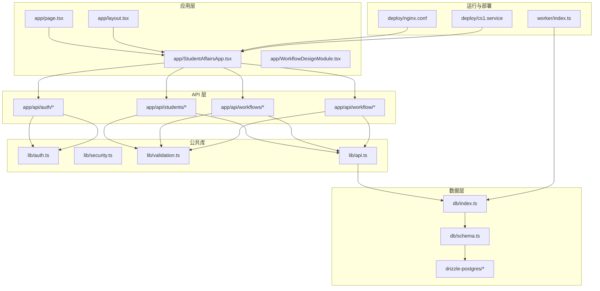
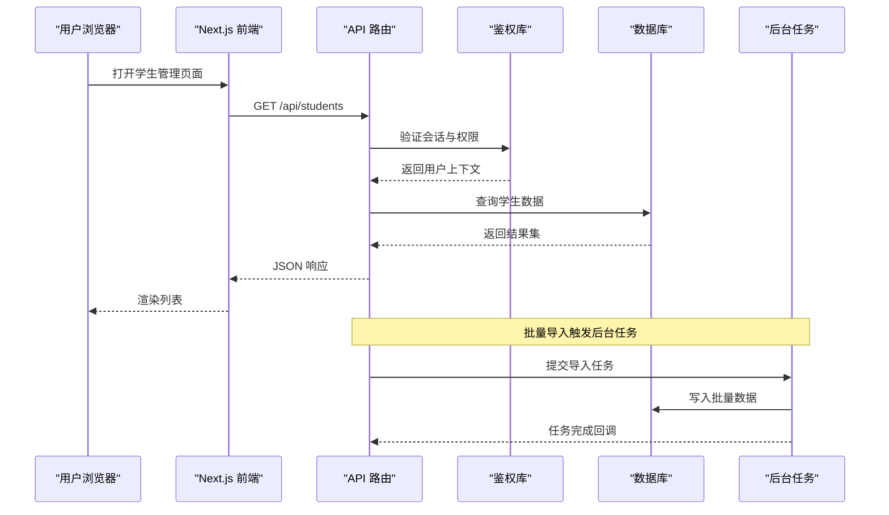
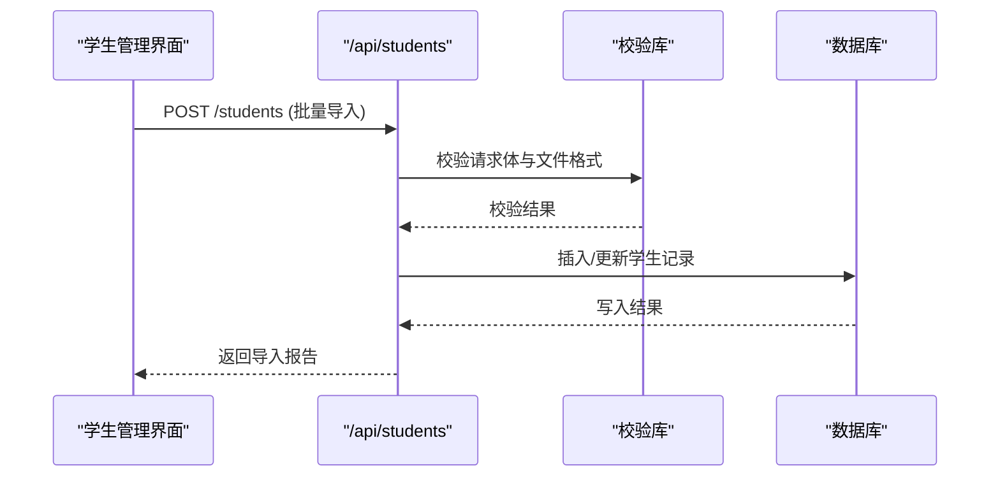
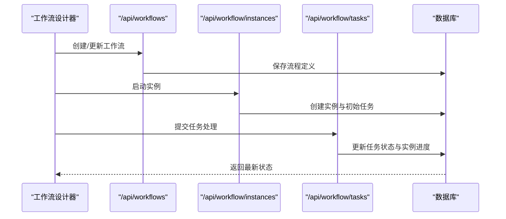
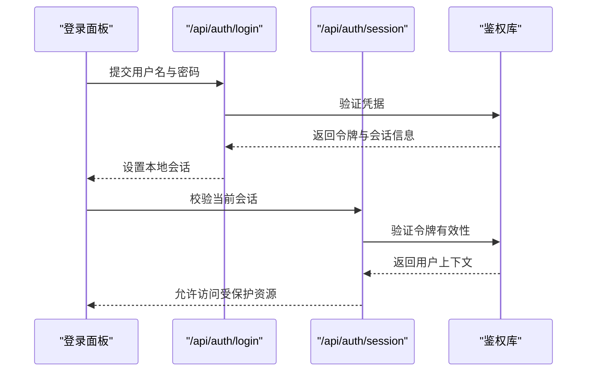
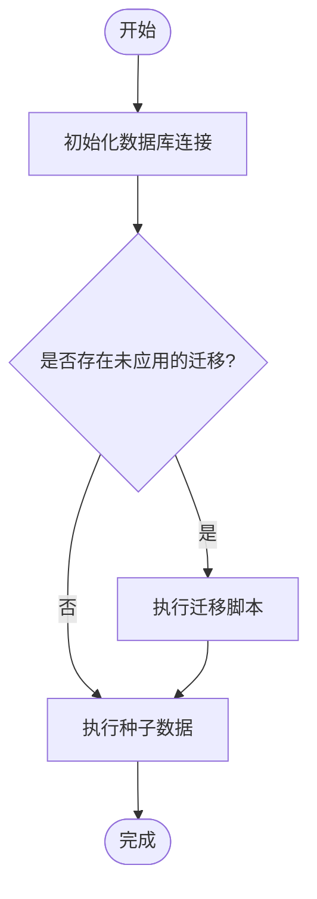
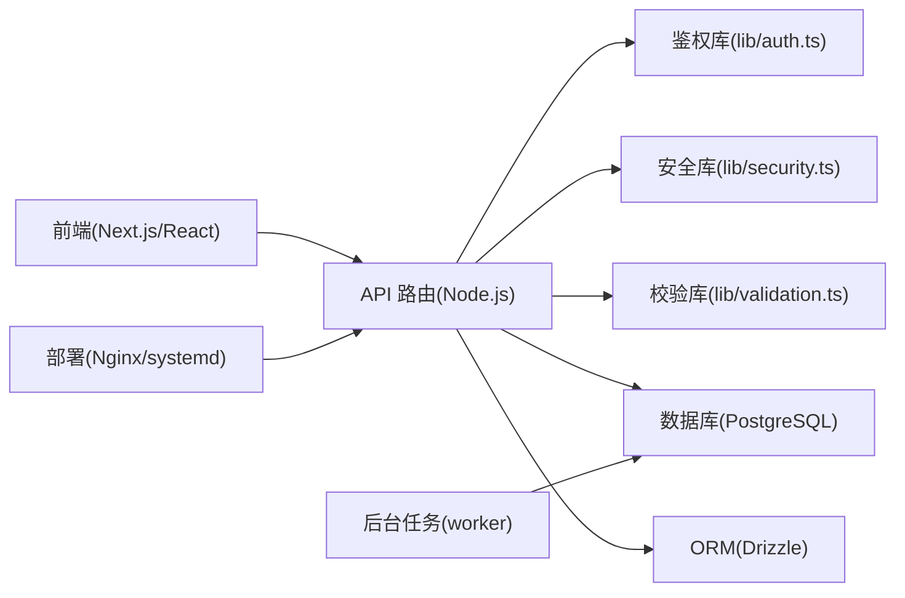

# 项目概览

<cite>
**本文引用的文件**   
- [README.md](file://README.md)
- [package.json](file://package.json)
- [next.config.ts](file://next.config.ts)
- [app/page.tsx](file://app/page.tsx)
- [app/layout.tsx](file://app/layout.tsx)
- [app/StudentAffairsApp.tsx](file://app/StudentAffairsApp.tsx)
- [app/WorkflowDesignModule.tsx](file://app/WorkflowDesignModule.tsx)
- [app/system-data.ts](file://app/system-data.ts)
- [app/feature-metadata.ts](file://app/feature-metadata.ts)
- [db/index.ts](file://db/index.ts)
- [db/schema.ts](file://db/schema.ts)
- [drizzle.config.ts](file://drizzle.config.ts)
- [lib/auth.ts](file://lib/auth.ts)
- [lib/security.ts](file://lib/security.ts)
- [lib/validation.ts](file://lib/validation.ts)
- [lib/api.ts](file://lib/api.ts)
- [worker/index.ts](file://worker/index.ts)
- [deploy/cs1.service](file://deploy/cs1.service)
- [deploy/nginx.conf](file://deploy/nginx.conf)
- [scripts/migrate.mjs](file://scripts/migrate.mjs)
- [scripts/seed-admin.mjs](file://scripts/seed-admin.mjs)
- [app/api/auth/login/route.ts](file://app/api/auth/login/route.ts)
- [app/api/auth/session/route.ts](file://app/api/auth/session/route.ts)
- [app/api/students/route.ts](file://app/api/students/route.ts)
- [app/api/students/[id]/route.ts](file://app/api/students/[id]/route.ts)
- [app/api/workflows/route.ts](file://app/api/workflows/route.ts)
- [app/api/workflow/instances/route.ts](file://app/api/workflow/instances/route.ts)
- [app/api/workflow/tasks/route.ts](file://app/api/workflow/tasks/route.ts)
</cite>

## 目录
1. [简介](#简介)
2. [项目结构](#项目结构)
3. [核心组件](#核心组件)
4. [架构总览](#架构总览)
5. [详细组件分析](#详细组件分析)
6. [依赖关系分析](#依赖关系分析)
7. [性能考虑](#性能考虑)
8. [故障排查指南](#故障排查指南)
9. [结论](#结论)
10. [附录](#附录)

## 简介
本文件为 CS1 学生事务管理系统的全面项目概览，面向初学者与有经验的开发者。系统围绕“学生信息管理、工作流处理、权限控制与数据管理”四大主题构建，采用现代全栈技术栈：Next.js（App Router）作为前后端一体化框架，PostgreSQL 作为持久化数据库，Drizzle ORM 进行数据建模与迁移，配合安全与校验库保障接口健壮性。部署层面提供 Nginx 反向代理与 systemd 服务脚本，便于生产环境上线。

主要目标
- 统一管理学生基本信息、关联记录与导入导出能力
- 通过可配置的工作流驱动审批、归档、审核等业务流程
- 基于角色与鉴权的访问控制，确保数据安全
- 提供可扩展的 API 层与前端模块，支撑多场景使用

典型使用场景
- 辅导员批量导入学生并维护基础信息
- 业务人员创建表单与模型，定义流程节点与条件分支
- 管理员查看审计日志、用户管理与系统统计
- 学生在授权后查看个人相关记录与通知

[本节不直接分析具体文件]

## 项目结构
系统采用 Next.js App Router 组织代码，按功能域划分目录：
- app：页面、API 路由、组件与全局布局
- db：数据库连接与模式定义
- drizzle-postgres：数据库迁移脚本与元数据
- lib：通用库（鉴权、安全、校验、API 工具）
- worker：后台任务处理入口
- deploy：Nginx 与 systemd 部署配置
- scripts：数据迁移与种子脚本
- tests：单元测试与集成测试

图表来源
- [app/page.tsx:1-20](file://app/page.tsx#L1-L20)
- [app/layout.tsx:1-20](file://app/layout.tsx#L1-L20)
- [app/StudentAffairsApp.tsx:1-20](file://app/StudentAffairsApp.tsx#L1-L20)
- [app/WorkflowDesignModule.tsx:1-20](file://app/WorkflowDesignModule.tsx#L1-L20)
- [db/index.ts:1-20](file://db/index.ts#L1-L20)
- [db/schema.ts:1-20](file://db/schema.ts#L1-L20)
- [drizzle.config.ts:1-20](file://drizzle.config.ts#L1-L20)
- [lib/auth.ts:1-20](file://lib/auth.ts#L1-L20)
- [lib/security.ts:1-20](file://lib/security.ts#L1-L20)
- [lib/validation.ts:1-20](file://lib/validation.ts#L1-L20)
- [lib/api.ts:1-20](file://lib/api.ts#L1-L20)
- [worker/index.ts:1-20](file://worker/index.ts#L1-L20)
- [deploy/nginx.conf:1-20](file://deploy/nginx.conf#L1-L20)
- [deploy/cs1.service:1-20](file://deploy/cs1.service#L1-L20)

章节来源
- [package.json:1-40](file://package.json#L1-L40)
- [next.config.ts:1-40](file://next.config.ts#L1-L40)
- [app/page.tsx:1-20](file://app/page.tsx#L1-L20)
- [app/layout.tsx:1-20](file://app/layout.tsx#L1-L20)

## 核心组件
- 应用入口与布局
  - 根页面与布局负责初始化全局样式、路由与状态容器
  - 主应用组件承载学生事务与工作流设计两大模块
- 学生管理
  - 提供学生列表、详情、批量导入与关联操作
  - 通过 API 路由暴露增删改查与批量处理能力
- 工作流设计与执行
  - 支持表单与模型设计、流程实例与任务处理
  - 通过 API 路由协调实例生命周期与任务流转
- 鉴权与安全
  - 登录与会话管理，统一鉴权中间逻辑
  - 输入校验与安全防护策略
- 数据层
  - 数据库连接与模式定义，ORM 迁移与版本管理
- 后台任务
  - 异步任务处理入口，用于耗时或批处理操作
- 部署与运维
  - Nginx 反向代理与 HTTPS 证书续期
  - systemd 服务管理应用进程

章节来源
- [app/StudentAffairsApp.tsx:1-20](file://app/StudentAffairsApp.tsx#L1-L20)
- [app/WorkflowDesignModule.tsx:1-20](file://app/WorkflowDesignModule.tsx#L1-L20)
- [app/system-data.ts:1-20](file://app/system-data.ts#L1-L20)
- [app/feature-metadata.ts:1-20](file://app/feature-metadata.ts#L1-L20)
- [db/index.ts:1-20](file://db/index.ts#L1-L20)
- [db/schema.ts:1-20](file://db/schema.ts#L1-L20)
- [lib/auth.ts:1-20](file://lib/auth.ts#L1-L20)
- [lib/security.ts:1-20](file://lib/security.ts#L1-L20)
- [lib/validation.ts:1-20](file://lib/validation.ts#L1-L20)
- [lib/api.ts:1-20](file://lib/api.ts#L1-L20)
- [worker/index.ts:1-20](file://worker/index.ts#L1-L20)
- [deploy/nginx.conf:1-20](file://deploy/nginx.conf#L1-L20)
- [deploy/cs1.service:1-20](file://deploy/cs1.service#L1-L20)

## 架构总览
系统采用分层架构：
- 表现层：Next.js 页面与组件，提供用户交互界面
- 接口层：RESTful API 路由，处理请求、鉴权、校验与响应
- 领域层：业务逻辑封装在 lib 与组件中，如工作流编排、学生管理
- 数据层：Drizzle ORM + PostgreSQL，保证数据一致性与迁移可追溯
- 运行层：Nginx 反向代理与 systemd 服务，worker 处理后台任务

图表来源
- [app/page.tsx:1-20](file://app/page.tsx#L1-L20)
- [app/api/students/route.ts:1-20](file://app/api/students/route.ts#L1-L20)
- [lib/auth.ts:1-20](file://lib/auth.ts#L1-L20)
- [db/index.ts:1-20](file://db/index.ts#L1-L20)
- [worker/index.ts:1-20](file://worker/index.ts#L1-L20)

## 详细组件分析

### 学生管理模块
职责
- 学生信息的增删改查、批量导入与导出
- 与学生相关的记录与通知管理

关键 API
- 获取学生列表与详情
- 更新学生信息与关联用户
- 批量导入学生数据

图表来源
- [app/api/students/route.ts:1-20](file://app/api/students/route.ts#L1-L20)
- [lib/validation.ts:1-20](file://lib/validation.ts#L1-L20)
- [db/schema.ts:1-20](file://db/schema.ts#L1-L20)

章节来源
- [app/api/students/route.ts:1-20](file://app/api/students/route.ts#L1-L20)
- [app/api/students/[id]/route.ts:1-20](file://app/api/students/[id]/route.ts#L1-L20)
- [lib/validation.ts:1-20](file://lib/validation.ts#L1-L20)
- [db/schema.ts:1-20](file://db/schema.ts#L1-L20)

### 工作流设计与执行模块
职责
- 表单与模型设计器，支持字段类型与约束
- 流程实例的生命周期管理（创建、推进、结束）
- 任务分配与处理，支持条件分支与审批节点

关键 API
- 创建工作流与模型
- 启动流程实例与提交任务
- 查询实例状态与任务列表

图表来源
- [app/api/workflows/route.ts:1-20](file://app/api/workflows/route.ts#L1-L20)
- [app/api/workflow/instances/route.ts:1-20](file://app/api/workflow/instances/route.ts#L1-L20)
- [app/api/workflow/tasks/route.ts:1-20](file://app/api/workflow/tasks/route.ts#L1-L20)
- [db/schema.ts:1-20](file://db/schema.ts#L1-L20)

章节来源
- [app/WorkflowDesignModule.tsx:1-20](file://app/WorkflowDesignModule.tsx#L1-L20)
- [app/api/workflows/route.ts:1-20](file://app/api/workflows/route.ts#L1-L20)
- [app/api/workflow/instances/route.ts:1-20](file://app/api/workflow/instances/route.ts#L1-L20)
- [app/api/workflow/tasks/route.ts:1-20](file://app/api/workflow/tasks/route.ts#L1-L20)

### 鉴权与权限控制
职责
- 用户登录与会话管理
- 基于角色的访问控制（RBAC）
- 安全策略与速率限制

关键 API
- 登录与会话校验

图表来源
- [app/api/auth/login/route.ts:1-20](file://app/api/auth/login/route.ts#L1-L20)
- [app/api/auth/session/route.ts:1-20](file://app/api/auth/session/route.ts#L1-L20)
- [lib/auth.ts:1-20](file://lib/auth.ts#L1-L20)

章节来源
- [lib/auth.ts:1-20](file://lib/auth.ts#L1-L20)
- [lib/security.ts:1-20](file://lib/security.ts#L1-L20)

### 数据管理与迁移
职责
- 数据库连接与模式定义
- Drizzle ORM 迁移与版本管理
- 数据种子与初始化脚本

关键文件
- 数据库连接与模式
- 迁移脚本与配置
- 种子脚本（管理员账户与测试数据）

图表来源
- [db/index.ts:1-20](file://db/index.ts#L1-L20)
- [db/schema.ts:1-20](file://db/schema.ts#L1-L20)
- [drizzle.config.ts:1-20](file://drizzle.config.ts#L1-L20)
- [scripts/migrate.mjs:1-20](file://scripts/migrate.mjs#L1-L20)
- [scripts/seed-admin.mjs:1-20](file://scripts/seed-admin.mjs#L1-L20)

章节来源
- [db/index.ts:1-20](file://db/index.ts#L1-L20)
- [db/schema.ts:1-20](file://db/schema.ts#L1-L20)
- [drizzle.config.ts:1-20](file://drizzle.config.ts#L1-L20)
- [scripts/migrate.mjs:1-20](file://scripts/migrate.mjs#L1-L20)
- [scripts/seed-admin.mjs:1-20](file://scripts/seed-admin.mjs#L1-L20)

### 后台任务处理
职责
- 异步处理耗时操作（如批量导入、报表生成）
- 任务队列与重试机制

关键入口
- worker 进程启动与任务调度

章节来源
- [worker/index.ts:1-20](file://worker/index.ts#L1-L20)

## 依赖关系分析
- 前端依赖 Next.js 生态（React、TypeScript、CSS 工具链）
- 后端依赖 Node.js 运行时与 Express-like 路由（Next.js API Routes）
- 数据层依赖 PostgreSQL 与 Drizzle ORM
- 安全与校验依赖自定义库与第三方包
- 部署依赖 Nginx 与 systemd

图表来源
- [package.json:1-40](file://package.json#L1-L40)
- [next.config.ts:1-40](file://next.config.ts#L1-L40)
- [lib/auth.ts:1-20](file://lib/auth.ts#L1-L20)
- [lib/security.ts:1-20](file://lib/security.ts#L1-L20)
- [lib/validation.ts:1-20](file://lib/validation.ts#L1-L20)
- [db/index.ts:1-20](file://db/index.ts#L1-L20)
- [db/schema.ts:1-20](file://db/schema.ts#L1-L20)
- [drizzle.config.ts:1-20](file://drizzle.config.ts#L1-L20)
- [deploy/nginx.conf:1-20](file://deploy/nginx.conf#L1-L20)
- [deploy/cs1.service:1-20](file://deploy/cs1.service#L1-L20)
- [worker/index.ts:1-20](file://worker/index.ts#L1-L20)

章节来源
- [package.json:1-40](file://package.json#L1-L40)
- [next.config.ts:1-40](file://next.config.ts#L1-L40)

## 性能考虑
- 数据库索引与查询优化：针对高频查询字段建立索引，避免全表扫描
- 分页与懒加载：列表页采用分页与按需加载，减少首屏压力
- 缓存策略：对静态元数据与字典数据实施缓存，降低重复计算
- 异步处理：将耗时操作放入后台任务队列，提升响应速度
- 连接池与限流：合理配置数据库连接池与接口速率限制，防止过载

[本节提供一般性指导，不直接分析具体文件]

## 故障排查指南
常见问题与定位步骤
- 登录失败：检查会话与令牌校验逻辑，确认凭据与权限配置
- 数据不一致：核对迁移脚本与模式定义，确保版本一致
- 导入失败：检查输入校验规则与文件格式，查看错误日志
- 工作流卡住：查看实例状态与任务历史，定位阻塞节点
- 部署问题：检查 Nginx 配置与 systemd 服务状态，确认端口与证书

建议工具与命令
- 查看应用日志与服务状态
- 检查数据库迁移与连接状态
- 使用测试套件验证接口与组件行为

章节来源
- [lib/auth.ts:1-20](file://lib/auth.ts#L1-L20)
- [lib/security.ts:1-20](file://lib/security.ts#L1-L20)
- [lib/validation.ts:1-20](file://lib/validation.ts#L1-L20)
- [db/index.ts:1-20](file://db/index.ts#L1-L20)
- [deploy/cs1.service:1-20](file://deploy/cs1.service#L1-L20)
- [deploy/nginx.conf:1-20](file://deploy/nginx.conf#L1-L20)

## 结论
CS1 学生事务管理系统以清晰的分层架构与模块化设计，实现了学生信息管理、工作流处理、权限控制与数据管理的核心能力。通过 Next.js 全栈开发、Drizzle ORM 与 PostgreSQL 的数据一致性保障，以及完善的部署与运维方案，系统具备良好的可扩展性与可维护性。初学者可从学生管理入手理解业务，有经验的开发者可深入工作流设计与鉴权扩展。

[本节总结性内容，不直接分析具体文件]

## 附录
- 技术栈
  - 前端：Next.js、React、TypeScript、CSS 工具链
  - 后端：Node.js、Next.js API Routes
  - 数据库：PostgreSQL、Drizzle ORM
  - 部署：Nginx、systemd、HTTPS 证书管理
- 系统要求
  - Node.js 版本与依赖包管理
  - PostgreSQL 数据库与连接参数
  - 环境变量与密钥管理
- 基本使用场景
  - 学生批量导入与信息管理
  - 工作流设计与任务处理
  - 管理员用户与权限配置
  - 系统监控与日志查看

章节来源
- [package.json:1-40](file://package.json#L1-L40)
- [next.config.ts:1-40](file://next.config.ts#L1-L40)
- [deploy/nginx.conf:1-20](file://deploy/nginx.conf#L1-L20)
- [deploy/cs1.service:1-20](file://deploy/cs1.service#L1-L20)